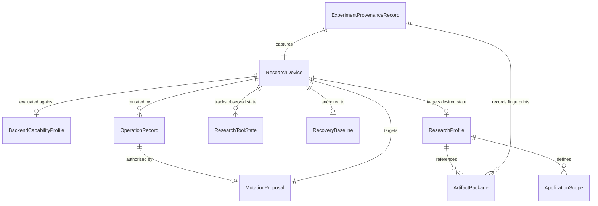
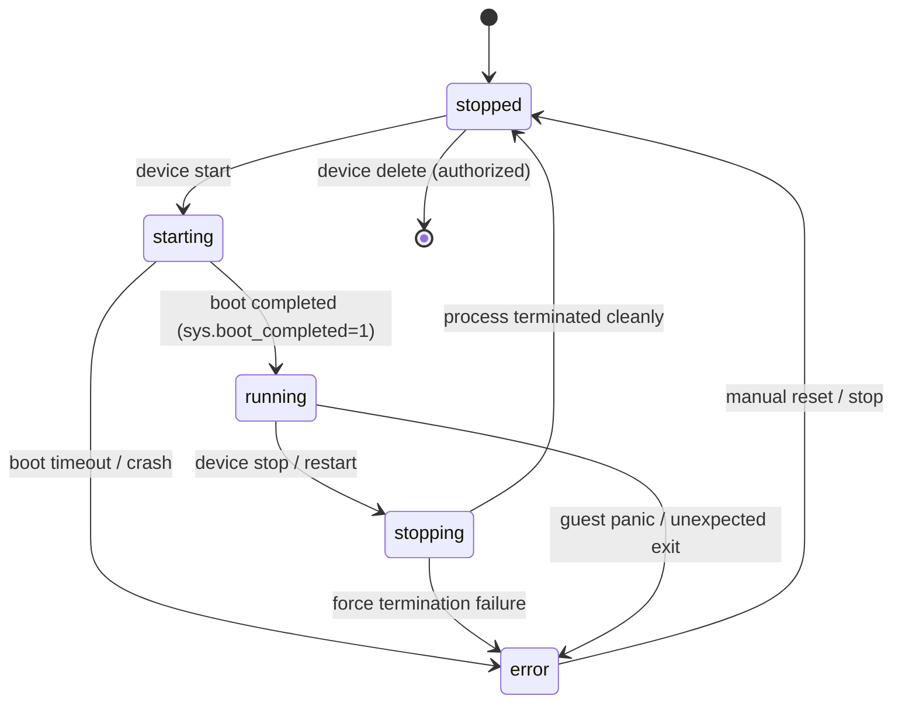
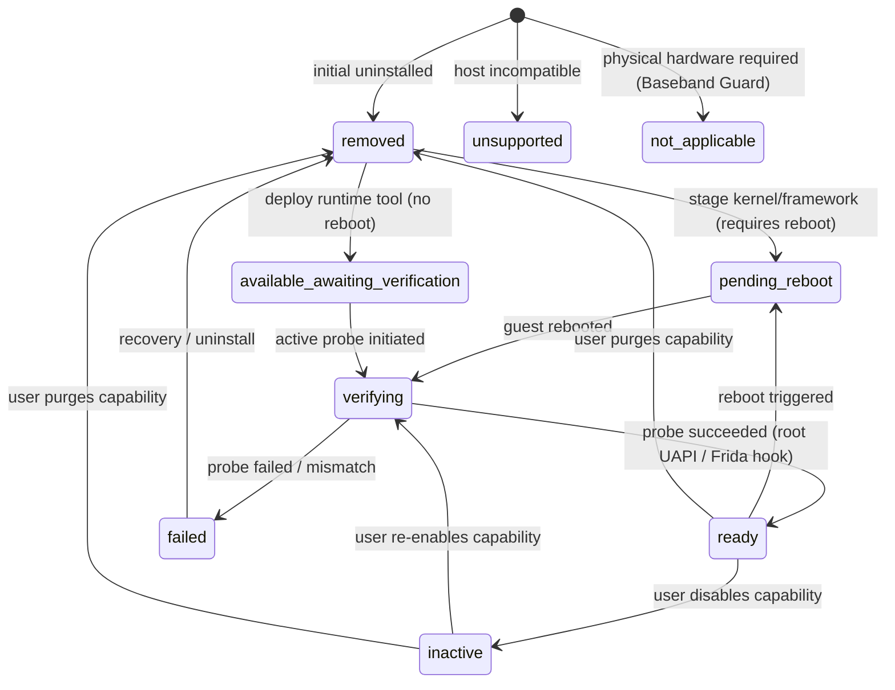
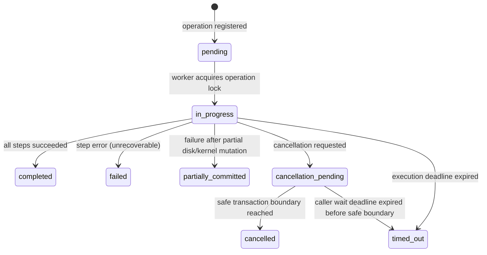
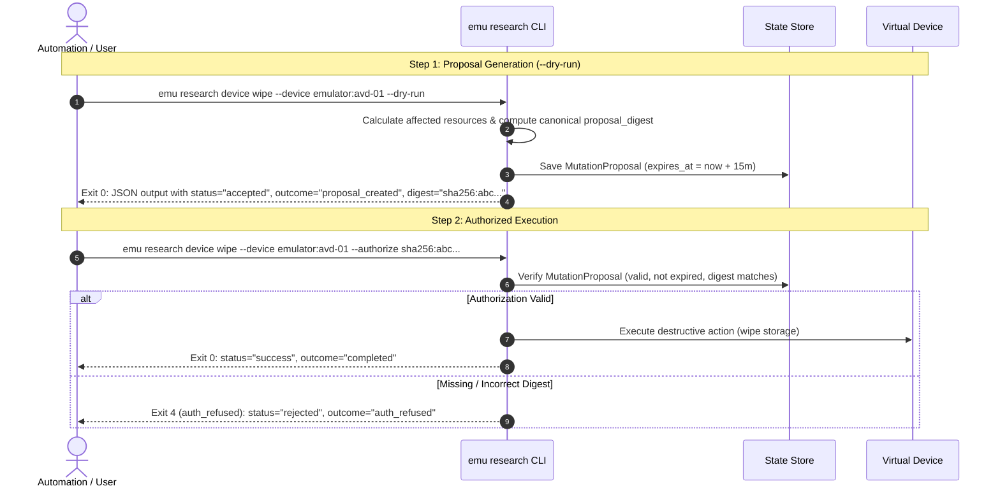

# Phase 1 Data Model: Android Research Backends and Security Tooling

**Version**: 1.0.0  
**Feature Branch**: `specs/001-add-android-research-backends`  
**Status**: Draft  
**Authority**: `specs/001-add-android-research-backends/research.md` and `specs/001-add-android-research-backends/spec.md`

---

## 1. Architectural Overview & System Invariants

### 1.1 Scope and Domain Boundaries

This data model formalizes all entities, value objects, state transitions, validation rules, and persistence models for the Android Security Research Harness within the `emu` project.

- **Primary Priority**: Android virtualization backends (**Android Emulator** and **Cuttlefish**) take development priority before any future Apple/iOS research capabilities.
- **Backward Compatibility**: Existing standard Android virtual devices (`avd:<name>`) and standard iOS devices (managed by `IosManager` using hardware/simulator UDIDs) remain 100% untouched and operational with zero behavioral regressions (FR-007, SC-008).
- **Physical Isolation**: All research tools, privilege escalations, kernel modifications, and instrumentation hooks operate strictly inside the virtual guest environment. Host filesystem writes are restricted to designated local data directories; host security policies and kernel permissions are never altered (SC-003, FR-012, FR-030).
- **No Cloud/Build Farm**: All artifacts (kernels, APKs, daemon binaries, modules) are user-supplied. The harness performs cryptographic fingerprinting, staging, validation, and lifecycle supervision, but does not provide automated kernel compilation farms or remote cloud orchestration.

### 1.2 Storage and Persistence Model (D-04)

Research metadata and durable state are stored strictly under the platform-local user data directory resolved via `dirs::data_local_dir()/emu/research` (`https://docs.rs/dirs/7.0.0/dirs/fn.data_local_dir.html`):

- **Linux**: `~/.local/share/emu/research/`
- **macOS**: `~/Library/Application Support/emu/research/`
- **Windows**: `%LOCALAPPDATA%\emu\research\`

```
<data_local_dir>/emu/research/
├── devices/
│   ├── <device_id_hash>.json          # Serialized ResearchDevice state
│   └── locks/
│       └── <device_id_hash>.lock      # Advisory lock file (fs4)
├── profiles/
│   └── <profile_id>.json              # Declarative ResearchProfile definitions
├── artifacts/
│   └── <sha256_digest>.json           # Validated ArtifactPackage records
├── baselines/
│   └── <baseline_id>.json             # RecoveryBaseline records
├── provenance/
│   └── <provenance_id>.json           # Immutable ExperimentProvenanceRecord files
├── operations/
│   ├── <operation_id>.json            # OperationRecord journal
│   ├── <operation_id>.events.jsonl    # Streamed event logs
│   └── locks/
│       └── <operation_id>.lock        # Exclusive worker execution lock (fs4)
└── proposals/
    └── <proposal_digest>.json         # MutationProposal pending authorization
```

#### Persistence Invariants:

1. **Atomic Staged Writes**: Every state mutation is written to a `<filename>.tmp` sibling file, followed by `std::fs::File::sync_all` and atomic rename (`std::fs::rename`).
2. **Dedicated Unlinked Lock Files**: Cross-process concurrency control is mediated using advisory file locks via `fs4::FileExt` on dedicated `.lock` files. Lock files are never deleted or unlinked while held to prevent lock-node races.
3. **No Database Heavyweight Dependencies**: SQLite / C-FFI engines are rejected in favor of transactional JSON files with advisory locks, preserving pure Rust 1.88.0 toolchain compatibility.

---

## 2. Core Entities & Field Specifications

### 2.1 Entity Relationship Diagram



---

### 2.2 ResearchDevice

Represents a managed virtual Android instance under either the Android Emulator or Cuttlefish backend.

| Field Name          | Type                          | Optionality  | Description                                                                                                                                                                                             |
| :------------------ | :---------------------------- | :----------- | :------------------------------------------------------------------------------------------------------------------------------------------------------------------------------------------------------ |
| `id`                | `ResearchDeviceId` (String)   | **Required** | Stable, backend-qualified unique identifier in format `<backend>:<opaque>` (e.g. `emulator:avd-sec-01`, `cuttlefish:cf-x86-01`). Invariant: globally unique, decoupled from ports/names (FR-002, D-02). |
| `backend`           | `BackendType` (Enum)          | **Required** | Virtualization backend: `emulator` or `cuttlefish` (FR-001).                                                                                                                                            |
| `display_name`      | `String`                      | **Required** | User-assigned human-readable name (e.g. `research-pixel`). May collide across backends.                                                                                                                 |
| `native_name`       | `String`                      | **Required** | Underlying native identifier: AVD system name for Emulator (e.g. `pixel_api34_sec`) or instance directory / group name for Cuttlefish.                                                                  |
| `instance_dir`      | `PathBuf`                     | **Required** | Isolated filesystem runtime root. For Cuttlefish, this is the dedicated directory used for `HOME=<dir>` to prevent multi-instance group spills (FR-001, D-01, G-07).                                    |
| `arch`              | `CpuArchitecture` (Enum)      | **Required** | Target guest CPU architecture: `arm64` or `x86_64`.                                                                                                                                                     |
| `guest_os`          | `GuestOsRelease` (Struct)     | **Required** | Operating system release: `api_level` (u32), `build_id` (String), `variant` (`userdebug` \| `user`).                                                                                                    |
| `kernel`            | `KernelDescriptor` (Struct)   | **Required** | Active kernel info: `release` (String), `family` (String), `kmi_version` (Option<String>), `flavor` (RootFlavor), `image_digest` (Sha256Digest).                                                        |
| `lifecycle_state`   | `DeviceLifecycleState` (Enum) | **Required** | Current lifecycle state: `stopped`, `starting`, `running`, `stopping`, `error`.                                                                                                                         |
| `adb_serial`        | `Option<String>`              | Optional     | Ephemeral ADB transport serial (e.g. `127.0.0.1:6520` or `emulator-5554`). Null when stopped.                                                                                                           |
| `console_port`      | `Option<u16>`                 | Optional     | Ephemeral telnet/console port. Null when stopped.                                                                                                                                                       |
| `active_profile_id` | `Option<ResearchProfileId>`   | Optional     | Identifier of currently applied declarative research profile.                                                                                                                                           |
| `baseline_id`       | `Option<RecoveryBaselineId>`  | Optional     | Identifier of the verified recovery baseline associated with this device.                                                                                                                               |
| `created_at`        | `DateTime<Utc>`               | **Required** | ISO 8601 creation timestamp.                                                                                                                                                                            |
| `updated_at`        | `DateTime<Utc>`               | **Required** | ISO 8601 last mutation timestamp.                                                                                                                                                                       |
| `last_settled_at`   | `DateTime<Utc>`               | **Required** | Timestamp of last verified stable operational condition.                                                                                                                                                |

#### Invariants & Validation Rules:

- **FR-002**: Addressing by `id` is always exact. Addressing by `display_name` that matches multiple devices across backends MUST be rejected with exit code 2 (`invalid_input`) unless disambiguated by `--backend` or `--device`.
- **G-07**: Cuttlefish instances MUST have isolated `instance_dir` paths. Sharing an `instance_dir` or using an unisolated default `$HOME` is rejected.

---

### 2.3 BackendCapabilityProfile

Declarative evaluation of host operating system compatibility, virtualization hypervisor availability, and binary dependencies.

| Field Name                      | Type                           | Optionality  | Description                                                                                                                                             |
| :------------------------------ | :----------------------------- | :----------- | :------------------------------------------------------------------------------------------------------------------------------------------------------ |
| `backend`                       | `BackendType` (Enum)           | **Required** | `emulator` or `cuttlefish`.                                                                                                                             |
| `host_os`                       | `HostOs` (Enum)                | **Required** | `linux`, `macos`, or `windows`.                                                                                                                         |
| `host_arch`                     | `HostArchitecture` (Enum)      | **Required** | `arm64` or `x86_64`.                                                                                                                                    |
| `hypervisor`                    | `HypervisorType` (Enum)        | **Required** | `kvm` (`/dev/kvm`), `hypervisor_framework` (`Hypervisor.Framework`), `whpx` (Windows Hypervisor Platform), or `none`.                                   |
| `support_status`                | `SupportStatus` (Enum)         | **Required** | `supported`, `unsupported`, or `experimental`.                                                                                                          |
| `required_binaries`             | `Vec<BinaryPrerequisite>`      | **Required** | List of required host binaries with path and version check (e.g. `emulator`, `adb`, `cvd`, `launch_cvd`).                                               |
| `required_entitlements`         | `Vec<EntitlementPrerequisite>` | **Required** | Specific privileges and group memberships (e.g. read/write `/dev/kvm`, membership in `kvm` and `cvdnetwork` groups on Linux).                           |
| `supported_guest_architectures` | `Vec<CpuArchitecture>`         | **Required** | Supported guest architectures on this host. Cross-architecture emulation is marked `unsupported` (G-04).                                                |
| `supports_kernel_injection`     | `bool`                         | **Required** | Whether low-level CLI flags allow custom kernel and initramfs injection (`true` for Emulator via `-kernel`, `true` for Cuttlefish via `--kernel_path`). |
| `remediation_steps`             | `Vec<String>`                  | **Required** | Human-readable actionable advice if status is `unsupported` or prerequisites are missing.                                                               |

#### Invariants & Validation Rules:

- **FR-004 / Gate G-02**: Cuttlefish requires `host_os = linux` with `/dev/kvm` read/write access. If inspected on macOS or Windows, `support_status` MUST evaluate to `unsupported`.
- **Gate G-01**: Android Emulator on Linux requires `/dev/kvm`; on macOS requires `sysctl kern.hv_support = 1`; on Windows requires WHPX. Software-only TCG fallback is rejected as `unsupported`.

---

### 2.4 ResearchProfile

Composite specification defining desired configurations for root privilege, dynamic instrumentation, hooking frameworks, and extended catalog capabilities.

| Field Name              | Type                            | Optionality  | Description                                                                                                                                                               |
| :---------------------- | :------------------------------ | :----------- | :------------------------------------------------------------------------------------------------------------------------------------------------------------------------ |
| `id`                    | `ResearchProfileId` (String)    | **Required** | Unique profile identifier (e.g. `prof_android14_ksunext_frida_vec`).                                                                                                      |
| `name`                  | `String`                        | **Required** | Descriptive name for the research profile.                                                                                                                                |
| `target_backend`        | `Option<BackendType>`           | Optional     | Constrained backend if profile is backend-specific; `None` if applicable to both.                                                                                         |
| `target_arch`           | `CpuArchitecture`               | **Required** | Target CPU architecture (`arm64` or `x86_64`).                                                                                                                            |
| `target_api_level`      | `u32`                           | **Required** | Target Android API level (e.g. 34 for Android 14).                                                                                                                        |
| `root_flavor`           | `RootFlavor` (Enum)             | **Required** | Exactly one root flavor: `kernelsu_next` (default), `kernelsu`, `resukisu`, `sukisu_ultra`, `kowsu`, or `no_root` (control baseline) (FR-010, FR-026).                    |
| `root_config`           | `Option<RootConfiguration>`     | Optional     | Artifact references for kernel replacement and manager APK. Required unless `root_flavor == no_root`.                                                                     |
| `frida_config`          | `FridaConfiguration` (Struct)   | **Required** | Frida settings: `enabled` (bool), `version` (String, pinned to `"17.18.0"` per D-07), `daemon_artifact` (Option<ArtifactPackageId>).                                      |
| `vector_config`         | `VectorConfiguration` (Struct)  | **Required** | Vector/NeoZygisk settings: `enabled` (bool), `version` (String, pinned to `"2.2"`), `neozygisk_version` (String, pinned to `"2.4"`), `modules` (Vec<XposedModuleConfig>). |
| `extended_capabilities` | `Vec<ExtendedCapabilityConfig>` | **Required** | Selected extended capabilities from reference catalog (1..9).                                                                                                             |
| `app_scopes`            | `Vec<ApplicationScope>`         | **Required** | Target and control application scoping declarations (FR-017).                                                                                                             |

#### Invariants & Validation Rules:

- **FR-010 / FR-026**: Exactly ONE root flavor permitted per profile. Multiple root tools or simultaneous installation of competing root mechanisms is strictly invalid.
- **FR-028**: Mutual conflict check. If `kowsu` is selected, `susfs` MUST NOT be included. If `nomount` is selected, `mountify` MUST NOT be included. If `susfs` is enabled with global mount hiding, `droidspaces` MUST NOT be enabled.
- **D-07**: Frida version must match `"17.18.0"` exactly.
- **D-08**: Vector version must match `"2.2"` and NeoZygisk must match `"2.4"`.

---

### 2.5 ResearchToolState

Tracks an individual tool, framework, or extended capability's lifecycle condition on a specific research device.

| Field Name             | Type                         | Optionality  | Description                                                                                                                                                                                          |
| :--------------------- | :--------------------------- | :----------- | :--------------------------------------------------------------------------------------------------------------------------------------------------------------------------------------------------- |
| `tool_id`              | `String`                     | **Required** | Unique tool key (e.g. `root:kernelsu_next`, `frida`, `framework:vector`, `module:com.example.sslunpin`, `cap:susfs`).                                                                                |
| `tool_family`          | `ToolFamily` (Enum)          | **Required** | `root_privilege`, `dynamic_instrumentation`, `hooking_framework`, `hooking_module`, `extended_kernel_capability`.                                                                                    |
| `desired_state`        | `ToolDesiredState` (Enum)    | **Required** | User-requested target state: `enabled`, `disabled`, `removed` (FR-009).                                                                                                                              |
| `observed_state`       | `ToolObservedState` (Enum)   | **Required** | Actual measured condition in guest: `available_awaiting_verification`, `verifying`, `ready`, `pending_reboot`, `inactive`, `removed`, `unsupported`, `not_applicable`, `failed`, `unknown` (FR-009). |
| `observed_version`     | `Option<String>`             | Optional     | Version string queried directly from guest runtime (e.g. `"3.3.0"`, `"17.18.0"`).                                                                                                                    |
| `interface_details`    | `Map<String, String>`        | **Required** | Low-level driver evidence (e.g. `uapi_version`: `"2"`, `driver_node`: `"[ksu_driver]"`, `cli_sock`: `"/data/adb/lspd/.cli_sock"`).                                                                   |
| `requires_reboot`      | `bool`                       | **Required** | Indicates whether a reboot is required to transition to desired state.                                                                                                                               |
| `verification_details` | `Option<VerificationRecord>` | Optional     | Record of the last active verification probe executed in the guest.                                                                                                                                  |
| `diagnostics`          | `Vec<String>`                | **Required** | Explanatory messages, failure causes, or warning details.                                                                                                                                            |

#### Invariants & Validation Rules:

- **FR-009**: `observed_state` `ready` NEVER survives a device restart without active post-boot re-verification. Upon reboot, `ready` transitions to `available_awaiting_verification` or `verifying`.
- **FR-030**: On virtual devices, physical-hardware-dependent features (Baseband Guard) MUST report `observed_state = not_applicable`. Simulating readiness or attempting to access host partitions is strictly prohibited.

---

### 2.6 ArtifactPackage

A user-supplied file (kernel image, APK, daemon binary, module bundle, container tarball) used in research workflows.

| Field Name             | Type                         | Optionality  | Description                                                                                                                                                                                  |
| :--------------------- | :--------------------------- | :----------- | :------------------------------------------------------------------------------------------------------------------------------------------------------------------------------------------- |
| `id`                   | `ArtifactPackageId` (String) | **Required** | Hash-derived identifier e.g. `art_sha256_<prefix>`.                                                                                                                                          |
| `package_type`         | `ArtifactPackageType` (Enum) | **Required** | `kernel_image`, `initramfs`, `manager_apk`, `daemon_binary`, `xposed_module`, `container_runtime_bundle`, `metamodule_tar`.                                                                  |
| `file_path`            | `PathBuf`                    | **Required** | Local filesystem path to the user-supplied file.                                                                                                                                             |
| `sha256_digest`        | `Sha256Digest` (String)      | **Required** | Hex-encoded cryptographic SHA-256 digest prefixed with `sha256:`.                                                                                                                            |
| `target_arch`          | `CpuArchitecture`            | **Required** | Binary architecture: `arm64` or `x86_64`.                                                                                                                                                    |
| `api_level_min`        | `Option<u32>`                | Optional     | Minimum compatible Android API level.                                                                                                                                                        |
| `api_level_max`        | `Option<u32>`                | Optional     | Maximum compatible Android API level.                                                                                                                                                        |
| `kernel_family`        | `Option<String>`             | Optional     | Kernel source family (e.g. `common-android14-6.1`). Required for `kernel_image`.                                                                                                             |
| `kmi_version`          | `Option<String>`             | Optional     | Kernel Module Interface release (e.g. `android14-6.1-2024-03`).                                                                                                                              |
| `virtual_platform_abi` | `Option<String>`             | Optional     | Expected virtual driver compatibility: `virtual_device` for Cuttlefish, `ranchu` for Emulator (Gate G-05).                                                                                   |
| `trust_status`         | `ArtifactTrustStatus` (Enum) | **Required** | `verified_trusted` (matches expected user hash), `unverified_trust` (no hash supplied, user authorized under guarded policy), `digest_mismatch_corrupt` (hash mismatch; deployment blocked). |

#### Invariants & Validation Rules:

- **FR-023 / Gate G-05**: If expected digest is supplied and does not match `sha256_digest`, status is `digest_mismatch_corrupt` and deployment is unconditionally rejected.
- **FR-027**: Custom kernels must target the virtual platform ABI. Standard phone GKI kernels are rejected preflight because they lack ranchu/virtio driver support.

---

### 2.7 ReferenceCapability

Declarative entry in the 9-family extended research capability catalog.

| Field Name              | Type                            | Optionality  | Description                                                                                                                                                                          |
| :---------------------- | :------------------------------ | :----------- | :----------------------------------------------------------------------------------------------------------------------------------------------------------------------------------- |
| `catalog_id`            | `String`                        | **Required** | Catalog ID: `cap_root_flavor`, `cap_susfs`, `cap_nomount`, `cap_mountify`, `cap_adv_net`, `cap_tmpfs_xattr`, `cap_bpf_trace`, `cap_ntsync`, `cap_droidspaces`, `cap_baseband_guard`. |
| `family_index`          | `u8`                            | **Required** | Numeric family index (1 to 9).                                                                                                                                                       |
| `family_name`           | `String`                        | **Required** | Family name per research catalog.                                                                                                                                                    |
| `provider`              | `String`                        | **Required** | Upstream provider repository and version bound.                                                                                                                                      |
| `delivery_mode`         | `CapabilityDeliveryMode` (Enum) | **Required** | `kernel_compile`, `in_guest_metamodule`, `in_guest_binary`, `kernel_lsm_module`, `sysctl_runtime`.                                                                                   |
| `prerequisites`         | `Vec<CapabilityPrerequisite>`   | **Required** | Required kernel config flags, root flavors, or other capabilities.                                                                                                                   |
| `conflicts_with`        | `Vec<String>`                   | **Required** | Catalog IDs that cannot coexist with this capability.                                                                                                                                |
| `virtual_applicability` | `VirtualApplicability` (Enum)   | **Required** | `applicable`, `experimental`, or `not_applicable`.                                                                                                                                   |
| `verification_method`   | `VerificationMethodDescriptor`  | **Required** | In-guest execution probe used to verify capability without false positives.                                                                                                          |
| `rollback_strategy`     | `RollbackStrategyDescriptor`    | **Required** | Procedure to deactivate or restore baseline.                                                                                                                                         |

---

### 2.8 RecoveryBaseline

Designated known-good reference state allowing a research device to be restored after experimental failure or bootloop.

| Field Name                   | Type                          | Optionality  | Description                                                 |
| :--------------------------- | :---------------------------- | :----------- | :---------------------------------------------------------- |
| `id`                         | `RecoveryBaselineId` (String) | **Required** | Baseline identifier (e.g. `base_pixel_api34_stock`).        |
| `device_id`                  | `ResearchDeviceId`            | **Required** | Target device identifier.                                   |
| `created_at`                 | `DateTime<Utc>`               | **Required** | Baseline creation timestamp.                                |
| `system_image_digest`        | `Sha256Digest`                | **Required** | Cryptographic hash of the clean base system image.          |
| `kernel_image_digest`        | `Sha256Digest`                | **Required** | Cryptographic hash of the verified stock/baseline kernel.   |
| `initramfs_digest`           | `Option<Sha256Digest>`        | Optional     | Cryptographic hash of stock initramfs if applicable.        |
| `clean_storage_snapshot_ref` | `PathBuf`                     | **Required** | Path to baseline user data snapshot or clean disk template. |
| `verified`                   | `bool`                        | **Required** | Whether this baseline was verified by booting successfully. |
| `verification_timestamp`     | `Option<DateTime<Utc>>`       | Optional     | Timestamp when baseline boot verification passed.           |

#### Invariants & Validation Rules:

- **FR-021 / Gate T-06**: If a recovery operation is invoked and `verified == false` or baseline files are missing/corrupted, automated recovery MUST be safely refused with an explanatory diagnostic, without deleting the device.

---

### 2.9 ExperimentProvenanceRecord

Immutable audit record capturing the exact environment configuration of a research experiment for reproducibility.

| Field Name              | Type                             | Optionality  | Description                                                       |
| :---------------------- | :------------------------------- | :----------- | :---------------------------------------------------------------- |
| `id`                    | `ProvenanceRecordId` (String)    | **Required** | Unique provenance record identifier.                              |
| `device_id`             | `ResearchDeviceId`               | **Required** | Source device identifier.                                         |
| `backend`               | `BackendType`                    | **Required** | `emulator` or `cuttlefish`.                                       |
| `guest_os`              | `GuestOsRelease`                 | **Required** | Guest OS release, API level, and build ID.                        |
| `kernel_release`        | `String`                         | **Required** | Kernel version string from `uname -r`.                            |
| `kernel_digest`         | `Sha256Digest`                   | **Required** | SHA-256 digest of running kernel artifact.                        |
| `root_flavor`           | `RootFlavor`                     | **Required** | Active root flavor.                                               |
| `tool_states`           | `Vec<ResearchToolState>`         | **Required** | Snapshot of all tool and capability states.                       |
| `artifact_fingerprints` | `Vec<ArtifactFingerprintRecord>` | **Required** | Exact SHA-256 digests and paths of all deployed artifacts.        |
| `app_scopes`            | `Vec<ApplicationScope>`          | **Required** | Module application target and control mappings.                   |
| `launch_parameters`     | `Vec<String>`                    | **Required** | Host CLI launch arguments used to boot the virtual instance.      |
| `environment_digest`    | `Sha256Digest`                   | **Required** | Canonical SHA-256 hash of all record fields for tamper detection. |
| `captured_at`           | `DateTime<Utc>`                  | **Required** | ISO 8601 audit capture timestamp.                                 |

---

### 2.10 OperationRecord

Journal entry tracking execution of asynchronous or bounded operations executed via coordinator or private worker.

| Field Name              | Type                           | Optionality  | Description                                                                            |
| :---------------------- | :----------------------------- | :----------- | :------------------------------------------------------------------------------------- |
| `operation_id`          | `OperationId` (String)         | **Required** | Unique operation identifier prefixed with `op_` (e.g. `op_01J8...`).                   |
| `command_type`          | `String`                       | **Required** | Subcommand invoked (e.g. `device.wipe`, `profile.apply`, `baseline.restore`).          |
| `target_device_id`      | `ResearchDeviceId`             | **Required** | Targeted research device.                                                              |
| `state`                 | `OperationState` (Enum)        | **Required** | Operational progress state (see Section 3.3).                                          |
| `execution_state`       | `ExecutionState` (Enum)        | **Required** | Underlying guest/process execution state: `stopped`, `continuing`, `unknown` (FR-036). |
| `deadline_seconds`      | `Option<u64>`                  | Optional     | Caller-bounded execution deadline in seconds.                                          |
| `proposal_id`           | `Option<MutationProposalId>`   | Optional     | Reference to proposal if operation is destructive.                                     |
| `authorized_by_digest`  | `Option<Sha256Digest>`         | Optional     | Explicit authorization digest provided by caller.                                      |
| `started_at`            | `DateTime<Utc>`                | **Required** | Operation start timestamp.                                                             |
| `updated_at`            | `DateTime<Utc>`                | **Required** | Last status update timestamp.                                                          |
| `completed_at`          | `Option<DateTime<Utc>>`        | Optional     | Terminal completion timestamp.                                                         |
| `partial_modifications` | `Vec<String>`                  | **Required** | List of discrete mutation steps committed before termination.                          |
| `checkpoint`            | `Option<String>`               | Optional     | Identifier of last reached safe transaction boundary.                                  |
| `error`                 | `Option<OperationErrorRecord>` | Optional     | Structured error details if state is `failed`, `timed_out`, or `rejected`.             |

---

### 2.11 MutationProposal

The authorization contract generated during `--dry-run` for destructive mutations.

| Field Name             | Type                    | Optionality  | Description                                                                                             |
| :--------------------- | :---------------------- | :----------- | :------------------------------------------------------------------------------------------------------ |
| `proposal_digest`      | `Sha256Digest` (String) | **Required** | Canonical SHA-256 digest of proposal fields (`sha256:<64_hex_chars>`). Required to authorize execution. |
| `action`               | `String`                | **Required** | Action to execute (e.g. `device.wipe`, `device.delete`, `profile.apply`, `baseline.restore`).           |
| `target_device_id`     | `ResearchDeviceId`      | **Required** | Target device identifier.                                                                               |
| `affected_resources`   | `Vec<String>`           | **Required** | Specific files/partitions affected (e.g. `["storage:/data/userdata.img", "qcow2:overlays_discarded"]`). |
| `risk_tier`            | `RiskTier` (Enum)       | **Required** | `low`, `medium`, `destructive_reversible`, `destructive_irreversible`.                                  |
| `requires_reboot`      | `bool`                  | **Required** | Whether action forces guest reboot.                                                                     |
| `invalidates_overlays` | `bool`                  | **Required** | Whether Cuttlefish qcow2 overlays are discarded (Gate G-06).                                            |
| `lossless`             | `bool`                  | **Required** | Always `false` for storage wipes, deletions, kernel swaps, or baseline restores.                        |
| `created_at`           | `DateTime<Utc>`         | **Required** | Creation timestamp.                                                                                     |
| `expires_at`           | `DateTime<Utc>`         | **Required** | Proposal expiration timestamp (default: +15 minutes).                                                   |

---

## 3. State Machines & Lifecycle Transitions

### 3.1 Device Lifecycle State Machine



- **Transitions**:
  - `stopped` $\rightarrow$ `starting`: Triggered by `emu research device start`. Hypervisor spawned.
  - `starting` $\rightarrow$ `running`: Monitored via `adb shell getprop sys.boot_completed`. When property reaches `"1"`, lifecycle settles to `running`.
  - `starting` $\rightarrow$ `error`: If boot deadline expires before `sys.boot_completed=1`, marked `error` (Gate G-08).
  - `running` $\rightarrow$ `stopping`: Triggered by `device stop` or `device restart`. Clean SIGTERM sent to supervisor.
  - `stopping` $\rightarrow$ `stopped`: Clean child process exit confirmed. Port and lock released.

---

### 3.2 Tool & Capability Lifecycle State Machine (FR-009)



#### Detailed Tool State Semantics:

1. **`available_awaiting_verification`**: The tool binary or daemon is placed on the device, but has not yet proven functional execution on an application or kernel interface.
2. **`verifying`**: An active, benign guest-scoped probe is currently executing.
3. **`ready`**: Active probe passed:
   - _KernelSU Next_: `/data/adb/ksud debug info` confirms `[ksu_driver]` and UAPI level 2 (Gate T-02).
   - _Frida_: Telemetry received from attaching `Process.getModuleByName("libc.so").getExportByName("getpid")` on an authorized sample app (Gate T-03).
   - _Vector_: `vector-cli --json status` confirms daemon active and module scope mediation active (Gate T-04).
4. **`pending_reboot`**: Staged components require a guest reboot under provider rules before they can be verified.
5. **`inactive`**: Tool components remain on disk, but live execution is disabled (e.g. baseline kernel booted while Manager APK remains, or module disabled in config).
6. **`removed`**: Tool files, drivers, and configurations have been purged. Shared `/data/adb/modules` directory preserved.
7. **`not_applicable`**: Feature requires physical hardware absent from virtual guest (Family 9 Baseband Guard; FR-030).
8. **`unsupported`**: Host or architecture does not support this tool.

---

### 3.3 Operation State Machine (FR-036)



#### Detailed Operation State Semantics:

- **`pending`**: Operation recorded on disk, awaiting worker process spawn.
- **`in_progress`**: Worker process holds exclusive lock and target device lock; mutations underway.
- **`completed`**: All declared mutation phases and post-mutation verification checks completed successfully.
- **`failed`**: Operation halted before modifying guest state, or cleanly rolled back.
- **`partially_committed`**: Operation failed after committing one or more irreversible steps (e.g. kernel flashed but reboot failed). `partial_modifications` records exact committed steps.
- **`cancellation_pending`**: Worker received cancellation request; attempting to stop at next safe checkpoint.
- **`cancelled`**: Worker reached verified safe transaction boundary and stopped execution. Exit code 130.
- **`timed_out`**: Bounded operation deadline expired. Accompanied by `execution_state`:
  - `stopped`: Worker halted child processes before exiting.
  - `continuing`: Long-running guest task (e.g. OS boot) is continuing asynchronously.
  - `unknown`: Communication lost.

---

### 3.4 Two-Step Destructive Mutation State Machine (FR-006, FR-035)



---

## 4. Extended Research Capability Catalog (9 Families)

Detailed modeling of the 9 extended research capability families from `research.md` Section 5:

| Family                           | Catalog ID                      | Upstream Provider & Ref Bound                                                                                                                                                   | Delivery Mode                                                                                       | Conflict Rules & Prerequisites                                                                          | Virtual Hardware Applicability                          | Verification Method                                                                        | Rollback Strategy                                                      |
| :------------------------------- | :------------------------------ | :------------------------------------------------------------------------------------------------------------------------------------------------------------------------------ | :-------------------------------------------------------------------------------------------------- | :------------------------------------------------------------------------------------------------------ | :------------------------------------------------------ | :----------------------------------------------------------------------------------------- | :--------------------------------------------------------------------- |
| **1. Root Flavors**              | `cap_root_flavor`               | - `kernelsu_next` (v3.3.0)<br>- `kernelsu` (`tiann` v3.3.0)<br>- `resukisu` (v4.2.0-rc2)<br>- `sukisu_ultra` (v4.2.0)<br>- `kowsu` (KOWX712 `master`)<br>- `no_root` (baseline) | Kernel replacement (`CONFIG_KSU=y`) + Manager APK                                                   | Exactly one root flavor per profile. Switching requires compatible kernel swap & reboot.                | Applicable (GKI 5.10+); Experimental on virtual targets | Privileged probe querying driver UAPI/version node (`[ksu_driver]`).                       | Flash verified baseline kernel artifact; purge flavor userspace files. |
| **2. Root Visibility**           | `cap_susfs`                     | `simonpunk/susfs4ksu` (v1.5.2+)<br>`sidex15/susfs4ksu-module`                                                                                                                   | Kernel patch (`CONFIG_KSU_SUSFS=y`) + module (`ksu_susfs`)                                          | **Conflicts with KowSU**. Conflicts with DroidSpaces unless global mount hiding disabled.               | Applicable (GKI 5.10+); Experimental                    | Query `/proc/mounts` and hidden paths from untrusted UID; verify concealment.              | Disable SUSFS module; restore baseline kernel artifact.                |
| **3. Mount Mediation**           | `cap_nomount`<br>`cap_mountify` | - NoMount: `maxsteeel/nomount` (v2.0.0)<br>- Mountify: `backslashxx/mountify` (Rel 204)                                                                                         | In-guest metamodule / kernel component atop KSU                                                     | **Mutual Conflict**: NoMount OR Mountify, never both. NoMount v2 requires kernel+userspace match.       | Applicable (GKI 5.10+); Experimental                    | Inspect guest `/proc/mounts` and `/system` to verify injection without mount pollution.    | Purge metamodule from `/data/adb/metamodule/` and reboot.              |
| **4. Advanced Networking**       | `cap_adv_net`                   | Linux In-Kernel Networking Subsystems                                                                                                                                           | Compiled kernel (`CONFIG_WIREGUARD=y`, `CONFIG_TCP_CONG_BBR=y`, `CONFIG_IP_SET=y`, `CONFIG_CIFS=y`) | Absent support requires kernel swap + reboot. Present support configurable via `sysctl`.                | Applicable                                              | Query `sysctl net.ipv4.tcp_available_congestion_control`; test wireguard interface.        | Reset runtime sysctl; restore baseline kernel if replaced.             |
| **5. TMPFS Extended Attributes** | `cap_tmpfs_xattr`               | Linux In-Kernel Filesystem Subsystem                                                                                                                                            | Compiled kernel (`CONFIG_TMPFS_XATTR=y`, `CONFIG_TMPFS_POSIX_ACL=y`)                                | Prerequisite for Mountify tmpfs mode and fine-grained in-memory security labels.                        | Applicable                                              | Mount tmpfs dir, set xattr (`setfattr -n user.test -v 1`), read with `getfattr`.           | Unmount test filesystem; restore baseline kernel.                      |
| **6. Observability & Tracing**   | `cap_bpf_trace`                 | Linux BPF Subsystem (`BTF`, `eBPF`, `FUSE-BPF`)                                                                                                                                 | Compiled kernel (`CONFIG_DEBUG_INFO_BTF=y`, `CONFIG_BPF_SYSCALL=y`, `CONFIG_FUSE_BPF=y`) + daemon   | High load may trigger soft lockup; isolate from host.                                                   | Applicable (GKI 5.10+); Experimental                    | Load minimal eBPF kprobe or run minimal FUSE-BPF checker (`/dev/fuse`).                    | Terminate daemon; unload eBPF program; restore baseline kernel.        |
| **7. Kernel Synchronization**    | `cap_ntsync`                    | Linux In-Kernel NTSync driver (`/dev/ntsync`)                                                                                                                                   | Compiled kernel driver (`CONFIG_NTSYNC=y`)                                                          | Exposes `/dev/ntsync`. Compatibility primitive for NT emulation; no Android runtime conflict.           | Applicable (Kernel 6.1+ backport)                       | Open `/dev/ntsync`, execute `NTSYNC_IOC_CREATE_MUTEX` ioctl, verify descriptor.            | Close open descriptors; restore baseline kernel.                       |
| **8. In-Guest Containers**       | `cap_droidspaces`               | `ravindu644/Droidspaces-OSS` (v6.5.5)                                                                                                                                           | In-guest musl static binary (`droidspaces`) + Android UI                                            | Requires namespaces (`CONFIG_PID_NS`, `CONFIG_USER_NS`). **Conflicts with SUSFS** global hiding.        | Applicable (Kernel 3.10+)                               | Run `droidspaces check` in guest shell; launch minimal container.                          | Stop containers; purge `/data/local/Droidspaces/`.                     |
| **9. Partition Protection**      | `cap_baseband_guard`            | `vc-teahouse/Baseband-guard` (`main`)                                                                                                                                           | Kernel LSM module (`CONFIG_BBG=y`)                                                                  | **NOT APPLICABLE on virtual devices**. Virtual devices lack cellular modems and radio flash partitions. | **Not Applicable** (FR-030)                             | Reports `not_applicable` truthfully. Zero host partition access; zero simulated readiness. | None (remains unconfigured).                                           |

---

## 5. Functional Requirements Traceability Matrix

| Requirement                           | Entity / State Machine Mapping                                               | Section Reference          |
| :------------------------------------ | :--------------------------------------------------------------------------- | :------------------------- |
| **FR-001** (Dual Backends)            | `ResearchDevice.backend`, `BackendCapabilityProfile.backend`                 | §2.2, §2.3                 |
| **FR-002** (Instance Identity)        | `ResearchDevice.id` (`<backend>:<opaque>`), distinct from `display_name`     | §2.2                       |
| **FR-003** (Preflight Diagnostics)    | `BackendCapabilityProfile.required_binaries`, `required_entitlements`        | §2.3                       |
| **FR-004** (Unsupported Reporting)    | `BackendCapabilityProfile.support_status = unsupported` on invalid host      | §2.3                       |
| **FR-005** (Lifecycle Management)     | `DeviceLifecycleState`, `OperationRecord`                                    | §2.2, §3.1                 |
| **FR-006** (Destructive Auth)         | `MutationProposal`, `--dry-run`, `--authorize sha256:<digest>`               | §2.11, §3.4                |
| **FR-007** (Standard Non-Regression)  | `ResearchDevice` does not wrap or alter existing `avd:<name>` or iOS         | §1.1                       |
| **FR-008** (Compatibility Gating)     | `ArtifactPackage.kernel_family`, `kmi_version`, `target_arch`                | §2.6                       |
| **FR-009** (Desired vs Observed)      | `ResearchToolState.desired_state` vs `observed_state`                        | §2.5, §3.2                 |
| **FR-010** (Single Root Invariant)    | `ResearchProfile.root_flavor` (strictly 1 root active per profile)           | §2.4                       |
| **FR-011** (KernelSU Next Setup)      | `ResearchProfile.root_config` with user-supplied kernel & manager APK        | §2.4                       |
| **FR-012** (KernelSU Next Identity)   | `ResearchToolState.interface_details` (`[ksu_driver]`, UAPI level 2)         | §2.5, §3.2                 |
| **FR-013** (Frida Deployment)         | `ResearchProfile.frida_config` (`version = "17.18.0"`)                       | §2.4                       |
| **FR-014** (Frida Verification)       | `available_awaiting_verification` $\rightarrow$ `ready` on telemetry receipt | §2.5, §3.2                 |
| **FR-015** (Vector / Xposed Setup)    | `ResearchProfile.vector_config` (`version = "2.2"`, NeoZygisk `"2.4"`)       | §2.4                       |
| **FR-016** (Module Management)        | `VectorConfiguration.modules`, `ApplicationScope`                            | §2.4                       |
| **FR-017** (Module Application Scope) | `ApplicationScope` (`target` vs `control`), scoped execution                 | §2.4                       |
| **FR-018** (Joint Coexistence)        | Simultaneous `ready` states for KSU-Next, Frida, and Vector                  | §2.4, §3.2                 |
| **FR-019** (Clean Disabling/Removal)  | `ToolDesiredState::Disabled` vs `Removed`, preserving shared dirs            | §2.5, §3.2                 |
| **FR-020** (Cancellation & Recovery)  | `OperationRecord.state = cancelled`, cleanup staging files                   | §2.10, §3.3                |
| **FR-021** (Baseline Recovery)        | `RecoveryBaseline`, safe refusal if unverified or missing                    | §2.8                       |
| **FR-022** (Provenance Records)       | `ExperimentProvenanceRecord`, canonical `environment_digest`                 | §2.9                       |
| **FR-023** (Artifact Integrity)       | `ArtifactPackage.sha256_digest`, `trust_status`                              | §2.6                       |
| **FR-024** (Empirical Support Gate)   | `support_status` gated by real lab proof, not unverified claims              | §2.3                       |
| **FR-025** (Extended Profiles)        | `ResearchProfile.extended_capabilities`                                      | §2.4, §4                   |
| **FR-026** (Alternative Roots)        | `RootFlavor` enum (KernelSU, ReSukiSU, SukiSU-Ultra, KowSU, No Root)         | §2.4, §4                   |
| **FR-027** (Kernel Interface / KMI)   | `ArtifactPackage.kernel_family`, `kmi_version`, `virtual_platform_abi`       | §2.6                       |
| **FR-028** (Conflict Enforcement)     | `ReferenceCapability.conflicts_with` preflight rejection                     | §2.7, §4                   |
| **FR-029** (Absent vs Present Cap)    | `requires_reboot` tracking, `pending_reboot` vs live sysctl apply            | §2.5, §3.2                 |
| **FR-030** (Baseband Guard N/A)       | `ReferenceCapability.virtual_applicability = not_applicable`                 | §2.7, §4                   |
| **FR-031** (Benign Verification)      | `VerificationRecord`, control vs target comparison                           | §2.5, §2.9                 |
| **FR-032** (100% Automation Coverage) | Finite CLI commands for all 8 operational families                           | Documented in CLI Contract |
| **FR-033** (Non-Interactive Inputs)   | Rejection on missing/ambiguous inputs without terminal prompt                | Documented in CLI Contract |
| **FR-034** (Structured JSON Output)   | Finite JSON stdout schema, separated stderr diagnostics stream               | Documented in CLI Contract |
| **FR-035** (Cross-Surface Safety)     | Identical two-step authorization across CLI and TUI                          | §2.11, §3.4                |
| **FR-036** (Bounded Ops & Deadlines)  | `OperationRecord.state`, `execution_state` (`stopped`, `continuing`)         | §2.10, §3.3                |
| **FR-037** (Repeat Semantics)         | Idempotent apply returns `already_satisfied` (0 duplicate actions)           | Documented in CLI Contract |
| **FR-038** (Interactive TUI Parity)   | TUI maps 1:1 onto identical underlying entities and locks                    | §1.2                       |
| **FR-039** (Cross-Surface Parity)     | Profile exported via CLI is 100% actionable in TUI and vice versa            | §2.4, §2.9                 |
