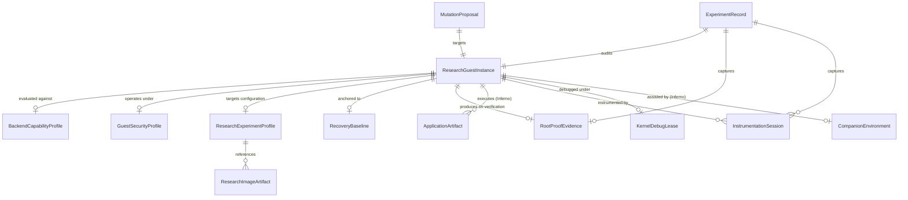
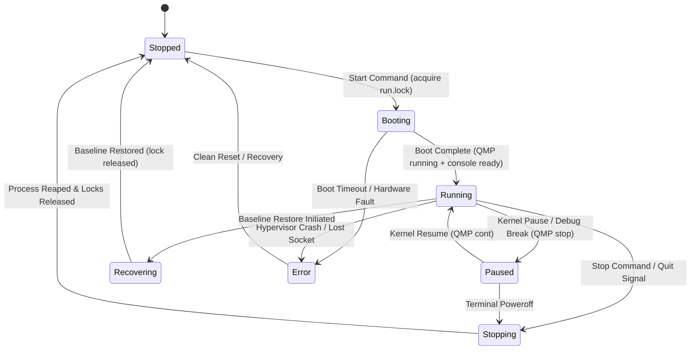
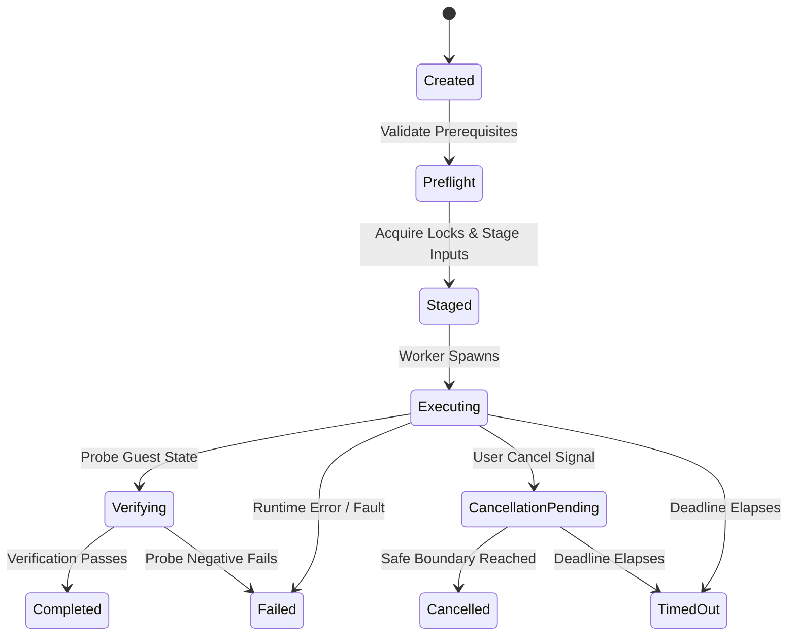
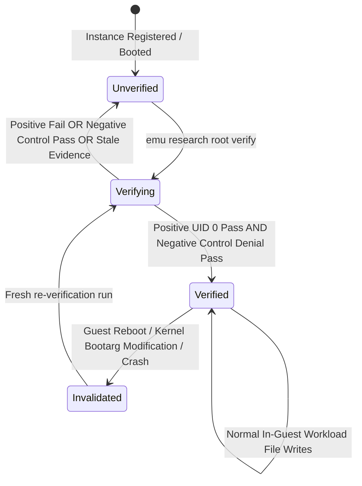
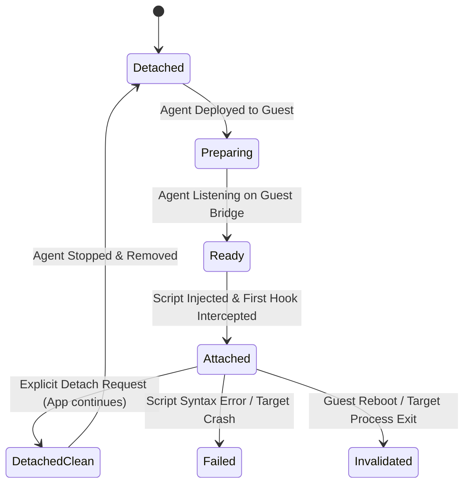
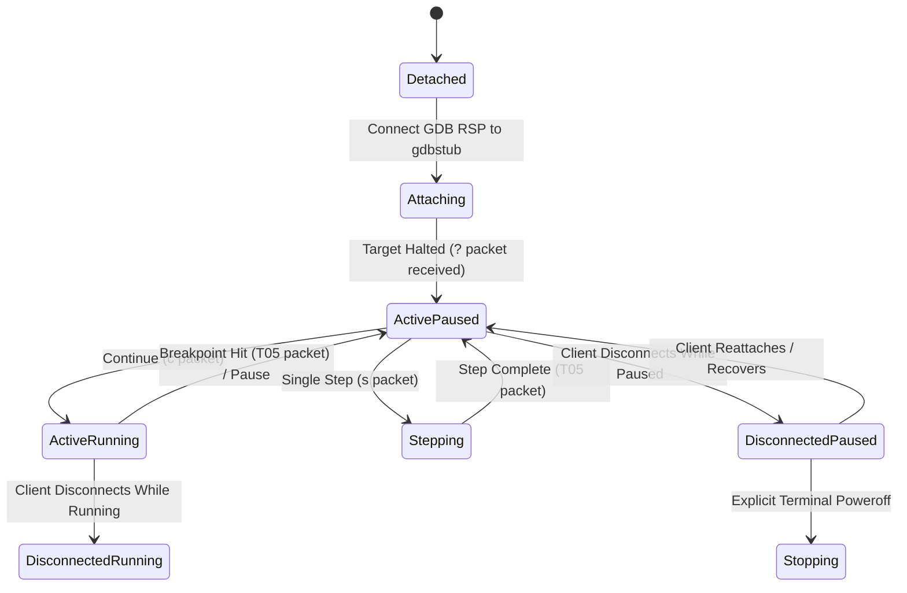

# Phase 1 Data Model: iOS Root VM and Darwin Security Research Backends

**Version**: 1.0.0  
**Feature Branch**: `002-ios-root-vm`  
**Status**: Complete  
**Authority**: `specs/002-ios-root-vm/research.md` and `specs/002-ios-root-vm/spec.md`

---

## 1. Architectural Overview & System Invariants

### 1.1 Scope and Domain Boundaries

This data model formalizes all entities, value objects, state transitions, validation rules, and persistence models for the iOS Root Virtual Machine and Darwin Security Research Harness within the `emu` project on macOS Apple Silicon (`aarch64`).

- **Primary Target Platform**: macOS Apple Silicon (`aarch64`, Darwin 25.x / macOS 15+) (FR-001). Host must satisfy `sysctl hw.optional.arm64 = 1` and `sysctl kern.hv_support = 1`.
- **Architectural Separation of Backends (FR-003, D-01)**: The system maintains strict operational separation between two distinct research backends:
  - `darwin-vm`: Minimal headless Darwin virtual machine specialized in root shell bootstrap, benign CLI testing, and low-level kernel debugging. Application frameworks are explicitly unavailable.
  - `Inferno`: Virtualized iOS security research environment specialized in userland security research, SpringBoard execution, application lifecycle management, and Frida dynamic instrumentation.
    The two backends do not share disk images, snapshots, or runtime supervisor instances (FR-009).
- **Platform Non-Regression & Android 001 Parity (FR-004, SC-008)**: Standard Android AVD and macOS iOS Simulator managers (`src/managers/common.rs`, `src/app/mod.rs`) remain 100% functional with zero regressions across 20 fixed lifecycle trials and zero performance degradation on baseline constitution budgets (polling <= 8ms, startup < 150ms, details <= 50ms, log streaming <= 10ms). All eight Android 001 specification artifacts (`specs/001-add-android-research-backends/`) are preserved byte-for-byte.
- **Host Privilege Boundary & Containment (FR-025, FR-034, SC-007, D-06)**: All research operations run strictly as an unprivileged host user. Guest root privileges (UID 0) grant zero host authority. No host drives, shared folders (virtfs/9p), or host credentials are exposed to the guest. In-guest filesystem modifications execute entirely within guest storage without host-side disk mounts during runtime. Emu never modifies host System Integrity Protection (SIP), Sealed System Volume (SSV), NVRAM variables, or host boot arguments.
- **Single-Binary Process Supervision (D-04)**: No persistent background system daemons (`launchd`). Running guests are supervised by private child instances: `emu __supervise --vm-id <ID>`. Finite mutating operations are executed by private workers: `emu __worker --operation-id <ID>`.

### 1.2 Storage and Persistence Model (D-04)

Research metadata, profiles, records, and durable state are stored strictly under the platform-local user data directory resolved via `dirs::data_local_dir()/emu/research`:

```text
~/Library/Application Support/emu/research/
├── instances/
│   ├── <instance_id>.json              # Serialized ResearchGuestInstance descriptors
│   └── locks/
│       └── <instance_id>.run.lock      # Advisory run lock (fs4)
├── profiles/
│   └── <profile_id>.json               # Versioned ResearchExperimentProfile definitions
├── artifacts/
│   └── <sha256_digest>.json            # Validated ResearchImageArtifact records
├── baselines/
│   └── <baseline_id>.json              # RecoveryBaseline reference state records
├── records/
│   └── <record_id>.json                # Immutable ExperimentRecord audit files
├── operations/
│   ├── <operation_id>.json             # OperationRecord journal
│   ├── <operation_id>.events.jsonl     # Streamed diagnostic log events
│   └── locks/
│       └── <operation_id>.op.lock      # Exclusive worker execution lock (fs4)
├── proposals/
│   └── <proposal_digest>.json          # MutationProposal pending authorization
└── security_profiles/
    └── <profile_id>.json               # GuestSecurityProfile definitions
```

#### Short Unix Domain Socket Paths on macOS (D-04)

Darwin sets `sizeof(sockaddr_un.sun_path)` to 104 bytes. Because standard paths under `$HOME/Library/Application Support/emu/research/...` exceed 104 bytes, the supervisor creates an owner-restricted (`0700`) temporary directory with a short path:

```text
/tmp/emu-<short_uuid>/
├── qmp.sock          # QEMU Machine Protocol control socket
├── gdb.sock          # Kernel debugging GDB RSP chardev socket
├── console.sock      # Virtio guest console PTY bridge socket
└── supervisor.sock   # Supervisor command & telemetry IPC socket
```

#### Persistence Invariants:

1. **Atomic Staged Writes**: Every state mutation is written to a `<filename>.tmp` sibling file, flushed, synced (`File::sync_all`), and atomically renamed (`std::fs::rename`).
2. **Dedicated Unlinked Lock Files**: Advisory locks use `fs4::FileExt` on dedicated unlinked `.lock` files. Lock files are never unlinked while held.
3. **No Automatic Mutation Retries (FR-047)**: Failed operations are marked `failed` or `unknown`. The reconciler never performs automatic retries on failed mutating steps.

---

## 2. Core Entities & Field Specifications

### 2.1 Entity Relationship Diagram



---

### 2.2 ResearchGuestInstance

Represents a managed virtualized Darwin or iOS research guest instance under either the `darwin-vm` or `Inferno` backend.

| Field Name            | Type                             | Optionality  | Description                                                                                                                                  |
| :-------------------- | :------------------------------- | :----------- | :------------------------------------------------------------------------------------------------------------------------------------------- |
| `id`                  | `ResearchGuestId` (UUIDv4)       | **Required** | Immutable globally unique identifier (e.g. `uuid::Uuid::new_v4()`). Disambiguates instances independently of display names (FR-005, SC-017). |
| `display_name`        | `String`                         | **Required** | Human-readable name (e.g. `ios-sec-lab`). May collide across backends (FR-007).                                                              |
| `backend`             | `BackendType` (Enum)             | **Required** | Virtualization backend: `darwin-vm` or `Inferno` (FR-003).                                                                                   |
| `lifecycle_state`     | `InstanceLifecycleState` (Enum)  | **Required** | Current state: `stopped`, `booting`, `running`, `paused`, `recovering`, `stopping`, `error` (D-04).                                          |
| `guest_arch`          | `CpuArchitecture` (Enum)         | **Required** | Guest CPU architecture: strictly `arm64` (Apple Silicon).                                                                                    |
| `guest_os_version`    | `String`                         | **Required** | OS release version (e.g. `"iOS 14.0 beta 5"`, `"Darwin 20.0.0 minimal"`).                                                                    |
| `build_identity`      | `String`                         | **Required** | Upstream build version (e.g. `"18A5351d"`).                                                                                                  |
| `boot_session_id`     | `Option<BootSessionId>` (UUIDv4) | Optional     | Unique boot session ID generated on each boot. Reset on cold reboot or crash (FR-010, FR-015). Null when stopped.                            |
| `config_revision`     | `Sha256Digest`                   | **Required** | Cryptographic hash of active kernel boot arguments, applied patches, and security profile.                                                   |
| `base_image_ref`      | `Sha256Digest`                   | **Required** | SHA-256 digest of registered base image artifact (FR-031).                                                                                   |
| `runtime_dir`         | `PathBuf`                        | **Required** | Short socket runtime directory: `/tmp/emu-<short_uuid>/` (D-04).                                                                             |
| `qmp_socket_path`     | `Option<PathBuf>`                | Optional     | Path to `qmp.sock`. Null when stopped.                                                                                                       |
| `gdb_socket_path`     | `Option<PathBuf>`                | Optional     | Path to `gdb.sock`. Null when stopped.                                                                                                       |
| `console_socket_path` | `Option<PathBuf>`                | Optional     | Path to `console.sock`. Null when stopped.                                                                                                   |
| `active_session_id`   | `Option<String>`                 | Optional     | Active user console session ID if attached.                                                                                                  |
| `security_profile_id` | `Option<String>`                 | Optional     | Currently applied `GuestSecurityProfile` ID (FR-030).                                                                                        |
| `baseline_id`         | `Option<RecoveryBaselineId>`     | Optional     | Associated recovery baseline ID (FR-043).                                                                                                    |
| `desired_privilege`   | `PrivilegeState` (Enum)          | **Required** | Desired privilege state: `root` (UID 0) or `unprivileged` (FR-014).                                                                          |
| `observed_privilege`  | `RootVerificationState` (Enum)   | **Required** | Observed privilege state: `unverified`, `verifying`, `verified`, `invalidated` (FR-014).                                                     |
| `created_at`          | `DateTime<Utc>`                  | **Required** | ISO 8601 creation timestamp.                                                                                                                 |
| `updated_at`          | `DateTime<Utc>`                  | **Required** | ISO 8601 last mutation timestamp.                                                                                                            |
| `last_settled_at`     | `DateTime<Utc>`                  | **Required** | Timestamp of last verified stable operational condition.                                                                                     |

#### Invariants & Validation Rules:

- **FR-005 / SC-017**: `id` is globally unique and immutable. Two instances with identical `display_name` ("ios-sec-lab") under `darwin-vm` and `Inferno` have distinct IDs and are controlled independently.
- **FR-007**: Addressing by `display_name` that matches multiple instances across backends MUST be rejected with exit code 2 (`invalid_input`) unless qualified by `--backend` or `--id`.
- **FR-015**: Any guest reboot, crash, or base image replacement transitions `boot_session_id` to a fresh UUID and marks `observed_privilege` as `unverified`.

---

### 2.3 BackendCapabilityProfile

Declarative evaluation of host operating system compatibility, hypervisor entitlements, and supported research operational layers.

| Field Name                   | Type                           | Optionality  | Description                                                                                                                      |
| :--------------------------- | :----------------------------- | :----------- | :------------------------------------------------------------------------------------------------------------------------------- |
| `backend`                    | `BackendType` (Enum)           | **Required** | `darwin-vm` or `Inferno`.                                                                                                        |
| `host_os`                    | `HostOs` (Enum)                | **Required** | Strictly `macos` (Darwin). Non-Darwin is unsupported (FR-001).                                                                   |
| `host_arch`                  | `HostArchitecture` (Enum)      | **Required** | Strictly `arm64` (Apple Silicon). x86_64 is unsupported (FR-001).                                                                |
| `hypervisor`                 | `HypervisorType` (Enum)        | **Required** | `hypervisor_framework` (`Hypervisor.framework` via `sysctl kern.hv_support`) or `tcg_emulation`.                                 |
| `support_status`             | `SupportStatus` (Enum)         | **Required** | `supported`, `unsupported`, or `experimental`.                                                                                   |
| `supported_guest_families`   | `Vec<String>`                  | **Required** | e.g. `["darwin-minimal"]` for `darwin-vm`; `["ios-14", "ios-15"]` for `Inferno`.                                                 |
| `headless_console_support`   | `bool`                         | **Required** | `true` for both backends.                                                                                                        |
| `graphical_display_support`  | `bool`                         | **Required** | `false` for `darwin-vm`; `true` for `Inferno` (SpringBoard/UI display).                                                          |
| `companion_vm_required`      | `bool`                         | **Required** | `false` for `darwin-vm`; `true` for `Inferno` (restore/USB workflows).                                                           |
| `app_frameworks_supported`   | `bool`                         | **Required** | `false` for `darwin-vm` (minimal kernel/CLI only); `true` for `Inferno` (SC-003, FR-023).                                        |
| `supported_debug_interfaces` | `Vec<DebugInterfaceType>`      | **Required** | `["gdb_rsp", "qmp_monitor"]` for both backends (FR-027).                                                                         |
| `required_binaries`          | `Vec<BinaryPrerequisite>`      | **Required** | Host binaries: `qemu-system-aarch64` (or custom fork binary), `hdiutil`, `diskutil`. For `Inferno`: `ideviceinstaller` (FR-016). |
| `required_entitlements`      | `Vec<EntitlementPrerequisite>` | **Required** | Hypervisor entitlements, SIP inspection status.                                                                                  |
| `remediation_steps`          | `Vec<String>`                  | **Required** | Human-readable remediation advice if prerequisites are missing.                                                                  |

#### Invariants & Validation Rules:

- **FR-001 / Gate G-01**: Must run on macOS Apple Silicon (`aarch64`). If evaluated on Linux or Windows, `support_status` MUST evaluate to `unsupported`.
- **FR-023 / SC-003**: `darwin-vm` declares `app_frameworks_supported = false`. Any request to install applications or spawn app Frida sessions on `darwin-vm` MUST be rejected with exit code 3 (`unsupported`) and structured diagnostic `AppFrameworksUnavailable`.

---

### 2.4 ResearchImageArtifact

Represents a legally obtained and verified firmware image, kernelcache, ramdisk, device tree, or root filesystem artifact.

| Field Name               | Type                           | Optionality  | Description                                                                                                     |
| :----------------------- | :----------------------------- | :----------- | :-------------------------------------------------------------------------------------------------------------- |
| `artifact_id`            | `ArtifactId` (String)          | **Required** | Content hash-derived identifier: `art_sha256_<prefix>`.                                                         |
| `artifact_type`          | `ImageArtifactType` (Enum)     | **Required** | `kernelcache`, `ramdisk`, `devicetree`, `trustcache`, `root_disk`, `ipsw_restore_bundle`.                       |
| `file_path`              | `PathBuf`                      | **Required** | Absolute path to artifact on host.                                                                              |
| `sha256_digest`          | `Sha256Digest` (String)        | **Required** | Cryptographic SHA-256 digest: `sha256:<hex>`. Computed prior to registration (FR-031).                          |
| `origin_metadata`        | `ImageOriginMetadata` (Struct) | **Required** | Source provenance: `source_type` (`user_supplied`, `prepared_recovery`), `build_identity`, `source_url_or_ref`. |
| `target_backend`         | `BackendType` (Enum)           | **Required** | Target backend: `darwin-vm` or `Inferno`. Prevents cross-backend raw image boot (FR-009).                       |
| `build_version_identity` | `String`                       | **Required** | Guest build identity parsed from plist/build manifest (e.g. `"18A5351d"`).                                      |
| `verified_device_node`   | `Option<String>`               | Optional     | Isolated device node (e.g. `"/dev/disk4s1"`) when attached for preparation (FR-033).                            |
| `verified_volume_uuid`   | `Option<String>`               | Optional     | Unique volume UUID verified via `diskutil info -plist` (FR-033). Hardcoded paths rejected.                      |
| `trust_status`           | `ArtifactTrustStatus` (Enum)   | **Required** | `verified_trusted`, `experimental_opt_in`, `digest_mismatch_corrupt`, `unverified_untrusted` (FR-032).          |
| `created_at`             | `DateTime<Utc>`                | **Required** | Registration timestamp.                                                                                         |

#### Invariants & Validation Rules:

- **FR-009**: An artifact with `target_backend = inferno` MUST NOT be used to initialize a `darwin-vm` instance and vice versa.
- **FR-032 / SC-009**: Corrupt or truncated images are marked `digest_mismatch_corrupt` and rejected prior to hypervisor initialization. Experimental artifacts require explicit `--allow-experimental` and an existing `RecoveryBaseline`.
- **FR-033 / SC-010**: Host-side image preparation verifies `verified_device_node` and `verified_volume_uuid`. Hardcoded mount paths (e.g. `/Volumes/System`) are strictly prohibited.

---

### 2.5 RootProofEvidence

Encapsulates the empirical verification evidence proving effective root control (UID 0) within a booted iOS-derived guest environment.

| Field Name                 | Type                           | Optionality  | Description                                                                                               |
| :------------------------- | :----------------------------- | :----------- | :-------------------------------------------------------------------------------------------------------- |
| `evidence_id`              | `EvidenceId` (UUIDv4)          | **Required** | Unique identifier for the verification execution.                                                         |
| `guest_id`                 | `ResearchGuestId` (UUIDv4)     | **Required** | Target guest instance identifier (FR-010).                                                                |
| `boot_session_id`          | `BootSessionId` (UUIDv4)       | **Required** | Active boot session ID to which this evidence is bound (FR-010).                                          |
| `backend`                  | `BackendType` (Enum)           | **Required** | Backend: `darwin-vm` or `Inferno`.                                                                        |
| `guest_build_identity`     | `String`                       | **Required** | Verified guest build identity (e.g. `"18A5351d"`).                                                        |
| `image_artifact_digest`    | `Sha256Digest`                 | **Required** | SHA-256 digest of input disk/firmware artifact.                                                           |
| `config_revision_hash`     | `Sha256Digest`                 | **Required** | Cryptographic hash of kernel boot arguments and security configuration (FR-010).                          |
| `verified_uid`             | `u32`                          | **Required** | Observed effective user ID: must be `0` for root (FR-010).                                                |
| `positive_probe_outcome`   | `ProbeOutcome` (Struct)        | **Required** | Positive test: writing `/private/var/root/.emu_probe` succeeds, content verified (FR-012).                |
| `negative_control_outcome` | `ProbeOutcome` (Struct)        | **Required** | Negative control: executing write as UID 501 (`mobile`) verifiably denied (`Permission denied`) (FR-012). |
| `observed_kernel_version`  | `String`                       | **Required** | Output of `uname -v` captured in guest (FR-013).                                                          |
| `observed_boot_args`       | `String`                       | **Required** | Boot arguments queried via `sysctl kern.bootargs` (FR-013).                                               |
| `benign_binary_digest`     | `Sha256Digest`                 | **Required** | SHA-256 digest of the supplied benign CLI test binary executed during verification (FR-013).              |
| `verification_state`       | `RootVerificationState` (Enum) | **Required** | `verified` (both positive and negative pass), `unverified` (probe failure, negative pass, or missing).    |
| `verified_at`              | `DateTime<Utc>`                | **Required** | Timestamp when empirical proof was evaluated.                                                             |
| `diagnostics`              | `Vec<String>`                  | **Required** | Structured log messages or warning diagnostics.                                                           |

#### Invariants & Validation Rules:

- **FR-012 / Gate T-01**: Both positive probe (UID 0 success) AND negative control (UID 501 denial) MUST succeed for `verification_state` to be `verified`.
- **FR-014 / Gate T-02**: If the unprivileged negative control action unexpectedly succeeds, `verification_state` MUST immediately be set to `unverified`.
- **FR-015 / Gate T-03**: Rebooting the guest or modifying kernel boot arguments invalidates active evidence; `verification_state` transitions to `unverified`.

---

### 2.6 ApplicationArtifact

Represents an owned, compatible iOS application package managed for security research on the `Inferno` backend.

| Field Name                | Type                         | Optionality  | Description                                                                                            |
| :------------------------ | :--------------------------- | :----------- | :----------------------------------------------------------------------------------------------------- |
| `app_id`                  | `ApplicationId` (String)     | **Required** | Application identifier: `app_<bundle_id>_<prefix>`.                                                    |
| `bundle_identifier`       | `String`                     | **Required** | Bundle ID (e.g. `"com.example.researchapp"`).                                                          |
| `bundle_name`             | `String`                     | **Required** | Display bundle name (e.g. `"ResearchApp"`).                                                            |
| `package_path`            | `PathBuf`                    | **Required** | Path to owned IPA or unpacked `.app` directory on host.                                                |
| `sha256_digest`           | `Sha256Digest`               | **Required** | SHA-256 digest of the application package file (FR-031).                                               |
| `binary_architecture`     | `CpuArchitecture` (Enum)     | **Required** | Must be `arm64` (Apple Silicon 64-bit Mach-O).                                                         |
| `code_signature_identity` | `String`                     | **Required** | Code signature identity or `"adhoc"` / `"unsigned"` (FR-022).                                          |
| `sandbox_container_path`  | `Option<String>`             | Optional     | In-guest data container path: `/private/var/mobile/Containers/Data/Application/<UUID>` (D-03, FR-024). |
| `entitlement_manifest`    | `Map<String, Value>`         | **Required** | Extracted entitlements plist dictionary.                                                               |
| `deployment_status`       | `AppDeploymentStatus` (Enum) | **Required** | `imported`, `installed`, `running`, `stopped`, `removed`, `incompatible`.                              |
| `target_guest_id`         | `ResearchGuestId` (UUIDv4)   | **Required** | Guest instance to which this application is deployed.                                                  |
| `created_at`              | `DateTime<Utc>`              | **Required** | Import timestamp.                                                                                      |
| `updated_at`              | `DateTime<Utc>`              | **Required** | Last status update timestamp.                                                                          |

#### Invariants & Validation Rules:

- **FR-016 / D-03**: Application installation is managed via `ideviceinstaller` using the standard `InstallationProxy` protocol over usbmuxd.
- **FR-022 / Gate G-05**: Mach-O header must declare ARM64 architecture. Incompatible binaries are rejected with exit code 2 (`invalid_input`).
- **FR-024**: Container access is restricted strictly to `/private/var/mobile/Containers/Data/Application/<UUID>` and requires explicit researcher authorization.

---

### 2.7 InstrumentationSession

Represents an active dynamic instrumentation session managed by the isolated `emu-frida-worker` process.

| Field Name                   | Type                          | Optionality  | Description                                                                              |
| :--------------------------- | :---------------------------- | :----------- | :--------------------------------------------------------------------------------------- |
| `session_id`                 | `InstrumentationSessionId`    | **Required** | Unique session ID: `sess_<uuid>`.                                                        |
| `guest_id`                   | `ResearchGuestId` (UUIDv4)    | **Required** | Target guest instance ID.                                                                |
| `boot_session_id`            | `BootSessionId` (UUIDv4)      | **Required** | Active boot session ID (FR-017).                                                         |
| `target_process_id`          | `u32`                         | **Required** | In-guest target PID.                                                                     |
| `target_bundle_id`           | `Option<String>`              | Optional     | Target iOS bundle ID if spawned via Frida `Device.spawn()`.                              |
| `agent_package_version`      | `String`                      | **Required** | Pinned Frida version: `"17.18.0"` (D-02, FR-017).                                        |
| `agent_integrity_hash`       | `Sha256Digest`                | **Required** | SHA-256 digest of deployed in-guest Frida agent package.                                 |
| `injected_script_hashes`     | `Vec<Sha256Digest>`           | **Required** | SHA-256 hashes of injected user scripts.                                                 |
| `hook_status`                | `HookStatus` (Struct)         | **Required** | Hook telemetry: `native_hooks_count`, `objc_hooks_count`, `events_intercepted`.          |
| `attachment_state`           | `FridaAttachmentState` (Enum) | **Required** | `detached`, `preparing`, `ready`, `attached`, `detached_clean`, `failed`, `invalidated`. |
| `attached_at`                | `Option<DateTime<Utc>>`       | Optional     | Timestamp when first hook event confirmed ready (FR-018).                                |
| `detached_at`                | `Option<DateTime<Utc>>`       | Optional     | Timestamp when session detached cleanly.                                                 |
| `captured_hook_events_count` | `u64`                         | **Required** | Total count of intercepted invocations.                                                  |
| `control_process_id`         | `Option<u32>`                 | Optional     | In-guest uninstrumented control PID (FR-021).                                            |
| `control_process_hooked`     | `bool`                        | **Required** | Must be `false`. Verifies probes attach exclusively to target PID (FR-021, SC-002).      |
| `diagnostics`                | `Vec<String>`                 | **Required** | Diagnostic logs from `emu-frida-worker`.                                                 |

#### Invariants & Validation Rules:

- **FR-018 / SC-002**: `attachment_state` transitions to `ready` ONLY after confirmed hook telemetry is received from the target process.
- **FR-019 / Gate T-03**: Guest reboot or target process termination immediately transitions `attachment_state` to `invalidated`.
- **FR-021**: `control_process_hooked` must remain `false`. Hooking of non-target processes fails the trial.

---

### 2.8 GuestSecurityProfile

Represents the declared and observable runtime security configuration of a research guest.

| Field Name               | Type                          | Optionality  | Description                                                                    |
| :----------------------- | :---------------------------- | :----------- | :----------------------------------------------------------------------------- |
| `profile_id`             | `String`                      | **Required** | Unique security profile ID (e.g. `"secprof_amfi_relaxed"`).                    |
| `name`                   | `String`                      | **Required** | Human-readable name.                                                           |
| `code_signing_mode`      | `CodeSigningMode` (Enum)      | **Required** | `enforced`, `adhoc_permitted`, `disabled`.                                     |
| `amfi_status`            | `AmfiStatus` (Enum)           | **Required** | `enforced`, `developer_mode`, `amfi_get_out_of_my_way` (boot-arg `amfi=0xff`). |
| `sandbox_mode`           | `SandboxMode` (Enum)          | **Required** | `enforced`, `audit_only`, `relaxed`.                                           |
| `root_filesystem_mount`  | `MountMode` (Enum)            | **Required** | `read_only` (stock default) or `read_write` (research mode) (FR-025).          |
| `kernel_privilege_level` | `KernelPrivilegeLevel` (Enum) | **Required** | `stock`, `root_console_enabled`, `kernel_debug_enabled`.                       |
| `guest_relaxations`      | `Vec<String>`                 | **Required** | List of specific policy relaxations applied inside guest (FR-030).             |
| `created_at`             | `DateTime<Utc>`               | **Required** | Creation timestamp.                                                            |
| `updated_at`             | `DateTime<Utc>`               | **Required** | Last update timestamp.                                                         |

#### Invariants & Validation Rules:

- **FR-030**: Security profile relaxations are reported independently of UID 0 root privilege status. Having UID 0 root access does not imply sandbox is disabled.

---

### 2.9 CompanionEnvironment

Represents a local helper virtual machine on the macOS host supporting restore and setup utilities for `Inferno`.

| Field Name               | Type                            | Optionality  | Description                                                                    |
| :----------------------- | :------------------------------ | :----------- | :----------------------------------------------------------------------------- |
| `companion_id`           | `CompanionId` (UUIDv4)          | **Required** | Unique companion VM identifier.                                                |
| `parent_guest_id`        | `ResearchGuestId` (UUIDv4)      | **Required** | Primary `Inferno` guest instance requiring helper services.                    |
| `lifecycle_state`        | `InstanceLifecycleState` (Enum) | **Required** | `stopped`, `booting`, `running`, `stopping`, `error`.                          |
| `cpu_limit`              | `u32`                           | **Required** | Allocated virtual CPUs (default: `2`).                                         |
| `memory_limit_mb`        | `u64`                           | **Required** | Allocated RAM ceiling in megabytes (default: `2048`).                          |
| `storage_limit_mb`       | `u64`                           | **Required** | Virtual disk ceiling in megabytes (default: `8192`).                           |
| `endpoint_socket_path`   | `PathBuf`                       | **Required** | Local Unix Domain Socket for access-controlled same-host IPC (FR-039).         |
| `forwarded_ports`        | `Vec<u16>`                      | **Required** | Local loopback ports (e.g. `[27042]`). Bound strictly to `127.0.0.1` (FR-039). |
| `active_workflows_count` | `u32`                           | **Required** | Count of actively executing restore tasks.                                     |
| `live_dependents_count`  | `u32`                           | **Required** | Count of live guest sessions currently bound to companion forwarders (FR-038). |
| `created_at`             | `DateTime<Utc>`                 | **Required** | Launch timestamp.                                                              |
| `updated_at`             | `DateTime<Utc>`                 | **Required** | Last heartbeat timestamp.                                                      |

#### Invariants & Validation Rules:

- **FR-038 / SC-011**: Companion VM terminates ONLY when `active_workflows_count == 0` AND `live_dependents_count == 0`.
- **FR-039**: Companion endpoints are bound strictly to private Unix Domain Sockets or `127.0.0.1`. Public interface binding (`0.0.0.0`) is unconditionally prohibited.

---

### 2.10 ResearchExperimentProfile

An editable, versioned specification of a complete reproducible research setup.

| Field Name                | Type                   | Optionality  | Description                                                     |
| :------------------------ | :--------------------- | :----------- | :-------------------------------------------------------------- |
| `profile_id`              | `String`               | **Required** | Unique profile identifier: `prof_<uuid>`.                       |
| `name`                    | `String`               | **Required** | Human-readable name.                                            |
| `target_backend`          | `BackendType` (Enum)   | **Required** | Target backend: `darwin-vm` or `Inferno`.                       |
| `base_image_digest`       | `Sha256Digest`         | **Required** | SHA-256 digest of verified base image artifact.                 |
| `kernel_boot_args`        | `String`               | **Required** | Kernel boot arguments (e.g. `"debug=0x144 amfi=0xff -v"`).      |
| `applied_patches`         | `Vec<String>`          | **Required** | List of applied patch identifiers.                              |
| `security_profile`        | `GuestSecurityProfile` | **Required** | Desired guest security configuration.                           |
| `app_artifacts`           | `Vec<Sha256Digest>`    | **Required** | SHA-256 digests of applications to install (Inferno).           |
| `instrumentation_scripts` | `Vec<Sha256Digest>`    | **Required** | SHA-256 digests of Frida instrumentation scripts.               |
| `guest_fixtures`          | `Vec<String>`          | **Required** | Declared test fixtures (e.g. `"/private/var/root/.emu_probe"`). |
| `exported_at`             | `DateTime<Utc>`        | **Required** | Export timestamp.                                               |
| `version`                 | `String`               | **Required** | Semantic version (e.g. `"1.0.0"`).                              |

#### Invariants & Validation Rules:

- **FR-041**: Exported profiles MUST automatically strip all host environment variables, host credentials, private SSH keys, and user secrets.
- **FR-040**: Re-importing a profile requires local validation of artifact checksums prior to instantiating the guest.

---

### 2.11 ExperimentRecord

An immutable, append-only historical audit record capturing the full execution trial.

| Field Name                | Type                           | Optionality  | Description                                      |
| :------------------------ | :----------------------------- | :----------- | :----------------------------------------------- |
| `record_id`               | `RecordId` (UUIDv4)            | **Required** | Immutable record identifier: `rec_<uuid>`.       |
| `profile_id`              | `String`                       | **Required** | Associated research profile ID.                  |
| `backend`                 | `BackendType` (Enum)           | **Required** | Backend used in trial.                           |
| `upstream_build_identity` | `String`                       | **Required** | Upstream build version (e.g. `"18A5351d"`).      |
| `artifact_checksums`      | `Map<String, Sha256Digest>`    | **Required** | Fingerprints of all components used.             |
| `session_parameters`      | `Map<String, Value>`           | **Required** | Boot parameters, hypervisor arguments.           |
| `observed_root_proof`     | `Option<RootProofEvidence>`    | Optional     | Captured root proof evidence if evaluated.       |
| `instrumentation_summary` | `Option<HookStatus>`           | Optional     | Captured Frida hook statistics if evaluated.     |
| `kernel_debug_telemetry`  | `Option<DebugTelemetryRecord>` | Optional     | Summary of kernel debug operations executed.     |
| `execution_status`        | `OperationStatus` (Enum)       | **Required** | `completed`, `failed`, `cancelled`, `timed_out`. |
| `started_at`              | `DateTime<Utc>`                | **Required** | Trial start timestamp.                           |
| `completed_at`            | `DateTime<Utc>`                | **Required** | Trial completion timestamp.                      |
| `errors`                  | `Vec<String>`                  | **Required** | List of recorded errors or failure reasons.      |

#### Invariants & Validation Rules:

- **FR-042 / SC-018**: Once written, `ExperimentRecord` files are immutable. The filesystem enforces write-protection; records are never mutated or overwritten.

---

### 2.12 RecoveryBaseline

A verified, immutable reference state used for guest rollback following experimental modification or failure.

| Field Name                      | Type                          | Optionality  | Description                                              |
| :------------------------------ | :---------------------------- | :----------- | :------------------------------------------------------- |
| `baseline_id`                   | `RecoveryBaselineId` (String) | **Required** | Baseline identifier: `base_<guest_id>_<prefix>`.         |
| `guest_id`                      | `ResearchGuestId` (UUIDv4)    | **Required** | Target guest instance ID.                                |
| `backend`                       | `BackendType` (Enum)          | **Required** | Target backend.                                          |
| `base_disk_digest`              | `Sha256Digest`                | **Required** | SHA-256 digest of clean baseline disk image.             |
| `kernel_config_hash`            | `Sha256Digest`                | **Required** | Hash of verified stock kernel boot configuration.        |
| `clean_snapshot_path`           | `PathBuf`                     | **Required** | Path to verified clean copy-on-write base disk.          |
| `declared_recovery_deadline_ms` | `u64`                         | **Required** | Predeclared recovery SLA in milliseconds (e.g. `15000`). |
| `verified`                      | `bool`                        | **Required** | `true` only after successful boot verification (FR-043). |
| `verified_at`                   | `Option<DateTime<Utc>>`       | Optional     | Timestamp when boot verification succeeded.              |
| `created_at`                    | `DateTime<Utc>`               | **Required** | Creation timestamp.                                      |

#### Invariants & Validation Rules:

- **FR-043 / SC-012**: If `verified == false` or baseline files are missing/corrupted, rollback is safely rejected with an error; automatic instance deletion is prohibited. Overwriting persistent guest state requires explicit authorization.

---

### 2.13 MutationProposal

Represents a pending destructive modification requiring explicit two-step researcher authorization.

| Field Name           | Type                       | Optionality  | Description                                                                  |
| :------------------- | :------------------------- | :----------- | :--------------------------------------------------------------------------- |
| `proposal_id`        | `ProposalId` (UUIDv4)      | **Required** | Unique proposal tracking ID.                                                 |
| `proposal_digest`    | `Sha256Digest` (String)    | **Required** | Cryptographic hash of proposed action: `sha256:<hex>`.                       |
| `operation_type`     | `MutationType` (Enum)      | **Required** | `disk_wipe`, `instance_delete`, `baseline_restore`, `security_policy_relax`. |
| `target_instance_id` | `ResearchGuestId` (UUIDv4) | **Required** | Target guest instance ID.                                                    |
| `backend`            | `BackendType` (Enum)       | **Required** | Target backend.                                                              |
| `affected_paths`     | `Vec<PathBuf>`             | **Required** | Concrete filesystem paths to be deleted or overwritten.                      |
| `destructive`        | `bool`                     | **Required** | Always `true` for `MutationProposal`.                                        |
| `expires_at`         | `DateTime<Utc>`            | **Required** | Proposal expiration timestamp (default: 15 minutes).                         |
| `parameters`         | `Map<String, Value>`       | **Required** | Serialized arguments of the proposed operation.                              |

#### Invariants & Validation Rules:

- **FR-008**: Destructive operations invoked without `--authorize sha256:<digest>` return exit code 4 (`auth_refused`) along with the generated `MutationProposal`.

---

### 2.14 KernelDebugLease

Represents an exclusive concurrency lease acquired by an active kernel debugging session.

| Field Name          | Type                       | Optionality  | Description                                                        |
| :------------------ | :------------------------- | :----------- | :----------------------------------------------------------------- |
| `lease_id`          | `LeaseId` (UUIDv4)         | **Required** | Unique lease identifier.                                           |
| `guest_id`          | `ResearchGuestId` (UUIDv4) | **Required** | Target guest instance ID.                                          |
| `session_id`        | `String`                   | **Required** | Debugger client session ID.                                        |
| `client_identity`   | `String`                   | **Required** | Client identifier (e.g. `"emu-gdb-client"`, `"cli-debug"`).        |
| `lease_state`       | `DebugLeaseState` (Enum)   | **Required** | `active`, `released`, `expired`, `disconnected_paused`.            |
| `acquired_at`       | `DateTime<Utc>`            | **Required** | Timestamp when lease was acquired.                                 |
| `heartbeat_at`      | `DateTime<Utc>`            | **Required** | Last client heartbeat timestamp.                                   |
| `qmp_cont_blocked`  | `bool`                     | **Required** | Must be `true`. While lease is held, QMP `cont` is blocked (D-05). |
| `gdb_endpoint_path` | `PathBuf`                  | **Required** | Private Unix Domain Socket for GDB RSP communication.              |

#### Invariants & Validation Rules:

- **D-05**: While a `KernelDebugLease` is `active`, all conflicting QMP commands (`cont`, `system_reset`) are strictly blocked.
- **FR-029 / SC-006**: When client disconnects while paused, lease transitions to `disconnected_paused`. Guest remains paused; silent resumption is prohibited.

---

## 3. State Machines & Lifecycle Dynamics

### 3.1 Guest Instance Lifecycle State Machine

A `ResearchGuestInstance` transitions through deterministic lifecycle states managed by the supervisor process (D-04):



#### State Transition Invariants:

1. **Stopped -> Booting**: Requires acquiring `<instance_id>.run.lock` via `fs4`. Fails with exit code 5 (`conflict`) if already held.
2. **Running -> Paused**: Issuing QMP `stop` halts virtual CPU execution. Guest runstate is `PAUSED`. Never reported as crash or boot failure (FR-028).
3. **Paused -> Running**: Issuing QMP `cont` resumes CPU execution. Permitted only if no conflicting `KernelDebugLease` blocks resumption (D-05).
4. **Any -> Error**: If hypervisor exits unexpectedly, supervisor discovers crash, cleans up short socket directory `/tmp/emu-<uuid>/`, marks state `error`, and does not automatically restart (FR-047).

---

### 3.2 Operation Lifecycle State Machine

Asynchronous and multi-stage mutating operations (image preparation, application installation, baseline restoration) transition through the following states:



#### Transition Invariants:

1. **CancellationPending vs Cancelled (FR-046)**: Requesting cancellation immediately sets status to `cancellation_pending` (acknowledged within <= 200ms, SC-015). Cessation is confirmed and status becomes `cancelled` ONLY after reaching a verified safe transaction boundary.
2. **TimedOut State Truthfulness (FR-046, SC-016)**: When caller wait deadline expires, the system returns exit code 124 (`timed_out`) and reports actual running state (`continuing`, `stopped`, or `unknown`). Continuing background tasks are not aborted by observer timeouts.

---

### 3.3 Root Verification State Machine

Empirical privilege verification follows a strict evidence-bound lifecycle (FR-014, FR-015):



#### Transition Invariants:

1. **Verifying -> Verified**: Requires both UID 0 success on `/private/var/root/.emu_probe` AND permission denial for UID 501 `mobile` (FR-012).
2. **Verified -> Invalidated**: Triggered automatically on guest reboot, crash, base image swap, or security policy modification. Active verification does NOT survive cold boots without fresh proof (FR-015).
3. **Runtime Invariance**: Normal in-guest writes by running workloads or fixtures preserve `verified` status throughout active boot session (FR-015).

---

### 3.4 Frida Dynamic Instrumentation State Machine

Dynamic instrumentation managed by `emu-frida-worker` follows this lifecycle (FR-017, FR-018, FR-019):



#### Transition Invariants:

1. **Ready -> Attached**: Requires confirmed reception of at least one valid hook event (native C or Objective-C) from target PID.
2. **Attached -> DetachedClean**: Detaches probes cleanly without terminating the target process (FR-018).
3. **Attached -> Invalidated**: Triggered automatically if target process exits or guest reboots (FR-019).

---

### 3.5 Kernel Debugger State Machine

The typed GDB RSP kernel debugger engine transitions through these states under an exclusive `KernelDebugLease` (D-05, FR-027, FR-029):



#### Transition Invariants:

1. **ActivePaused -> DisconnectedPaused (FR-029, SC-006)**: If client disconnects while guest is paused, hypervisor execution remains paused. Status is reported truthfully as `paused`. Silent resumption is prohibited.
2. **DisconnectedPaused Recovery**: CLI/TUI surfaces explicit recovery commands: `resume`, `reset`, or `terminate` (FR-029).

---

## 4. Validation Rule Engine (All 48 FRs)

The following matrix formally specifies the constraint rules, enforcing entity, method, and failure outcome for all Functional Requirements (FR-001 through FR-048):

| Rule ID    | Invariant & Constraint Specification                                                                                                                | Enforcing Entity & Method                           | Failure Outcome & Exit Code                                 |
| :--------- | :-------------------------------------------------------------------------------------------------------------------------------------------------- | :-------------------------------------------------- | :---------------------------------------------------------- |
| **FR-001** | Host must be macOS Apple Silicon (`aarch64`). Non-Darwin or x86_64 host rejected.                                                                   | `BackendCapabilityProfile::evaluate_host()`         | Exit code 3 (`unsupported`), structured diagnostic          |
| **FR-002** | Preflight diagnostics must execute non-interactively without GUI initialization.                                                                    | `PreflightEngine::run_preflight()`                  | Exit code 0 with capability JSON or non-zero on error       |
| **FR-003** | `darwin-vm` and `Inferno` backends must remain operationally and structurally isolated.                                                             | `InstanceRegistry::validate_backend_isolation()`    | Exit code 5 (`conflict`) on cross-backend contamination     |
| **FR-004** | Standard Android AVD and iOS Simulator workflows must exhibit zero regressions (SC-008).                                                            | `LegacyManagerRegressionTest::assert_parity()`      | Exit code 1 (`failed`) if legacy manager behavior altered   |
| **FR-005** | Guest instance assigned immutable UUIDv4 identifier independent of display name.                                                                    | `ResearchGuestInstance::new()`                      | Invariant enforced by constructor; UUID cannot be mutated   |
| **FR-006** | Guest lifecycle operations (create, inspect, start, stop, restart, delete) supported.                                                               | `GuestCoordinator::execute_lifecycle()`             | Exit code 1 (`failed`) on invalid lifecycle transition      |
| **FR-007** | Duplicate display names across backends must be disambiguated by backend or ID.                                                                     | `InstanceResolver::resolve_by_query()`              | Exit code 2 (`invalid_input`) if query matches >1 instance  |
| **FR-008** | Destructive actions require two-step authorization with `proposal_digest`.                                                                          | `MutationGate::validate_authorization()`            | Exit code 4 (`auth_refused`), returns `MutationProposal`    |
| **FR-009** | Raw disk images or snapshots cannot be reused across different backends.                                                                            | `ArtifactValidator::validate_backend_match()`       | Exit code 2 (`invalid_input`) on backend mismatch           |
| **FR-010** | Verify effective root (UID 0) in guest, bound to boot session ID and build identity.                                                                | `RootProofEngine::verify_root()`                    | `verification_state = unverified`, exit code 1 on failure   |
| **FR-011** | Interactive root console established via guest bootstrap without external exploits.                                                                 | `ConsoleManager::attach_console()`                  | Exit code 1 (`failed`) if console chardev unavailable       |
| **FR-012** | Root verification executes positive probe and verifies negative control denial.                                                                     | `RootProofEngine::evaluate_probes()`                | Exit code 1 (`failed`) if negative control succeeds         |
| **FR-013** | Record guest kernel version, boot parameters, and benign test binary execution digest.                                                              | `RootProofEngine::capture_evidence()`               | Incomplete evidence marks `verification_state = unverified` |
| **FR-014** | Desired privilege and observed privilege reported as distinct attributes.                                                                           | `ResearchGuestInstance::get_status()`               | Separate fields in serialized JSON output                   |
| **FR-015** | Root verification invalidated on reboot, crash, base image swap, or bootarg change.                                                                 | `SupervisorMonitor::on_lifecycle_event()`           | Transitions `observed_privilege` to `unverified`            |
| **FR-016** | Import, install, list, launch, inspect, stop, remove owned iOS apps on `Inferno`.                                                                   | `AppManager::manage_lifecycle()`                    | Exit code 1 (`failed`) on installation proxy error          |
| **FR-017** | Complete Frida lifecycle bound to instance ID, boot session ID, agent version & hash.                                                               | `FridaWorkerClient::manage_lifecycle()`             | Exit code 1 (`failed`) on version/hash mismatch             |
| **FR-018** | Frida attach / spawn requires actual observed hook evidence before reporting ready.                                                                 | `FridaWorkerClient::attach()`                       | `attachment_state` remains `preparing` until hook received  |
| **FR-019** | Frida readiness invalidated on reboot, base image change, or process exit.                                                                          | `FridaWorkerClient::on_process_exit()`              | Transitions `attachment_state` to `invalidated`             |
| **FR-020** | Capture dynamic hook evidence from both native C/ARM64 functions and ObjC methods.                                                                  | `FridaWorkerClient::capture_telemetry()`            | Verified in `HookStatus` counts                             |
| **FR-021** | Dynamic probes attach strictly to target PID; control process remains unhooked.                                                                     | `FridaWorkerClient::verify_specificity()`           | Exit code 1 (`failed`) if control process is hooked         |
| **FR-022** | Validate application ABI (ARM64) and signature against security profile prior to launch.                                                            | `AppValidator::validate_binary()`                   | Exit code 2 (`invalid_input`) on incompatible ABI           |
| **FR-023** | Report app frameworks unavailable on minimal backends (`darwin-vm`) truthfully.                                                                     | `BackendCapabilityProfile::assert_apps_supported()` | Exit code 3 (`unsupported`), `AppFrameworksUnavailable`     |
| **FR-024** | Authorized scoped read/export of app containers requires explicit authorization.                                                                    | `ContainerManager::export_container_path()`         | Exit code 4 (`auth_refused`) if unauthorized                |
| **FR-025** | Authorized in-guest root filesystem access runs in guest without host disk mounts.                                                                  | `GuestFsManager::execute_in_guest()`                | Zero host mounts created during live guest execution        |
| **FR-026** | Enumerate guest processes, query Mach services, attach Frida to daemons on `Inferno`.                                                               | `SystemInspector::inspect_services()`               | Structured JSON list of daemons and services                |
| **FR-027** | Kernel debug operations (pause, resume, registers, memory, step, breakpoints).                                                                      | `GdbRspClient::execute_debug_cmd()`                 | Exit code 1 (`failed`) on RSP protocol error                |
| **FR-028** | Paused debugger state distinguished from hypervisor crash or boot failure.                                                                          | `SupervisorMonitor::query_runstate()`               | Runstate `PAUSED` mapped to `paused`, not `error`           |
| **FR-029** | Truthful debugger disconnect handling: preserve paused runstate, offer recovery.                                                                    | `GdbRspClient::on_disconnect()`                     | Guest remains paused; reports `paused` truthfully           |
| **FR-030** | Apply, inspect, and revert `GuestSecurityProfile` independently of UID 0 root.                                                                      | `SecurityProfileManager::apply_profile()`           | Security state and root state serialized separately         |
| **FR-031** | Compute, record, and verify SHA-256 hashes and build identities for all images.                                                                     | `ImageRegistry::register_image()`                   | Exit code 2 (`invalid_input`) on hash mismatch              |
| **FR-032** | Reject corrupt images; unverified experimental images require opt-in and baseline.                                                                  | `ImageRegistry::validate_image()`                   | Exit code 2 (`invalid_input`) if experimental unflagged     |
| **FR-033** | Verify unique device node and volume UUID; reject hardcoded `/Volumes/System`.                                                                      | `ImagePreparationWorker::verify_mount()`            | Operation aborted immediately on unverified mount path      |
| **FR-034** | Host-side preparation operates exclusively on guest image; host SSV/SIP untouched.                                                                  | `ImagePreparationWorker::enforce_isolation()`       | Mount strictly inside `/tmp/emu-*/mnt/`; host untouched     |
| **FR-035** | Host preparation requiring elevation fails fast in unattended mode if unauthorized.                                                                 | `PrivilegeGate::check_authorization()`              | Exit code 2 (`invalid_input` / `MissingAuthorization`)      |
| **FR-036** | Multi-stage cleanup of disposable resources on preparation failure or cancel.                                                                       | `ImagePreparationWorker::cleanup_stack()`           | Detaches loopback disks, unmounts paths, cleans tmp         |
| **FR-037** | Isolated local companion VM on macOS host for restore utilities without Linux PC.                                                                   | `CompanionManager::start_companion()`               | Companion launched locally with declared CPU/RAM limits     |
| **FR-038** | Companion VM terminated ONLY when zero active workflows AND zero dependent guests.                                                                  | `CompanionManager::evaluate_teardown()`             | Companion retained while live dependents exist              |
| **FR-039** | Isolate research control, GDB, Frida, and companion sockets to same-host loopback.                                                                  | `NetworkManager::bind_socket()`                     | External network binding (`0.0.0.0`) rejected               |
| **FR-040** | Versioned portable research profiles revalidate local artifact checksums on import.                                                                 | `ProfileManager::import_profile()`                  | Exit code 2 (`invalid_input`) if local artifact missing     |
| **FR-041** | Profile export automatically strips host credentials, SSH keys, and secrets.                                                                        | `ProfileManager::export_profile()`                  | Excluded from output manifest; secrets never leaked         |
| **FR-042** | Record every execution trial in an immutable append-only `ExperimentRecord`.                                                                        | `ExperimentTracker::record_trial()`                 | Record file written atomically with read-only attributes    |
| **FR-043** | Restore guest to verified `RecoveryBaseline` within declared deadline or refuse.                                                                    | `RecoveryEngine::restore_baseline()`                | Refuses recovery if baseline unverified or corrupt          |
| **FR-044** | Non-interactive CLI with machine-parseable stdout (JSON) and stderr diagnostics.                                                                    | `CliDriver::execute()`                              | Exactly one JSON object on stdout when `--json` passed      |
| **FR-045** | Deterministic exit codes: 0 (success/already_satisfied), 1 (fail), 2 (input), 3 (unsupported), 4 (auth), 5 (conflict), 124 (timeout), 130 (cancel). | `CliDriver::exit_with_code()`                       | Standardized exit code contract enforced                    |
| **FR-046** | Distinguish cancellation-pending from confirmed cessation; observer disconnect safe.                                                                | `OperationCoordinator::cancel()`                    | Status `cancellation_pending` until safe boundary           |
| **FR-047** | Imperative mutations execute exactly once; desired profile application is idempotent.                                                               | `OperationReconciler::apply()`                      | Identical state application returns exit code 0 (no-op)     |
| **FR-048** | Full functional parity between CLI and interactive TUI; UI navigation <= 100ms.                                                                     | `TuiDriver::handle_input()`                         | Non-blocking async channel communication                    |

---

## 5. Mutation Authorization Protocol (Two-Step Safety Gate)

To prevent accidental destruction of guest disks, research environments, or baseline templates (FR-008), destructive operations enforce a cryptographic two-step authorization workflow:

### 5.1 Dry-Run Proposal Generation

When a destructive command (e.g. `guest delete`, `baseline restore`, `guest wipe`) is executed with `--dry-run` (or invoked without explicit authorization):

1. The coordinator inspects target resources, disk paths, and configuration.
2. It generates a canonical `MutationProposal` containing:
   - Target instance ID and backend.
   - Exact list of host and guest file paths to be destroyed or overwritten.
   - Action parameters and expiration timestamp (default: 15 minutes).
3. It computes the cryptographic proposal digest:
   $$\text{proposal\_digest} = \text{"sha256:"} + \text{SHA-256}(\text{CanonicalJSON}(\text{MutationProposal}))$$
4. It saves the proposal under `proposals/<proposal_digest>.json`.
5. The command returns exit code 0 (if `--dry-run`) with outcome `"proposal_created"`, or exit code 4 (`auth_refused`) with error code `"AUTH_REQUIRED"` and the required authorization flag.

### 5.2 Execution Authorization Gate

To execute the mutation, the caller must re-issue the command supplying:

```sh
--authorize sha256:<proposal_digest>
```

The coordinator validates:

1. File `proposals/<proposal_digest>.json` exists and has not expired.
2. Current target instance state and target file paths match the proposal exactly.
3. If valid, the mutation proceeds. Upon completion, the proposal file is consumed.
4. If expired, modified, or mismatched, the operation is rejected with exit code 4 (`auth_refused`).

---

## 6. Supervisor & Worker IPC Interface Contracts

### 6.1 Supervisor Architecture (`emu __supervise --vm-id <ID>`)

The supervisor is an internal child process dedicated to a single running guest:

- **Process Ownership**: Directly spawns and monitors the QEMU fork child process (`qemu-system-aarch64`).
- **Socket Ownership**: Creates `/tmp/emu-<short_uuid>/` (`0700`) and owns:
  - `qmp.sock`: Line-delimited QMP control channel.
  - `gdb.sock`: GDB RSP chardev socket for kernel debugging.
  - `console.sock`: Guest root bootstrap virtio console PTY.
  - `supervisor.sock`: Local UNIX domain socket exposing supervisor RPC commands to the main `emu` CLI/TUI.
- **Lock Ownership**: Holds `<instance_id>.run.lock` via `fs4::FileExt` throughout its execution lifetime.
- **Termination**: When the guest shuts down or exits, the supervisor reaps child processes, unlinks the temporary socket directory, releases the file lock, and terminates cleanly.

### 6.2 Worker Architecture (`emu __worker --operation-id <ID>`)

The worker executes offline, multi-stage mutating operations (image preparation, offline patching, baseline restoration):

- **Lock Ownership**: Acquires `<op_id>.op.lock` and target `<instance_id>.device.lock`.
- **Cleanup Stack**: Maintains a deterministic LIFO cleanup stack (`Drop` / `defer`) that unmounts guest disk loopbacks, purges temporary scratch files, and detaches disk images if an error or cancellation signal occurs (FR-036).
- **Progress Journaling**: Atomically updates `operations/<operation_id>.json` and streams diagnostic events to `operations/<operation_id>.events.jsonl`.
