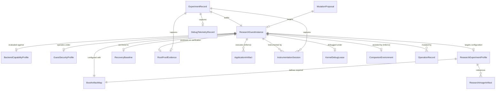
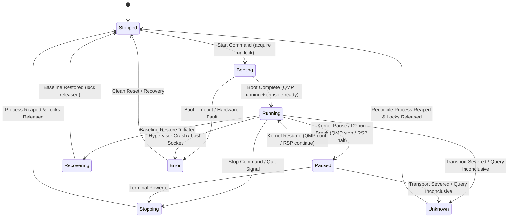
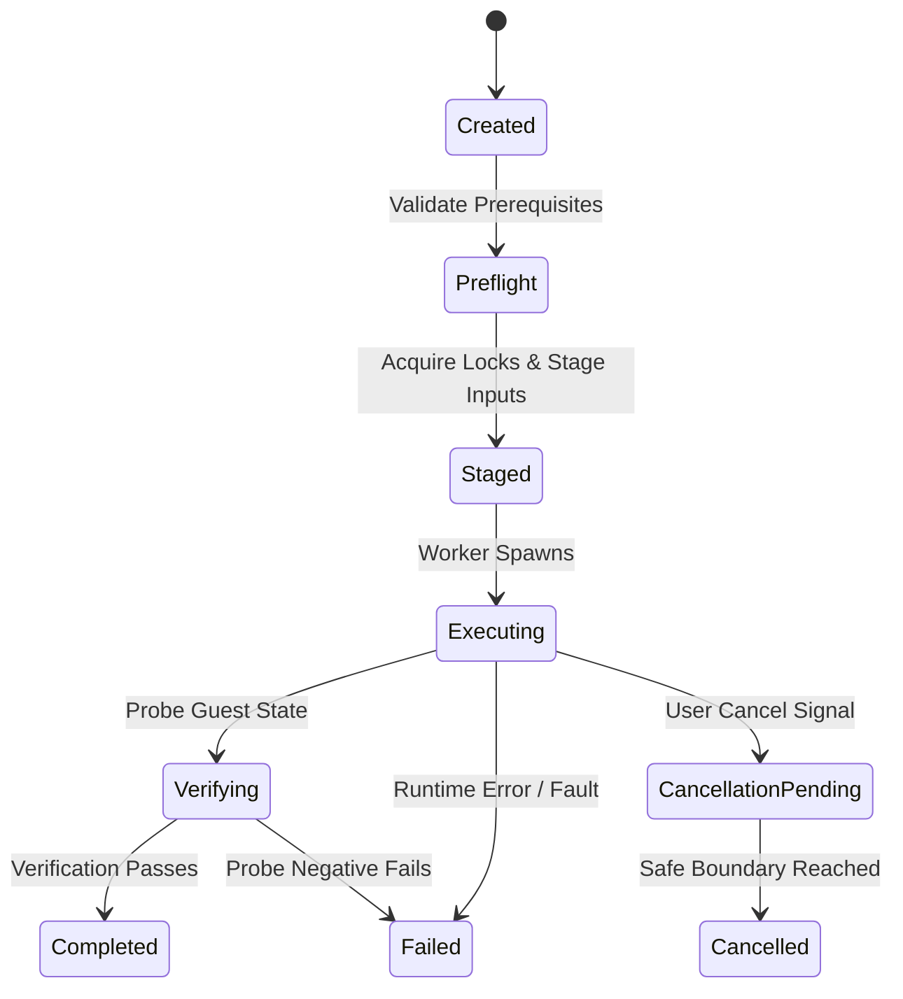
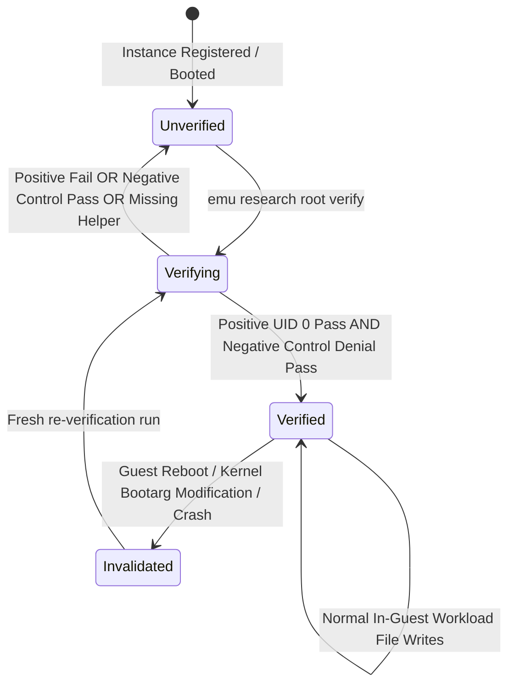
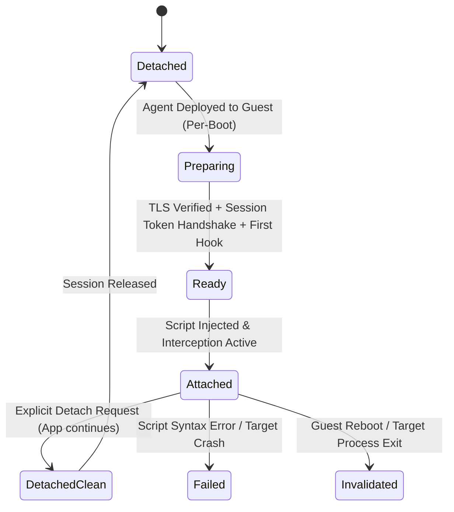
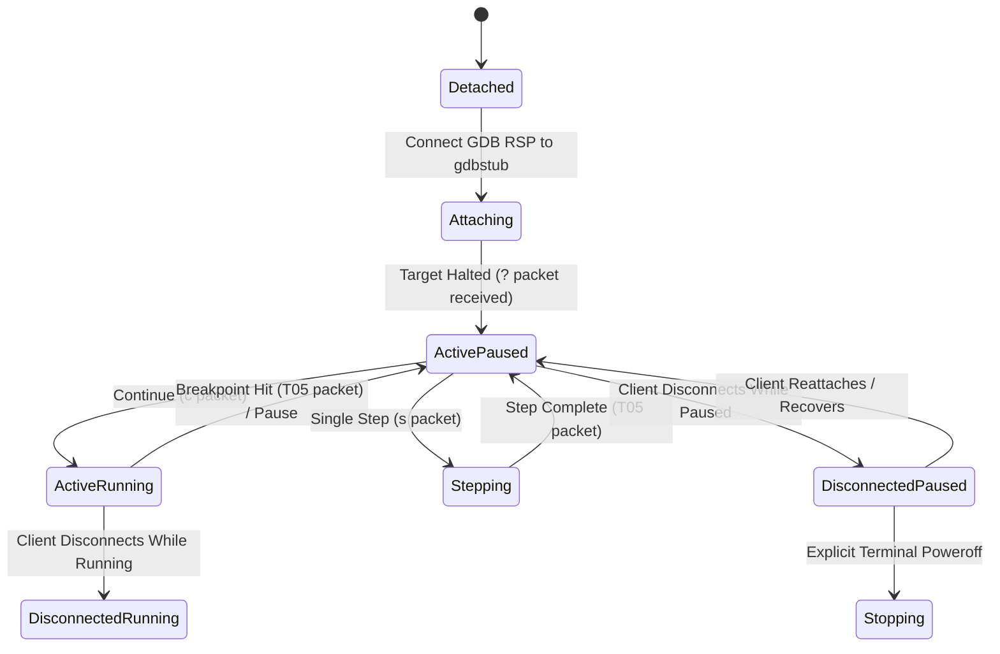

# Phase 1 Data Model: iOS Root VM and Darwin Security Research Backends

**Version**: 1.2.0  
**Feature Branch**: `002-ios-root-vm`  
**Status**: Complete  
**Canonical Schema Identifier**: `https://emu.rs/schemas/v1/research-ios.schema.json`  
**Authority**: `specs/002-ios-root-vm/research.md`, `specs/002-ios-root-vm/contracts/cli.md`, and `specs/002-ios-root-vm/spec.md`

---

## 1. Architectural Overview & System Invariants

### 1.1 Scope and Domain Boundaries

This data model formalizes all entities, value objects, state transitions, validation rules, and persistence models for the iOS Root Virtual Machine and Darwin Security Research Harness within the `emu` project on macOS Apple Silicon (`aarch64`).

- **Primary Target Platform**: Configured supported build on macOS Apple Silicon (`aarch64`) (FR-001). Host must satisfy `sysctl hw.optional.arm64 = 1`. While `sysctl kern.hv_support = 1` is inspected during host preflight diagnostics, the research hypervisors (`darwin-vm`, `Inferno`, and the companion `qemu-system-x86_64`) execute in user space using QEMU's Tiny Code Generator (TCG). Therefore, Hypervisor.framework entitlement is not an execution prerequisite for these guest configurations.
- **Architectural Separation of Backends (FR-003, D-01)**: The system maintains strict operational and structural separation between two distinct research backends:
  - `darwin-vm`: Minimal headless Darwin virtual machine specialized in root shell bootstrap, benign CLI testing, and low-level kernel debugging. Read-only queries evaluate with Exit Code 0 (`completed`), truthfully projecting `app_frameworks_supported: false`. Mutating commands requesting application installation or Frida app spawning are rejected with Exit Code 3 (`unsupported`, `APP_FRAMEWORKS_UNAVAILABLE`; FR-023, SC-003).
  - `Inferno`: Virtualized iOS security research environment specialized in userland security research, SpringBoard execution, application lifecycle management, and Frida dynamic instrumentation.
    The two backends do not share disk images, snapshots, or runtime supervisor instances (FR-009).
- **Platform Non-Regression & Android 001 Parity (FR-004, SC-008)**: Standard Android AVD and macOS iOS Simulator managers (`src/managers/common.rs`, `src/app/mod.rs`) remain 100% functional with zero regressions across 20 fixed lifecycle trials and zero performance degradation on baseline constitution budgets (polling <= 8ms, startup < 150ms, details <= 50ms, log streaming <= 10ms). All eight Android 001 specification artifacts (`specs/001-add-android-research-backends/`) remain preserved byte-for-byte. Existing `DeviceManager` trait methods (`list_devices`, `start_device`, `stop_device`, `create_device`, `delete_device`, `wipe_device`, `is_available`) remain unchanged; `CommandExecutor` receives in-place typed execution methods (`run_typed`, `spawn_typed`) with owned `ProcessHandle` without retry or error-ignoring helpers for research operations.
- **Host Privilege Boundary & Containment (FR-025, FR-034, SC-007, D-06)**: Research supervisors, workers, and guest processes run strictly as an unprivileged host user, EXCEPT for narrowly authorized host-side image preparation steps executed via the executor requiring elevated privileges (`sudo hdiutil`) under explicit researcher authorization (FR-035). Unattended execution requiring elevation without pre-authorized credentials fails fast with Exit Code 4 (`auth_refused` / `AUTH_REQUIRED`). In-guest root privileges (UID 0) grant zero host authority. No host drives, shared folders (virtfs/9p), or host credentials are exposed to the guest. In-guest filesystem modifications execute entirely within guest storage without host-side disk mounts during runtime. Emu never modifies host System Integrity Protection (SIP), Sealed System Volume (SSV), NVRAM variables, or host boot arguments. QEMU TCG is explicitly not a cryptographic security boundary against hostile guests attempting hypervisor escape.
- **Single-Binary Process Supervision (D-04)**: No persistent background system daemons (`launchd`). Running guests are supervised by private child instances: `emu __supervise --vm-id <ID>`. Finite mutating operations are executed by private workers: `emu __worker --operation-id <ID>`. Dynamic instrumentation is executed by the isolated native helper `tools/frida-worker/` (`emu-frida-worker`).
- **Research Implementation Disclaimer**: All research backends, root verification probes, application installations, and dynamic instrumentation mechanisms are planned architectural implementations; their joint simultaneous execution in a live environment is subject to empirical Phase 2 laboratory trials and is not claimed as 100% observed proof in Phase 1 design artifacts.

### 1.2 Storage Hierarchy & Persistence Model (D-04)

Research metadata, profiles, records, and durable state are stored strictly under the platform-local user data directory resolved via `dirs::data_local_dir()/emu/research` (`~/Library/Application Support/emu/research` on macOS):

```text
~/Library/Application Support/emu/research/
├── instances/
│   ├── <instance_id>.json              # Serialized ResearchGuestInstance descriptors
│   └── locks/
│       ├── <instance_id>.run.lock      # Permanent advisory run lock (fs4)
│       └── <instance_id>.device.lock   # Permanent target device lock (fs4)
├── profiles/
│   └── <profile_id>.json               # Versioned ResearchExperimentProfile definitions
├── artifacts/
│   └── <sha256_digest>.json            # Validated ResearchImageArtifact records
├── baselines/
│   └── <baseline_id>.json              # RecoveryBaseline reference state records
├── records/
│   └── <record_id>.json                # Immutable ExperimentRecord audit files
├── operations/
│   ├── <operation_id>.json             # OperationRecord journal
│   ├── <operation_id>.events.jsonl     # Streamed diagnostic log events
│   └── locks/
│       └── <operation_id>.op.lock      # Permanent exclusive worker execution lock (fs4)
├── proposals/
│   └── <proposal_digest>.json          # MutationProposal pending authorization
└── security_profiles/
    └── <profile_id>.json               # GuestSecurityProfile definitions
```

#### Short Unix Domain Socket Paths on macOS (D-04)

Darwin sets `sizeof(sockaddr_un.sun_path)` to strictly 104 bytes (`sizeof(struct sockaddr_un)` is 106 bytes including `sun_len` and `sun_family`). Because standard paths under `$HOME/Library/Application Support/emu/research/...` exceed 104 bytes and trigger `EINVAL` or `ENAMETOOLONG`, the supervisor creates an owner-restricted (`0700`) temporary directory with a short path:

```text
/tmp/emu-<short_uuid>/
├── qmp.sock          # QEMU Machine Protocol control socket
├── gdb.sock          # Kernel debugging GDB RSP chardev socket
├── console.sock      # Virtio guest console PTY bridge socket
├── supervisor.sock   # Supervisor command & telemetry IPC socket
└── inferno-usb.sock  # Companion VM USB-over-IP tunneling socket
```

#### Persistence Invariants:

1. **Atomic Staged Writes**: Every state mutation is written to a `<filename>.tmp` sibling file, flushed, synced (`File::sync_all`), and atomically renamed (`std::fs::rename`).
2. **Permanent Never-Unlinked Lockfiles**: Dedicated advisory lock files reside in nested lock directories (`instances/locks/<id>.run.lock`, `instances/locks/<id>.device.lock`, `operations/locks/<id>.op.lock`). Lockfiles are permanently retained on disk and are **never unlinked or deleted**, eliminating inode-recycling race conditions. Ownership is governed strictly by `fs4` advisory flock semantics (`fs4::FileExt`).
3. **Offline Worker vs. Live Mutation Lock Hierarchy**:
   - **Offline Mutating Workers** (image preparation, disk wiping, baseline restoration, offline storage mutations):
     - For host-side image preparation occurring before a guest instance exists, the worker acquires artifact and workspace resource locks (`operations/locks/<op_id>.op.lock`, `artifacts/locks/<sha256>.lock`), not fabricated guest instance locks.
     - For offline mutations targeting an existing guest instance (disk wiping, baseline restoration), the worker must acquire BOTH `<instance_id>.device.lock` AND `<instance_id>.run.lock` exclusively. Crucially, exclusive acquisition of `.run.lock` succeeds **only after the guest supervisor confirms the hypervisor child process has been fully reaped** (`waitpid` observed, PID reaped, socket directory purged). Holding `.device.lock` alone does not exclude running QEMU while the supervisor holds `.run.lock`.
   - **Live Guest Mutations**: Per-run in-guest mutations (`root fs-write`, `app container-write`, security policy apply/revert) route through the active supervisor under `<instance_id>.device.lock` serialization. Possession of `.run.lock` by the supervisor is **not a blanket conflict** for valid routed mutations.
4. **Reaped Child Verification Before Destructive Writes**: The underlying QEMU process must be verified reaped before any destructive disk writes begin, not merely reported as "UI stopped" or requested to terminate. Process termination uses explicit asynchronous shutdown and wait-reap loops (`SIGTERM` -> timeout deadline -> `SIGKILL` -> `waitpid`); relying on synchronous `Drop` for process reaping is prohibited.
5. **On-Demand GDB RSP Debug Entry**: The GDB RSP connection is established on-demand upon explicit debug entry (`emu research debug pause`), not eagerly on VM boot. The act of opening the RSP connection to QEMU's gdbstub itself halts and pauses virtual CPU execution (`vm_stop`). Once connected, the supervisor retains the underlying RSP connection across observer disconnects, preventing silent resumption.
6. **Two-Step Digest Consumption & Journaling**: Mutating proposals verify that target parameters, backend, affected paths, parameters, and configuration revision match before consumption. Under lock, the proposal file is consumed and durably recorded in `OperationRecord.consumed_proposal_digest` **before** side effects begin.
7. **No Automatic Mutation Retries (FR-047)**: Failed operations are marked `failed` or `unknown`. The reconciler never performs automatic retries on failed mutating steps.
8. **Caller Timeout is NOT an Operation State (FR-046, SC-016)**: Timeout is strictly an observer condition when a caller wait deadline elapses before task completion. The CLI/TUI returns Exit Code 124 (`timed_out` / `timeout`) with `data` reporting the actual observer condition (`continuing`, `stopped`, or `unknown`). The worker and supervisor journals preserve their actual active status (`executing` or `cancellation_pending`) without terminating background worker or hypervisor execution.
9. **Application-Enforced Record Immutability (FR-042, SC-018)**: `ExperimentRecord` files are append-only historical audit records. Immutability is enforced by application domain logic; records are never mutated or overwritten.
10. **Export Sanitization Allowlist (FR-041)**: Exported research profiles automatically strip host environment variables, host credentials, private SSH keys, and runtime secrets. Guest container data and logs are exported only upon explicit user authorization.
11. **Strict Single-Envelope Output Invariant**: When `--json` is supplied, `stdout` outputs strictly one finite JSON `OutputEnvelope`. Commands that produce open-ended interactive streams (such as interactive `root console` without `--command` or `operation events --follow`) fail fast with Exit Code 2 (`invalid_input`), preserving machine parseability.

---

## 2. Core Entities & Field Specifications

### 2.1 Entity Relationship Diagram



---

### 2.2 ResearchGuestInstance

Represents a managed virtualized Darwin or iOS research guest instance under either the `darwin-vm` or `Inferno` backend.

| Field Name            | Type                             | Optionality  | Description                                                                                                                                  |
| :-------------------- | :------------------------------- | :----------- | :------------------------------------------------------------------------------------------------------------------------------------------- |
| `id`                  | `ResearchGuestId` (UUIDv4)       | **Required** | Immutable globally unique identifier (e.g. `uuid::Uuid::new_v4()`). Disambiguates instances independently of display names (FR-005, SC-017). |
| `display_name`        | `String`                         | **Required** | Human-readable name (e.g. `ios-sec-lab`). May collide across backends (FR-007).                                                              |
| `backend`             | `BackendType` (Enum)             | **Required** | Virtualization backend: `darwin-vm` or `Inferno` (FR-003).                                                                                   |
| `lifecycle_state`     | `InstanceLifecycleState` (Enum)  | **Required** | Current state: `stopped`, `booting`, `running`, `paused`, `recovering`, `stopping`, `error`, `unknown` (D-04, FR-028).                       |
| `guest_arch`          | `CpuArchitecture` (Enum)         | **Required** | Guest CPU architecture: strictly `arm64` (Apple Silicon).                                                                                    |
| `guest_os_version`    | `String`                         | **Required** | OS release version (e.g. `"iOS 14.0 beta 5"`, `"Darwin 20.0.0 minimal"`).                                                                    |
| `build_identity`      | `String`                         | **Required** | Upstream build version (e.g. `"18A5351d"`).                                                                                                  |
| `boot_session_id`     | `Option<BootSessionId>` (UUIDv4) | Optional     | Unique boot session ID generated on each boot. Reset on cold reboot or crash (FR-010, FR-015). Null when stopped.                            |
| `config_revision`     | `Sha256Digest`                   | **Required** | Cryptographic hash of active kernel boot arguments, applied patches, and security profile.                                                   |
| `base_image_ref`      | `Sha256Digest`                   | **Required** | SHA-256 digest of registered base root disk image artifact (FR-031).                                                                         |
| `boot_artifacts`      | `BootArtifactMap` (Struct)       | **Required** | Ordered map of backend-specific boot artifact roles to registered SHA-256 digests.                                                           |
| `profile_id`          | `Option<String>`                 | Optional     | Associated `ResearchExperimentProfile` ID if instantiated from profile.                                                                      |
| `runtime_dir`         | `PathBuf`                        | **Required** | Short socket runtime directory: `/tmp/emu-<short_uuid>/` (D-04).                                                                             |
| `qmp_socket_path`     | `Option<PathBuf>`                | Optional     | Path to `qmp.sock`. Null when stopped.                                                                                                       |
| `gdb_socket_path`     | `Option<PathBuf>`                | Optional     | Path to `gdb.sock`. Null when stopped.                                                                                                       |
| `console_socket_path` | `Option<PathBuf>`                | Optional     | Path to `console.sock`. Null when stopped.                                                                                                   |
| `active_session_id`   | `Option<String>`                 | Optional     | Active user console session ID if attached.                                                                                                  |
| `security_profile_id` | `Option<String>`                 | Optional     | Currently applied `GuestSecurityProfile` ID (FR-030).                                                                                        |
| `baseline_id`         | `Option<RecoveryBaselineId>`     | Optional     | Associated recovery baseline ID (FR-043).                                                                                                    |
| `desired_privilege`   | `PrivilegeState` (Enum)          | **Required** | Desired privilege state: `root` (UID 0) or `unprivileged` (FR-014).                                                                          |
| `observed_privilege`  | `RootVerificationState` (Enum)   | **Required** | Observed privilege state: `unverified`, `verifying`, `verified`, `invalidated` (FR-014).                                                     |
| `run_lock_path`       | `Option<PathBuf>`                | Optional     | Permanent path to `instances/locks/<id>.run.lock`.                                                                                           |
| `device_lock_path`    | `Option<PathBuf>`                | Optional     | Permanent path to `instances/locks/<id>.device.lock`.                                                                                        |
| `created_at`          | `DateTime<Utc>`                  | **Required** | ISO 8601 creation timestamp.                                                                                                                 |
| `updated_at`          | `DateTime<Utc>`                  | **Required** | ISO 8601 last mutation timestamp.                                                                                                            |
| `last_settled_at`     | `DateTime<Utc>`                  | **Required** | Timestamp of last verified stable operational condition.                                                                                     |

#### Invariants & Validation Rules:

- **FR-005 / SC-017**: `id` is globally unique and immutable. Two instances with identical `display_name` ("ios-sec-lab") under `darwin-vm` and `Inferno` have distinct IDs and are controlled independently.
- **FR-007**: Addressing by `display_name` that matches multiple instances across backends MUST be rejected with exit code 2 (`invalid_input`) unless qualified by `--backend` or `--id`.
- **Complete Boot Manifest Mandate**: Instantiation requires a complete, ordered `BootArtifactMap`. Supplying solely a root disk without required kernelcache, devicetree, or firmware is prohibited.
- **FR-015**: Any guest reboot, crash, base image replacement, or boot argument modification resets `boot_session_id` to a fresh UUID and marks `observed_privilege` as `unverified`. Normal in-guest writes preserve verification during the active boot session.
- **D-04**: The supervisor run lock does not blanket-deny valid routed mutations; commands routed through the supervisor execute under coordinator validation.

---

### 2.3 BackendCapabilityProfile

Declarative evaluation of host operating system compatibility, hypervisor entitlements, and supported research operational layers. Dynamic capabilities reflect inspected configuration and observed proof rather than static brand assumptions.

| Field Name                   | Type                           | Optionality  | Description                                                                                                                      |
| :--------------------------- | :----------------------------- | :----------- | :------------------------------------------------------------------------------------------------------------------------------- |
| `backend`                    | `BackendType` (Enum)           | **Required** | `darwin-vm` or `Inferno`.                                                                                                        |
| `host_os`                    | `HostOs` (Enum)                | **Required** | Strictly `macos` (Darwin). Non-Darwin is unsupported (FR-001).                                                                   |
| `host_arch`                  | `HostArchitecture` (Enum)      | **Required** | Strictly `arm64` (Apple Silicon). x86_64 is unsupported (FR-001).                                                                |
| `hypervisor`                 | `HypervisorType` (Enum)        | **Required** | `hypervisor_framework` (`Hypervisor.framework` via `sysctl kern.hv_support`) or `tcg_emulation`.                                 |
| `support_status`             | `SupportStatus` (Enum)         | **Required** | `supported`, `unsupported`, or `experimental`.                                                                                   |
| `supported_guest_families`   | `Vec<String>`                  | **Required** | e.g. `["darwin-minimal"]` for `darwin-vm`; `["ios-14", "ios-15"]` for `Inferno`.                                                 |
| `headless_console_support`   | `bool`                         | **Required** | `true` for both backends.                                                                                                        |
| `graphical_display_support`  | `bool`                         | **Required** | `false` for `darwin-vm`; `true` for `Inferno` (SpringBoard/UI display).                                                          |
| `companion_vm_required`      | `bool`                         | **Required** | `false` for `darwin-vm`; `true` for `Inferno` (restore/USB workflows).                                                           |
| `app_frameworks_supported`   | `bool`                         | **Required** | `false` for `darwin-vm` (minimal kernel/CLI only); `true` for `Inferno` if frameworks present in image (SC-003, FR-023).         |
| `supported_debug_interfaces` | `Vec<DebugInterfaceType>`      | **Required** | `["gdb_rsp", "qmp_monitor"]` for both backends (FR-027).                                                                         |
| `capabilities`               | `CapabilityDetail` (Struct)    | **Required** | Evaluated capability levels: `root_shell`, `kernel_debug`, `app_frameworks`, `dynamic_instrumentation`, `companion_bridge`.      |
| `required_binaries`          | `Vec<BinaryPrerequisite>`      | **Required** | Host binaries: `qemu-system-aarch64` (or custom fork binary), `hdiutil`, `diskutil`. For `Inferno`: `ideviceinstaller` (FR-016). |
| `required_entitlements`      | `Vec<EntitlementPrerequisite>` | **Required** | Hypervisor entitlements, SIP inspection status.                                                                                  |
| `remediation_steps`          | `Vec<String>`                  | **Required** | Human-readable remediation advice if prerequisites are missing.                                                                  |

#### CapabilityDetail Struct:

```text
root_shell:              SupportStatus (supported | unsupported | experimental)
kernel_debug:            SupportStatus (supported | unsupported | experimental)
app_frameworks:          SupportStatus (supported | unsupported | experimental)
dynamic_instrumentation: SupportStatus (supported | unsupported | experimental)
companion_bridge:        SupportStatus (supported | unsupported | experimental)
```

#### Invariants & Validation Rules:

- **FR-001 / Gate G-01**: Must run on macOS Apple Silicon (`aarch64`). If evaluated on Linux or Windows, `support_status` MUST evaluate to `unsupported`.
- **FR-023 / SC-003**: `darwin-vm` declares `app_frameworks_supported = false` and `capabilities.app_frameworks = unsupported`. Any request to install applications or spawn app Frida sessions on `darwin-vm` MUST be rejected with exit code 3 (`unsupported`) and structured diagnostic `APP_FRAMEWORKS_UNAVAILABLE`.
- **Dynamic Capabilities vs. Brand Booleans**: Capabilities reflect inspected configuration and observed proof. Read queries of missing capabilities return Exit Code 0 with `SupportStatus::unsupported` rather than throwing fatal CLI runtime errors.

---

### 2.4 ResearchImageArtifact

Represents a legally obtained and verified firmware image, kernelcache, ramdisk, device tree, or root filesystem artifact.

| Field Name               | Type                           | Optionality  | Description                                                                                                     |
| :----------------------- | :----------------------------- | :----------- | :-------------------------------------------------------------------------------------------------------------- |
| `artifact_id`            | `ArtifactId` (String)          | **Required** | Content hash-derived identifier: `art_<prefix>`.                                                                |
| `artifact_type`          | `ImageArtifactType` (Enum)     | **Required** | `kernelcache`, `ramdisk`, `devicetree`, `trustcache`, `root_disk`, `sptm_firmware`, `sep_firmware`, etc.        |
| `file_path`              | `PathBuf`                      | **Required** | Absolute path to artifact on host.                                                                              |
| `sha256_digest`          | `Sha256Digest` (String)        | **Required** | Cryptographic SHA-256 digest: `sha256:<hex>`. Computed prior to registration (FR-031).                          |
| `origin_metadata`        | `ImageOriginMetadata` (Struct) | **Required** | Source provenance: `source_type` (`user_supplied`, `prepared_recovery`), `build_identity`, `source_url_or_ref`. |
| `target_backend`         | `BackendType` (Enum)           | **Required** | Target backend: `darwin-vm` or `Inferno`. Prevents cross-backend raw image boot (FR-009).                       |
| `build_version_identity` | `String`                       | **Required** | Guest build identity parsed from plist/build manifest (e.g. `"18A5351d"`).                                      |
| `verified_device_node`   | `Option<String>`               | Optional     | Isolated device node (e.g. `"/dev/disk4s1"`) when attached for preparation (FR-033).                            |
| `verified_volume_uuid`   | `Option<String>`               | Optional     | Unique volume UUID verified via `diskutil info -plist` (FR-033). Hardcoded paths rejected.                      |
| `trust_status`           | `ArtifactTrustStatus` (Enum)   | **Required** | `verified_trusted`, `experimental_opt_in`, `digest_mismatch_corrupt`, `unverified_untrusted` (FR-032).          |
| `created_at`             | `DateTime<Utc>`                | **Required** | Registration timestamp.                                                                                         |

#### Invariants & Validation Rules:

- **FR-009**: An artifact with `target_backend = inferno` MUST NOT be used to initialize a `darwin-vm` instance and vice versa.
- **FR-032 / SC-009**: Corrupt or truncated images are marked `digest_mismatch_corrupt` and rejected prior to hypervisor initialization. Experimental artifacts require explicit `--allow-experimental` and an existing `RecoveryBaseline`.
- **FR-033 / SC-010**: Host-side image preparation verifies `verified_device_node` and `verified_volume_uuid`. Hardcoded mount paths (e.g. `/Volumes/System`) are strictly prohibited.

---

### 2.5 BootArtifactMap

An ordered mapping of backend-specific boot artifact roles to registered cryptographic SHA-256 digests. Defines the full prerequisite artifact set required to launch a research guest:

| Role Identifier       | Backend Relevance | Optionality  | Description                                                              |
| :-------------------- | :---------------- | :----------- | :----------------------------------------------------------------------- |
| `kernelcache`         | Both              | **Required** | Mach-O kernelcache image (`-bootkc` on darwin-vm, `-kernel` on Inferno). |
| `devicetree`          | Both              | **Required** | Flattened device tree DTB (`-dtree` on darwin-vm, `-dtb` on Inferno).    |
| `trustcache`          | Both              | Optional     | Verified code signature trust cache (`-tc`).                             |
| `ramdisk`             | darwin-vm         | Optional     | Initial root ramdisk (`-ramdisk`).                                       |
| `root_disk`           | Both              | Optional     | Raw root APFS/HFS+ disk image.                                           |
| `sptm_firmware`       | Both (SPTM)       | Optional     | Secure Page Table Monitor firmware image.                                |
| `txm_firmware`        | Both (SPTM)       | Optional     | Trusted Execution Monitor firmware image.                                |
| `sep_firmware`        | Inferno           | Optional     | Secure Enclave Processor firmware image.                                 |
| `nvram_template`      | Inferno           | Optional     | NVRAM variable store template.                                           |
| `ipsw_restore_bundle` | Inferno           | Optional     | Source IPSW restore bundle used for companion restore.                   |

---

### 2.6 RootProofEvidence

Encapsulates empirical verification evidence proving effective root control (UID 0) within a booted iOS-derived guest environment. Failed probe attempts truthfully record observed states and nulls under `unverified`, while `verified` requires positive UID 0 pass and negative control denial.

| Field Name                 | Type                           | Optionality  | Description                                                                                               |
| :------------------------- | :----------------------------- | :----------- | :-------------------------------------------------------------------------------------------------------- |
| `evidence_id`              | `EvidenceId` (UUIDv4)          | **Required** | Unique identifier for the verification execution.                                                         |
| `guest_id`                 | `ResearchGuestId` (UUIDv4)     | **Required** | Target guest instance identifier (FR-010).                                                                |
| `boot_session_id`          | `BootSessionId` (UUIDv4)       | **Required** | Active boot session ID to which this evidence is bound (FR-010).                                          |
| `backend`                  | `BackendType` (Enum)           | **Required** | Backend: `darwin-vm` or `Inferno`.                                                                        |
| `guest_build_identity`     | `String`                       | **Required** | Verified guest build identity (e.g. `"18A5351d"`).                                                        |
| `image_artifact_digest`    | `Sha256Digest`                 | **Required** | SHA-256 digest of input disk/firmware artifact.                                                           |
| `config_revision_hash`     | `Sha256Digest`                 | **Required** | Cryptographic hash of kernel boot arguments and security configuration (FR-010).                          |
| `verified_uid`             | `Option<u32>`                  | Optional     | Observed effective user ID: must be `0` when `verified`; null or non-zero in failed attempts (FR-010).    |
| `positive_probe_outcome`   | `Option<ProbeOutcome>`         | Optional     | Positive test: writing `/private/var/root/.emu_probe` succeeds, content verified (FR-012).                |
| `negative_control_outcome` | `Option<ProbeOutcome>`         | Optional     | Negative control: unprivileged write fails with `EACCES` or `EPERM` (FR-012).                             |
| `observed_kernel_version`  | `Option<String>`               | Optional     | Output of `uname -v` captured in guest (FR-013). Required when `verified`.                                |
| `observed_boot_args`       | `Option<String>`               | Optional     | Boot arguments queried via `sysctl kern.bootargs` (FR-013). Required when `verified`.                     |
| `benign_binary_digest`     | `Option<Sha256Digest>`         | Optional     | SHA-256 digest of benign CLI test binary executed during verification (FR-013). Required when `verified`. |
| `verification_state`       | `RootVerificationState` (Enum) | **Required** | `verified` (both positive and negative pass), `unverified` (probe failure, negative pass, or missing).    |
| `verified_at`              | `DateTime<Utc>`                | **Required** | Timestamp when empirical proof was evaluated.                                                             |
| `diagnostics`              | `Vec<String>`                  | **Required** | Structured log messages or warning diagnostics.                                                           |

#### ProbeOutcome Struct:

```text
path:                String (e.g. "/private/var/root/.emu_probe")
status:              ProbeStatus (success | denied | error | unverified)
target_user:         String (e.g. "root", "mobile")
executed_euid:       u32 (0 for positive probe, >0 for negative control)
expected_denial:     bool (false for positive, true for negative)
helper_executed:     bool (true if dedicated fixture helper executed)
syscall_errno:       Option<i32> (13 for EACCES, 1 for EPERM)
syscall_error_name:  Option<String> ("EACCES", "EPERM")
content_verified:    Option<bool> (true if probe content matches boot session UUID)
output:              String
```

#### Invariants & Validation Rules:

- **FR-012 / Gate T-01 Conditional Verification**:
  - When `verification_state == verified`: strictly requires `verified_uid == 0`, `positive_probe_outcome.status == success` (UID 0, content verified, `helper_executed == true`), and `negative_control_outcome.status == denied` (non-zero UID, `expected_denial == true`, `helper_executed == true`, syscall errno `EACCES` or `EPERM`). Missing observations, negative control UID 0, `helper_executed == false`, or `ENOENT` are strictly prohibited from achieving `verified`.
  - When `verification_state != verified`: missing observations are recorded as nulls, and failed probe attempts (e.g. non-zero UID, missing helper, `ENOENT`) are truthfully preserved without fabricating zero UIDs or passing states.
- **FR-014 / Gate T-02**: If the unprivileged negative control unexpectedly succeeds, or if the helper/account/path is missing, `verification_state` MUST evaluate to `unverified` (failing closed). Missing prerequisites are never treated as a successful negative control.
- **No Hardcoded UID 501**: Negative control inspects actual non-zero UID rather than blindly hardcoding 501.
- **FR-015 / Gate T-03**: Rebooting the guest, crash, or modifying boot arguments invalidates active evidence; `verification_state` transitions to `unverified`. Normal in-guest filesystem writes preserve verification during the active boot session.

---

### 2.7 ApplicationArtifact

Represents an owned, compatible iOS application package managed for security research on the `Inferno` backend.

| Field Name                | Type                               | Optionality  | Description                                                                                                 |
| :------------------------ | :--------------------------------- | :----------- | :---------------------------------------------------------------------------------------------------------- |
| `app_id`                  | `ApplicationId` (String)           | **Required** | Application identifier: `app_<bundle_id>_<prefix>`.                                                         |
| `bundle_identifier`       | `String`                           | **Required** | Bundle ID (e.g. `"com.example.researchapp"`).                                                               |
| `bundle_name`             | `String`                           | **Required** | Display bundle name (e.g. `"ResearchApp"`).                                                                 |
| `package_path`            | `PathBuf`                          | **Required** | Path to owned IPA or unpacked `.app` directory on host.                                                     |
| `sha256_digest`           | `Sha256Digest`                     | **Required** | SHA-256 digest of the application package file (FR-031).                                                    |
| `binary_architecture`     | `CpuArchitecture` (Enum)           | **Required** | Must be `arm64` (Apple Silicon 64-bit Mach-O).                                                              |
| `code_signature_identity` | `String`                           | **Required** | Code signature identity or `"adhoc"` / `"unsigned"` (FR-022).                                               |
| `sandbox_container_path`  | `Option<String>`                   | Optional     | In-guest container path: `/private/var/mobile/Containers/Data/Application/<UUID>`. Null at import (FR-024). |
| `entitlement_manifest`    | `Map<String, Value>`               | **Required** | Extracted entitlements plist dictionary.                                                                    |
| `deployment_status`       | `AppDeploymentStatus` (Enum)       | **Required** | `imported`, `installed`, `running`, `stopped`, `removed`, `incompatible`.                                   |
| `target_guest_id`         | `Option<ResearchGuestId>` (UUIDv4) | Optional     | Target guest ID. **Optional/null at import time**; bound upon installation or deployment.                   |
| `created_at`              | `DateTime<Utc>`                    | **Required** | Import timestamp.                                                                                           |
| `updated_at`              | `DateTime<Utc>`                    | **Required** | Last status update timestamp.                                                                               |

#### Invariants & Validation Rules:

- **Decoupled Import Boundary**: Importing an application package validates the Mach-O binary architecture (`ARM64`), bundle identifier, and manifest integrity on the host; it does **not** require a running guest or deployed container at import time.
- **FR-016 / D-03**: Application installation is managed via modern `ideviceinstaller` (v1.2.0+) routed through the owned companion VM usbmuxd bridge (`-u <UDID>`).
- **FR-024**: Authorized container access (`container-read`, `container-write`, `container-export`) operates strictly within `/private/var/mobile/Containers/Data/Application/<UUID>` and requires explicit researcher authorization.

---

### 2.8 InstrumentationSession

Represents an active dynamic instrumentation session managed by the isolated `tools/frida-worker/` (`emu-frida-worker`) native helper process.

| Field Name                   | Type                          | Optionality  | Description                                                                              |
| :--------------------------- | :---------------------------- | :----------- | :--------------------------------------------------------------------------------------- |
| `session_id`                 | `InstrumentationSessionId`    | **Required** | Unique session ID: `sess_<uuid>`.                                                        |
| `guest_id`                   | `ResearchGuestId` (UUIDv4)    | **Required** | Target guest instance ID.                                                                |
| `boot_session_id`            | `BootSessionId` (UUIDv4)      | **Required** | Active boot session ID (FR-017).                                                         |
| `target_process_id`          | `u32`                         | **Required** | In-guest target PID.                                                                     |
| `target_bundle_id`           | `Option<String>`              | Optional     | Target iOS bundle ID if spawned via Frida `Device.spawn()`.                              |
| `agent_package_version`      | `String`                      | **Required** | Pinned Frida version: `"17.18.0"` (D-02, FR-017).                                        |
| `agent_integrity_hash`       | `Sha256Digest`                | **Required** | SHA-256 digest of deployed in-guest Frida agent package.                                 |
| `tls_server_cert_pinned`     | `bool`                        | **Required** | Must be `true`. Verifies server-auth TLS certificate fingerprint pinned.                 |
| `session_token_configured`   | `bool`                        | **Required** | Must be `true`. Verifies per-session client authentication token configured.             |
| `injected_script_hashes`     | `Vec<Sha256Digest>`           | **Required** | SHA-256 hashes of injected user scripts.                                                 |
| `hook_status`                | `HookStatus` (Struct)         | **Required** | Hook telemetry: `native_hooks_count`, `objc_hooks_count`, `events_intercepted`.          |
| `attachment_state`           | `FridaAttachmentState` (Enum) | **Required** | `detached`, `preparing`, `ready`, `attached`, `detached_clean`, `failed`, `invalidated`. |
| `attached_at`                | `Option<DateTime<Utc>>`       | Optional     | Timestamp when first hook event confirmed ready (FR-018).                                |
| `detached_at`                | `Option<DateTime<Utc>>`       | Optional     | Timestamp when session detached cleanly.                                                 |
| `captured_hook_events_count` | `u64`                         | **Required** | Total count of intercepted invocations.                                                  |
| `control_process_id`         | `Option<u32>`                 | Optional     | In-guest uninstrumented control PID (FR-021).                                            |
| `control_process_hooked`     | `bool`                        | **Required** | Must be `false`. Verifies probes attach exclusively to target PID (FR-021, SC-002).      |
| `diagnostics`                | `Vec<String>`                 | **Required** | Diagnostic logs from `emu-frida-worker`.                                                 |

#### HookStatus Struct:

```text
native_hooks_count: u32 (>= 0)
objc_hooks_count:   u32 (>= 0)
events_intercepted: u64 (>= 0)
```

#### Invariants & Validation Rules:

- **Per-Boot Agent vs. Session Readiness**: The Frida agent package is deployed per-boot into guest runtime. `attachment_state` transitions to `ready` ONLY after server-auth TLS server certificate verification, session token handshake over the owned SSH bridge, and confirmed reception of at least one valid hook event from the target process.
- **FR-019 / Gate T-03**: Guest reboot or target process termination immediately transitions `attachment_state` to `invalidated`.
- **FR-021**: Probes attach strictly to `target_process_id`. `control_process_hooked` must remain `false`.

---

### 2.9 GuestSecurityProfile

Represents the declared and observable runtime security configuration of a research guest.

| Field Name               | Type                          | Optionality  | Description                                                                    |
| :----------------------- | :---------------------------- | :----------- | :----------------------------------------------------------------------------- |
| `profile_id`             | `String`                      | **Required** | Unique security profile ID (e.g. `"secprof_amfi_relaxed"`).                    |
| `name`                   | `String`                      | **Required** | Human-readable name.                                                           |
| `code_signing_mode`      | `CodeSigningMode` (Enum)      | **Required** | `enforced`, `adhoc_permitted`, `disabled`.                                     |
| `amfi_status`            | `AmfiStatus` (Enum)           | **Required** | `enforced`, `developer_mode`, `amfi_get_out_of_my_way` (boot-arg `amfi=0xff`). |
| `sandbox_mode`           | `SandboxMode` (Enum)          | **Required** | `enforced`, `audit_only`, `relaxed`.                                           |
| `root_filesystem_mount`  | `MountMode` (Enum)            | **Required** | `read_only` (stock default) or `read_write` (research mode) (FR-025).          |
| `kernel_privilege_level` | `KernelPrivilegeLevel` (Enum) | **Required** | `stock`, `root_console_enabled`, `kernel_debug_enabled`.                       |
| `guest_relaxations`      | `Vec<String>`                 | **Required** | List of specific policy relaxations applied inside guest (FR-030).             |
| `baseline_id`            | `Option<String>`              | Optional     | Associated recovery baseline ID for policy reversion (FR-030).                 |
| `created_at`             | `DateTime<Utc>`               | **Required** | Creation timestamp.                                                            |
| `updated_at`             | `DateTime<Utc>`               | **Required** | Last update timestamp.                                                         |

#### Invariants & Validation Rules:

- **FR-030**: Security profile relaxations are reported independently of UID 0 root privilege status. Having UID 0 root access does not imply sandbox is disabled.
- **Reversion to Verified Baseline**: `root security revert` restores the guest to its verified baseline configuration (`baseline_id`), NEVER assuming an unverified universal stock state.

---

### 2.10 CompanionEnvironment

Represents a local helper virtual machine on the macOS host running custom `qemu-system-x86_64` (TCG) supporting restore and setup utilities for `Inferno`.

| Field Name               | Type                            | Optionality  | Description                                                                             |
| :----------------------- | :------------------------------ | :----------- | :-------------------------------------------------------------------------------------- |
| `companion_id`           | `CompanionId` (UUIDv4)          | **Required** | Unique companion VM identifier.                                                         |
| `parent_guest_id`        | `ResearchGuestId` (UUIDv4)      | **Required** | Primary `Inferno` guest instance requiring helper services.                             |
| `lifecycle_state`        | `InstanceLifecycleState` (Enum) | **Required** | `stopped`, `booting`, `running`, `stopping`, `error`, `unknown`.                        |
| `cpu_limit`              | `u32`                           | **Required** | Allocated virtual CPUs (default: `2`).                                                  |
| `memory_limit_mb`        | `u64`                           | **Required** | Allocated RAM ceiling in megabytes (default: `2048`).                                   |
| `storage_limit_mb`       | `u64`                           | **Required** | Virtual disk ceiling in megabytes (default: `8192`).                                    |
| `endpoint_socket_path`   | `PathBuf`                       | **Required** | Local Unix Domain Socket for access-controlled same-host IPC (`inferno-usb.sock`).      |
| `forwarded_ports`        | `Vec<u16>`                      | **Required** | Local loopback ports. Bound strictly to `127.0.0.1` (FR-039).                           |
| `active_operation_ids`   | `Vec<String>`                   | **Required** | **Authoritative set** of actively executing restore operation IDs.                      |
| `live_guest_ids`         | `Vec<ResearchGuestId>`          | **Required** | **Authoritative set** of live dependent Inferno guest IDs bound to forwarders (FR-038). |
| `active_workflows_count` | `u32`                           | **Required** | Derived count: `active_operation_ids.len()`.                                            |
| `live_dependents_count`  | `u32`                           | **Required** | Derived count: `live_guest_ids.len()`.                                                  |
| `created_at`             | `DateTime<Utc>`                 | **Required** | Launch timestamp.                                                                       |
| `updated_at`             | `DateTime<Utc>`                 | **Required** | Last heartbeat timestamp.                                                               |

#### Invariants & Validation Rules:

- **Authoritative Sets vs. Derived Counts**: Active restore tasks and live dependent guest instances are tracked as explicit identifier sets (`active_operation_ids`, `live_guest_ids`). Counts are strictly derived.
- **FR-038 / SC-011**: Companion VM terminates cleanly ONLY when `active_operation_ids.is_empty()` AND `live_guest_ids.is_empty()`. Cancellation of one guest does not terminate a companion shared by another dependent guest.
- **Launch Ordering**: Companion socket listener must be initialized and ready before the Inferno guest is started to avoid `ECONNREFUSED`.

---

### 2.11 ResearchExperimentProfile

An editable, versioned specification of a complete reproducible research setup.

| Field Name                | Type                       | Optionality  | Description                                                     |
| :------------------------ | :------------------------- | :----------- | :-------------------------------------------------------------- |
| `profile_id`              | `String`                   | **Required** | Unique profile identifier: `prof_<uuid>`.                       |
| `name`                    | `String`                   | **Required** | Human-readable name.                                            |
| `target_backend`          | `BackendType` (Enum)       | **Required** | Target backend: `darwin-vm` or `Inferno`.                       |
| `base_image_digest`       | `Sha256Digest`             | **Required** | SHA-256 digest of verified base root disk image artifact.       |
| `boot_artifacts`          | `BootArtifactMap` (Struct) | **Required** | Complete role map of boot artifacts (kernelcache, DTB, etc.).   |
| `kernel_boot_args`        | `String`                   | **Required** | Kernel boot arguments (e.g. `"debug=0x144 amfi=0xff -v"`).      |
| `applied_patches`         | `Vec<String>`              | **Required** | List of applied patch identifiers.                              |
| `security_profile`        | `GuestSecurityProfile`     | **Required** | Desired guest security configuration.                           |
| `app_artifacts`           | `Vec<Sha256Digest>`        | **Required** | SHA-256 digests of applications to install (Inferno).           |
| `instrumentation_scripts` | `Vec<Sha256Digest>`        | **Required** | SHA-256 digests of Frida instrumentation scripts.               |
| `guest_fixtures`          | `Vec<String>`              | **Required** | Declared test fixtures (e.g. `"/private/var/root/.emu_probe"`). |
| `exported_at`             | `DateTime<Utc>`            | **Required** | Export timestamp.                                               |
| `version`                 | `String`                   | **Required** | Semantic version (e.g. `"1.0.0"`).                              |

#### Invariants & Validation Rules:

- **FR-041**: Exported profiles MUST automatically strip all host environment variables, host credentials, private SSH keys, and user secrets.
- **FR-040**: Re-importing a profile requires local validation of artifact checksums prior to instantiating the guest.

---

### 2.12 ExperimentRecord

An immutable, append-only historical audit record capturing the full execution trial.

| Field Name                | Type                           | Optionality  | Description                                                                             |
| :------------------------ | :----------------------------- | :----------- | :-------------------------------------------------------------------------------------- |
| `record_id`               | `RecordId` (UUIDv4)            | **Required** | Immutable record identifier: `rec_<uuid>`.                                              |
| `profile_id`              | `String`                       | **Required** | Associated research profile ID.                                                         |
| `backend`                 | `BackendType` (Enum)           | **Required** | Backend used in trial.                                                                  |
| `upstream_build_identity` | `String`                       | **Required** | Upstream build version (e.g. `"18A5351d"`).                                             |
| `artifact_checksums`      | `Map<String, Sha256Digest>`    | **Required** | Fingerprints of all components used.                                                    |
| `session_parameters`      | `Map<String, Value>`           | **Required** | Boot parameters, hypervisor arguments.                                                  |
| `observed_root_proof`     | `Option<RootProofEvidence>`    | Optional     | Captured root proof evidence if evaluated.                                              |
| `instrumentation_summary` | `Option<HookStatus>`           | Optional     | Captured Frida hook statistics if evaluated.                                            |
| `kernel_debug_telemetry`  | `Option<DebugTelemetryRecord>` | Optional     | Summary of kernel debug operations executed.                                            |
| `execution_status`        | `OperationStatus` (Enum)       | **Required** | `created`, `staged`, `executing`, `verifying`, `completed`, `failed`, `cancelled`, etc. |
| `started_at`              | `DateTime<Utc>`                | **Required** | Trial start timestamp.                                                                  |
| `completed_at`            | `DateTime<Utc>`                | **Required** | Trial completion timestamp.                                                             |
| `errors`                  | `Vec<String>`                  | **Required** | List of recorded errors or failure reasons.                                             |

#### Invariants & Validation Rules:

- **FR-042 / SC-018**: Once written, `ExperimentRecord` files are immutable. The application enforces write protection; records are never mutated or overwritten.

---

### 2.13 RecoveryBaseline

A verified, immutable reference state used for guest rollback following experimental modification or failure.

| Field Name                      | Type                          | Optionality  | Description                                              |
| :------------------------------ | :---------------------------- | :----------- | :------------------------------------------------------- |
| `baseline_id`                   | `RecoveryBaselineId` (String) | **Required** | Baseline identifier: `base_<guest_id>_<prefix>`.         |
| `guest_id`                      | `ResearchGuestId` (UUIDv4)    | **Required** | Target guest instance ID.                                |
| `backend`                       | `BackendType` (Enum)          | **Required** | Target backend.                                          |
| `base_disk_digest`              | `Sha256Digest`                | **Required** | SHA-256 digest of clean baseline disk image.             |
| `kernel_config_hash`            | `Sha256Digest`                | **Required** | Hash of verified stock kernel boot configuration.        |
| `boot_artifacts`                | `Option<BootArtifactMap>`     | Optional     | Full set of boot artifacts bound to baseline.            |
| `clean_snapshot_path`           | `PathBuf`                     | **Required** | Path to verified clean copy-on-write base disk.          |
| `declared_recovery_deadline_ms` | `u64`                         | **Required** | Predeclared recovery SLA in milliseconds (e.g. `15000`). |
| `verified`                      | `bool`                        | **Required** | `true` only after successful boot verification (FR-043). |
| `verified_at`                   | `Option<DateTime<Utc>>`       | Optional     | Timestamp when boot verification succeeded.              |
| `created_at`                    | `DateTime<Utc>`               | **Required** | Creation timestamp.                                      |

#### Invariants & Validation Rules:

- **FR-043 / SC-012**: If `verified == false` or baseline files are missing/corrupted, rollback is safely rejected with an error; automatic instance deletion is prohibited. Overwriting persistent guest state requires explicit authorization.

---

### 2.14 MutationProposal

Represents a pending destructive modification requiring explicit two-step researcher authorization. Supports authorizing host image preparation and workspace mutations prior to guest creation.

| Field Name           | Type                               | Optionality  | Description                                                                                                      |
| :------------------- | :--------------------------------- | :----------- | :--------------------------------------------------------------------------------------------------------------- |
| `proposal_id`        | `ProposalId` (UUIDv4)              | **Required** | Unique proposal tracking ID.                                                                                     |
| `proposal_digest`    | `Sha256Digest` (String)            | **Required** | Cryptographic hash of proposed action: `sha256:<hex>`.                                                           |
| `config_revision`    | `Sha256Digest`                     | **Required** | Cryptographic hash of active configuration revision bound to this proposal.                                      |
| `operation_type`     | `MutationType` (Enum)              | **Required** | Dangerous action enum (e.g. `disk_wipe`, `guest_wipe`, `instance_delete`, `baseline_restore`, `fs_write`, etc.). |
| `target_instance_id` | `Option<ResearchGuestId>` (UUIDv4) | Optional     | Target guest instance ID. **Nullable**; null for pre-guest image preparation and workspace operations.           |
| `target_resource`    | `Option<String>`                   | Optional     | Target resource path, device node, or workspace identifier when target instance does not yet exist.              |
| `backend`            | `BackendType` (Enum)               | **Required** | Target backend.                                                                                                  |
| `affected_paths`     | `Vec<PathBuf>`                     | **Required** | Concrete filesystem paths to be deleted or overwritten.                                                          |
| `destructive`        | `bool`                             | **Required** | Always `true` for `MutationProposal`.                                                                            |
| `expires_at`         | `DateTime<Utc>`                    | **Required** | Proposal expiration timestamp (default: 15 minutes).                                                             |
| `parameters`         | `Map<String, Value>`               | **Required** | Serialized arguments of the proposed operation.                                                                  |

#### MutationType Enum:

```text
disk_wipe               # Complete disk erasure
guest_wipe              # Reset guest storage to baseline/image
instance_delete         # Full deletion of guest descriptor and disks
baseline_restore        # Rollback disk state to baseline snapshot
baseline_delete         # Deletion of recovery baseline snapshot
security_policy_relax   # Apply relaxed kernel security settings
security_apply          # Apply custom GuestSecurityProfile
security_revert         # Revert security settings to verified baseline
container_write         # Scoped write to application sandbox container
container_export        # Scoped export of application container data
fs_write                # In-guest filesystem file creation/write
fs_export               # In-guest filesystem export to host
image_prepare_elevation # Host-side elevated image preparation (sudo)
image_overwrite         # Host-side image file overwrite
image_prepare           # Image disk attachment and modification
profile_apply           # Apply mutating experiment profile
```

#### Invariants & Validation Rules:

- **FR-008**: Destructive operations invoked without `--authorize sha256:<digest>` return exit code 4 (`auth_refused`) along with the generated `MutationProposal`.
- **Pre-Guest Authorization**: Host-side image preparation and image overwriting authorize without a target guest instance ID, binding to `target_resource` and `affected_paths`.

---

### 2.15 KernelDebugLease

Represents an exclusive concurrency lease acquired by an active kernel debugging session.

| Field Name          | Type                       | Optionality  | Description                                                        |
| :------------------ | :------------------------- | :----------- | :----------------------------------------------------------------- |
| `lease_id`          | `LeaseId` (UUIDv4)         | **Required** | Unique lease identifier.                                           |
| `guest_id`          | `ResearchGuestId` (UUIDv4) | **Required** | Target guest instance ID.                                          |
| `session_id`        | `String`                   | **Required** | Debugger client session ID.                                        |
| `client_identity`   | `String`                   | **Required** | Client identifier (e.g. `"emu-gdb-client"`, `"cli-debug"`).        |
| `lease_state`       | `DebugLeaseState` (Enum)   | **Required** | `active`, `released`, `expired`, `disconnected_paused`.            |
| `acquired_at`       | `DateTime<Utc>`            | **Required** | Timestamp when lease was acquired.                                 |
| `heartbeat_at`      | `DateTime<Utc>`            | **Required** | Last client heartbeat timestamp.                                   |
| `qmp_cont_blocked`  | `bool`                     | **Required** | Must be `true`. While lease is held, QMP `cont` is blocked (D-05). |
| `gdb_endpoint_path` | `PathBuf`                  | **Required** | Private Unix Domain Socket for GDB RSP communication.              |

#### Invariants & Validation Rules:

- **D-05**: While a `KernelDebugLease` is `active`, all conflicting QMP commands (`cont`, `system_reset`) are strictly blocked with exit code 5 (`conflict`).
- **FR-029 / SC-006**: When client disconnects while paused, lease transitions to `disconnected_paused`. The supervisor never sends `D` (detach), `c` (continue), or `k` (kill) to QEMU. Guest remains paused; silent resumption is prohibited.

---

### 2.16 Supporting Entities

#### OperationRecord (`operations/<operation_id>.json`)

Represents an asynchronous, multi-stage operation managed by a private worker.

| Field Name                 | Type                               | Optionality  | Description                                                                                                     |
| :------------------------- | :--------------------------------- | :----------- | :-------------------------------------------------------------------------------------------------------------- |
| `operation_id`             | `String`                           | **Required** | Prefixed tracking identifier: `op_[0-9A-Za-z]+`.                                                                |
| `operation_type`           | `String`                           | **Required** | Operation type (e.g. `"image_prepare"`, `"guest_wipe"`, `"baseline_restore"`).                                  |
| `target_instance_id`       | `Option<ResearchGuestId>` (UUIDv4) | Optional     | Target guest instance ID. Null for host-side image preparation.                                                 |
| `backend`                  | `Option<BackendType>`              | Optional     | Target backend.                                                                                                 |
| `status`                   | `OperationStatus` (Enum)           | **Required** | `created`, `preflight`, `staged`, `executing`, `verifying`, `completed`, `failed`, `cancellation_pending`, etc. |
| `phase`                    | `String`                           | **Required** | Active sub-phase (e.g. `"mounting"`, `"writing"`, `"verifying"`, `"cleanup"`).                                  |
| `progress_percent`         | `Option<u32>`                      | Optional     | Progress percentage (0–100).                                                                                    |
| `created_at`               | `DateTime<Utc>`                    | **Required** | Operation creation timestamp.                                                                                   |
| `started_at`               | `Option<DateTime<Utc>>`            | Optional     | Execution start timestamp.                                                                                      |
| `completed_at`             | `Option<DateTime<Utc>>`            | Optional     | Execution completion timestamp.                                                                                 |
| `committed_artifacts`      | `Vec<String>`                      | **Required** | List of artifact paths or digests committed before error/completion.                                            |
| `residual_resources`       | `Vec<String>`                      | **Required** | List of temporary scratch paths or loopback attachments needing cleanup.                                        |
| `consumed_proposal_digest` | `Option<Sha256Digest>`             | Optional     | Cryptographic digest of MutationProposal consumed for this operation (FR-008).                                  |
| `error`                    | `Option<ErrorRecord>`              | Optional     | Structured error details if failed.                                                                             |

#### DebugTelemetryRecord

Summary of kernel debugging metrics captured during an experiment trial.

| Field Name                   | Type   | Optionality  | Description                                          |
| :--------------------------- | :----- | :----------- | :--------------------------------------------------- |
| `breakpoints_hit_count`      | `u32`  | **Required** | Total hardware/software breakpoints encountered.     |
| `step_operations_count`      | `u32`  | **Required** | Total single-step (`s`) instructions executed.       |
| `memory_reads_count`         | `u32`  | **Required** | Total memory read (`m`) operations executed.         |
| `memory_writes_count`        | `u32`  | **Required** | Total memory write (`M`) operations executed.        |
| `register_reads_count`       | `u32`  | **Required** | Total register query (`g` / `p`) packets dispatched. |
| `disconnect_paused_observed` | `bool` | **Required** | `true` if paused runstate was preserved on detach.   |

#### GuestProcessRecord & GuestMachServiceRecord

Structures returned by in-guest inspection operations on `Inferno` (FR-026).

```text
GuestProcessRecord:
  pid:   u32 (Process ID)
  ppid:  u32 (Parent Process ID)
  name:  String (Process Name)
  user:  String (Username)
  uid:   u32 (User ID)
  arch:  CpuArchitecture ("arm64")

GuestMachServiceRecord:
  service_name: String (Mach port / launchd service name)
  active:       bool
  pid:          Option<u32> (Serving PID if currently running)
```

---

## 3. State Machines & Lifecycle Dynamics

### 3.1 Guest Instance Lifecycle State Machine

A `ResearchGuestInstance` transitions through deterministic lifecycle states managed by the supervisor process (D-04):



#### State Transition Invariants:

1. **Stopped -> Booting**: Requires acquiring `<instance_id>.run.lock` via `fs4`. Fails with exit code 5 (`conflict`) if already held.
2. **Running -> Paused**: Issuing QMP `stop` or hitting a GDB breakpoint halts virtual CPU execution. Guest runstate is `PAUSED`. Never reported as crash or boot failure (FR-028).
3. **Paused -> Running**: Issuing QMP `cont` resumes CPU execution. Permitted only if no conflicting `KernelDebugLease` blocks resumption (D-05).
4. **Any -> Unknown**: If QMP transport is severed unexpectedly and hardware runstate query cannot be completed, state transitions to `unknown`. Silent restart is prohibited; recovery requires explicit process reconciliation.
5. **Any -> Error**: If hypervisor exits unexpectedly, supervisor discovers crash, cleans up short socket directory `/tmp/emu-<uuid>/`, marks state `error`, and does not automatically restart (FR-047).

---

### 3.2 Operation Lifecycle State Machine

Asynchronous and multi-stage mutating operations transition through the following states:



#### Transition Invariants:

1. **CancellationPending vs Cancelled (FR-046, SC-015)**: Requesting cancellation immediately sets status to `cancellation_pending` (acknowledged within <= 200ms). Cessation is confirmed and status becomes `cancelled` (Exit Code 130) ONLY after reaching a verified safe transaction boundary with disposable cleanup.
2. **Caller Timeout is NOT an Operation State (FR-046, SC-016)**: Timeout is strictly an observer condition when a caller wait deadline elapses before task completion. The worker and supervisor journals preserve their actual active status (`executing` or `cancellation_pending`). The CLI/TUI observer returns Exit Code 124 (`timed_out` / `timeout`) with `data` reporting the actual observer condition (`continuing`, `stopped`, or `unknown`) without terminating background worker or hypervisor execution.

---

### 3.3 Root Verification State Machine

Empirical privilege verification follows a strict evidence-bound lifecycle (FR-014, FR-015):



#### Transition Invariants:

1. **Verifying -> Verified**: Requires both UID 0 success on `/private/var/root/.emu_probe` (content verified) AND unprivileged non-zero UID permission denial with `EACCES` or `EPERM` (FR-012).
2. **Missing Prerequisites Fail Closed**: Missing fixture helper, missing unprivileged account, or missing path transitions status to `unverified`. No synthetic passing status is ever inferred.
3. **Verified -> Invalidated**: Triggered automatically on guest reboot, crash, base image swap, or security policy modification (FR-015). Active verification does NOT survive cold boots without fresh proof.
4. **Runtime Invariance**: Normal in-guest writes by running workloads or fixtures preserve `verified` status throughout active boot session (FR-015).

---

### 3.4 Frida Dynamic Instrumentation State Machine

Dynamic instrumentation managed by the isolated `tools/frida-worker/` helper follows this lifecycle (FR-017, FR-018, FR-019):



#### Transition Invariants:

1. **Preparing -> Ready**: Requires verified server-auth TLS certificate pinning, per-session client token authentication over the owned SSH bridge, and confirmed reception of at least one valid hook event from target PID.
2. **Attached -> DetachedClean**: Detaches probes cleanly without terminating the target process (FR-018).
3. **Attached -> Invalidated**: Triggered automatically if target process exits or guest reboots (FR-019).

---

### 3.5 Kernel Debugger State Machine

The typed GDB RSP kernel debugger engine transitions through these states under an exclusive `KernelDebugLease` (D-05, FR-027, FR-029):



#### Transition Invariants:

1. **Supervisor RSP Ownership**: The supervisor retains the underlying RSP connection for the duration of the VM lifecycle.
2. **ActivePaused -> DisconnectedPaused (FR-029, SC-006)**: When an observer disconnects while paused, the supervisor NEVER sends `D`, `c`, or `k` to QEMU. The hypervisor remains paused. Status is reported truthfully as `paused`. Silent resumption is prohibited.

---

## 4. Validation Rule Engine (All 48 FRs)

The following matrix formally specifies the constraint rules, enforcing entity, method, and failure outcome for all Functional Requirements (FR-001 through FR-048):

| Rule ID    | Invariant & Constraint Specification                                                                                                 | Enforcing Entity & Method                           | Failure Outcome & Exit Code                                 |
| :--------- | :----------------------------------------------------------------------------------------------------------------------------------- | :-------------------------------------------------- | :---------------------------------------------------------- |
| **FR-001** | Host must be macOS Apple Silicon (`aarch64`). Non-Darwin or x86_64 host rejected.                                                    | `BackendCapabilityProfile::evaluate_host()`         | Exit code 3 (`unsupported`), structured diagnostic          |
| **FR-002** | Preflight diagnostics must execute non-interactively without GUI initialization.                                                     | `PreflightEngine::run_preflight()`                  | Exit code 0 with capability JSON or non-zero on error       |
| **FR-003** | `darwin-vm` and `Inferno` backends must remain operationally and structurally isolated.                                              | `InstanceRegistry::validate_backend_isolation()`    | Exit code 5 (`conflict`) on cross-backend contamination     |
| **FR-004** | Standard Android AVD and iOS Simulator workflows must exhibit zero regressions (SC-008).                                             | `LegacyManagerRegressionTest::assert_parity()`      | Exit code 1 (`failed`) if legacy manager behavior altered   |
| **FR-005** | Guest instance assigned immutable UUIDv4 identifier independent of display name.                                                     | `ResearchGuestInstance::new()`                      | Invariant enforced by constructor; UUID cannot be mutated   |
| **FR-006** | Guest lifecycle operations (create, inspect, start, stop, restart, delete, wipe) supported.                                          | `GuestCoordinator::execute_lifecycle()`             | Exit code 1 (`failed`) on invalid lifecycle transition      |
| **FR-007** | Duplicate display names across backends must be disambiguated by backend or ID.                                                      | `InstanceResolver::resolve_by_query()`              | Exit code 2 (`invalid_input`) if query matches >1 instance  |
| **FR-008** | Destructive actions require two-step authorization with `proposal_digest`.                                                           | `MutationGate::validate_authorization()`            | Exit code 4 (`auth_refused`), returns `MutationProposal`    |
| **FR-009** | Raw disk images or snapshots cannot be reused across different backends.                                                             | `ArtifactValidator::validate_backend_match()`       | Exit code 2 (`invalid_input`) on backend mismatch           |
| **FR-010** | Verify effective root (UID 0) in guest, bound to boot session ID and build identity.                                                 | `RootProofEngine::verify_root()`                    | `verification_state = unverified`, exit code 1 on failure   |
| **FR-011** | Interactive root console established via guest bootstrap without external exploits.                                                  | `ConsoleManager::attach_console()`                  | Exit code 1 (`failed`) if console chardev unavailable       |
| **FR-012** | Root verification executes positive probe and verifies negative control denial.                                                      | `RootProofEngine::evaluate_probes()`                | Exit code 1 (`failed`) if negative control succeeds         |
| **FR-013** | Record guest kernel version, boot parameters, and benign test binary execution digest.                                               | `RootProofEngine::capture_evidence()`               | Incomplete evidence marks `verification_state = unverified` |
| **FR-014** | Desired privilege and observed privilege reported as distinct attributes.                                                            | `ResearchGuestInstance::get_status()`               | Separate fields in serialized JSON output                   |
| **FR-015** | Root verification invalidated on reboot, crash, base image swap, or bootarg change.                                                  | `SupervisorMonitor::on_lifecycle_event()`           | Transitions `observed_privilege` to `unverified`            |
| **FR-016** | Import, install, list, launch, inspect, stop, remove owned iOS apps on `Inferno`.                                                    | `AppManager::manage_lifecycle()`                    | Exit code 1 (`failed`) on installation proxy error          |
| **FR-017** | Complete Frida lifecycle bound to instance ID, boot session ID, agent version & hash.                                                | `FridaWorkerClient::manage_lifecycle()`             | Exit code 1 (`failed`) on version/hash mismatch             |
| **FR-018** | Frida attach / spawn requires actual observed hook evidence before reporting ready.                                                  | `FridaWorkerClient::attach()`                       | `attachment_state` remains `preparing` until hook received  |
| **FR-019** | Frida readiness invalidated on reboot, base image change, or process exit.                                                           | `FridaWorkerClient::on_process_exit()`              | Transitions `attachment_state` to `invalidated`             |
| **FR-020** | Capture dynamic hook evidence from both native C/ARM64 functions and ObjC methods.                                                   | `FridaWorkerClient::capture_telemetry()`            | Verified in `HookStatus` counts                             |
| **FR-021** | Dynamic probes attach strictly to target PID; control process remains unhooked.                                                      | `FridaWorkerClient::verify_specificity()`           | Exit code 1 (`failed`) if control process is hooked         |
| **FR-022** | Validate application ABI (ARM64) and signature against security profile prior to launch.                                             | `AppValidator::validate_binary()`                   | Exit code 2 (`invalid_input`) on incompatible ABI           |
| **FR-023** | Report app frameworks unavailable on minimal backends (`darwin-vm`) truthfully.                                                      | `BackendCapabilityProfile::assert_apps_supported()` | Exit code 3 (`unsupported`), `APP_FRAMEWORKS_UNAVAILABLE`   |
| **FR-024** | Authorized scoped read/write/export of app containers requires explicit authorization.                                               | `ContainerManager::export_container_path()`         | Exit code 4 (`auth_refused`) if unauthorized                |
| **FR-025** | Authorized in-guest root filesystem access runs in guest without host disk mounts.                                                   | `GuestFsManager::execute_in_guest()`                | Zero host mounts created during live guest execution        |
| **FR-026** | Enumerate guest processes, query Mach services, attach Frida to daemons on `Inferno`.                                                | `SystemInspector::inspect_services()`               | Structured JSON list of daemons and services                |
| **FR-027** | Kernel debug operations (pause, resume, registers, memory, step, breakpoints).                                                       | `GdbRspClient::execute_debug_cmd()`                 | Exit code 1 (`failed`) on RSP protocol error                |
| **FR-028** | Paused debugger state distinguished from hypervisor crash or boot failure.                                                           | `SupervisorMonitor::query_runstate()`               | Runstate `PAUSED` mapped to `paused`, not `error`           |
| **FR-029** | Truthful debugger disconnect handling: preserve paused runstate, offer recovery.                                                     | `GdbRspClient::on_disconnect()`                     | Guest remains paused; reports `paused` truthfully           |
| **FR-030** | Apply, inspect, and revert `GuestSecurityProfile` independently of UID 0 root.                                                       | `SecurityProfileManager::apply_profile()`           | Security state and root state serialized separately         |
| **FR-031** | Compute, record, and verify SHA-256 hashes and build identities for all images.                                                      | `ImageRegistry::register_image()`                   | Exit code 2 (`invalid_input`) on hash mismatch              |
| **FR-032** | Reject corrupt images; unverified experimental images require opt-in and baseline.                                                   | `ImageRegistry::validate_image()`                   | Exit code 2 (`invalid_input`) if experimental unflagged     |
| **FR-033** | Verify unique device node and volume UUID; reject hardcoded `/Volumes/System`.                                                       | `ImagePreparationWorker::verify_mount()`            | Operation aborted immediately on unverified mount path      |
| **FR-034** | Host-side preparation operates exclusively on guest image; host SSV/SIP untouched.                                                   | `ImagePreparationWorker::enforce_isolation()`       | Mount strictly inside `/tmp/emu-*/mnt/`; host untouched     |
| **FR-035** | Host preparation requiring elevation fails fast in unattended mode if unauthorized.                                                  | `PrivilegeGate::check_authorization()`              | Exit code 4 (`auth_refused` / `AUTH_REQUIRED`)              |
| **FR-036** | Multi-stage cleanup of disposable resources on preparation failure or cancel.                                                        | `ImagePreparationWorker::cleanup_stack()`           | Detaches loopback disks, unmounts paths, cleans tmp         |
| **FR-037** | Isolated local companion VM on macOS host for restore utilities without Linux PC.                                                    | `CompanionManager::start_companion()`               | Companion launched locally with declared CPU/RAM limits     |
| **FR-038** | Companion VM terminated ONLY when zero active workflows AND zero dependent guests.                                                   | `CompanionManager::evaluate_teardown()`             | Companion retained while live dependents exist              |
| **FR-039** | Isolate research control, GDB, Frida, and companion sockets to same-host loopback.                                                   | `NetworkManager::bind_socket()`                     | External network binding (`0.0.0.0`) rejected               |
| **FR-040** | Versioned portable research profiles revalidate local artifact checksums on import.                                                  | `ProfileManager::import_profile()`                  | Exit code 2 (`invalid_input`) if local artifact missing     |
| **FR-041** | Profile export automatically strips host credentials, SSH keys, and secrets.                                                         | `ProfileManager::export_profile()`                  | Excluded from output manifest; secrets never leaked         |
| **FR-042** | Record every execution trial in an immutable append-only `ExperimentRecord`.                                                         | `ExperimentTracker::record_trial()`                 | Record file written atomically with read-only attributes    |
| **FR-043** | Restore guest to verified `RecoveryBaseline` within declared deadline or refuse.                                                     | `RecoveryEngine::restore_baseline()`                | Refuses recovery if baseline unverified or corrupt          |
| **FR-044** | Non-interactive CLI with machine-parseable stdout (JSON) and stderr diagnostics.                                                     | `CliDriver::execute()`                              | Exactly one JSON object on stdout when `--json` passed      |
| **FR-045** | Deterministic exit codes: 0 (success), 1 (runtime), 2 (input), 3 (unsupported), 4 (auth), 5 (conflict), 124 (timeout), 130 (cancel). | `CliDriver::exit_with_code()`                       | Standardized exit code contract enforced                    |
| **FR-046** | Distinguish cancellation-pending from confirmed cessation; observer disconnect safe.                                                 | `OperationCoordinator::cancel()`                    | Status `cancellation_pending` until safe boundary           |
| **FR-047** | Imperative mutations execute exactly once; desired profile application is idempotent.                                                | `OperationReconciler::apply()`                      | Identical state application returns exit code 0 (no-op)     |
| **FR-048** | Full functional parity between CLI and interactive TUI; UI navigation <= 100ms.                                                      | `TuiDriver::handle_input()`                         | Non-blocking async channel communication                    |

---

## 5. Mutation Authorization Protocol (Two-Step Safety Gate)

To prevent accidental destruction of guest disks, research environments, or baseline templates (FR-008), destructive operations enforce a cryptographic two-step authorization workflow:

### 5.1 Dry-Run Proposal Generation

When a destructive command (e.g. `guest delete`, `guest wipe`, `baseline restore`, `root fs-write`, `app container-write`, `root security revert`) is executed with `--dry-run` (or invoked without explicit authorization):

1. The coordinator inspects target resources, disk paths, and configuration.
2. It generates a canonical `ProposalPayload` containing:
   - `proposal_id`: Unique tracking ID.
   - `config_revision`: Cryptographic hash of active configuration revision.
   - `operation_type`: Dangerous action enum from `MutationType`.
   - `target_instance_id`: Target guest ID (nullable for host-side image preparation before guest creation).
   - `target_resource`: Target resource path or workspace identifier when instance does not yet exist.
   - `backend`: Target backend (`darwin-vm` or `Inferno`).
   - `affected_paths`: Exact list of host and guest file paths to be destroyed or overwritten.
   - `parameters`: Serialized arguments of the proposed operation.
   - `destructive`: `true`.
   - `expires_at`: Proposal expiration timestamp (default: 15 minutes).
3. It computes the cryptographic proposal digest over this payload (eliminating self-referential digest hashing):
   $$\text{proposal\_digest} = \text{"sha256:"} + \text{SHA-256}(\text{CanonicalJSON}(\text{ProposalPayload}))$$
4. It saves the complete `MutationProposal` (incorporating `proposal_digest` and `ProposalPayload`) under `proposals/<proposal_digest>.json`.
5. The command returns exit code 0 (if `--dry-run`) with outcome `"proposal_created"`, or exit code 4 (`auth_refused`) with error code `"AUTH_REQUIRED"` and the required authorization flag.

### 5.2 Execution Authorization Gate

To execute the mutation, the caller must re-issue the command supplying:

```sh
--authorize sha256:<proposal_digest>
```

The coordinator validates:

1. File `proposals/<proposal_digest>.json` exists and has not expired.
2. Re-computes $\text{SHA-256}(\text{CanonicalJSON}(\text{ProposalPayload}))$ to ensure the proposal was not modified or tampered with.
3. Verifies that current target instance state, target file paths, and active `config_revision` match the proposal exactly.
4. Under the instance/device lock, the proposal is marked consumed, and `consumed_proposal_digest` is durably written to `OperationRecord` (`operations/<operation_id>.json`) **before** any disk mutations or destructive effects begin.
5. If expired, modified, or mismatched, the operation is rejected with exit code 4 (`auth_refused`). If an execution fault occurs mid-mutation, the operation is recorded as `failed` or `unknown`; automatic retries are strictly prohibited (FR-047).

---

## 6. Supervisor & Worker IPC Interface Contracts

### 6.1 Supervisor Architecture (`emu __supervise --vm-id <ID>`)

The supervisor is an internal child process dedicated to a single running guest:

- **Process Ownership**: Directly spawns and monitors the QEMU fork child process (`qemu-system-aarch64`).
- **Socket Ownership**: Creates `/tmp/emu-<short_uuid>/` (`0700`) and owns:
  - `qmp.sock`: Line-delimited QMP control channel.
  - `gdb.sock`: GDB RSP chardev socket for kernel debugging.
  - `console.sock`: Guest root bootstrap virtio console PTY.
  - `supervisor.sock`: Local UNIX domain socket exposing supervisor RPC commands.
  - `inferno-usb.sock`: Companion VM USB tunneling socket.
- **Lock Ownership**: Holds `<instance_id>.run.lock` via `fs4::FileExt` throughout its execution lifetime. Live in-guest mutations (`fs-write`, `container-write`, security adjustments) route through the supervisor serialized by `<instance_id>.device.lock`; possession of `.run.lock` does **not** constitute a blanket denial of routed valid mutations.
- **On-Demand RSP Debugger Transport**: The GDB RSP connection is opened on-demand upon explicit debug entry (`emu research debug pause`), not eagerly on boot. The act of opening the RSP connection to QEMU's gdbstub itself halts and pauses virtual CPU execution (`vm_stop`). The supervisor permanently maintains this connection across observer disconnects; it never sends `D`, `c`, or `k` on observer exit, securely preserving the paused breakpoint state.
- **Explicit Async Shutdown & Reap Wait**: The supervisor terminates ONLY when the underlying guest process has been explicitly reaped (`waitpid`) and zero dependent helper resources or workflows remain. Relying on synchronous `Drop` for process reaping is prohibited; termination executes an explicit asynchronous shutdown sequence (`SIGTERM` -> timeout deadline -> `SIGKILL` -> `waitpid` reap).

### 6.2 Worker Architecture (`emu __worker --operation-id <ID>`)

The worker executes offline, multi-stage mutating operations (image preparation, offline patching, baseline restoration):

- **Strict Lock Acquisition Sequence**: Offline workers must acquire BOTH `<instance_id>.device.lock` AND `<instance_id>.run.lock` exclusively before mutating guest storage. Exclusive acquisition of `.run.lock` is attempted only after the supervisor confirms the child process has been fully reaped. Holding `.device.lock` alone does not exclude a running hypervisor while the supervisor holds `.run.lock`.
- **Reaped Before Destructive Disk Write**: The underlying QEMU process must be verified reaped before any destructive disk modifications occur, not merely reported as "UI stopped".
- **Lock Ownership**: Acquires `<op_id>.op.lock` and target `<instance_id>.device.lock` (plus `<instance_id>.run.lock` for offline mutations).
- **Cleanup Stack**: Maintains a deterministic LIFO cleanup stack (`Drop` / `defer`) that unmounts guest disk loopbacks, purges temporary scratch files, and detaches disk images if an error or cancellation signal occurs (FR-036).
- **Progress Journaling**: Atomically updates `operations/<operation_id>.json` and streams diagnostic events to `operations/<operation_id>.events.jsonl`.

### 6.3 Isolated Frida Native Helper (`tools/frida-worker/`)

- **Executable Separation**: Implemented in `tools/frida-worker/` outside the root crate, compiling the `emu-frida-worker` binary linked against `frida-core` 17.18.0.
- **Transport Security**: Connects over an owned authenticated SSH bridge with pinned SSH host key, using server-auth TLS with pinned server certificate and per-session client authentication token (no mTLS).
- **Specificity**: Enforces probe specificity; control processes remain unhooked (`control_process_hooked == false`).

---

## 7. Public Operations Specification Under Existing Families

To prevent hidden scope deletion while maintaining the canonical 10-family command structure, the following operations are formally specified:

### 7.1 `guest create` & `guest wipe` (`guest` family)

- **`guest create`**:
  - **Canonical Profile-Driven Creation**:
    ```sh
    emu research guest create --name <DISPLAY_NAME> --profile <PROFILE_ID_OR_PATH> [--json]
    ```
  - **Discrete Artifact Flags Creation**:
    ```sh
    emu research guest create --name <DISPLAY_NAME> --backend <darwin-vm|Inferno> \
      --root-disk <DIGEST> --kernelcache <DIGEST> --devicetree <DIGEST> \
      [--trustcache <DIGEST>] [--ramdisk <DIGEST>] [--sptm <DIGEST>] [--sep <DIGEST>] [--nvram <DIGEST>] \
      [--kernel-args <ARGS>] [--json]
    ```
  - **Single `--image` Shorthand**: Permitted only when `<DIGEST>` resolves to a complete registered `BootArtifactMap` from an existing profile or image manifest. Constructing an unverified guest from a lone root disk is prohibited.
  - **Output Projection**: Returns updated `ResearchGuestInstance` entity with `lifecycle_state: "stopped"`.

- **`guest wipe`**:
  - **Command**: `emu research guest wipe (--id <UUID> | --name <NAME> [--backend <BACKEND>]) [--dry-run] [--authorize <DIGEST>] [--json]`
  - **Semantics**: Matches existing `DeviceManager::wipe_device` semantics. Resets guest storage back to the clean base image or verified baseline, purging experimental data modifications.
  - **Mutation Type**: `MutationType::guest_wipe` or `MutationType::disk_wipe`.
  - **Authorization**: Destructive action requiring two-step authorization.
  - **Output Projection**: Returns updated `ResearchGuestInstance` status with `lifecycle_state: "stopped"`, `wiped: true`, and list of `reclaimed_paths`.

### 7.2 `frida configure` & `frida spawn` (`frida` family)

- **`frida configure`**:
  - **Command**: `emu research frida configure --guest-id <UUID> --options-file <PATH> [--json]`
  - **Semantics**: Configures the in-guest Frida bridge using a validated options file containing the pinned TLS server certificate and per-session client token. Arbitrary listening endpoints are rejected.
  - **Output Projection**: Returns `{ "guest_id": "<UUID>", "bridge_configured": true, "tls_server_cert_pinned": true, "session_token_configured": true }`.
- **`frida spawn`**:
  - **Command**: `emu research frida spawn --guest-id <UUID> --bundle-id <BUNDLE_ID> --script <PATH> [--pause] [--json]`
  - **Semantics**: Spawns target iOS application on `Inferno`, injects user script bundled with `frida-objc-bridge` preamble, asserts probe specificity, and transitions session to `ready` upon verified hook telemetry.
  - **Output Projection**: Returns full `InstrumentationSession` entity.

### 7.3 `app container-write` (`app` family)

- **Command**: `emu research app container-write --guest-id <UUID> --bundle-id <BUNDLE_ID> --src <LOCAL_PATH> --dest <CONTAINER_PATH> [--authorize <DIGEST>] [--json]`
- **Semantics**: Writes host files into the target application's sandbox data container under `/private/var/mobile/Containers/Data/Application/<UUID>/...`.
- **Mutation Type**: `MutationType::container_write`.
- **Authorization**: Scoped container write requires researcher authorization.
- **Output Projection**: Returns `{ "guest_id": "<UUID>", "bundle_id": "<BUNDLE_ID>", "bytes_written": <u64>, "container_dest_path": "<PATH>", "sha256_digest": "sha256:..." }`.

### 7.4 `root fs-read`, `root fs-write`, `root fs-export`, `root console` (`root` family)

- **`root fs-read`**:
  - **Command**: `emu research root fs-read --guest-id <UUID> --path <GUEST_PATH> [--json]`
  - **Semantics**: Reads an arbitrary guest file via the in-guest bootstrap channel. Executes entirely within the running guest with zero host-side disk mounts (FR-025).
  - **Output Projection**: Returns `{ "guest_id": "<UUID>", "path": "<PATH>", "size_bytes": <u64>, "sha256_digest": "sha256:..." }`.
- **`root fs-write`**:
  - **Command**: `emu research root fs-write --guest-id <UUID> --path <GUEST_PATH> --src <LOCAL_PATH> [--authorize <DIGEST>] [--json]`
  - **Semantics**: Writes a host file to an arbitrary guest root path via the in-guest bootstrap channel without host disk mounts.
  - **Mutation Type**: `MutationType::fs_write`.
  - **Output Projection**: Returns `{ "guest_id": "<UUID>", "path": "<PATH>", "bytes_written": <u64>, "sha256_digest": "sha256:..." }`.
- **`root fs-export`**:
  - **Command**: `emu research root fs-export --guest-id <UUID> --path <GUEST_PATH> --dest <HOST_PATH> [--authorize <DIGEST>] [--json]`
  - **Semantics**: Exports an in-guest file or directory tree to the host filesystem.
  - **Mutation Type**: `MutationType::fs_export`.
  - **Output Projection**: Returns `{ "guest_id": "<UUID>", "path": "<PATH>", "dest_path": "<HOST_PATH>", "bytes_exported": <u64>, "sha256_digest": "sha256:..." }`.
- **`root console` Non-Interactive Strict Envelope**:
  - **Command**: `emu research root console --guest-id <UUID> --command <CMD> [--json]`
  - **Semantics**: Executes a single non-interactive command over the guest console PTY and emits a single finite `OutputEnvelope` containing `exit_code`, `stdout`, and `stderr`.
  - **Strict Error**: Invoking `emu research root console` without `--command` while passing `--json` fails fast with Exit Code 2 (`invalid_input`), as open-ended interactive PTY streams violate the single finite JSON stdout invariant.

### 7.5 `root ps` & `root mach-services` (`root` family)

- **`root ps`**:
  - **Command**: `emu research root ps --guest-id <UUID> [--json]`
  - **Semantics**: Queries the in-guest process table on `Inferno` (FR-026).
  - **Output Projection**: Returns `{ "guest_id": "<UUID>", "processes": [ GuestProcessRecord ] }`.
- **`root mach-services`**:
  - **Command**: `emu research root mach-services --guest-id <UUID> [--json]`
  - **Semantics**: Enumerates registered Mach ports and launchd system daemons on `Inferno` (FR-026).
  - **Output Projection**: Returns `{ "guest_id": "<UUID>", "services": [ GuestMachServiceRecord ] }`.

### 7.6 `root security inspect`, `root security apply`, `root security revert` (`root` family)

- **`root security inspect`**:
  - **Command**: `emu research root security inspect --guest-id <UUID> [--json]`
  - **Semantics**: Inspects currently active AMFI, code signing, and sandbox policies.
  - **Output Projection**: Returns full `GuestSecurityProfile` entity.
- **`root security apply`**:
  - **Command**: `emu research root security apply --guest-id <UUID> --profile <PROFILE_ID|PATH> [--authorize <DIGEST>] [--json]`
  - **Semantics**: Applies specific guest security policy relaxations (FR-030).
  - **Mutation Type**: `MutationType::security_apply`.
  - **Output Projection**: Returns `{ "guest_id": "<UUID>", "applied_profile_id": "<ID>", "security_profile": GuestSecurityProfile, "status": "applied" }`.
- **`root security revert`**:
  - **Command**: `emu research root security revert --guest-id <UUID> --baseline-id <BASELINE_ID> [--dry-run] [--authorize <DIGEST>] [--json]`
  - **Semantics**: Reverts security policies back to a verified baseline configuration (FR-030). Reverts strictly to baseline, never to an assumed universal stock state.
  - **Mutation Type**: `MutationType::security_revert`.
  - **Output Projection**: Returns `{ "guest_id": "<UUID>", "reverted_to_baseline_id": "<ID>", "security_profile": GuestSecurityProfile, "status": "reverted" }`.

### 7.7 `operation events` (`operation` family)

- **Polling Command**: `emu research operation events --id <OPERATION_ID> [--cursor <N>] [--json]`
  - **Semantics**: Reads diagnostic log events starting from `--cursor <N>` up to the current tail. Returns a single finite `OutputEnvelope` where `data.events` is an array of `StreamLogEnvelope` records.
- **Streaming Rejection**: Passing `--follow` together with `--json` is strictly rejected with Exit Code 2 (`invalid_input`), preserving the single finite JSON stdout invariant. For continuous log streaming, consumers inspect stderr or omit `--json`.

### 7.8 `record inspect` & `record list` (`record` family)

- **`record inspect`**:
  - **Command**: `emu research record inspect --id <UUID> [--json]`
  - **Semantics**: Reads an immutable historical `ExperimentRecord` from `records/<id>.json`.
  - **Output Projection**: Returns full `ExperimentRecord` entity.
- **`record list`**:
  - **Command**: `emu research record list [--profile <PROFILE_ID>] [--backend <BACKEND>] [--json]`
  - **Semantics**: Enumerates historical audit records with optional filtering.
  - **Output Projection**: Returns `{ "records": [ ExperimentRecordSummary ] }`.

---

## 8. Cohort Evaluation & Performance Targets

- **Reference Evaluation Cohort**: 4-guest sequential cohort (2 `darwin-vm`, 2 `Inferno`), evaluated sequentially on macOS Apple Silicon.
- **Resource Constraints**: No invented 32-instance target; no unrealistic 180s recovery or 50ms preflight claims. Deadlines and resource limits are frozen per configuration, adhering to existing constitution budgets as targets.
- **Preserved Acceptance Scope**:
  - 20 legacy Android AVD / iOS Simulator lifecycle trials with zero regressions (FR-004, SC-008).
  - 8 Android 001 specification artifacts preserved byte-for-byte.
  - 3 root boots per backend with empirical verification (SC-001).
  - 3 Inferno app / native + ObjC hook capture trials (SC-002).
  - 3 daemon inspection trials (FR-026).
  - All 16 critical negative/falsification test variants (SC-019).
  - CLI and TUI functional parity across all command families (FR-048).
  - Same-backend fresh import verification (FR-040).
