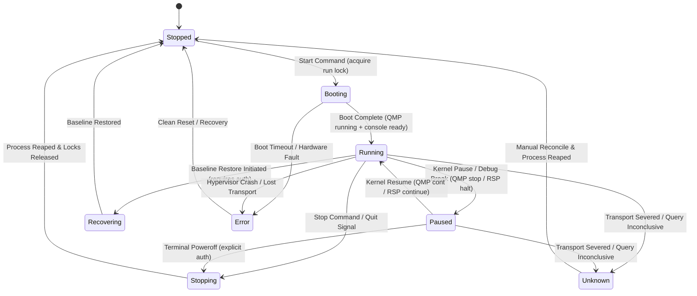

# Phase 0 Research: iOS Root VM and Darwin Security Research Backends

**Canonical Schema Identifier**: `https://emu.rs/schemas/v1/research-ios.schema.json`  
**Status**: Consolidated Technical Baseline & Design Decisions  
**Target Host Platform**: macOS Apple Silicon (`aarch64`, Darwin 25.x / macOS 15+)  
**Toolchain Baseline**: Rust 2024 edition, pinned to `rustc 1.88.0` (declared in `.tool-versions`); `bun 1.2.17`  
**Authority**: `contracts/cli.md`, `specs/002-ios-root-vm/spec.md`

---

## 1. Baseline Context, Primary Source Pins & Architectural Seams

### 1.1 Current Host Platform, Repository Evidence & Technical Baseline

- **Host Target Platform**: macOS Apple Silicon (`aarch64`, Darwin 25.x / macOS 15+), requiring ARM64 instruction execution (`sysctl hw.optional.arm64 = 1`). While `Hypervisor.framework` availability (`sysctl kern.hv_support = 1`) is evaluated during host preflight diagnostics, the iOS research hypervisors (`darwin-vm`, `Inferno`, and the companion `qemu-system-x86_64`) execute in user space using QEMU's Tiny Code Generator (TCG). Therefore, HVF entitlement is not an execution prerequisite for these guest configurations.
- **Toolchain & Language Baseline**: The repository specifies Rust 2024 edition (`Cargo.toml`) and `.tool-versions` pins `rust 1.88.0` and `bun 1.2.17`. All code adheres to strict compiler diagnostics (`-D warnings`) and clippy rules without unprincipled linter suppressions.
- **Repository Dependency Status**:
  - Existing locked runtime dependencies (`Cargo.toml`, `Cargo.lock`): `tokio = { version = "1.53.1", features = ["full"] }`, `clap = { version = "4.6.7", features = ["derive", "env"] }`, `serde = { version = "1.0.229", features = ["derive"] }`, `serde_json = "1.0.151"`, `dirs = "7.0.0"`, `regex = "1.13"`, `chrono = { version = "0.4", features = ["serde"] }`, `anyhow = "1.0"`, `thiserror = "2.0"`, `ratatui = "0.30"`, `crossterm = "0.29"`.
  - Locked transitive crates available for promotion: `sha2 = "0.10.9"` (cryptographic image, proposal, and artifact hashing), `uuid = "1.26.1"` (features: `["v4"]`, unique instance and session IDs), `nix = "0.29.0"` (Unix domain socket permissions, PTY allocation, process signaling).
  - Proposed new dependency: `fs4 = "1.1.0"` (features: `["sync"]`, `default-features = false`) for cross-process advisory file locking via `fs4::FileExt`. Required because `fs4` supports MSRV 1.75+ (compatible with Rust 1.88.0), whereas `std::fs::File::try_lock` requires Rust 1.89+, which violates the repository's pinned `1.88.0` toolchain.
  - Zero manifest modifications are made during Phase 0 / Phase 1 design; dependency additions will be formally introduced in Phase 2 implementation.
- **Current Repository Layout & Existing Abstractions**:
  - The repository currently implements a single-crate layout under `src/` (not `crates/`).
  - `DeviceManager` trait resides at `src/managers/common.rs:31-131`, utilizing Return Position Impl Trait in Trait (RPITIT; `impl std::future::Future<Output = Result<...>> + Send`) and operating on `DeviceConfig`. The legacy methods (`list_devices`, `start_device`, `stop_device`, `create_device`, `delete_device`, `wipe_device`, `is_available`) are actively consumed by existing Android and iOS simulator managers and MUST remain intact without signature breakage.
  - `CommandExecutor` trait resides at `src/utils/command_executor.rs:15-37`, currently defining string-based `run(&self, command, args) -> Result<String>` and PID-based `spawn(&self, command, args) -> Result<u32>`, along with legacy retry/ignore helpers (`run_with_retry`, `run_ignoring_errors`). For research backends, `CommandExecutor` will receive in-place typed execution methods (`run_typed(&self, spec: &CommandSpec) -> Result<CommandOutput>`, `spawn_typed(&self, spec: &CommandSpec) -> Result<ProcessHandle>`) with owned `ProcessHandle` and cancellation tokens, implemented for both the production runner (`src/utils/command.rs`) and `MockCommandExecutor` (`src/utils/command_executor.rs`). Research workflows never invoke retry or error-ignoring helpers.
  - Active device managers: only standard Android AVD (`src/managers/android/`) and macOS iOS Simulator (`src/managers/ios/`) exist in the current codebase. Research managers (`DarwinVmManager`, `InfernoManager`) and research services (`src/services/research/`) are planned architectural modules, not yet implemented. Existing Android and iOS simulator code is functionally preserved with zero regressions (SC-008, FR-004), but is not byte-frozen; integration adjustments may occur. In contrast, all eight Android 001 specification documentation artifacts (`specs/001-add-android-research-backends/`) remain strictly byte-for-byte immutable.
  - Headless CLI execution vs. Legacy Check: In the current repository, `src/main.rs:121-153` (`run_local_check`) calls `App::new().await` during `emu --check` to construct the application shell and discover devices without entering the interactive TUI event loop. In contrast, all new headless research CLI subcommands (`emu research ...`) will introduce a dedicated headless routing branch in `src/main.rs` that completely bypasses `App::new()`, preventing raw terminal initialization, alternate screen buffer allocation, mouse capture, or UI background thread polling.
- **Standard Platform Preservation (SC-008, FR-004)**: Standard Android AVD and macOS iOS Simulator workflows maintain 100% behavioral parity with zero functional or performance regressions. All eight Android 001 specification artifacts (`specs/001-add-android-research-backends/`) remain preserved byte-for-byte, and legacy device operations undergo 20 fixed verification trials before and after research execution.

### 1.2 Upstream Primary Source Pins (Verified Commits & Reality)

All upstream hypervisor and toolchain references are grounded in verified commit hashes and primary source inspection:

- **`darwin-vm`**: Commit `1c1b2c500e2192d29ef84941cd3b517024450526` (`https://github.com/jprx/darwin-vm`).
  - _Engineering Reality_: Minimal Darwin boot harness. Inspection of `run.sh:12-32` demonstrates direct invocation of `qemu-system-aarch64` passing custom machine flags: `-M darwin -bootkc <kernelcache> -dtree <dtb> -tc <trustcache> -ramdisk <initrd> -args <bootargs>`. Note: upstream does not use generic `-kernel` or `-dtb` flags; it uses QEMU patches tailored for Apple Darwin boot structures. It provides no C library, no shared object API, and no embeddable headers. It executes exclusively as an external process under QEMU Tiny Code Generator (TCG).
- **`Inferno`**: Commit `cc4302a99167abec69b714cfd00c38caece7e7de` (`https://github.com/ChefKissInc/Inferno`).
  - _Engineering Reality_: iOS security research emulation platform based on QEMU. Primary inspection of `system/main.c:44-96` proves that `main()` initializes and directly owns the CoreFoundation runloop (`CFRunLoop`), registers process-wide POSIX signal handlers, allocates global window display contexts, and controls process exit. It possesses no re-entrant C API or embeddable supervisor interface. It runs as an out-of-process hypervisor using TCG on Apple Silicon.
- **`qemu-sptm`**: Commit `2867d847d3471560e773120ee50c42dbcbb6d60b` (`https://github.com/ChefKissInc/qemu-sptm`).
  - _Engineering Reality_: Underlying QEMU fork providing Secure Page Table Monitor (SPTM) and Apple Silicon emulation primitives under TCG. Contains QEMU TCG plugin headers (`include/plugins/qemu-plugin.h`) and plugin directories (`plugins/`), while the active `Inferno` checkout currently omits in-tree plugin integration.
- **Official Inferno Companion Setup Guide**: `https://chefkiss.dev/guides/inferno/companion-setup/`.
  - _Engineering Reality_: Documents the companion VM setup required to run specialized restore utilities, `idevicerestore`, and USB-over-IP tunneling. Upstream explicitly documents compiling and running a custom `qemu-system-x86_64` binary built from Inferno with remote USB emulation (`-device usb-ehci,id=ehci -device usb-tcp-remote,bus=ehci.0,conn-type=unix,conn-addr=<path>`).
- **Official Inferno Host Setup Guide**: `https://chefkiss.dev/guides/inferno/host-setup/`.
  - _Engineering Reality_: Documents upstream build configuration: `LIBTOOL="glibtool" ../configure --target-list=aarch64-softmmu,x86_64-softmmu ...`. Upstream `hw/usb/meson.build` compiles `tcp-usb.c`, `dev-tcp-remote.c`, and `hcd-tcp.c` whenever `CONFIG_USB_TCP` is enabled.
- **Official Frida 17 Release Notes**: `https://frida.re/news/2025/05/17/frida-17-0-0-released/`.
  - _Engineering Reality_: Confirms that `frida-objc-bridge` was unbundled from GumJS in Frida 17.0.0. Scripts referencing `ObjC` without bundling `frida-objc-bridge` trigger immediate `ReferenceError`. Confirms deprecation/deletion of legacy APIs (`Module.findExportByName`, `Module.findBaseAddress`, `Process.enumerateModulesSync`) in favor of modern `Process.getModuleByName().getExportByName()` and synchronous `Process.enumerateModules()`.
- **Primary Source Inspection vs. Runtime Capability**:
  - Source-inspected code paths and configuration flags constitute structural findings, NOT observed runtime capabilities.
  - Live simultaneous joint capability (iOS root + GDB kernel debug + SpringBoard + Frida 17.18.0 dynamic instrumentation + companion USB) is strictly classified as an unobserved empirical prerequisite to be validated in controlled laboratory trials, rather than a design unknown or reason for scope reduction.

### 1.3 Key Protocol Realities & Rejected Fallacies

1. **QMP is Line-Delimited JSON, NOT JSON-RPC 2.0**: QEMU Machine Protocol (QMP) uses an asynchronous, line-delimited JSON framing format. It requires reading a greeting banner (`{"QMP": {"version": ...}}`), issuing a capabilities handshake (`{"execute": "qmp_capabilities"}`), receiving a command response (`{"return": {...}}` or `{"error": {...}}`), and processing out-of-band asynchronous event lines (`{"event": "...", "data": {...}}`). It does not use JSON-RPC 2.0 framing or schema headers.
2. **QMP `running: true` != Guest OS Ready**: QMP `query-status` returning `{"running": true}` denotes only that virtual CPU instructions are being decoded and executed by the QEMU TCG engine. It does **not** indicate that the Darwin/XNU kernel has initialized, that the root ramdisk has mounted, or that userland services (`launchd`, `SpringBoard`, `installd`) are ready to receive commands.
3. **QMP `stop` != Guest Shutdown**: Issuing `{"execute": "stop"}` suspends virtual CPU instruction execution immediately, freezing memory in `RunState::PAUSED`. It is not an OS shutdown or ACPI poweroff. Poweroff requires `{"execute": "quit"}` or explicit guest shutdown commands.
4. **Frida Socket-Only Manager is NOT Endpoint Immunity**: Calling `frida_device_manager_new_with_socket_backend_only()` prevents Frida from enumerating host Mach task ports or local macOS processes. However, it does NOT provide network or endpoint immunity against rogue local services if pointed at an unauthenticated loopback port. The worker must connect only to an owned guest bridge over an authenticated SSH bridge with pinned SSH host key, verified TLS server certificate, and per-session client token.
5. **No Magic QMP Dynamic-Port Discovery**: QEMU command lines must declare explicit loopback ports or owner-restricted Unix Domain Sockets. Relying on port 0 with ad-hoc discovery via QMP or log scraping is prohibited.
6. **No Unauthenticated Public Listening Endpoints**: All research control, QMP, GDB RSP, Frida, and companion channels are restricted to owner-permissioned Unix Domain Sockets (`0700`) or loopback interfaces guarded by credentials and capability leases.
7. **Observer Detach != Operation Cancellation**: Interactive CLI/TUI observers disconnecting or receiving `Ctrl+C` detach their local IPC observers without terminating guest execution or background worker operations. Cancellation requires explicit invocation of `emu research operation cancel --id <ID>`.

---

## 2. Core Architectural Decisions

### Decision D-01: Hypervisor Isolation via Out-of-Process Supervision (No In-Process C FFI)

- **Decision**: **Do not embed QEMU fork codebases (`darwin-vm`, `Inferno`, `qemu-sptm`) into the Emu binary via C/Rust FFI**. Hypervisor backends execute strictly as isolated child processes supervised by a private child supervisor (`emu __supervise --vm-id <ID>`). Communication occurs exclusively over structured, out-of-process IPC: QMP over local Unix Domain Sockets (UDS) for lifecycle management, and typed GDB Remote Serial Protocol (RSP) over chardev sockets for kernel debugging.
- **Rationale**:
  - _Crash Containment_: Experimental Darwin/XNU guest kernels frequently encounter panics, unmapped page faults, or unexpected traps. In an out-of-process model, guest kernel panics or process crashes are cleanly isolated to the child process without destabilizing the host Emu harness.
  - _Global State & Runloop Conflicts_: Upstream `Inferno` (`system/main.c:44-96`) directly takes over the macOS `CFRunLoop`, installs process-wide signal handlers (`SIGINT`, `SIGTERM`), and manipulates global mutable state. Linking this into Tokio or Ratatui async loops introduces potential signal conflicts, event loop contention, and runloop collisions.
  - _Toolchain Decoupling_: Backends can be compiled with custom Meson/Ninja/Clang configurations independently of Emu's Rust 1.88.0 toolchain.
- **Alternatives Considered**:
  - _Direct C FFI via `bindgen`_: Rejected. QEMU internal headers have no stable ABI; global state collisions destroy Tokio runtime.
  - _UniFFI Binding Layer_: Rejected. Inverted architectural target; UniFFI is designed for exporting Rust to mobile languages, not embedding C hypervisors.
  - _In-Tree QEMU TCG Plugins for Lifecycle_: Rejected. TCG plugins (`qemu-plugin.h`) are designed for memory/instruction tracing, not VM supervisor control; `Inferno` lacks in-tree plugin support.
- **Source Bounds**: Confirmed via `Inferno/system/main.c:44-96` and `darwin-vm/run.sh:12-32`. Both backends execute under TCG on macOS Apple Silicon.

### Decision D-02: Isolated Frida Dynamic Instrumentation Worker with Server-Auth TLS & Client Token over Owned SSH Bridge

- **Decision**: **Integrate Frida exclusively via an isolated private child executable (`emu-frida-worker`), built from a standalone private Cargo package (`tools/frida-worker/`) outside the root workspace and default target graph, linked against the official `frida-core` C devkit (pinned candidate: Tag 17.18.0)**. The supervisor manages the worker over bounded, typed stdio JSON streams. Direct linkage of `frida-core` into the main `emu` executable or inclusion in the root crate target graph is strictly prohibited. The worker connects exclusively to an owned guest bridge authenticated via a pinned Frida TLS server certificate and per-session client token over an owned authenticated SSH bridge with pinned SSH host key (server-auth TLS + token client auth; client certificate authentication is not used). Bearer tokens alone or unauthenticated sockets are rejected.
- **Rationale**:
  - _GLib Loop Isolation_: `frida-core` requires GLib (`GMainContext`, `GMainLoop`). Running GLib inside Tokio/Ratatui leads to potential thread contention, signal handler interference, and event loop starvation.
  - _Host Injection Guard_: `frida_device_manager_new_with_socket_backend_only()` ensures host Mach task-port injection backends are eliminated from the worker.
  - _Server-Auth TLS & Client Token Protection_: Because `socket_backend_only` does not protect against connecting to an untrusted local port, the worker enforces server identity verification and token authentication over an owned authenticated SSH bridge with pinned SSH host key. During guest initialization, the supervisor provisions a unique TLS keypair into the guest bootstrap environment and pins the server certificate fingerprint in the instance runtime descriptor. The worker passes the pinned certificate authority and client token via `FridaRemoteDeviceOptions`:
    ```c
    FridaRemoteDeviceOptions *opts = frida_remote_device_options_new();
    frida_remote_device_options_set_certificate(opts, pinned_tls_cert);
    frida_remote_device_options_set_token(opts, session_token);
    ```
  - _Preflight System Parameters Assertion_: Following TLS transport negotiation and before dispatching `spawn` or `attach`, the worker invokes `frida_device_query_system_parameters_sync()`. It asserts `os.id == "ios"` (or `os.name == "iOS"`) and verifies guest build identity matches the instance descriptor, aborting immediately if host macOS parameters are encountered.
  - _Frida 17 Script Compatibility_: GumJS in Frida 17 unbundled `frida-objc-bridge` (official release: `https://frida.re/news/2025/05/17/frida-17-0-0-released/`). Injected scripts must incorporate a pre-bundled `frida-objc-bridge` runtime preamble. Legacy APIs (`Module.findExportByName`, `Module.findBaseAddress`, `Process.enumerateModulesSync`) are replaced with modern `Process.getModuleByName().getExportByName()` and synchronous `Process.enumerateModules()`. Users provide bundled `frida-objc-bridge` scripts; Emu does not perform automatic script rewriting or AST injection.
  - _No Thread Suspension Assumption_: Standard upstream Frida 17.18.0 is evaluated without assuming uncorroborated, non-upstream thread suspension kernel patches. Joint compatibility is an unobserved candidate configuration subject to empirical laboratory acceptance.
  - _Build Isolation via Standalone Package (`tools/frida-worker/`)_: To ensure that root `cargo clippy --all-targets --all-features` and root automated test suites do NOT require the `frida-core` native C devkit or local C compilation toolchain, `emu-frida-worker` is architected as an explicitly separate private Cargo package under `tools/frida-worker/` outside the root workspace and default target graph. The main `emu` crate contains strictly typed IPC protocol definitions, stdio transport handlers, and mock implementations (`src/workers/frida/`). The native helper is built explicitly for lab or release environments via `cargo build --manifest-path tools/frida-worker/Cargo.toml`. This intentional isolation tradeoff prevents unrequested distro packaging or build-script plumbing in the root repository.
- **Alternatives Considered**:
  - _In-Process C FFI in Supervisor/TUI_: Rejected. GLib loop collisions, signal interception, and crash propagation to user interface.
  - _CLI Scraping (`frida`, `frida-trace`)_: Rejected. Fragile CLI text output, no reliable bidirectional RPC channels.
  - _External Python/Node Bindings_: Rejected. Heavy host runtime dependencies and virtual environment management.
  - _Unauthenticated Bearer Token alone_: Rejected. A bearer token alone fails to authenticate server identity, exposing the harness to rogue local listeners.
- **Source Bounds**: Official Frida 17.18.0 release (`https://github.com/frida/frida/releases/tag/17.18.0`), `frida-core` C headers (`frida-core.h`), and Frida 17 release announcement (`https://frida.re/news/2025/05/17/frida-17-0-0-released/`).

### Decision D-03: iOS Application Lifecycle via Modern `ideviceinstaller` Wire Grammar

- **Decision**: **Manage iOS application lifecycle on `Inferno` using modern `ideviceinstaller` (v1.2.0+) subcommands routed through the owned companion VM usbmuxd bridge, adhering strictly to actual streaming text and JSON output grammar**. Application frameworks are supported exclusively on `Inferno`; `darwin-vm` reports application frameworks unavailable (`AppFrameworksUnavailable`, exit code 3).
- **Rationale & Parsing Realities**:
  - _Query vs. Mutation Grammar_: Upstream inspection of `ideviceinstaller.c:220-270` establishes that only query commands (`ideviceinstaller -u <UDID> list --json`) output structured JSON. Mutating subcommands (`install <FILE>`, `uninstall <BUNDLE>`, `upgrade <FILE>`) **do not output JSON or XML**. They emit streaming carriage-return text progress to stdout (`\rInstall: Status (N%)`) terminating in `\rInstall: Complete\n`, and error strings to stderr (`ERROR: ... failed. Got error "..." with code 0x...`).
  - _Executor Parsing Contract_: `CommandExecutor` executes the subcommand, captures stdout/stderr, verifies exit code 0, checks for the terminal `Complete` token, and parses stderr error strings into structured error records on non-zero exit.
  - _Target Disambiguation_: Invocations always pass `-u <UDID>` mapped strictly to the owned companion VM bridge, prohibiting interaction with ambient host devices.
  - _Execution & Verification Gate_: Installing an IPA does not prove application boot. The system launches the application via Frida `spawn` / `resume` and verifies sandboxed container creation under `/private/var/mobile/Containers/Data/Application/<UUID>`.
  - _Artifact Import Boundary_: Importing an application artifact (`AppArtifact`) validates the Mach-O binary architecture (`ARM64`), bundle identifier, and manifest integrity; it does NOT falsely require a running guest or deployed container at import time.
- **Alternatives Considered**:
  - _Direct Filesystem Injection (`/Applications` copy + `uicache`)_: Rejected. Bypasses `installd`, MobileInstallation, and sandbox data container creation under `/private/var/mobile/Containers/`.
  - _Assuming JSON Output on Mutating Commands_: Rejected. Source inspection proves mutating subcommands emit plain text progress only.
- **Source Bounds**: `ideviceinstaller.c:220-270` (`https://github.com/libimobiledevice/ideviceinstaller`).

### Decision D-04: Single-Binary CLI/TUI + Private Supervisor & Worker Architecture with Short UDS Paths

- **Decision**: **Maintain a single public binary (`emu`) containing both CLI and TUI, plus private child supervisor (`emu __supervise --vm-id <ID>`) and worker (`emu __worker --operation-id <ID>`) modes, complemented by the explicitly separate native helper binary (`emu-frida-worker`). Do not deploy persistent background host daemons (`launchd`)**. All Unix Domain Sockets use owner-restricted short paths under `/tmp/emu-<short_id>/` to strictly respect Darwin's 104-byte `sun_path` limit.
- **Rationale**:
  - _Process Tree Ownership_: The private child supervisor owns the QEMU child process handle, QMP control socket, GDB chardev socket, guest console PTY, and advisory file locks. The supervisor does not terminate when a guest halts or pauses; it terminates ONLY when the underlying guest process has been reaped AND zero dependent helper resources or workflows remain.
  - _Locking & Persistence Structure_: Durable metadata, profiles, and state are stored under `dirs::data_local_dir()/emu/research` (`~/Library/Application Support/emu/research`). Cross-process serialization uses advisory file locking (`fs4 = "1.1.0"`, feature `sync`) on dedicated, permanent never-unlinked lockfiles in nested directories (`instances/locks/<id>.run.lock`, `operations/locks/<id>.op.lock`, `<id>.device.lock`). Lockfiles are permanently retained on disk and never unlinked/deleted, preventing inode-recycling race conditions; ownership is governed solely by `fs4` advisory flock semantics.
  - _Two-Step Destructive Authorization_: Destructive operations (disk wipes, instance deletions, baseline rollbacks) require a `MutationProposal` with a SHA-256 digest. Under the instance lock, the proposal digest is verified and consumed before side effects begin. Stale proposal revisions are rejected.
  - _Darwin 104-Byte `sun_path` Limit_: In Darwin, `sizeof(((struct sockaddr_un *)0)->sun_path)` is strictly 104 bytes (whereas `sizeof(struct sockaddr_un)` is 106 bytes including `sun_len` and `sun_family`). Paths under `$HOME/Library/Application Support/...` exceed 104 bytes and fail with `EINVAL` or `ENAMETOOLONG`. Sockets are created in private `0700` temporary directories: `/tmp/emu-<short_id>/` (`qmp.sock`, `gdb.sock`, `console.sock`, `inferno-usb.sock`).
  - _Headless Routing Bypass_: Invocations under `emu research ...` execute directly in a headless async loop, bypassing `App::new()` and preventing TUI initialization.
- **Alternatives Considered**:
  - _Host Daemon (`launchd` plist / `emud`)_: Rejected. Requires host configuration mutation, elevated install permissions, and leaves stale state.
  - _Unsupervised Direct Process Spawning_: Rejected. Closing the TUI drops process handles, leaving orphaned hypervisors consuming host RAM/CPU.
  - _`std::fs::File::try_lock`_: Rejected. Requires Rust 1.89+, violating repository toolchain pin `1.88.0`.
- **Source Bounds**: POSIX `sys/un.h` Darwin definition (`sun_path[104]`), `fs4` crate MSRV documentation, and `src/main.rs`.

### Decision D-05: Supervisor RSP Ownership & Truthful Non-Mutating Disconnect Handling

- **Decision**: **The supervisor process initiates the GDB Remote Serial Protocol (RSP) connection to QEMU's gdbstub ONLY upon first explicit debug entry (not eagerly at guest boot), and retains the connection for the remainder of the guest runstate, managing an exclusive `KernelDebugLease`. Observers connect to the supervisor via local IPC. On observer disconnect, the supervisor NEVER sends `D` (detach), `c` (continue), or `k` (kill) to QEMU. On unexpected transport loss, the supervisor queries QMP `query-status` and reports actual status (`paused`, `running`, or `unknown`) truthfully without issuing QMP `stop` or performing automatic retries**.
- **Rationale**:
  - _Preventing Premature VM Halting_: In upstream `Inferno`, `gdb_chr_event` when `CHR_EVENT_OPENED` occurs calls `vm_stop()`. Eagerly connecting the RSP transport at guest launch would therefore halt virtual CPU execution during boot. Initiating the connection strictly upon first explicit debug entry avoids disrupting guest startup, while retaining ownership of the chardev transport throughout the remaining guest lifecycle prevents triggering QEMU's `handle_detach()` (`gdbstub/gdbstub.c:1061`), which would otherwise call `gdb_continue() -> vm_start()` and silently resume execution on observer exit.
  - _Zero Execution Mutation on Transport Loss_: If the RSP socket drops unexpectedly, issuing an imperative QMP `stop` or `cont` would corrupt hypervisor state. The supervisor must not mutate the runstate.
  - _Zero Automatic Retries (FR-047)_: Automatic reconnection attempts after transport drops risk state corruption and violate the single-execution contract.
  - _Truthful Runstate Reporting (SC-006, FR-029)_: The supervisor immediately queries QMP `query-status` to inspect hardware runstate. If the guest was paused, it reports `status: "paused"`, surfacing explicit recovery actions (`resume`, `reset`, `terminate`) to the user.
  - _Exclusive Debug Lease_: While `KernelDebugLease` is held, concurrent QMP operations (`cont`, `system_reset`) are rejected with Exit Code 5 (`conflict`).
- **Alternatives Considered**:
  - _Interactive LLDB/GDB PTY Child_: Rejected. Escape sequence noise, timing jitter, non-deterministic automation.
  - _Sending `D` on Observer Disconnect_: Rejected. Causes QEMU to resume guest execution silently.
- **Source Bounds**: QEMU source `gdbstub/gdbstub.c:1061-1080` and `monitor/qmp-cmds.c:44-112`.

### Decision D-06: Trust Boundaries, Containment & Non-Malicious-Guest Security Model

- **Decision**: **Define explicit security boundaries: Emu is designed for authorized security research on owned lab guests and test applications. QEMU TCG is explicitly NOT a security boundary against hostile guests attempting hypervisor escape. Operating privileges remain strictly unprivileged on the host**.
- **Rationale**:
  - _Host Privilege Boundary_: Emu runs entirely within an ordinary, unprivileged user account. Emu never modifies host System Integrity Protection (SIP), Sealed System Volume (SSV), NVRAM variables, or host boot arguments (FR-034, SC-007).
  - _Guest Root Containment (SC-007, FR-025)_: In-guest root privileges (UID 0) grant zero host authority. No host drives, shared folders (virtfs/9p), or host credentials are exposed to the guest. Runtime in-guest modifications execute entirely within guest storage without host-side disk mounts.
  - _TCG Hypervisor Escape Reality_: Upstream QEMU documentation explicitly establishes that QEMU TCG does not treat guest-to-host isolation as a hardened cryptographic boundary. Emu disclaims false claims of hypervisor escape immunity.
  - _Secret Stripping (FR-041)_: Exported experiment profiles automatically strip host environment variables, SSH keys, and credentials. Guest container data and logs are exported only upon explicit researcher authorization.
- **Alternatives Considered**:
  - _Claiming Hardened Sandbox / Exploit Immunity_: Rejected. Hypervisors (especially TCG JIT engines) have attack surfaces that cannot guarantee containment of malicious exploit payloads.
  - _Requiring Host SIP Disabling for Host-Side Patching_: Rejected. Severe host security compromise; all disk preparation operations operate strictly on guest image loopback/vnode attachments.
- **Source Bounds**: QEMU TCG Security Documentation (`https://www.qemu.org/docs/master/system/security.html`).

### Decision D-07: Image Preparation via Verified Device Identity & Safe Disposable Cleanup

- **Decision**: **Execute host-side image preparation and patching strictly through verified unique volume identifiers and device nodes, with multi-stage cleanup of disposable resources at safe boundaries**.
- **Rationale**:
  - _Unique Device Node Verification (SC-010, FR-033)_: When attaching a guest disk image (`hdiutil attach -nomount`), the system inspects `diskutil info -plist` to determine the exact device node (`/dev/diskNsM`) and Volume UUID. Trusting hardcoded paths (such as `/Volumes/System`) is strictly prohibited.
  - _Host Isolation_: Mount operations target only private workspace directories (`dirs::data_local_dir()/emu/research/mnt/<op_id>`).
  - _Administrative Authorization Gate (FR-035)_: If image preparation requires elevated privileges (`sudo hdiutil`), Emu requests explicit authorization. In unattended automation mode without pre-authorized credentials, the command aborts immediately with Exit Code 4 (`auth_refused`, `AUTH_REQUIRED`).
  - _Safe Disposable Cleanup (FR-036)_: A deterministic cleanup stack unmounts filesystems, detaches loopback devices, and cleans temporary scratch files up to safe boundaries, recording any partial commits or residual resources in the operation record.
- **Alternatives Considered**:
  - _Hardcoded Mount Points (`/Volumes/OS`)_: Rejected. Collisions with host or external volumes cause severe filesystem corruption.
  - _Silent Sudo Prompts in CI_: Rejected. Causes automated pipelines to hang indefinitely on terminal stdin.
- **Source Bounds**: macOS `hdiutil` and `diskutil` plist specifications.

### Decision D-08: Documented Local x86_64 Companion VM on Same Mac via UDS USB

- **Decision**: **Adopt the documented custom `qemu-system-x86_64` companion VM built from Inferno running under TCG on the same macOS Apple Silicon host with Unix Domain Socket (UDS) USB transport (`usb-tcp-remote`). The speculative ARM64/HVF companion candidate is excluded**.
- **Rationale & Source Invariants**:
  - _Upstream Documentation Match_: The official Inferno companion guide (`https://chefkiss.dev/guides/inferno/companion-setup/`) specifies running custom `qemu-system-x86_64` from Inferno with remote USB emulation on the same machine via UNIX socket. Upstream host setup builds both `aarch64-softmmu` and `x86_64-softmmu`.
  - _TCG Execution on Apple Silicon_: `qemu-system-x86_64` runs on macOS Apple Silicon via QEMU's TCG engine translating x86_64 guest instructions to host ARM64 instructions in user space, requiring no nested virtualization or special entitlements.
  - _Launch Ordering Invariant_: In `hw/usb/dev-tcp-remote.c:436-444`, `dev-tcp-remote` acts as the listening server (`bind()`), whereas in `hw/usb/hcd-tcp.c:359-364`, `hcd-tcp` acts as the connecting client (`connect()`). Therefore, the companion VM must be spawned and achieve socket listener readiness before the Inferno guest is started, avoiding `ECONNREFUSED`.
  - _UDS Path Constraint_: Sockets use short temporary paths (`/tmp/emu-<short_id>/inferno-usb.sock`) adhering to Darwin's 104-byte `sun_path` limit (`sizeof(((struct sockaddr_un *)0)->sun_path)`).
  - _Lifecycle Bound to Authoritative Dependency Sets (FR-038, SC-011)_: The companion supervisor tracks authoritative live reference sets of active restore operations and live dependent guests. The companion VM terminates cleanly ONLY when the active restore set is empty AND the live dependent guest set is empty. Cancellation of one guest does not terminate a companion shared by another dependent guest.
- **Alternatives Considered**:
  - _External Physical Linux Host_: Rejected. Introduces hardware fragmentation and breaks self-contained macOS execution.
  - _Speculative ARM64/HVF Companion_: Excluded from current baseline; lacks upstream documentation in Inferno companion setup.
  - _Aggressive Companion Teardown on Restore Exit_: Rejected. Breaks live Inferno guests that depend on ongoing usbmuxd forwarding.
- **Source Bounds**: Upstream `hw/usb/dev-tcp-remote.c`, `hw/usb/hcd-tcp.c`, and official companion documentation (`https://chefkiss.dev/guides/inferno/companion-setup/`).

---

## 3. Structural FFI vs. IPC Assessment

| Hypervisor / Research Component         | Interface Under Evaluation                           | Structural Assessment & Decision | Core Rationale & Failure Mode Analysis                                                                                                                                                                                                                                                                                                                                                     |
| :-------------------------------------- | :--------------------------------------------------- | :------------------------------- | :----------------------------------------------------------------------------------------------------------------------------------------------------------------------------------------------------------------------------------------------------------------------------------------------------------------------------------------------------------------------------------------- |
| **QEMU Forks (`darwin-vm`, `Inferno`)** | In-Process C FFI (`bindgen` / UniFFI)                | **REJECTED**                     | • No stable embeddable C API (`run.sh` CLI wrapper in `darwin-vm`).<br>• Global state, signal handlers, and `CFRunLoop` claimed in `Inferno/system/main.c:44-96`.<br>• Guest kernel panic/fault crashes entire Emu harness.<br>• Process isolation provides clean operational modularity and crash containment, avoiding binary linking pending formal legal review.                       |
| **QEMU Monitor Control**                | QMP over Unix Domain Socket (UDS)                    | **ACCEPTED**                     | • Asynchronous, line-delimited JSON protocol supported natively by QEMU (`qmp-cmds-control.c`).<br>• Clean process crash boundary.<br>• Sub-millisecond latency over local UDS.<br>• Fine-grained lifecycle, pause, and runstate inspection.                                                                                                                                               |
| **Kernel Debugger**                     | GDB RSP over Loopback Socket / Chardev               | **ACCEPTED**                     | • Standard Remote Serial Protocol natively supported by QEMU gdbstub (`gdbstub/system.c`).<br>• Direct hardware register inspection, memory reads/writes, single-stepping, and breakpoints.<br>• Managed under an exclusive `KernelDebugLease` preventing QMP state collisions.                                                                                                            |
| **QEMU TCG Plugin**                     | Rust TCG Plugin (`qemu-plugin.h`)                    | **REJECTED (Current Phase)**     | • TCG plugins are designed for execution and memory access tracing, not VM supervisor management.<br>• `Inferno` currently lacks TCG plugin support in its active checkout.<br>• Unnecessary complexity for Phase 1 scope.                                                                                                                                                                 |
| **Frida Instrumentation Core**          | In-Process FFI into Supervisor / TUI                 | **REJECTED**                     | • GLib event loop (`GMainLoop`) conflicts with Tokio/Ratatui async loops.<br>• Memory management hazards with C callback retention and GLib allocations.<br>• Risk of accidental host process injection from unconstrained local device discovery.                                                                                                                                         |
| **Frida Dynamic Worker**                | Out-of-Process Worker (`emu-frida-worker`) via C ABI | **ACCEPTED**                     | • Links official `frida-core` 17.18.0 C devkit in an isolated private executable.<br>• Enforces `DeviceManager.with_socket_backend_only()`, pinned TLS server certificate, and per-session client token over owned SSH bridge.<br>• Communicates with Emu supervisor over bounded, typed stdio JSON records.<br>• GLib context completely isolated; worker crashes do not destabilize Emu. |
| **Application Installation**            | `ideviceinstaller` CLI Subcommands over IPC          | **ACCEPTED**                     | • Implements Apple's standard `InstallationProxy` over companion usbmuxd bridge.<br>• Verifies container creation under `/private/var/mobile/Containers/Data/Application/`.<br>• Adheres to streaming text progress on install/uninstall and JSON on list.                                                                                                                                 |

---

## 4. Complete Protocol Action & Capability Mapping (All 48 FRs)

The following matrix maps every Functional Requirement (FR-001 through FR-048) defined in the feature specification to its concrete architectural layer, IPC mechanism, specific command or action, and verified invariant.

| FR Identifier | Category & Requirement Summary                 | Architectural Layer & Component | IPC Protocol / Mechanism                | Concrete Protocol Action / Command                                                                                                                                                | Verified Invariant & Falsification Condition                                                                                                               |
| :------------ | :--------------------------------------------- | :------------------------------ | :-------------------------------------- | :-------------------------------------------------------------------------------------------------------------------------------------------------------------------------------- | :--------------------------------------------------------------------------------------------------------------------------------------------------------- |
| **FR-001**    | macOS Apple Silicon (`aarch64`) Host Platform  | Preflight / System              | Host Kernel / `sysctl`                  | Query `sysctl hw.optional.arm64` and `uname -m`                                                                                                                                   | Host must be Apple Silicon (`aarch64`); x86_64 or non-Darwin rejected with Exit Code 3 (`unsupported`).                                                    |
| **FR-002**    | Non-Interactive Preflight Diagnostics          | CLI / Preflight Engine          | Non-interactive execution               | `emu research backend preflight --json`                                                                                                                                           | Outputs structured JSON to stdout, logs to stderr; zero GUI or interactive prompts invoked.                                                                |
| **FR-003**    | Architectural Separation of Backends           | Instance Registry / Dispatch    | Internal Rust Domain Types              | Explicit `BackendType::DarwinVm` vs `BackendType::Inferno`                                                                                                                        | Separate configuration types, disk layouts, and supervisor instances; no cross-backend reuse.                                                              |
| **FR-004**    | Standard Platform & Android 001 Parity         | Core Managers & Specs           | In-Memory Dispatch / Filesystem         | Preservation of `AndroidManager`, `IosManager`; 8 spec files                                                                                                                      | Exact byte-for-byte hash match on 8 Android 001 specs; zero regression on legacy AVD across 20 trials.                                                     |
| **FR-005**    | Immutable Globally Unique Identifier           | Data Model / Registry           | UUIDv4 Generation                       | Generate `uuid::Uuid::new_v4()` on instance creation                                                                                                                              | Internal ID immutable; independent of user-assigned display names.                                                                                         |
| **FR-006**    | Standard Guest Lifecycle Operations            | Supervisor / Coordinator        | QMP over UDS + OS Process               | `create`, `inspect`, `start`, `stop`, `restart`, `delete`                                                                                                                         | Operations transition state machine deterministically; no orphaned PIDs.                                                                                   |
| **FR-007**    | Disambiguation of Identical Display Names      | CLI Parser / Registry           | Domain Query Resolver                   | Disambiguate by `<backend>:<id>` or reject ambiguous query                                                                                                                        | Shared display names across backends rejected with Exit Code 2 (`invalid_input`) without unique ID.                                                        |
| **FR-008**    | Explicit Destructive Operation Confirmation    | CLI / TUI Command Gate          | Proposal Digest / `--authorize`         | Require `--authorize sha256:<digest>` generated via `--dry-run`                                                                                                                   | Destructive ops abort with Exit Code 4 (`auth_refused`) if unconfirmed; routine start/stop proceed.                                                        |
| **FR-009**    | Prevent Cross-Backend Raw Image Reuse          | Storage / Profile Engine        | Artifact Header & Metadata Check        | Validate `target_backend` tag in image metadata                                                                                                                                   | Attempting to boot an `Inferno` image on `darwin-vm` fails preflight validation with Exit Code 2.                                                          |
| **FR-010**    | Verify Effective Root (UID 0) in Guest         | Guest Verification Engine       | Guest Bootstrap Console / SSH           | Execute privileged fixture check; verify UID 0                                                                                                                                    | Correlates guest build identity, image hash, and runtime boot session ID.                                                                                  |
| **FR-011**    | Interactive Root Console via Bootstrap         | Console Manager                 | Unix PTY / Virtio Console               | Connect to guest root console stream over Virtio chardev                                                                                                                          | No reliance on external commercial jailbreak tools or closed exploits.                                                                                     |
| **FR-012**    | Root Verification via Dedicated Fixture Helper | Guest Verification Engine       | Guest Helper (`emu-root-probe`)         | Execute probe verifying `geteuid() == 0` write of full UUID payload with readback; dropping privileges succeeds and subsequent unprivileged open/write denied (`EACCES`/`EPERM`). | Positive write succeeds with full byte count & readback match; non-zero UID negative control verifiably denied (`EACCES`/`EPERM`).                         |
| **FR-013**    | Capture Kernel & Test Binary Evidence          | Telemetry Collector             | Guest Shell Execution                   | Execute `uname -v`, query boot args, run benign test binary                                                                                                                       | Evidence hashed and bound to immutable `RootProofEvidence` record.                                                                                         |
| **FR-014**    | Distinct Desired vs Observed Privilege State   | Data Model / Status Reporter    | Status Serialization                    | Separate fields: `desired_privilege` vs `observed_privilege`                                                                                                                      | Stale, missing, or negative-control-pass evidence marks status `unverified` (no special enum).                                                             |
| **FR-015**    | Invalidate Root Verification on Reboot/Change  | Supervisor State Monitor        | Lifecycle Event Observer                | Invalidate `RootProofEvidence` upon guest reboot, crash, base image replacement, root-relevant security policy or kernel parameter modification, or lost guest-session connection | In-guest filesystem writes preserve verification; reboot, crash, base image replacement, policy/kernel modification, or lost guest connection invalidates. |
| **FR-016**    | iOS Application Lifecycle Management           | App Manager (`Inferno`)         | `ideviceinstaller` over companion       | `install <FILE>`, `list --json`, `uninstall <BUNDLE>` via `-u <UDID>`                                                                                                             | Validates container creation under `/private/var/mobile/Containers/Data/Application/`.                                                                     |
| **FR-017**    | Complete Frida Runtime Lifecycle               | Instrumentation Manager         | Stdio JSON to `emu-frida-worker`        | `prepare`, `install`, `configure`, `start`, `inspect`, `stop`, `remove`                                                                                                           | FR-017 `configure` operates under existing `frida` family using validated guest-owned bridge config.                                                       |
| **FR-018**    | Frida Script Attachment & Spawn                | `emu-frida-worker`              | Frida C API over pinned TLS socket      | `Device.spawn()`, `Device.attach()`, `Session.create_script()`                                                                                                                    | Instrumentation marked ready ONLY after confirmed hook telemetry received from target.                                                                     |
| **FR-019**    | Invalidate Frida Readiness on Reboot/Exit      | `emu-frida-worker` / Supervisor | Event Channel                           | Invalidate session upon guest reboot, base image replacement, root-relevant security policy modification, target process termination, or lost guest-session connection            | Re-proves readiness on new connection; harmless observer detach leaves guest session running.                                                              |
| **FR-020**    | Native C/ARM64 & Objective-C Hooking           | `emu-frida-worker`              | Frida Interceptor & `frida-objc-bridge` | Inject pre-bundled script hooking C export and ObjC method                                                                                                                        | Both native and Objective-C hook invocations captured with timestamps and payloads.                                                                        |
| **FR-021**    | Instrumentation Target Process Specificity     | `emu-frida-worker`              | Frida Interceptor Scope                 | Attach strictly to target PID; monitor control PID                                                                                                                                | Hooks fire exclusively in target PID; uninstrumented control process remains untouched.                                                                    |
| **FR-022**    | Validate Application ABI & Security Profile    | App Manager / Preflight         | Binary Header / Mach-O Parser           | Check Mach-O CPU type (`ARM64`), codesign against profile                                                                                                                         | Incompatible ABI or unpermitted signature fails preflight before guest launch.                                                                             |
| **FR-023**    | Report Unavailable App Frameworks Truthfully   | Backend Capability Evaluator    | Capability Query                        | Return structured error `AppFrameworksUnavailable`                                                                                                                                | Query on minimal `darwin-vm` refuses app install with Exit Code 3 (`unsupported`).                                                                         |
| **FR-024**    | Authorized Scoped App Container File Access    | Guest File Manager              | In-Guest Helper / AFC                   | `container-read`, `container-write`, `container-export`                                                                                                                           | Scoped strictly to target app container; requires explicit researcher authorization.                                                                       |
| **FR-025**    | Authorized In-Guest Root Filesystem Access     | Guest File Manager              | Guest Bootstrap Channel                 | `root fs-read`, `root fs-write`, `root fs-export`                                                                                                                                 | Executes entirely inside guest; zero host-side disk mounting during live execution.                                                                        |
| **FR-026**    | Process Enumeration & Mach Service Query       | System Inspector (`Inferno`)    | In-Guest Shell / Frida Worker           | `root ps`, `root mach-services`                                                                                                                                                   | Allows enumerating guest processes and attaching Frida probes to compatible daemons.                                                                       |
| **FR-027**    | Kernel Debugging Operations                    | Kernel Debugger Engine          | GDB RSP Client over Chardev             | `?`, `g`, `G`, `m`, `M`, `Z0`, `z0`, `s`, `c`                                                                                                                                     | Register inspection, memory read/write, breakpoints, single-stepping under `KernelDebugLease`.                                                             |
| **FR-028**    | Distinguish Paused Debugger from Failure       | Kernel Debugger / Supervisor    | QMP `query-status` + GDB state          | Map `RunState::PAUSED` with active lease to `Paused`                                                                                                                              | Paused debug state never reported as VM crash or boot failure.                                                                                             |
| **FR-029**    | Truthful Debugger Disconnect State Handling    | Kernel Debugger / Supervisor    | QMP `query-status` inspection           | Query runstate on disconnect; report paused/running/unknown                                                                                                                       | Preserves paused state on disconnect; never silently resumes execution; no QMP stop.                                                                       |
| **FR-030**    | `GuestSecurityProfile` Management              | Security Policy Manager         | Guest Patch Engine / Profile            | `root security inspect`, `root security apply`, `root security revert`                                                                                                            | Reverts to verified baseline (not universal stock); reports policies independently of UID 0.                                                               |
| **FR-031**    | Cryptographic Image Hash & Build Identity      | Image Registry Engine           | `sha2::Sha256` / Plist Parser           | Compute SHA-256 and parse `BuildIdentities` on import                                                                                                                             | Tampered or truncated images detected and rejected prior to hypervisor launch.                                                                             |
| **FR-032**    | Reject Corrupt Images; Experimental Opt-In     | Image Registry Engine           | Header / Format Validation              | Verify APFS/HFS+ headers; check `--allow-experimental`                                                                                                                            | Experimental images require explicit opt-in flag AND an imported verified baseline evidence.                                                               |
| **FR-033**    | Verify Unique Device Node & Volume Identity    | Host Image Preparation Engine   | `diskutil info -plist`                  | Inspect exact `/dev/diskNsM` and Volume UUID                                                                                                                                      | Prohibits hardcoded path trust (`/Volumes/System`); binds only verified device node.                                                                       |
| **FR-034**    | Preserve Host SSV and SIP Untouched            | Host Image Preparation Engine   | Boundary Enforcement                    | Mount exclusively to private workspace mountpoints                                                                                                                                | Host system volumes, Sealed System Volume, and SIP remain 100% untouched.                                                                                  |
| **FR-035**    | Explicit Administrative Authorization Gate     | Host Image Preparation Engine   | Privilege Gate / Authorization          | Check pre-authorized token or interactive sudo prompt                                                                                                                             | Unattended runs lacking authorization fail fast with Exit Code 4 (`auth_refused`).                                                                         |
| **FR-036**    | Multi-Stage Disposable Resource Cleanup        | Image Preparation / Worker      | Clean-up Stack (`Drop` / `defer`)       | Unmount mounted disks, detach loopbacks, purge scratch files                                                                                                                      | Safe boundary cleanup on failure; records committed artifacts or residual resources.                                                                       |
| **FR-037**    | Isolated Local Companion VM Orchestration      | Companion Manager (`Inferno`)   | Local `qemu-system-x86_64` (TCG)        | Launch local Linux companion VM on same macOS host                                                                                                                                | Operates restore/USB utilities without external physical Linux hardware.                                                                                   |
| **FR-038**    | Companion Lifecycle Bound to Dependents        | Companion Manager               | Authoritative Dependency Sets           | Retain companion while active restore or live guest depends                                                                                                                       | Terminate companion ONLY when zero active workflows AND zero dependent guests.                                                                             |
| **FR-039**    | Isolate Research Channels to Same-Host         | Network & IPC Layer             | Socket Configuration                    | Bind Unix Domain Sockets (`0700`) or loopback `127.0.0.1`                                                                                                                         | Zero external network exposure; unauthenticated public listening endpoints denied.                                                                         |
| **FR-040**    | Versioned Portable Research Profiles           | Profile Manager                 | JSON Serialization / Manifest           | Export/import `ResearchExperimentProfile` with SHA-256s                                                                                                                           | Revalidates local artifact checksums before instantiating or mutating guest.                                                                               |
| **FR-041**    | Automatic Secret Stripping on Profile Export   | Profile Manager                 | Sanitization Filter                     | Exclude host environment variables, SSH keys, credentials                                                                                                                         | Guest container data and logs exported only upon explicit user authorization.                                                                              |
| **FR-042**    | Immutable Experiment Record Generation         | Experiment Tracker              | Append-Only Log / Storage               | Write `ExperimentRecord` capturing inputs, evidence, hashes                                                                                                                       | Immutable trial snapshot permanently retained; protected against mutation.                                                                                 |
| **FR-043**    | Restore to Verified RecoveryBaseline           | State Recovery Engine           | Disk Image Restoration                  | Restore base image and kernel config within declared deadline                                                                                                                     | Missing baseline safely refuses recovery; requires explicit confirmation for wipe.                                                                         |
| **FR-044**    | Non-Interactive Machine-Parseable CLI          | CLI Interface                   | Clap Subcommands + JSON stdout          | Non-interactive subcommands output JSON to stdout, logs to stderr                                                                                                                 | Full feature parity across all research operations without launching TUI.                                                                                  |
| **FR-045**    | Distinct Outcome Exit Codes                    | CLI Interface                   | Process Exit Codes                      | Exit `0` (success), `1` (runtime), `2` (input), `3` (unsupported), `4` (auth), `5` (conflict), `124` (timeout), `130` (cancelled)                                                 | Adheres strictly to canonical process exit code contract (`contracts/cli.md`).                                                                             |
| **FR-046**    | Cancellation Truth & Safe Cessation            | Operation Supervisor            | Cooperative Cancellation Token          | Set `cancellation_pending`; confirm only at safe boundary                                                                                                                         | Caller timeout or observer disconnect does NOT cancel continuing guest task.                                                                               |
| **FR-047**    | Single Execution & Idempotent Profiles         | Operation Reconciler            | Operation ID + Lockfile                 | Apply desired profile idempotently; no duplicate retry                                                                                                                            | Applying identical desired profile is a no-op; failed mutations never auto-retry.                                                                          |
| **FR-048**    | CLI/TUI Functional Parity & Responsiveness     | TUI / Async Core                | Tokio Async Tasks / Ratatui Loop        | Non-blocking TUI message passing                                                                                                                                                  | TUI navigation latency <= 100ms; cancellation acknowledgement <= 200ms.                                                                                    |

---

## 5. Guest Artifact Preparation, Root Policy, ideviceinstaller & Isolated Frida Worker Contract

### 5.1 Baseline Research Candidate Definitions

1. **`Inferno` Primary Candidate (Candidate I-1)**:
   - _Target Hardware Identity_: Apple iPhone 11 (`iPhone12,1`, platform board identifier **`n104ap`**, platform A13 Bionic; Darwin 20.0.0). Note: `d421ap` is rejected as an invalid board identifier for standard iPhone 11.
   - _Guest OS Version_: iOS 14.0 beta 5 (Build `18A5351d`).
   - _Required User-Supplied Artifacts_: Legally obtained IPSW restore bundle, APticket/SHSH blob, matching kernelcache, and device tree.
   - _Verification Mandate_: Build identity, component hashes, and APticket compatibility are verified at runtime from user-supplied files; no proprietary blobs are distributed by Emu.
   - _First Experimental Artifact Baseline Bootstrap_: For initial experimental artifact baseline bootstrapping, the system requires a separately imported, pre-verified baseline evidence and explicit flag (`--allow-experimental`); verified status is never fabricated on file hash alone.
2. **`darwin-vm` Primary Candidate (Candidate D-1)**:
   - _Target Hardware Identity_: Minimal headless Darwin virtual machine (`-M darwin`).
   - _Guest OS Version_: iOS-derived / Darwin minimal kernel pinned strictly via the upstream `get_files` manifest; never substituted with a macOS-only image.
   - _Required User-Supplied Artifacts_: Extracted Mach kernelcache (`bootkc`), device tree (`dtree`), trust cache (`tc`), and root ramdisk image (`ramdisk`), plus SPTM/TXM firmware components (`sptm`, `txm`) when SPTM virtualization roles are selected per the upstream `get_files` manifest.
   - _Scope_: Headless root shell, benign CLI binaries, and low-level kernel debugging; application frameworks are explicitly reported as unavailable (`AppFrameworksUnavailable`, Exit Code 3 for mutating actions, Exit Code 0 with `app_frameworks_supported: false` for capability queries).

### 5.2 Root Preparation & Dedicated Benign Fixture Helper Contract

- **Guest Bootstrap & Console Access**:
  - The guest image is prepared with a pre-configured root bootstrap shell attached to the primary serial/virtio console (`/dev/console`).
  - Access requires no commercial jailbreak exploit chains; root privilege is established natively within the controlled virtual research stack.
- **Empirical Privilege Verification Protocol (SC-001, FR-010, FR-012, FR-013, FR-014)**:
  - Falsification oracle requires deploying and executing an owned, dedicated benign fixture helper (`emu-root-probe`) inside the guest:
  1. _Positive Control (Effective UID 0 Execution)_:
     - Helper executes privileged action: opens `/private/var/root/.emu_probe` with `O_WRONLY | O_CREAT | O_TRUNC` (mode 0600) as UID 0.
     - Asserts that `geteuid() == 0`.
     - Writes the complete active boot session UUID string payload (`uuid_payload`).
     - Asserts that the write syscall returns strictly the number of bytes written matching the full UUID payload length (`bytes_written == uuid_payload.len()`, rejecting partial writes or `-1` return), conforming to Apple's `write(2)` POSIX contract.
     - Closes the privileged write descriptor.
     - Re-opens `/private/var/root/.emu_probe` for reading (`O_RDONLY`), reads back the stored bytes, and asserts that the readback content strictly matches the written boot session UUID string.
  2. _Negative Control (Unprivileged Falsification Gate)_:
     - The helper drops privileges to a declared non-zero UID/GID (e.g. typical observed guest `mobile` account; helper asserts `geteuid() != 0`, checking actual observed non-zero UID rather than blindly hardcoding 501).
     - The privilege drop must SUCCEED using standard Darwin unistd APIs:
       1. Reduces supplementary groups via `setgroups(0, NULL)`.
       2. Sets primary GID via `setgid(unprivileged_gid)`.
       3. Sets primary UID via `setuid(unprivileged_uid)`.
       4. Asserts that every return value equals `0`, and verifies via `getuid()`, `geteuid()`, `getgid()`, `getegid()` that the active IDs match the declared non-zero unprivileged identity (`geteuid() != 0`).
          If any call fails or privilege cannot be dropped, the helper aborts with drop failure exit code, and the supervisor marks privilege state **`unverified`** (failing closed).
     - With all privileged file descriptors closed, the helper attempts to open and write to `/private/var/root/.emu_probe` as the observed unprivileged UID.
     - Helper asserts that the `open(2)` or `write(2)` syscall returns `-1` and `errno` matches strictly **`EACCES`** (13, Permission denied) or **`EPERM`** (1, Operation not permitted).
     - Any unexpected write success, or failure with other errnos (`ENOENT`, `ENOTDIR`), results in immediate falsification failure, marking the instance **`unverified`**.
  3. _Missing Prerequisites Fail Closed_:
     - A missing utility, non-existent unprivileged account, or missing path leaves the status as **`unverified`**. No special new enum (such as `SingleUserRootOnly`) is introduced.
  4. _Evidence Capture_:
     - Helper captures guest kernel version (`uname -v`), boot arguments (`sysctl kern.bootargs`), effective UID, syscall error numbers, and binary digest bound to the runtime boot session ID into `RootProofEvidence`.
  5. _Invalidation Boundary (FR-015)_: Any guest reboot, hypervisor crash, base image replacement, root-relevant security policy or kernel parameter modification, or lost guest-session connection immediately invalidates the active root proof. Normal in-guest filesystem writes preserve verification. (Harmless observer detach does NOT invalidate guest verification).
  6. _Security Revert Boundary (FR-030)_: Root security policy reversions (`root security revert`) restore the guest to its verified baseline configuration, not to an assumed universal stock state.

### 5.3 Application Management & `ideviceinstaller` Wire Parsing Contract

- **Subcommand Grammar**: Modern `ideviceinstaller` (v1.2.0+) subcommands are strictly used: `list`, `install`, `uninstall`, `upgrade`. Legacy flags (`-i`, `-l`) are prohibited. Target UDID is always supplied via `-u <UDID>`.
- **Parsing Boundaries**:
  - `ideviceinstaller -u <UDID> list --json`: Structured JSON returned; parsed into application inventory.
  - `ideviceinstaller -u <UDID> install <IPA>`: Streaming plain text output to stdout (`\rInstall: Status (N%)`) culminating in `\rInstall: Complete\n`. Errors emitted to stderr (`ERROR: ...`). `CommandExecutor` verifies exit code 0 and presence of `Complete`.
  - `ideviceinstaller -u <UDID> uninstall <BUNDLE_ID>`: Streaming plain text output culminating in `\rUninstall: Complete\n`.
- **App Container Operations (FR-024)**:
  - CLI commands under `app`: `app container-read`, `app container-write`, `app container-export`.
  - Authorized container file access operates strictly within the target application's sandbox container under `/private/var/mobile/Containers/Data/Application/<UUID>`.

### 5.4 Isolated Frida Worker Contract (`emu-frida-worker`)

- **Binary Separation & Package Layout**: Implemented as an explicitly separate native child executable (`emu-frida-worker`) hosted in a standalone private Cargo package (`tools/frida-worker/`) outside the root workspace and default target graph. This ensures root `cargo clippy --all-targets --all-features` passes cleanly in CI without requiring the official `frida-core` 17.18.0 C devkit (`frida-core.h`) on the developer host. Explicit builds target `--manifest-path tools/frida-worker/Cargo.toml`.
- **GLib Context Management**: Initializes private `GMainContext` and runs `GMainLoop` in a dedicated worker thread. Supervisor communicates with worker over bounded, line-delimited stdio JSON.
- **Device Connection & Authenticated Endpoint Authority**:
  - Worker instantiates device manager: `FridaDeviceManager *dm = frida_device_manager_new_with_socket_backend_only();`.
  - Connects to owned guest bridge over owner-restricted UDS or loopback port using pinned TLS server certificate and bootstrap session token via `FridaRemoteDeviceOptions` over an authenticated SSH bridge with pinned host key.
  - Preflight system parameters check asserts `os.id == "ios"` (or `os.name == "iOS"`).
- **Lifecycle Configuration (FR-017)**:
  - `configure` executes under the existing `frida` family using the validated existing guest-owned bridge configuration, with zero arbitrary listen endpoints or environment injection.
- **Session Invalidation Boundary (FR-019)**:
  - Active Frida deployment readiness and instrumentation sessions are automatically invalidated upon guest reboot, base image replacement, root-relevant security policy modification, target process termination, or lost guest-session connection.
  - Harmless observer CLI/TUI disconnection does not terminate the underlying guest or invalidate the session.
- **Modern Module APIs & `frida-objc-bridge` Bundling**:
  - Pre-bundled `frida-objc-bridge` preamble prepended to user-supplied scripts.
  - Scripts utilize `Process.getModuleByName().getExportByName()` and synchronous `Process.enumerateModules()`. Legacy `Module.findExportByName` and `Process.enumerateModulesSync` are rejected.
  - User provides bundled `frida-objc-bridge` scripts; Emu does not perform automatic script rewriting or AST injection.

---

## 6. State Machine, Process Supervision, Lifetime & Persistence Model

### 6.1 Guest Instance Lifecycle State Machine

A `ResearchGuestInstance` transitions through the following deterministic states (including `unknown` for unavailable live observation):



- **Runstate Semantics**:
  - `Unknown`: Assigned when transport drops and QMP `query-status` cannot determine whether the virtual CPU is running or paused. Recovering an `Unknown` or `Error` instance requires reconciling reaped processes before allowing restart.
  - `Timeout is NOT a Terminal Operation State`: If a caller wait deadline expires, the command exits with Exit Code 124 (`timeout`), reporting the actual background state (`continuing`, `stopped`, or `unknown`) without stopping guest execution.

### 6.2 Supervisor & Worker Concurrency Model

- **Private Supervisor (`emu __supervise --vm-id <ID>`)**:
  - Spawned by `emu` CLI/TUI as an unprivileged child process.
  - Owns QEMU child process, QMP UDS socket, GDB RSP chardev socket, guest console PTY, and advisory file lock (`instances/locks/<vm_id>.run.lock`).
  - Holds persistent RSP connection; does NOT forward `D`/`c`/`k` on observer disconnect.
  - The supervisor does not terminate when a guest halts or pauses; it terminates ONLY when the underlying guest process has been reaped AND zero dependent helper resources or workflows remain.
- **Private Worker (`emu __worker --operation-id <ID>`)**:
  - Executes finite, long-running mutating operations (image preparation, offline patching, baseline recovery, disk wipes).
  - Acquires exclusive operation lock (`operations/locks/<op_id>.op.lock`) and target device lock (`<vm_id>.device.lock`).
  - **Exclusive Run Lock Requirement for Destructive Operations**: Any offline mutating or destructive operation that touches guest disk images or baseline state MUST acquire BOTH `<vm_id>.device.lock` AND the instance run lock (`instances/locks/<vm_id>.run.lock`). This requires verifying that any prior supervising guest process has been completely stopped and reaped before persistent storage modifications begin, ensuring single-owner process exclusivity without relying on fragile PID-only checks.
  - Writes operation progress atomically to disk journal and diagnostic events to JSONL stream.
  - Releases locks and exits cleanly upon task completion or safe boundary failure.
- **Advisory Locking via `fs4`**:
  - Dedicated permanent never-unlinked lockfiles in nested directories: `instances/locks/<id>.run.lock` and `operations/locks/<id>.op.lock`.
  - Lockfiles are permanently retained on disk and never unlinked/deleted, preventing inode-recycling race conditions; ownership is governed solely by `fs4` advisory flock semantics.
- **Reconciliation Invariants**:
  - _No PID-Only Kill_: Verifies process start time and executable path before sending signals.
  - _No Automatic Mutation Retries_: Failed operations are recorded with actual observed errors; reconciler never auto-retries failed mutations (FR-047).

### 6.3 Storage Hierarchy & Short Socket Path Architecture

- **Platform-Local Persistence Root**:
  - Base Directory: `dirs::data_local_dir()/emu/research` (`~/Library/Application Support/emu/research` on macOS).
  - Subdirectories:
    - `instances/`: Serialized `ResearchGuestInstance` descriptors (`<id>.json`).
    - `instances/locks/`: Permanent advisory run locks (`<id>.run.lock`).
    - `profiles/`: Versioned `ResearchExperimentProfile` definitions (`<profile_id>.json`).
    - `artifacts/`: Validated `ResearchImageArtifact` records (`<sha256_digest>.json`).
    - `baselines/`: `RecoveryBaseline` reference state records (`<baseline_id>.json`).
    - `records/`: Immutable `ExperimentRecord` audit files (`<record_id>.json`).
    - `operations/`: `OperationRecord` journals (`<operation_id>.json`) and event streams (`<operation_id>.events.jsonl`).
    - `operations/locks/`: Permanent worker execution locks (`<operation_id>.op.lock`).
    - `proposals/`: `MutationProposal` records pending authorization (`<proposal_digest>.json`).
    - `security_profiles/`: `GuestSecurityProfile` definitions (`<profile_id>.json`).
- **Atomic File Serialization**:
  - Staged atomic writes: write `<filename>.tmp` -> `File::sync_all()` -> `std::fs::rename()`.
- **Short Unix Domain Socket Resolution on macOS**:
  - Sockets are placed in owner-restricted (`0700`) temporary directory:
    ```text
    /tmp/emu-<short_uuid>/
    ├── qmp.sock
    ├── gdb.sock
    ├── console.sock
    ├── supervisor.sock
    └── inferno-usb.sock
    ```
  - In Darwin, `sizeof(((struct sockaddr_un *)0)->sun_path)` is strictly 104 bytes. Cleaned up on supervisor termination.

---

## 7. Licensing, Supply Chain & Legal Review (Engineering Analysis)

> **Disclaimer**: The following analysis constitutes an objective software engineering assessment of license mechanics and operational supply chain boundaries. It does not constitute formal legal counsel.

### QEMU Forks (`darwin-vm`, `Inferno`, `qemu-sptm`) (GPL-2.0 / GPL-3.0 / AGPL-3.0)

- **License Context**: Upstream `Inferno` and `qemu-sptm` contain code derived from QEMU (GPL-2.0) with modifications released under GPL-3.0 and AGPL-3.0 in upstream repositories.
- **Process Isolation & Legal Boundary**: Emu interacts with QEMU forks strictly as independent child processes communicating across operating system boundaries (Unix Domain Sockets, pipes, TCP loopback). Emu does not statically or dynamically link QEMU fork object code.
- **No Affirmative Legal Claim**: Emu makes **no affirmative legal claim** that out-of-process IPC eliminates copyleft or AGPL-3.0 obligations under all legal jurisdictions. Process isolation is implemented for crash containment, thread safety, and modularity.
- **Distribution Policy**: To prevent copyleft licensing contamination, Emu **never bundles pre-compiled QEMU fork binaries** in application packages or releases until a comprehensive formal legal review is completed. Users compile or supply their own QEMU backend binaries.

### Frida Core Devkit Licensing (wxWindows / LGPL / Frida License)

- **License Context**: `frida-core` devkit is licensed under the wxWindows Library Licence (permitting binary linking without requiring source disclosure of the linking application).
- **Compliance Architecture**: Frida C devkit linkage is strictly confined to the isolated `emu-frida-worker` executable. The main `emu` codebase contains zero Frida symbols.

### Proprietary Apple Firmware & IPSW Copyright Boundaries

- **Zero Proprietary Bundling & No Auto-Download**: Emu **never bundles, hosts, or distributes** proprietary Apple firmware files, IPSW restore images, kernelcaches, ramdisks, or APtickets, and possesses **no implicit auto-download scope**.
- **User-Supplied Asset & Local Staging Model**: The researcher is solely responsible for legally obtaining required IPSW restore files and firmware artifacts through authorized developer or device owner channels. While Emu never distributes proprietary assets, **authorized local staging, copies, preparation, patching, and caching of explicitly-owned user-supplied artifacts** within the platform user data directory (`dirs::data_local_dir()/emu/research/artifacts/`) is fully supported and required for research execution, accompanied by cryptographic checksum verification (`sha2::Sha256`) and configuration plist parsing.

---

### 8.1 Empirical Validation Gates

- **Gate G-01 (Host Virtualization Entitlements)**: Validate macOS Apple Silicon (`aarch64`) architecture via `sysctl hw.optional.arm64`. Confirm `Hypervisor.framework` availability via `sysctl kern.hv_support`. Report acceleration status truthfully without launching graphical interfaces. (Marked: DESIGN REVIEW ONLY)
- **Gate G-02 (Backend Isolation & Legacy Non-Regression)**: Validate that `darwin-vm` and `Inferno` instance configurations remain strictly segregated. Verify zero functional or performance regressions across 20 consecutive legacy Android AVD / iOS Simulator lifecycle trials (launch, inspect, log stream, stop) against baseline constitution budgets (polling <= 8ms, cold startup < 150ms, details <= 50ms, log streaming <= 10ms), and confirm byte-for-byte preservation of all 8 Android 001 specification files (SC-008). (Marked: DESIGN REVIEW ONLY)
- **Gate G-03 (Instance Identity Disambiguation)**: Verify that two instances with identical display names ("ios-sec-lab") registered under different backends are assigned distinct UUIDv4 identities and are disambiguated in all CLI/TUI invocations (SC-017). (Marked: DESIGN REVIEW ONLY)
- **Gate G-04 (Destructive Operation Authorization)**: Verify that destructive mutations (disk wipe, instance deletion, baseline rollback) require explicit confirmation identifying the affected instance ID and file paths, aborting immediately with Exit Code 4 (`auth_refused`) if authorization is absent (FR-008). (Marked: DESIGN REVIEW ONLY)
- **Gate G-05 (Artifact Integrity & Build Verification)**: Verify that corrupted, truncated, or incompatible firmware images are detected and rejected prior to hypervisor launch (SC-009). Experimental configurations require explicit `--allow-experimental` flags and an available verified baseline. (Marked: DESIGN REVIEW ONLY)
- **Gate G-06 (Mounted Device Identity Verification)**: Verify that host-side disk preparation workflows verify the exact device node (`/dev/diskNsM`) and Volume UUID via `diskutil info -plist`, with zero reliance on hardcoded paths (`/Volumes/System`) and zero modification to host SSV or SIP (SC-010). (Marked: DESIGN REVIEW ONLY)
- **Gate G-07 (Companion VM Lifecycle Binding)**: Verify that the local companion VM terminates cleanly within declared deadlines only when zero active restore tasks and zero dependent guest sessions remain (SC-011). (Marked: DESIGN REVIEW ONLY)
- **Gate G-08 (Caller Timeout, Safe Cancellation & TUI Responsiveness)**: Verify that when a caller wait deadline elapses, the CLI/TUI reports the actual continuing state without falsely declaring the background task stopped (SC-016). Verify that interactive TUI navigation maintains an input latency of <= 100ms across 50 consecutive navigation events, and acknowledges user cancellation requests within <= 200ms across 10 consecutive cancellation trials during active background operations with zero UI thread freezes, confirming cessation only at a verified safe boundary (SC-015, FR-046, FR-048). (Marked: DESIGN REVIEW ONLY)

- **Gate T-01 (iOS Root Proof Verification Across 3 Cold Boots)**: Across the 4-guest reference cohort, verify that 100% of tested root configurations (at least one per named backend) achieve verifiable root proof across 3 consecutive cold boots, with privilege status successfully re-proven and negative controls confirmed on each boot: effective UID 0 write returning the complete UUID byte count with readback match, and unprivileged open/write denied with `EACCES` or `EPERM` (SC-001, FR-010, FR-012, FR-013). (Marked: DESIGN REVIEW ONLY)
- **Gate T-02 (Negative Control Falsification)**: Simulate an unexpected unprivileged write success or missing fixture evidence; verify that the system immediately transitions privilege status to `unverified` and emits diagnostic warnings (FR-014). (Marked: DESIGN REVIEW ONLY)
- **Gate T-03 (Root Invalidation on Reboot)**: Reboot a verified root guest; verify that observed privilege status transitions immediately to `unverified` until re-proven, while normal in-guest filesystem writes preserve verification (FR-015). (Marked: DESIGN REVIEW ONLY)
- **Gate T-04 (Host Containment Invariance)**: Verify that 100% of guest root operations, in-guest writes, and instrumentation sessions result in zero unauthorized host file modifications, zero privilege elevation, and zero configuration alterations on the macOS host in declared containment fixtures (SC-007). (Marked: DESIGN REVIEW ONLY)
- **Gate T-05 (Application Lifecycle & Hook Capture Across 3 Cold Boots)**: On the reference `Inferno` iOS userland guest, verify that 100% of trials across 3 consecutive cold boots successfully install an owned sample iOS application, deploy and start Frida, attach to the target PID, intercept both native C/ARM64 and Objective-C hooks with an untouched control process, detach cleanly without process termination, and stop/remove Frida cleanly (SC-002, FR-016, FR-018, FR-020, FR-021). (Marked: DESIGN REVIEW ONLY)
- **Gate T-06 (Minimal Backend App Framework Query & Action Refusal)**: Validate that read-only capability queries (`backend preflight`, `backend list`) on minimal `darwin-vm` accurately report `app_frameworks_supported: false` with Exit Code 0 and structured payload, while attempting application deployment or Frida app spawning (`app install`, `frida spawn`) on minimal `darwin-vm` is refused with structured error `AppFrameworksUnavailable` and Exit Code 3 without substituting user-space simulation (SC-003, FR-023). (Marked: DESIGN REVIEW ONLY)
- **Gate T-07 (Kernel Debugger State Integrity)**: On reference kernel debug configurations for both backends, execute pause, register inspection, memory inspection, breakpoint triggering, single-stepping, test state edit, and state restoration without triggering guest boot failure, false crash status, or session corruption (SC-004, FR-027, FR-028). (Marked: DESIGN REVIEW ONLY)
- **Gate T-08 (Debugger Disconnect Truthfulness)**: Disconnect the GDB client while the guest is paused; verify that the supervisor preserves the paused runstate, reports status truthfully as `paused`, and presents explicit recovery prompts without silent resumption (SC-006, FR-029). (Marked: DESIGN REVIEW ONLY)
- **Gate T-09 (System Daemon Dynamic Instrumentation on Inferno)**: On the reference `Inferno` guest, verify that 100% of trials successfully attach dynamic instrumentation (Frida) to a selected compatible guest system daemon, capturing trace events from system service calls with an uninstrumented control daemon remaining unaffected, and detaching cleanly without daemon termination (SC-005, FR-026). (Marked: DESIGN REVIEW ONLY)
- **Gate T-10 (Authorized Baseline Recovery within Predeclared Deadline)**: Verify that 100% of authorized baseline recovery operations restore an altered guest to its clean RecoveryBaseline within a predeclared configuration-specific deadline recorded prior to measurement, and missing baselines safely refuse restoration (SC-012, FR-043). (Marked: DESIGN REVIEW ONLY)
- **Gate T-11 (Research Profile Export & Workstation Reproduction)**: Verify that research profiles exported from an Apple Silicon workstation successfully reproduce an identical operational research baseline on a fresh guest instance on the same or independent compatible workstation in 100% of tested valid imports with zero host secrets leaked, with at least one fresh same-backend trial successfully reproducing live root proof and one Inferno trial successfully reproducing real application launch and Frida dynamic hook execution (SC-013, FR-040, FR-041). (Marked: DESIGN REVIEW ONLY)
- **Gate T-12 (Non-Interactive CLI Parity & Stream Separation)**: Verify that 100% of in-scope research operations across the cohort are executable via non-interactive CLI commands with structured, machine-parseable output (`stdout` `OutputEnvelope`), separated diagnostics (`stderr` `StreamLogEnvelope`), appropriate outcome exit codes (0, 1, 2, 3, 4, 5, 124, 130), and full semantic parity with the interactive TUI (SC-014, FR-044, FR-045). (Marked: DESIGN REVIEW ONLY)
- **Gate T-13 (Immutable Experiment Record Auditability)**: Verify that 100% of executed research trials generate an immutable `ExperimentRecord` capturing full environmental and evidence parameters, preserving historical records from subsequent modification (SC-018, FR-042). (Marked: DESIGN REVIEW ONLY)
- **Gate T-14 (Reference Acceptance Negative Case Set Evaluation)**: Verify that 100% of the 16 critical negative cases defined in the Reference Acceptance Set are evaluated at least once per applicable backend within the cohort, returning documented outcome-appropriate classifications without unhandled exceptions or state corruption (SC-019, FR-045, FR-047). (Marked: DESIGN REVIEW ONLY)

### 8.2 Exhaustive Success Criteria Crosswalk (SC-001 through SC-019)

The following table crosswalks every Success Criterion (SC-001 through SC-019) from `specs/002-ios-root-vm/spec.md:358-376` to its bound empirical gate, quantitative acceptance oracle, and fails-closed falsification condition:

| SC Identifier & Title                                                      | Primary Spec Anchor | Bound Empirical Gate / Artifact             | Quantitative Oracle & Acceptance Criteria                                                                                                                                                                                                                                                                                                                                                                                                        | Falsification / Fails-Closed Trigger                                                                                                                                             |
| :------------------------------------------------------------------------- | :------------------ | :------------------------------------------ | :----------------------------------------------------------------------------------------------------------------------------------------------------------------------------------------------------------------------------------------------------------------------------------------------------------------------------------------------------------------------------------------------------------------------------------------------- | :------------------------------------------------------------------------------------------------------------------------------------------------------------------------------- |
| **SC-001** (Root Proof Across Cold Boots)                                  | spec.md:358         | Gate **T-01** (`RootProofEvidence`)         | 100% of tested root guest configurations achieve verifiable root proof across **3 consecutive cold boots**; positive write returns full UUID byte count (`bytes_written == payload.len()`) and readback matches; negative control denied.                                                                                                                                                                                                        | Positive write fails, byte count truncated, readback mismatch, or negative control write unexpectedly succeeds => marks status `unverified`.                                     |
| **SC-002** (App Lifecycle & Hook Capture Across Cold Boots)                | spec.md:359         | Gate **T-05** (`InstrumentationSession`)    | 100% of trials across **3 consecutive cold boots** on `Inferno` successfully install sample app, deploy Frida, attach to PID, intercept native C/ARM64 and ObjC hooks, leave control process untouched, detach cleanly, remove Frida.                                                                                                                                                                                                            | Install failure, hook timeout, control process affected, or process crash on detach => fails acceptance gate.                                                                    |
| **SC-003** (Minimal Backend App Framework Refusal & Query Truthfulness)    | spec.md:360         | Gate **T-06** (`AppFrameworksUnavailable`)  | 100% of read-only capability queries (`backend preflight`, `backend list`) on minimal `darwin-vm` report application frameworks as unavailable with **Exit Code 0 and structured payload (`app_frameworks_supported: false`)**; 100% of mutating application lifecycle actions (`app install`, `frida spawn`) on minimal `darwin-vm` are refused with **Exit Code 3 (`unsupported`, `AppFrameworksUnavailable`)** without user-space simulation. | Reporting app frameworks available on darwin-vm, returning non-zero exit on read queries, returning success on app install, or substituting user-space simulation => fails gate. |
| **SC-004** (Kernel Debugger State Integrity)                               | spec.md:361         | Gate **T-07** (`KernelDebugLease`)          | 100% of trials across both backends successfully execute pause, register inspection, memory inspection, breakpoint triggering, single-stepping, test state edit, and state restore without crash or false boot failure.                                                                                                                                                                                                                          | Hypervisor crash, corrupted register widths, memory read timeout, or false VM failure during pause => fails gate.                                                                |
| **SC-005** (Guest Daemon Dynamic Instrumentation)                          | spec.md:362         | Gate **T-09** (`DaemonTraceEvent`)          | 100% of trials on `Inferno` attach Frida to selected compatible guest daemon, capture trace events, leave uninstrumented control daemon untouched, detach cleanly without daemon termination.                                                                                                                                                                                                                                                    | Daemon crash, missing trace events, control daemon hooked, or failed detachment => fails gate.                                                                                   |
| **SC-006** (Debugger Disconnect Truthfulness)                              | spec.md:363         | Gate **T-08** (`QmpStatus`)                 | 100% of debugger disconnect events while paused preserve observed state, report truthfully as `paused`, `running`, or `unknown` without false resumption, and present safe recovery prompts.                                                                                                                                                                                                                                                     | Forwarding `D`/`c` to QEMU on disconnect, silent VM continuation, or false resume claims => fails gate.                                                                          |
| **SC-007** (Host Containment Invariance)                                   | spec.md:364         | Gate **T-04** (`HostContainmentReport`)     | 100% of guest root execution, in-guest writes, and instrumentation result in **zero unauthorized host file modifications, zero host privilege elevation, and zero host config alterations** in declared containment fixtures.                                                                                                                                                                                                                    | Any host file mutation, unauthorized file access outside workspace, or SIP/SSV modification => fails containment gate.                                                           |
| **SC-008** (Legacy Android/iOS Non-Regression & Android Spec Preservation) | spec.md:365         | Gate **G-02** (`LegacyRegressionReport`)    | 100% behavioral parity across **20 fixed legacy lifecycle trials** (launch, inspect, log stream, stop); zero performance regressions on constitution budgets (polling <= 8ms, startup < 150ms, details <= 50ms, logs <= 10ms); **all 8 Android 001 specs byte-for-byte identical**.                                                                                                                                                              | Any legacy command failure, budget breach, or hash divergence on 8 Android 001 spec files => blocks release.                                                                     |
| **SC-009** (Artifact Integrity & Build Verification)                       | spec.md:366         | Gate **G-05** (`ArtifactValidationRecord`)  | 100% of corrupted, truncated, or incompatible images/firmware detected and rejected prior to hypervisor launch (Exit Code 2); experimental images require explicit `--allow-experimental` opt-in and verified baseline.                                                                                                                                                                                                                          | Hypervisor launches corrupted image or unverified experimental image without baseline => fails gate.                                                                             |
| **SC-010** (Isolated Disk Mounting & Node Verification)                    | spec.md:367         | Gate **G-06** (`MountVerificationRecord`)   | 100% of host-side disk mount/prep workflows verify isolated mounted image identity and device nodes (`/dev/diskNsM`), with zero reliance on `/Volumes/System` and zero modification to host SSV or SIP.                                                                                                                                                                                                                                          | Hardcoded path collision or failure to verify device node before mount => fails preparation gate.                                                                                |
| **SC-011** (Companion VM Lifecycle & Resource Cleanup)                     | spec.md:368         | Gate **G-07** (`CompanionLifecycleState`)   | 100% of companion VMs and helper resources terminate cleanly within configuration deadlines **ONLY when no active restore workflow remains AND no live dependent guests remain**, leaving zero orphaned background processes.                                                                                                                                                                                                                    | Companion killed while guest depends on it, or companion orphaned after all dependents exit => fails gate.                                                                       |
| **SC-012** (Authorized Baseline Recovery within Deadline)                  | spec.md:369         | Gate **T-10** (`RecoveryRecord`)            | 100% of authorized baseline recovery operations restore altered guest to clean RecoveryBaseline within predeclared configuration-specific deadline; missing baselines safely refuse restoration.                                                                                                                                                                                                                                                 | Baseline recovery deadline exceeded, unconfirmed wipe, or overwrite with missing baseline => fails gate.                                                                         |
| **SC-013** (Profile Export & Independent Workstation Reproduction)         | spec.md:370         | Gate **T-11** (`ProfileReproductionReport`) | 100% of valid profile imports reproduce identical baseline on fresh guest on same or independent workstation with **zero host secrets leaked**; fresh trials reproduce live root proof and Inferno app/Frida hooks.                                                                                                                                                                                                                              | Secret leaked in export, import failure on clean host, or failure to reproduce live root/Frida => fails gate.                                                                    |
| **SC-014** (Non-Interactive CLI Parity & Stream Separation)                | spec.md:371         | Gate **T-12** (`OutputEnvelope`)            | 100% of in-scope research operations executable via non-interactive CLI with structured `stdout` JSON (`OutputEnvelope`), separated `stderr` JSONL diagnostics, documented outcome exit codes, and full TUI parity.                                                                                                                                                                                                                              | Data leaked to stderr, diagnostics leaked to stdout, unparseable JSON, or missing CLI capability => fails gate.                                                                  |
| **SC-015** (TUI Responsiveness & Cancellation Acknowledgment)              | spec.md:372         | Gate **G-08** (`TuiResponsivenessRecord`)   | Interactive TUI navigation maintains input latency **<= 100ms across 50 consecutive navigation events**; acknowledges cancellation **<= 200ms across 10 consecutive cancellation trials** during active background work; zero UI freezes.                                                                                                                                                                                                        | UI thread freeze, navigation latency > 100ms, or cancellation acknowledgment > 200ms => fails gate.                                                                              |
| **SC-016** (Truthful Bounded Timeout Reporting)                            | spec.md:373         | Gate **G-08** (`OperationRecord`)           | 100% of caller-bounded timeout events accurately report current operational status (`continuing`, `stopped`, or `unknown`) with Exit Code 124 without falsely claiming background task termination.                                                                                                                                                                                                                                              | Command reports task stopped when guest continues running, or emits terminal failure on timeout => fails gate.                                                                   |
| **SC-017** (Instance Identity Disambiguation Across Backends)              | spec.md:374         | Gate **G-03** (`ResearchGuestInstance`)     | 100% of guest instances sharing identical display names across distinct backends are uniquely resolved, addressed, and controlled without unintended cross-instance side effects.                                                                                                                                                                                                                                                                | Ambiguous display name targets wrong instance or mutates cross-backend neighbor => fails gate.                                                                                   |
| **SC-018** (Immutable Experiment Record Auditability)                      | spec.md:375         | Gate **T-13** (`ExperimentRecord`)          | 100% of executed research trials generate an immutable `ExperimentRecord` capturing full environmental and evidence parameters, preserving historical records from subsequent modification.                                                                                                                                                                                                                                                      | Missing trial record, mutable record overwriting, or truncated evidence fields => fails audit gate.                                                                              |
| **SC-019** (16 Critical Negative / Falsification Test Cases)               | spec.md:376         | Gate **T-14** (`NegativeTestCaseReport`)    | 100% of the **16 critical negative cases** in Reference Acceptance Set evaluated at least once per applicable backend within cohort, returning documented outcome-appropriate exit codes without unhandled exceptions.                                                                                                                                                                                                                           | Unhandled exception, panic, state corruption, or wrong exit code on any negative case => fails gate.                                                                             |

### 8.3 16 Critical Negative / Falsification Test Cases (SC-019 Alignment)

Every negative case defined in the specification Reference Acceptance Set must be evaluated within the 4-guest cohort (SC-019, Gate **T-14**):

1. _Missing Prerequisites / Query Truthfulness_: Unaccelerated host reports limits; read-only capability query on unsupported or unavailable features (e.g. app frameworks on minimal `darwin-vm`) returns Exit Code 0 with structured status (`app_frameworks_supported: false`).
2. _Name Collision_: Ambiguous instance names across backends are rejected with Exit Code 2 (`invalid_input`).
3. _Corrupted Artifact_: Truncated or corrupted image files are rejected before hypervisor execution (Exit Code 2).
4. _Experimental Image Guard_: Unverified experimental images without baseline or missing `--allow-experimental` are rejected (Exit Code 2).
5. _Authorization Denial_: Unattended elevation or unconfirmed destructive mutation exits with Exit Code 4 (`auth_refused`); unauthorized local client access to private UDS sockets is denied.
6. _Root Verification Falsification_: Incomplete root proof or unexpected unprivileged negative control success marks privilege state `unverified`.
7. _Stale Proof Invalidation_: Guest reboot or kernel configuration modification invalidates active root proof and Frida readiness.
8. _Unsafe Mount Detection_: Detection of unexpected host volume paths aborts preparation, emits Exit Code 1, and cleans up disposable attachments.
9. _Helper Failure Handling_: Companion VM failure during restore reports structured error and preserves live dependent guests.
10. _Cross-Backend State Rejection_: Attempting to import raw disk snapshots from `Inferno` into `darwin-vm` is strictly rejected (Exit Code 2).
11. _App Framework Action Rejection_: Incompatible ABI, invalid signature, or attempting application installation/spawning on minimal `darwin-vm` rejects mutating action with Exit Code 3 (`unsupported`, `AppFrameworksUnavailable`).
12. _Frida Script Error_: Script syntax errors or target process crash transitions session to `failed`, reporting observed target status truthfully with Exit Code 1.
13. _Debugger Disconnect_: Disconnecting GDB observer while paused preserves paused runstate without silent resumption.
14. _Concurrent Mutation Conflict_: Simultaneous mutating commands against the same instance are rejected with Exit Code 5 (`conflict`).
15. _Bounded Timeout vs Cancel_: Timeout reports actual in-progress state with Exit Code 124; cancellation-pending confirms cessation only at safe boundary (Exit Code 130); observer disconnect leaves guest running.
16. _Idempotent Re-Application_: Applying an identical desired profile is a no-op returning exit code 0; failed imperative commands return non-zero without auto-retries.

### 8.4 Methodological Boundary & Cohort Reality

- **Cohort Definition**: 4-guest reference evaluation cohort (2 `darwin-vm`, 2 `Inferno`), evaluated sequentially on macOS Apple Silicon.
- **Resource Constraints**: No invented 32-instance target; no unrealistic 180s recovery or 50ms preflight promises. Deadlines and resource limits are frozen per configuration, adhering to existing constitution budgets.
- **Empirical Gate Review Status**: All gates are marked **DESIGN REVIEW ONLY**. Runtime passing status requires empirical laboratory execution on physical hardware during Phase 2.

---

## 9. Control-Channel Validation Oracle (Generic QMP Probe Results - Carried-Forward Historical Evidence)

### 9.1 Objective & Experimental Scope

To empirically validate the QEMU Machine Protocol (QMP) wire framing, capabilities negotiation handshake, command/query dispatch, error handling, and shutdown lifecycle prior to backend implementation, an isolated, firmware-free control-channel experiment was historically executed on the host workstation.

> **Historical Carried-Forward Evidence Notice**: This experiment verifies the generic QEMU QMP control protocol using the host's existing `/opt/homebrew/bin/qemu-system-aarch64` binary with `-machine none`. It is carried forward solely as historical protocol verification for the supervisor control channel; it does **not** constitute proof of custom fork (`Inferno`, `darwin-vm`, `qemu-sptm`) runtime behavior or iOS guest execution.

### 9.2 Experimental Command Execution

The generic hypervisor was launched in a headless, non-executing mode with no virtual disks, firmware, or network adapters:

```sh
/opt/homebrew/bin/qemu-system-aarch64 -machine none -nodefaults -display none -S -qmp stdio
```

### 9.3 Observed Protocol Trace & Output Evidence

1. **Initial QMP Greeting Banner**:
   Upon process launch, QEMU emitted the mandatory greeting banner indicating version and capabilities:

   ```json
   {
     "QMP": {
       "version": {
         "qemu": { "micro": 1, "minor": 1, "major": 11 },
         "package": ""
       },
       "capabilities": ["oob"]
     }
   }
   ```

2. **Capabilities Negotiation (`qmp_capabilities`)**:
   - _Sent_: `{"execute": "qmp_capabilities"}`
   - _Received_: `{"return": {}}`
   - _Verification_: Successfully transitioned QMP session from initialization mode to command execution mode.

3. **Hypervisor Version Query (`query-version`)**:
   - _Sent_: `{"execute": "query-version"}`
   - _Received_:
     ```json
     {
       "return": {
         "package": "",
         "qemu": { "major": 11, "micro": 1, "minor": 1 }
       }
     }
     ```

4. **Execution Runstate Query (`query-status`)**:
   - _Sent_: `{"execute": "query-status"}`
   - _Received_:
     ```json
     { "return": { "running": false, "status": "prelaunch" } }
     ```
   - _Verification_: Confirms virtual CPU execution is halted in `prelaunch` mode (`-S` flag).

5. **Harmless State Modification (`stop`)**:
   - _Sent_: `{"execute": "stop"}`
   - _Received_: `{"return": {}}`
   - _Verification_: Confirms `stop` command is accepted and preserves prelaunch state without unmapped memory faults.

6. **Structured Error Handling on Unknown Command**:
   - _Sent_: `{"execute": "nonexistent_command"}`
   - _Received_:
     ```json
     {
       "error": {
         "class": "CommandNotFound",
         "desc": "The command nonexistent_command has not been found"
       }
     }
     ```
   - _Verification_: Confirms QMP returns typed, structured JSON error responses rather than terminating the connection.

7. **Clean Session Termination (`quit`)**:
   - _Sent_: `{"execute": "quit"}`
   - _Received_:
     ```json
     {"timestamp": {"seconds": 1789646373, "microseconds": 894541}, "event": "SHUTDOWN", "data": {"guest": false, "reason": "host-qmp-quit"}}
     {"return": {}}
     ```
   - _Process Termination_: Process exited cleanly with exit code `0`. All temporary resources and pipes were reaped with zero resource leaks.

### 9.4 Empirical Conclusions for Supervisor Design

- QMP wire protocol behaves deterministically over line-delimited JSON streams.
- The supervisor must buffer incoming bytes, parse complete newline-terminated JSON objects, await the greeting banner, and complete `qmp_capabilities` negotiation before dispatching lifecycle commands.
- Asynchronous events (such as `SHUTDOWN`) can arrive concurrently with command returns and must be processed by an asynchronous event reader loop.
