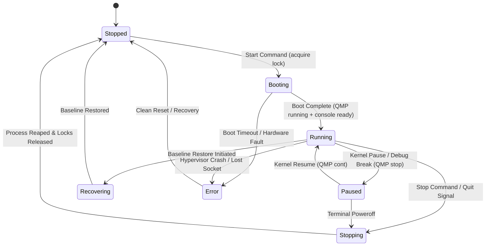

# Phase 0 Research: iOS Root VM and Darwin Security Research Backends

## 1. Baseline Context, Primary Source Pins & Architectural Seams

### Current Host Platform & Toolchain Pins

- **Host Target Platform**: macOS Apple Silicon (`aarch64`, Darwin 25.x / macOS 15+).
- **Toolchain Pin**: `.tool-versions` pins `rust 1.88.0` and `bun 1.2.17`. `Cargo.toml` declares `edition = "2024"`. Rust 1.88.0 is the active repository toolchain pin.
- **Dependency Promotions Available**: `fs4 = "1.1.0"` (feature: `sync`) for cross-process advisory file locking compatible with Rust 1.88; `sha2 = "0.10.9"` for cryptographic artifact verification; `uuid = "1.26.1"` for immutable identifier generation. Transitive or existing dependencies include `tokio 1.53.1`, `nix 0.29.0`, `clap 4.6.7`, `serde 1.0.229`, `serde_json 1.0.151`, `dirs 7.0.0`.
- **Standard Platform Invariant (SC-008, FR-004)**: Zero functional regressions or performance degradation on existing Android AVD and macOS iOS Simulator managers (`src/managers/common.rs`, `src/app/mod.rs`). Exact byte-for-byte preservation across all eight Android 001 specification artifacts (`specs/001-add-android-research-backends/`).

### Upstream Primary Source Pins (Verified Commit Identifiers)

All upstream repository references are verified by commit hash:

- **`darwin-vm`**: Commit `1c1b2c500e2192d29ef84941cd3b517024450526` (`https://github.com/jprx/darwin-vm`).
  - _Engineering Reality_: Minimal Darwin boot harness. Inspection of `run.sh:12-32` demonstrates direct execution of `qemu-system-aarch64 -M darwin -kernel bootkc -dtb dtree -initrd ramdisk -append ...`. It provides no C API, shared library entrypoint, or stable embeddable header interface. It is exclusively an executable CLI wrapper around specialized QEMU fork patches.
- **`Inferno`**: Commit `cc4302a99167abec69b714cfd00c38caece7e7de` (`https://github.com/ChefKissInc/Inferno`).
  - _Engineering Reality_: Complete iOS research emulation platform based on QEMU. Primary inspection of `system/main.c:44-96` confirms that `main()` directly owns the CoreFoundation runloop (`CFRunLoop`), signal handlers, process globals, display windows, and process exit codes. It possesses no clean re-entrant C API or embeddable lifecycle.
- **`qemu-sptm`**: Commit `2867d847d3471560e773120ee50c42dbcbb6d60b` (`https://github.com/ChefKissInc/qemu-sptm`).
  - _Engineering Reality_: Underlying QEMU fork providing Secure Page Table Monitor (SPTM) and Apple Silicon virtualization primitives. Contains QEMU TCG plugin headers (`include/plugins/qemu-plugin.h`) and plugin directories (`plugins/`), while the `Inferno` checkout currently omits these paths.
- **QEMU Monitor & Control Protocols (Source Inspection)**:
  - Capabilities & Control: `monitor/qmp-cmds-control.c:72-134` (`qmp_capabilities`, `query-commands`).
  - Core Lifecycle Commands: `monitor/qmp-cmds.c:44-112` (`quit`, `stop` transitioning runstate to `PAUSED`, `cont` resuming CPU execution).
  - Debugging Stub: `gdbstub/system.c:333-412` (chardev listener, GDB RSP socket binding, accelerator status checks).

### Key Protocol Distinctions & Fallacies Rejected

1. **QMP is NOT JSON-RPC 2.0**: QEMU Machine Protocol (QMP) uses an asynchronous, line-delimited JSON framing format with a mandatory initial greeting banner (`{"QMP": {"version": ...}}`), a mandatory capabilities negotiation handshake (`{"execute": "qmp_capabilities"}`), explicit execution verbs (`{"execute": "<cmd>", "arguments": {...}}`), and asynchronous out-of-band events (`{"event": "...", "data": {...}}`). It does not adhere to the JSON-RPC 2.0 specification (no `"jsonrpc": "2.0"` header, different error object schemas).
2. **CPU Execution Status != OS Readiness**: QMP `query-status` returning `{"running": true}` denotes only that virtual CPU instructions are being decoded by TCG or executed by HVF. It does **not** signify that the iOS kernel has initialized, that the root ramdisk has mounted, or that userland daemons (`launchd`, `SpringBoard`, `installd`) are ready to receive commands.
3. **VM Stop != Guest Shutdown**: Issuing `{"execute": "stop"}` halts virtual CPU instruction execution immediately, freezing guest state in memory (`RunState::PAUSED`). It is **not** an ACPI/poweroff shutdown. Terminal poweroff requires `{"execute": "quit"}` or explicit system shutdown commands.
4. **No Public Control Endpoints**: QMP and GDB endpoints must never bind to public network interfaces (`0.0.0.0`) or unauthenticated TCP sockets. All research control channels are restricted to owner-permissioned Unix Domain Sockets or localhost loopback interfaces guarded by peer credentials and explicit capability leases.

---

## 2. Core Architectural Decisions

### Decision D-01: Virtualization Engine Separation & No QEMU In-Process FFI

- **Decision**: **Do not embed QEMU fork codebases (`darwin-vm`, `Inferno`, `qemu-sptm`) directly into the Emu binary via C/Rust FFI**. Manage hypervisor backends strictly as isolated child processes communicating over native, structured IPC protocols: QMP over local Unix Domain Sockets (UDS) for lifecycle management, and typed GDB Remote Serial Protocol (RSP) over chardev sockets for kernel debugging.
- **Rationale**:
  - _Process Crash Separation_: QEMU forks running experimental guest kernels undergo panics, undefined instruction faults, and memory translation aborts. An in-process crash terminates the entire Emu CLI/TUI session. Out-of-process execution isolates guest crashes to the child process.
  - _Global State Collisions_: Upstream inspection of `Inferno` (`system/main.c:44-96`) proves it claims process-wide signal handlers, `CFRunLoop`, and global mutable variables that directly conflict with Tokio and Ratatui runtime loops.
  - _Upgrade & Toolchain Flexibility_: Backends can be built, patched, or updated independently of Emu's Rust compilation cycle without complex multi-repository CMake/Meson-in-Cargo build dependencies.
  - _FFI Misalignment_: UniFFI is designed for exporting Rust business logic to mobile client foreign languages (Swift, Kotlin), not embedding third-party C hypervisors. Raw `bindgen` against QEMU internals creates an unmaintainable, brittle ABI surface across compiler revisions.
- **Alternatives Considered**:
  - _Direct C/Rust FFI (`bindgen` to QEMU internals)_: Rejected. Unstable internal C ABI, global state collisions, lack of re-entrant lifecycle entrypoints in `Inferno`.
  - _UniFFI Binding Layer_: Rejected. Inverted architectural target; UniFFI targets client foreign interfaces, not embedding large monolithic C executables.
  - _In-Tree Rust TCG Plugin for VM Management_: Rejected. TCG plugins (`qemu-plugin.h`) are architecturally designed for instruction/memory execution tracing, not VM supervisor lifecycle management. `Inferno` currently lacks TCG plugin support in tree.

### Decision D-02: Isolated Frida Dynamic Instrumentation Worker via Official C ABI

- **Decision**: **Integrate Frida exclusively via an isolated private child executable (`emu-frida-worker`), linked statically or dynamically against the official `frida-core` C devkit (pinned candidate: tag 17.18.0)**. The supervisor communicates with `emu-frida-worker` over bounded, typed stdio JSON streams. Direct linkage of `frida-core` into the main Emu supervisor or TUI process is strictly prohibited.
- **Rationale**:
  - _GLib Event Loop Isolation_: `frida-core` relies on GLib (`GMainContext`, `GMainLoop`). Running GLib loops inside an async Tokio/Ratatui binary leads to thread contention, signal handling conflicts, and event loop starvation.
  - _Memory Safety & Callback Retention_: Frida C API callbacks require explicit memory management (`g_error_free`, `g_object_unref`) and persistent context retention. Rust panics must never escape across the C FFI boundary. Isolating the FFI code inside a dedicated worker ensures that memory leaks or FFI panics do not destabilize the Emu harness.
  - _Host Device Injection Guard_: Primary inspection of `frida-core` (tag 17.18.0, `src/frida.vala`) confirms that `DeviceManager.with_socket_backend_only()` restricts discovery to network/socket backends, preventing accidental enumeration or injection into host macOS processes. Remote guest endpoints are bound via `DeviceManager.add_remote_device("127.0.0.1:<port>", options)`.
  - _Version Parity_: Frida 17.18.0 is the active ecosystem release matching the verified Android toolchain pin. (Note: iOS 14 joint compatibility on virtualized Apple Silicon hardware remains an unobserved candidate configuration that must pass empirical validation gates before active capability certification).
- **Alternatives Considered**:
  - _In-Process C FFI in Supervisor/TUI_: Rejected. GLib loop collisions, signal interception, and crash propagation to the user interface.
  - _CLI Scraping (`frida`, `frida-ps`, `frida-trace`)_: Rejected. Fragile CLI output formatting, lack of consistent `--json` schema across all subcommands, and inability to maintain persistent bi-directional RPC channels.
  - _External Python/Node Bindings_: Rejected. Introduces heavy external runtime dependencies, virtual environments, and host interpreter version instability.
  - _Legacy Frida Candidate (e.g. 16.5.9)_: Rejected. 17.18.0 is the current primary release with verified C API devkit availability; pinning arbitrary older versions creates toolchain fragmentation.

### Decision D-03: iOS Application Lifecycle via `ideviceinstaller` (InstallationProxy) & Frida Spawning

- **Decision**: **Manage iOS application lifecycle on `Inferno` via the standard `InstallationProxy` protocol using the companion `libimobiledevice` `ideviceinstaller` tool with a pinned capability manifest, combined with Frida for process execution and container verification**.
- **Execution & Validation Flow**:
  1. _Capability Preflight_: Query backend profile; if application frameworks are absent (as in minimal `darwin-vm`), fail fast with structured diagnostics (`AppFrameworksUnavailable`).
  2. _Package Installation_: Invoke `ideviceinstaller` using modern subcommands (`install <FILE>`, `list`, `uninstall <BUNDLE>`, specifying `-u <UDID>`), parsing XML/JSON output.
  3. _Launch & Execution Gate_: Installing an IPA does **not** prove application boot. The system launches the application via Frida `Device.spawn(bundle_id)` followed by `Device.resume(pid)`.
  4. _Container & Entitlement Verification_: A root file access helper inspects the active sandbox container under `/private/var/mobile/Containers/Data/Application/<UUID>` and verifies container metadata, rejecting shallow `/Applications/` + `uicache` approximations.
- **Rationale**: Standard iOS userland applications rely on `installd`, MobileInstallation, and SpringBoard container mappings. Direct filesystem copying into `/Applications` bypasses sandbox container creation, data protection classes, and entitlement registration. Utilizing `ideviceinstaller` over the standard usbmuxd/companion channel replicates real-device deployment semantics.
- **Alternatives Considered**:
  - _Direct Filesystem Injection (`/Applications` copy + `uicache`)_: Rejected. Incomplete; fails to create valid sandboxed data containers under `/private/var/mobile/Containers/` and fails on modern SpringBoard app registrations.
  - _Proprietary Commercial APIs (Corellium REST API)_: Rejected. Emu is an independent, sovereign research harness; no proprietary commercial accounts or cloud dependencies are permitted.
  - _Universal Code-Signing Bypass Assumption_: Rejected. AMFI policies vary between iOS versions; code-signing and sandbox relaxations must be explicitly declared and tracked in the `GuestSecurityProfile`.

### Decision D-04: Single-Binary Process Supervision, Lifetime & Locking Architecture

- **Decision**: **Retain a single binary architecture. Manage running guests via a hidden, private supervisor mode: `emu __supervise --vm-id <ID>`. Manage offline preparation and recovery via finite worker invocations: `emu __worker --operation-id <ID>`. No persistent background system daemons (launchd/systemd)**.
- **Supervision & Lifetime Invariants**:
  - _Dedicated Supervisor_: One unprivileged supervisor process per running research guest. The supervisor owns the QEMU child process handle, QMP connection, GDB debug lease, guest console PTY, and at most one local companion VM.
  - _Bounded Lifecycle_: The supervisor lifetime terminates strictly when the guest stops, all dependent helper resources are released, and child processes are reaped.
  - _No Dangling PIDs / No Automatic Restart_: If the supervisor process dies unexpectedly, the reconciler discovers unmanaged guest processes, safely halts them via verified process tree inspection, and flags the guest state as `recovering` or `error` without automatic retry.
  - _Locking & Persistence_: Store all metadata, profiles, and state under `dirs::data_local_dir()/emu/research`. Cross-process concurrency is serialized using advisory file locks via `fs4 = "1.1.0"` (feature: `sync`) on dedicated, unlinked `.lock` files. Staged atomic file replacement (`.tmp` write + flush + sync + rename) prevents state corruption.
  - _Short Unix Domain Socket Paths on macOS_: Darwin enforces a strict 104-byte limit on `sockaddr_un.sun_path`. Paths under `$HOME/Library/Application Support/emu/research/...` frequently exceed this limit. Emu resolves this by creating a private `0700` temporary directory with a short path (`/tmp/emu-<short_hash>/`) for Unix Domain Sockets (QMP, console, guest bridge), recording the active socket descriptors in the instance runtime descriptor.
- **Rationale**: Daemons create installation friction, require root/launchd plists, and leave stale state across uninstalls. A single binary with private supervisor modes ensures complete process tree ownership without external dependencies while guaranteeing clean resource teardown.
- **Alternatives Considered**:
  - _Central Host Daemon (`emud` via launchd)_: Rejected. Excessive host modification, permission elevation issues, and lifecycle management overhead for a developer/research CLI tool.
  - _Unsupervised Direct Process Spawning from CLI/TUI_: Rejected. Closing the TUI or terminating a CLI command drops process handles, leaving orphaned QEMU and companion VM instances consuming host RAM and CPU.
  - _`std::fs::File::try_lock`_: Rejected. Requires Rust 1.89+, violating repository toolchain pin `rust 1.88.0`.

### Decision D-05: Kernel Debugging via Bounded GDB RSP Client & Exclusive Debug Lease

- **Decision**: **Implement a typed Rust GDB Remote Serial Protocol (RSP) client communicating over dedicated chardev/loopback sockets connected to QEMU's gdbstub (`gdbstub/system.c`). Enforce an exclusive `KernelDebugLease` concurrency contract**.
- **Debugging & State Invariants**:
  - _Typed Bounded Protocol_: Support discrete GDB RSP packets: `?` (halt reason), `g`/`G` (read/write general registers), `m`/`M` (read/write virtual memory), `Z0`/`z0` (software breakpoint set/clear), `s` (single step), `c` (continue). Register layouts and target descriptions are validated against declared architecture widths (ARM64 64-bit general-purpose registers `x0`-`x30`, `sp`, `pc`, `pstate`). Memory addresses must be validated against kernel physical/virtual layout; arbitrary addresses are never invented.
  - _Exclusive `KernelDebugLease`_: When a debugger session attaches, it acquires an exclusive `KernelDebugLease`. While this lease is held, conflicting QMP operations (such as QMP `cont`, QMP `system_reset`) are strictly blocked.
  - _Truthful Disconnect Handling (SC-006, FR-029)_: If the debugger disconnects while the guest is paused, Emu queries QMP `query-status` to observe the true hardware runstate. The system preserves the paused state, reports the status truthfully as `paused`, and does **not** silently resume the VM. The CLI/TUI surfaces explicit recovery actions (`resume`, `reset`, or `terminate`).
  - _Terminal Poweroff Authority_: Explicit user terminal poweroff is the only lifecycle operation permitted to terminate a guest while a debug lease is held, preceded by a state consistency check.
- **Rationale**: Scraped interactive GDB/LLDB CLI wrappers are unstable and non-deterministic. A typed, bounded RSP client provides sub-millisecond execution control, programmatic state inspection, and reliable test automation.
- **Alternatives Considered**:
  - _Spawning Interactive LLDB/GDB Child in a PTY_: Rejected. Prone to terminal escape sequence pollution, timing jitter, and parsing breakage across debugger releases.
  - _Non-Exclusive Debugging (Permitting Concurrent QMP `cont`)_: Rejected. Introduces severe state races, register corruption, and hypervisor deadlocks.

### Decision D-06: Trust Boundaries, Containment & Non-Malicious-Guest Security Model

- **Decision**: **Formulate explicit security trust boundaries: Emu is designed for authorized security research on owned lab guests and test applications. QEMU TCG is explicitly NOT a security boundary against malicious, hostile guests attempting hypervisor escape. Operating privileges remain strictly unprivileged on the host**.
- **Security Invariants & Mitigations**:
  - _Host Privilege Boundary_: Emu runs entirely within an ordinary, unprivileged user account. Emu **never** modifies host System Integrity Protection (SIP), Sealed System Volume (SSV), NVRAM variables, or host boot arguments.
  - _Guest Root Privilege Containment (SC-007, FR-025)_: In-guest root privileges (UID 0) grant zero host authority. No host drives, shared folders (9p/virtfs), or host user credentials are exposed to the guest. Runtime in-guest modifications execute entirely within the guest storage layer without host-side disk mounts.
  - _TCG Hypervisor Escape Reality_: Upstream QEMU documentation (`https://www.qemu.org/docs/master/system/gdb.html`) explicitly establishes that QEMU TCG does not treat guest-to-host isolation as a hardened cryptographic boundary. Emu establishes containment validation fixtures to verify that guest execution does not modify host files, but explicitly disclaims false claims of hypervisor escape immunity.
  - _Sensitive Data Warnings_: Exported experiment profiles automatically strip host environmental secrets, private SSH keys, and user credentials (FR-041). Guest container data and logs are exported only upon explicit researcher authorization.
- **Alternatives Considered**:
  - _Claiming Hardened Sandbox / Exploit Immunity_: Rejected. Fraudulent engineering claim; hypervisors (especially TCG JIT engines) possess attack surfaces that cannot guarantee containment of malicious exploit payloads.
  - _Requiring Host SIP Disabling for Host-Side Patching_: Rejected. Host security compromise; all disk preparation operations must operate strictly on guest image loopback/vnode attachments.

### Decision D-07: Image Preparation, Verified Volume Identity & Disposable Cleanup

- **Decision**: **Implement host-side image preparation and patching strictly through verified unique volume identifiers and device nodes, with multi-stage cleanup of disposable resources at safe boundaries**.
- **Preparation Invariants (SC-010, FR-033, FR-034, FR-036)**:
  - _Unique Volume Verification_: When attaching or mounting a guest disk image on macOS (`hdiutil attach -nomount`), the system inspects `diskutil info -plist` to determine the exact device node (`/dev/diskNsM`) and Volume UUID. Hardcoded path assumptions (such as `/Volumes/System`) are strictly prohibited.
  - _Host Isolation_: Mount operations target only private, dedicated workspace mount points (`dirs::data_local_dir()/emu/research/mnt/<op_id>`).
  - _Administrative Authorization Gate (FR-035)_: If host image preparation requires temporary elevated privileges (e.g. `sudo hdiutil` or custom mount options), Emu requests explicitly scoped authorization identifying the exact target image and operation. In unattended CLI execution without pre-authorized credentials, the command aborts immediately with exit code `2` (MissingAuthorization).
  - _Safe Disposable Cleanup (FR-036)_: If preparation fails mid-operation, a deterministic cleanup stack unmounts attached filesystems, detaches disk images, and purges temporary scratch files up to verified safe boundaries, emitting structured reports of any committed or residual artifacts.
- **Alternatives Considered**:
  - _Hardcoded Mount Assumptions (`/Volumes/OS`, `/Volumes/System`)_: Rejected. Extremely hazardous; collisions with existing host volumes or external drives can lead to host filesystem corruption.
  - _Silent Sudo Prompts in Automated Scripts_: Rejected. Causes unattended CI/CD pipelines to hang indefinitely on terminal stdin prompts.

### Decision D-08: Local Companion VM Orchestration for Restore Workflows

- **Decision**: **Accommodate `Inferno` restore and USB-over-IP setup utilities through an isolated, local companion virtual machine on the macOS host, bound strictly to the active restore workflow or live guest session dependencies**.
- **Companion Invariants (SC-011, FR-037, FR-038)**:
  - _Local Virtualization_: Companion Linux VM executes locally on the Apple Silicon Mac using lightweight hypervisor virtualization with pre-declared memory and CPU limits.
  - _Access-Controlled Same-Host Channels_: Companion communication is restricted to localhost network forwarders or Unix Domain Sockets with zero external network exposure.
  - _Dependency-Bound Lifetime_: The companion VM remains running as long as an active restore workflow is executing or a live `Inferno` guest session depends on companion forwarders. It terminates cleanly **only** when all dependent workflows and guest sessions have concluded.
  - _Observer Disconnect & Caller Timeout_: A caller CLI/TUI wait timeout or observation disconnect does **not** terminate the companion VM or cancel background restore progress.
- **Alternatives Considered**:
  - _Requiring External Physical Linux Machine_: Rejected. Violates project requirements; complicates developer environments and eliminates self-contained testing on macOS Apple Silicon.
  - _Aggressive Companion Teardown on Restore Completion_: Rejected. Breaks live `Inferno` sessions that rely on ongoing companion USB/network forwarding.

---

## 3. Structural FFI vs. IPC Assessment

| Hypervisor / Research Component         | Interface Under Evaluation                           | Structural Assessment & Decision | Core Rationale & Failure Mode Analysis                                                                                                                                                                                                                                                                                                     |
| :-------------------------------------- | :--------------------------------------------------- | :------------------------------- | :----------------------------------------------------------------------------------------------------------------------------------------------------------------------------------------------------------------------------------------------------------------------------------------------------------------------------------------- |
| **QEMU Forks (`darwin-vm`, `Inferno`)** | In-Process C FFI (`bindgen` / UniFFI)                | **REJECTED**                     | • No stable embeddable C API (`run.sh` CLI wrapper in `darwin-vm`).<br>• Global state, signal handlers, and `CFRunLoop` claimed in `Inferno` `system/main.c:44-96`.<br>• Guest kernel panic/segfault crashes entire Emu harness.<br>• GPL-2.0 licensing implications require strict process isolation for distribution.                    |
| **QEMU Monitor Control**                | QMP over Unix Domain Socket (UDS)                    | **ACCEPTED**                     | • Asynchronous, typed JSON protocol supported natively by QEMU (`qmp-cmds-control.c`).<br>• Clean process crash boundary.<br>• Sub-millisecond command latency on local Unix domain sockets.<br>• Provides fine-grained lifecycle, pause, and runstate query capabilities.                                                                 |
| **Kernel Debugger**                     | GDB RSP over Loopback Socket / Chardev               | **ACCEPTED**                     | • Standard Remote Serial Protocol natively supported by QEMU gdbstub (`gdbstub/system.c`).<br>• Direct hardware register inspection, memory reads/writes, single-stepping, and breakpoints.<br>• Managed under an exclusive `KernelDebugLease` preventing QMP state collisions.                                                            |
| **QEMU TCG Plugin**                     | Rust TCG Plugin (`qemu-plugin.h`)                    | **REJECTED (Current Phase)**     | • TCG plugins are designed for execution and memory access tracing, not VM management.<br>• `Inferno` currently lacks TCG plugin support in its active checkout.<br>• No missing contract requirement currently justifies TCG plugin complexity.                                                                                           |
| **Frida Instrumentation Core**          | In-Process FFI into Supervisor / TUI                 | **REJECTED**                     | • GLib event loop (`GMainLoop`) conflicts with Tokio/Ratatui async loops.<br>• Memory management hazards with C callback retention and GLib allocations.<br>• Risk of accidental host process injection from unconstrained local device discovery.                                                                                         |
| **Frida Dynamic Worker**                | Out-of-Process Worker (`emu-frida-worker`) via C ABI | **ACCEPTED**                     | • Links official `frida-core` 17.18.0 C devkit in an isolated private executable.<br>• Uses `DeviceManager.with_socket_backend_only()` to prevent host enumeration.<br>• Communicates with Emu supervisor over bounded, typed stdio JSON records.<br>• GLib context completely isolated; worker crashes or memory leaks do not affect Emu. |
| **Application Installation**            | `ideviceinstaller` CLI Subcommands over IPC          | **ACCEPTED**                     | • Implements Apple's standard `InstallationProxy` over usbmuxd.<br>• Verifies container creation, Data partition paths, and mobile installation registrations.<br>• Pinned capability manifest rejects legacy `-i`/`-l` flags in favor of modern grammar.                                                                                  |

---

## 4. Complete Protocol Action & Capability Mapping (All 48 FRs)

The following matrix maps every Functional Requirement (FR-001 through FR-048) defined in the feature specification to its concrete architectural layer, IPC protocol mechanism, specific command or action, and verified invariant.

| FR Identifier | Category & Requirement Summary                   | Architectural Layer & Component | IPC Protocol / Mechanism          | Concrete Protocol Action / Command                                | Verified Invariant & Falsification Condition                                              |
| :------------ | :----------------------------------------------- | :------------------------------ | :-------------------------------- | :---------------------------------------------------------------- | :---------------------------------------------------------------------------------------- |
| **FR-001**    | macOS Apple Silicon (`aarch64`) Host Platform    | Preflight / System              | Host Kernel / `sysctl`            | Query `sysctl hw.optional.arm64` and `uname -m`                   | Host must be Apple Silicon (`aarch64`); x86_64 or non-Darwin rejected.                    |
| **FR-002**    | Non-Interactive Preflight Diagnostics            | CLI / Preflight Engine          | Non-interactive execution         | `emu preflight --json` (checks HVF, CPU, permissions)             | Outputs structured JSON to stdout; zero GUI or interactive prompts invoked.               |
| **FR-003**    | Architectural Separation of Backends             | Instance Registry / Dispatch    | Internal Rust Domain Types        | Explicit `BackendType::DarwinVm` vs `BackendType::Inferno`        | Separate configuration types, disk layouts, and supervisor instances.                     |
| **FR-004**    | Standard Platform & Android 001 Parity           | Core Managers & Specs           | In-Memory Dispatch / Filesystem   | Preservation of `AndroidManager`, `IosManager`; 8 spec files      | Exact byte-for-byte hash match on 8 Android 001 specs; zero regression on legacy AVD.     |
| **FR-005**    | Immutable Globally Unique Identifier             | Data Model / Registry           | UUIDv4 Generation                 | Generate `uuid::Uuid::new_v4()` on instance creation              | Internal ID immutable; independent of user-assigned display names.                        |
| **FR-006**    | Standard Guest Lifecycle Operations              | Supervisor / Coordinator        | QMP over UDS + OS Process         | `create`, `inspect`, `start`, `stop`, `restart`, `delete`         | Operations transition state machine deterministically; no orphaned PIDs.                  |
| **FR-007**    | Disambiguation of Identical Display Names        | CLI Parser / Registry           | Domain Query Resolver             | Disambiguate by `<backend>:<id>` or reject ambiguous query        | Shared display names across backends never trigger accidental cross-mutations.            |
| **FR-008**    | Explicit Destructive Operation Confirmation      | CLI / TUI Command Gate          | Interactive Prompt / `--confirm`  | Require `--confirm-destructive` specifying target ID & paths      | Destructive ops abort if unconfirmed; routine start/stop/restart proceed without prompts. |
| **FR-009**    | Prevent Cross-Backend Raw Image Reuse            | Storage / Profile Engine        | Artifact Header & Metadata Check  | Validate `target_backend` tag in image metadata                   | Attempting to boot an `Inferno` image on `darwin-vm` fails preflight validation.          |
| **FR-010**    | Verify Effective Root (UID 0) in Guest           | Guest Verification Engine       | Guest Bootstrap Console / SSH     | Execute privileged fixture check; verify UID 0                    | Correlates guest build identity, image hash, and runtime boot session ID.                 |
| **FR-011**    | Interactive Root Console via Bootstrap           | Console Manager                 | Unix PTY / Virtio Console         | Connect to guest root console stream over Virtio chardev          | No reliance on external commercial jailbreak tools or closed exploits.                    |
| **FR-012**    | Root Verification via Harmless Privileged Action | Guest Verification Engine       | Guest Shell Execution             | Write and read isolated fixture (`/private/var/root/.emu_probe`)  | Denied to unprivileged user (UID 501 `mobile`); confirmed permitted to UID 0.             |
| **FR-013**    | Capture Kernel & Test Binary Evidence            | Telemetry Collector             | Guest Shell Execution             | Execute `uname -a`, query boot args, run benign test binary       | Evidence hashed and bound to `RootProofEvidence` record.                                  |
| **FR-014**    | Distinct Desired vs Observed Privilege State     | Data Model / Status Reporter    | Status Serialization              | Separate fields: `desired_privilege` vs `observed_privilege`      | Stale, missing, or negative-control-pass evidence marks status `unverified`.              |
| **FR-015**    | Invalidate Root Verification on Reboot/Change    | Supervisor State Monitor        | Lifecycle Event Observer          | Invalidate `RootProofEvidence` on reboot, crash, or image swap    | Runtime writes to guest test fixtures preserve verification; reboot invalidates.          |
| **FR-016**    | iOS Application Lifecycle Management             | App Manager (`Inferno`)         | `ideviceinstaller` over usbmuxd   | `install <FILE>`, `list`, `uninstall <BUNDLE>` via `-u <UDID>`    | Validates container creation under `/private/var/mobile/Containers/Data/Application/`.    |
| **FR-017**    | Complete Frida Runtime Lifecycle                 | Instrumentation Manager         | Stdio JSON to `emu-frida-worker`  | `prepare`, `install`, `start`, `inspect`, `stop`, `remove`        | Session bound to guest instance, boot session ID, agent version, and hash.                |
| **FR-018**    | Frida Script Attachment & Spawn                  | `emu-frida-worker`              | Frida C API over guest socket     | `Device.spawn()`, `Device.attach()`, `Session.create_script()`    | Instrumentation marked ready ONLY after confirmed hook telemetry received.                |
| **FR-019**    | Invalidate Frida Readiness on Reboot/Exit        | `emu-frida-worker` / Supervisor | Event Channel                     | Detach notification; invalidate session on process exit           | Target process termination or VM reboot transitions session to `terminated`/`invalid`.    |
| **FR-020**    | Native C/ARM64 & Objective-C Hooking             | `emu-frida-worker`              | Frida Interceptor & ObjC APIs     | Inject script hooking C export and `ObjC.classes.X["- y"]`        | Both native and Objective-C hook invocations captured with timestamps and args.           |
| **FR-021**    | Instrumentation Target Process Specificity       | `emu-frida-worker`              | Frida Interceptor Scope           | Attach strictly to target PID; monitor control PID                | Hooks fire exclusively in target PID; uninstrumented control process untouched.           |
| **FR-022**    | Validate Application ABI & Security Profile      | App Manager / Preflight         | Binary Header / Mach-O Parser     | Check Mach-O CPU type (`ARM64`), codesign against profile         | Incompatible ABI or unpermitted signature fails preflight before guest launch.            |
| **FR-023**    | Report Unavailable App Frameworks Truthfully     | Backend Capability Evaluator    | Capability Query                  | Return structured error `AppFrameworksUnavailable`                | Query on minimal `darwin-vm` refuses app install without silent failure.                  |
| **FR-024**    | Authorized Scoped App Container File Access      | Guest File Manager              | In-Guest Helper / AFC             | Read/export authorized paths in sandboxed app container           | Scoped strictly to target app container; requires explicit researcher authorization.      |
| **FR-025**    | Authorized In-Guest Root Filesystem Access       | Guest File Manager              | In-Guest Agent / Bootstrap Shell  | Read/write authorized paths via guest bootstrap channel           | Executes entirely inside guest; zero host-side disk mounting during live execution.       |
| **FR-026**    | Process Enumeration & Mach Service Query         | System Inspector (`Inferno`)    | In-Guest Shell / Frida Worker     | Enumerate `launchctl list`, query Mach services                   | Allows attaching Frida probes to compatible guest system daemons on `Inferno`.            |
| **FR-027**    | Kernel Debugging Operations                      | Kernel Debugger Engine          | GDB RSP Client over Chardev       | `?`, `g`, `G`, `m`, `M`, `Z0`, `z0`, `s`, `c`                     | Register inspection, memory read/write, breakpoints, single-stepping supported.           |
| **FR-028**    | Distinguish Paused Debugger from Failure         | Kernel Debugger / Supervisor    | QMP `query-status` + GDB state    | Map `RunState::PAUSED` with active lease to `Paused`              | Paused debug state never reported as VM crash or boot failure.                            |
| **FR-029**    | Truthful Debugger Disconnect State Handling      | Kernel Debugger / Supervisor    | QMP `query-status` inspection     | Query runstate on disconnect; report paused/running/unknown       | Preserves paused state on disconnect; never silently resumes execution.                   |
| **FR-030**    | `GuestSecurityProfile` Management                | Security Policy Manager         | Guest Patch Engine / Profile      | Apply/revert AMFI, code-signing, and sandbox policy profiles      | Security policy relaxations reported independently of UID 0 root status.                  |
| **FR-031**    | Cryptographic Image Hash & Build Identity        | Image Registry Engine           | `sha2::Sha256` / Plist Parser     | Compute SHA-256 and parse `BuildIdentities` on import             | Tampered or truncated images detected and rejected prior to hypervisor launch.            |
| **FR-032**    | Reject Corrupt Images; Experimental Opt-In       | Image Registry Engine           | Header / Format Validation        | Verify APFS/HFS+ headers; check `--allow-experimental`            | Experimental configurations require explicit opt-in and verified baseline.                |
| **FR-033**    | Verify Unique Device Node & Volume Identity      | Host Image Preparation Engine   | `diskutil info -plist`            | Inspect exact `/dev/diskNsM` and Volume UUID                      | Prohibits hardcoded path trust (`/Volumes/System`); binds only verified device node.      |
| **FR-034**    | Preserve Host SSV and SIP Untouched              | Host Image Preparation Engine   | Boundary Enforcement              | Mount exclusively to private workspace mountpoints                | Host system volumes, Sealed System Volume, and SIP remain 100% untouched.                 |
| **FR-035**    | Explicit Administrative Authorization Gate       | Host Image Preparation Engine   | Privilege Gate / Sudo Prompt      | Check interactive terminal or pre-authorized sudo credential      | Unattended runs lacking authorization fail fast with `MissingAuthorization` (exit 2).     |
| **FR-036**    | Multi-Stage Disposable Resource Cleanup          | Image Preparation / Worker      | Clean-up Stack (`Drop` / `defer`) | Unmount mounted disks, detach loopbacks, purge scratch files      | Safe boundary cleanup on failure; logs committed artifacts or unmount leaks.              |
| **FR-037**    | Isolated Local Companion VM Orchestration        | Companion Manager (`Inferno`)   | Local Hypervisor Process          | Launch local Linux companion VM on macOS host                     | Operates restore/USB utilities without external physical Linux hardware.                  |
| **FR-038**    | Companion Lifecycle Bound to Dependents          | Companion Manager               | Dependent Tracking Graph          | Retain companion while active restore or live guest depends       | Terminate companion ONLY when zero active workflows AND zero dependent guests.            |
| **FR-039**    | Isolate Research Channels to Same-Host           | Network & IPC Layer             | Socket Configuration              | Bind Unix Domain Sockets (`0700`) or loopback `127.0.0.1`         | Zero external network exposure; unauthenticated public listening endpoints denied.        |
| **FR-040**    | Versioned Portable Research Profiles             | Profile Manager                 | JSON Serialization / Manifest     | Export/import `ResearchExperimentProfile` with SHA-256s           | Revalidates local artifact checksums before instantiating or mutating guest.              |
| **FR-041**    | Automatic Secret Stripping on Profile Export     | Profile Manager                 | Sanitization Filter               | Exclude host environment variables, SSH keys, credentials         | Guest container data and logs exported only upon explicit user authorization.             |
| **FR-042**    | Immutable Experiment Record Generation           | Experiment Tracker              | Append-Only Log / Storage         | Write `ExperimentRecord` capturing inputs, evidence, hashes       | Immutable trial snapshot permanently retained; protected against mutation.                |
| **FR-043**    | Restore to Verified RecoveryBaseline             | State Recovery Engine           | Disk Image Restoration            | Restore base image and kernel config within declared deadline     | Missing baseline safely refuses recovery; requires explicit confirmation for wipe.        |
| **FR-044**    | Non-Interactive Machine-Parseable CLI            | CLI Interface                   | Clap Subcommands + JSON stdout    | Non-interactive subcommands output JSON to stdout, logs to stderr | Full feature parity across all research operations without launching TUI.                 |
| **FR-045**    | Distinct Outcome Exit Codes                      | CLI Interface                   | Process Exit Codes                | Exit `0` (success), `1` (failure), `2` (auth), `3` (timeout)      | Read-only queries of unavailable capabilities return exit code 0 with status JSON.        |
| **FR-046**    | Cancellation Truth & Safe Cessation              | Operation Supervisor            | Cooperative Cancellation Token    | Set `cancellation_pending`; confirm only at safe boundary         | Caller timeout or observer disconnect does NOT cancel continuing guest task.              |
| **FR-047**    | Single Execution & Idempotent Profiles           | Operation Reconciler            | Operation ID + Lockfile           | Apply desired profile idempotently; no duplicate retry            | Applying identical desired profile is a no-op; failed mutations never auto-retry.         |
| **FR-048**    | CLI/TUI Functional Parity & Responsiveness       | TUI / Async Core                | Tokio Async Tasks / Ratatui Loop  | Non-blocking TUI message passing                                  | TUI navigation latency <= 100ms; cancellation acknowledgement <= 200ms.                   |

---

## 5. Guest Artifact Preparation, Root Policy & Isolated Frida Worker Contract

### Baseline Research Candidate Definitions

1. **`Inferno` Primary Candidate (Candidate I-1)**:
   - _Target Hardware Identity_: Apple iPhone 11 (`iPhone12,1`, platform `d421ap`, A13 Bionic).
   - _Guest OS Version_: iOS 14.0 beta 5 (Build `18A5351d`).
   - _Required User-Supplied Artifacts_: Legally obtained IPSW restore bundle, APticket/SHSH blob, matching kernelcache, and device tree.
   - _Verification Mandate_: Build identity, component hashes, and APticket compatibility must be verified at runtime from user-supplied files; no proprietary blobs are distributed by Emu.
2. **`darwin-vm` Primary Candidate (Candidate D-1)**:
   - _Target Hardware Identity_: Minimal headless Darwin virtual machine (`-M darwin`).
   - _Guest OS Version_: iOS-derived / Darwin minimal kernel matching the current `get_files` manifest revision.
   - _Required User-Supplied Artifacts_: Extracted Mach kernelcache, device tree (`dtree`), trust cache (`tc`), and root ramdisk image.
   - _Scope_: Headless root shell, benign CLI binaries, and low-level kernel debugging; application frameworks are explicitly reported as unavailable.

### Root Preparation & Verification Protocol

- **Guest Bootstrap & Console Access**:
  - The guest image is prepared with a pre-configured root bootstrap shell attached to the primary serial/virtio console (`/dev/console`).
  - Access requires no commercial jailbreak exploit chains; root privilege is built into the controlled virtual stack.
- **Empirical Privilege Verification (SC-001, FR-010, FR-012, FR-013)**:
  1. _Positive Control_: Execute a benign privileged test command on a dedicated guest test fixture:
     ```sh
     /bin/sh -c 'id -u && echo "emu_root_verified" > /private/var/root/.emu_probe && cat /private/var/root/.emu_probe'
     ```
     Verify that `id -u` returns `0` and the write succeeds.
  2. _Negative Control (Falsification Gate)_: Execute the identical operation as an unprivileged user (UID 501 `mobile`):
     ```sh
     su - mobile -c 'echo "fail" > /private/var/root/.emu_probe'
     ```
     Verify that the operation is verifiably denied (`Permission denied`, exit code != 0).
  3. _Evidence Capture_: Capture guest kernel version (`uname -v`), boot arguments (`sysctl kern.bootargs`), and the cryptographic digest of a supplied benign CLI test binary.
  4. _Session Binding_: Package results into `RootProofEvidence`, binding evidence to the active boot session ID, kernel build identity, and configuration revision hash.
  5. _Invalidation Boundary (FR-015)_: Any guest reboot, hypervisor crash, base image swap, or security policy alteration immediately invalidates the active root proof. Normal in-guest filesystem writes by running workloads preserve active verification.

### Isolated Frida Worker Architecture (`emu-frida-worker`)

- **Binary Separation**: Implemented as a standalone, private Rust binary (`emu-frida-worker`) built against the official `frida-core` C devkit header (`frida-core.h`).
- **Devkit Version Pin**: Pinned to **Frida 17.18.0** (`https://github.com/frida/frida/releases/tag/17.18.0`).
- **GLib Context Management**:
  - Worker initializes a private GLib context: `GMainContext *context = g_main_context_new();`.
  - Runs a dedicated worker thread with `GMainLoop *loop = g_main_loop_new(context, FALSE);`.
  - Supervisor Tokio loop interacts with the worker strictly via stdin/stdout line-delimited JSON.
- **Device Connection & Host Isolation**:
  - Worker instantiates device manager: `FridaDeviceManager *dm = frida_device_manager_new_with_socket_backend_only();`.
  - Binds to the approved guest bridge:
    ```c
    FridaRemoteDeviceOptions *opts = frida_remote_device_options_new();
    frida_device_manager_add_remote_device_sync(dm, "127.0.0.1:27042", opts, cancellable, &error);
    ```
  - Local device enumeration is blocked by `with_socket_backend_only()`, guaranteeing zero interaction with host macOS processes.
- **Worker Protocol Schema (JSON over stdio)**:
  - _Request (Supervisor -> Worker)_:
    ```json
    {"op_id": "op-101", "action": "spawn", "bundle_id": "com.example.researchapp"}
    {"op_id": "op-102", "action": "inject", "target_pid": 412, "script_source": "..."}
    {"op_id": "op-103", "action": "detach", "session_id": "sess-501"}
    ```
  - _Response / Telemetry (Worker -> Supervisor)_:
    ```json
    {"op_id": "op-101", "status": "ok", "result": {"pid": 412}}
    {"op_id": "op-102", "event": "hook_payload", "data": {"type": "native", "symbol": "open", "arg0": "/etc/hosts"}}
    {"op_id": "op-102", "status": "ok", "result": {"session_id": "sess-501", "hooks_active": 2}}
    ```
- **Memory & Error Safety**:
  - All GLib error pointers (`GError *error`) are checked and freed using `g_error_free()`.
  - Frida handles (`FridaSession`, `FridaScript`, `FridaDevice`) are unreferenced using `g_object_unref()`.
  - Rust FFI wrappers enforce `std::panic::catch_unwind` at every extern "C" boundary, ensuring panics never cross the C ABI.

---

## 6. State Machine, Process Supervision, Lifetime & Persistence Model

### Guest Instance Lifecycle State Machine

A `ResearchGuestInstance` transitions through the following deterministic states:



### Supervisor & Worker Concurrency Model

- **Supervisor Mode (`emu __supervise --vm-id <ID>`)**:
  - Spawns and supervises the underlying QEMU child process.
  - Owns QMP Unix Domain Socket, GDB RSP chardev socket, and guest console PTY.
  - Monitors child process exit codes and QMP asynchronous events (`SHUTDOWN`, `RESET`, `STOP`).
  - Holds an exclusive advisory file lock (`<vm_id>.run.lock`) via `fs4` throughout execution.
  - Terminates immediately when QEMU exits and all child helper processes are reaped.
- **Worker Mode (`emu __worker --operation-id <ID>`)**:
  - Executes finite, long-running mutating operations (image preparation, offline patching, baseline recovery).
  - Acquires exclusive operation lock (`<op_id>.op.lock`) and target device lock (`<vm_id>.device.lock`).
  - Writes operation progress and state transitions atomically to disk.
  - Releases all locks and exits cleanly upon task completion or failure.
- **Reconciliation & Crash Invariants**:
  - _No PID-Only Kill_: The supervisor never issues `SIGKILL` based solely on raw PID queries; it verifies the process identity and executable path to avoid PID-recycling hazards.
  - _No Stale Lock Deletion_: Lock files are never unlinked from the filesystem. Process ownership is determined solely by `fs4` file locking semantics.
  - _No Automatic Mutation Retries_: A crashed or timed-out operation is marked `failed` or `unknown`. The reconciler never performs automatic retries on failed mutating operations (FR-047).

### Persistence & Short Socket Path Architecture

- **Persistent Data Root**:
  - Base Directory: `dirs::data_local_dir()/emu/research` (e.g. `$HOME/Library/Application Support/emu/research`).
  - Subdirectories:
    - `instances/`: Instance registration descriptors (`<id>.json`).
    - `profiles/`: Versioned research experiment profiles (`<profile_id>.json`).
    - `records/`: Immutable experiment records (`<record_id>.json`).
    - `baselines/`: Reference recovery baselines (`<baseline_id>.json`).
    - `locks/`: Dedicated, unlinked lockfiles (`*.lock`).
- **Atomic File Serialization**:
  - State files are serialized using staged atomic writes: write to `<filename>.tmp` -> `flush()` -> `sync_all()` -> `std::fs::rename()`.
- **Short Unix Domain Socket Resolution on macOS**:
  - _Problem_: Darwin sets `sizeof(sockaddr_un.sun_path)` to 104 bytes. Standard user data paths frequently reach 110–130 bytes, causing `bind()` to fail with `EINVAL` or `ENAMETOOLONG`.
  - _Solution_: On session creation, Emu creates an owner-restricted (`0700`) temporary directory with a short path:
    ```text
    /tmp/emu-<short_uuid>/
    ├── qmp.sock
    ├── gdb.sock
    └── console.sock
    ```
  - The supervisor stores the canonical paths in the instance's active runtime state and cleans up the temporary directory on shutdown.

---

## 7. Licensing, Supply Chain & Legal Review (Engineering Analysis)

> **Disclaimer**: The following analysis constitutes an objective software engineering assessment of license mechanics and operational supply chain boundaries. It does not constitute formal legal counsel.

### QEMU & Fork Licensing (GPL-2.0 / LGPL-2.1)

- **Upstream Licenses**: QEMU is licensed primarily under the GNU General Public License version 2 (GPL-2.0), with certain library components licensed under the GNU Lesser General Public License (LGPL-2.1).
- **Separation via Process Boundary**: Emu does not statically or dynamically link QEMU fork object code into the main Emu binary. Communication occurs strictly across operating system boundaries using standard IPC protocols (Unix Domain Sockets, pipes, TCP loopback).
- **Distribution Reality**: The architectural use of IPC creates clean modular separation. However, engineering analysis notes that bundling pre-compiled GPL binaries within an installer or container package triggers source-code offer requirements under GPL-2.0 Section 3. For source-only repository distribution, Emu maintains zero GPL contamination; users compile or supply their own QEMU backend binaries. Comprehensive legal review is mandated before distributing any pre-compiled binaries containing QEMU fork code.

### Frida Core Devkit Licensing (wxWindows / LGPL / Frida License)

- **License Model**: `frida-core` is licensed under the wxWindows Library Licence (an LGPL-style license with an exception permitting binary linking without requiring source disclosure of the linking application).
- **Compliance Architecture**: By confining Frida C ABI devkit linkage strictly to the isolated `emu-frida-worker` executable, the main Emu codebase remains completely decoupled from Frida library symbols and licensing constraints.

### `libimobiledevice` & `ideviceinstaller` (LGPL-2.1 / GPL-2.0)

- **Separation Architecture**: Interacted with exclusively as an external command-line tool via standard stdio process piping. No direct C library linkage is performed.

### Proprietary Apple Firmware & IPSW Copyright Boundaries

- **Zero Proprietary Bundling**: Emu **never** hosts, downloads, caches, or distributes proprietary Apple firmware files, IPSW restore images, kernelcaches, RAM disks, or APtickets.
- **User-Supplied Asset Model**: The researcher is solely responsible for obtaining necessary IPSW files and restore credentials legally through their authorized Apple Developer or device owner accounts. Emu's role is strictly limited to computing SHA-256 hashes, parsing configuration plists, and executing format verification on user-provided files.

---

## 8. Empirical Validation Gates, Methodological Boundary & 19 SC Alignment

### Host Preflight & Lifecycle Validation Gates

- **Gate G-01 (Host Virtualization Entitlements)**: Validate macOS Apple Silicon (`aarch64`) architecture via `sysctl hw.optional.arm64`. Confirm `Hypervisor.framework` availability via `sysctl kern.hv_support`. Report acceleration status truthfully without launching graphical interfaces.
- **Gate G-02 (Backend Isolation & Non-Regression)**: Validate that `darwin-vm` and `Inferno` instance configurations remain strictly segregated. Verify zero regressions across 20 consecutive legacy Android AVD / iOS Simulator lifecycle trials and confirm byte-for-byte preservation of all 8 Android 001 specification files (SC-008).
- **Gate G-03 (Instance Identity Disambiguation)**: Verify that two instances with identical display names ("ios-sec-lab") registered under different backends are assigned distinct UUIDv4 identities and are disambiguated in all CLI/TUI invocations (SC-017).
- **Gate G-04 (Destructive Operation Authorization)**: Verify that destructive mutations (disk wipe, instance deletion, baseline rollback) require explicit confirmation identifying the affected instance ID and file paths, aborting immediately if authorization is absent (FR-008).
- **Gate G-05 (Artifact Integrity & Build Verification)**: Verify that corrupted, truncated, or incompatible firmware images are detected and rejected prior to hypervisor launch (SC-009). Experimental configurations require explicit `--allow-experimental` flags and an available verified baseline.
- **Gate G-06 (Mounted Device Identity Verification)**: Verify that host-side disk preparation workflows verify the exact device node (`/dev/diskNsM`) and Volume UUID via `diskutil info -plist`, with zero reliance on hardcoded paths (`/Volumes/System`) and zero modification to host SSV or SIP (SC-010).
- **Gate G-07 (Companion VM Lifecycle Binding)**: Verify that the local companion VM terminates cleanly within declared deadlines only when zero active restore tasks and zero dependent guest sessions remain (SC-011).
- **Gate G-08 (Caller Timeout vs Task Cancellation)**: Verify that when a caller wait deadline elapses, the CLI/TUI reports the actual continuing state without falsely declaring the background task stopped (SC-016). Verify that cooperative cancellation acknowledges within 200ms and confirms cessation only at a verified safe boundary (SC-015, FR-046).

### Toolchain Empirical Validation Gates

- **Gate T-01 (iOS Root Proof Verification)**: Boot an iOS-derived guest on `darwin-vm` and `Inferno`. Verify UID 0 root execution against an isolated fixture denied to unprivileged callers, confirm negative control denial, and record kernel observations (SC-001).
- **Gate T-02 (Negative Control Falsification)**: Simulate an unexpected unprivileged write success or missing fixture evidence; verify that the system immediately transitions privilege status to `unverified` and emits diagnostic warnings (FR-014).
- **Gate T-03 (Root Invalidation on Reboot)**: Reboot a verified root guest; verify that observed privilege status transitions immediately to `unverified` until re-proven, while normal in-guest filesystem writes preserve verification (FR-015).
- **Gate T-04 (Host Containment Invariance)**: Verify that 100% of guest root operations, in-guest writes, and instrumentation sessions result in zero unauthorized host file modifications or privilege elevation in declared containment fixtures (SC-007).
- **Gate T-05 (Application Lifecycle & Hook Capture)**: On `Inferno`, install a sample iOS application, deploy Frida, attach to the target PID, capture both native C/ARM64 and Objective-C hooks, verify an uninstrumented control process remains untouched, and detach cleanly (SC-002).
- **Gate T-06 (Minimal Backend App Framework Refusal)**: Request application installation or Frida spawning on minimal `darwin-vm`; verify that the system reports application frameworks unavailable and refuses deployment with structured errors (SC-003).
- **Gate T-07 (Kernel Debugger State Integrity)**: On reference kernel debug configurations for both backends, execute pause, register inspection, memory inspection, breakpoint triggering, single-stepping, test state edit, and state restoration (SC-004).
- **Gate T-08 (Debugger Disconnect Truthfulness)**: Disconnect the GDB client while the guest is paused; verify that the system preserves the paused runstate, reports status truthfully as `paused`, and presents explicit recovery prompts without silent resumption (SC-006).

### 16 Critical Negative / Falsification Test Cases

Every case defined in the specification Reference Acceptance Set must be evaluated within the 4-guest cohort (SC-019):

1. _Missing Prerequisites_: Unaccelerated host reports limits; read-only capability query returns exit code 0 with structured unavailable status.
2. _Name Collision_: Ambiguous instance names across backends are rejected with an explicit disambiguation requirement.
3. _Corrupted Artifact_: Truncated or corrupted image files are rejected before hypervisor execution.
4. _Experimental Image Guard_: Unverified experimental images without baseline or missing `--allow-experimental` are rejected.
5. _Authorization Denial_: Unattended elevation without credentials exits with code 2; unauthorized local client access to private UDS sockets is denied.
6. _Root Verification Falsification_: Incomplete root proof or unexpected unprivileged negative control success marks privilege state `unverified`.
7. _Stale Proof Invalidation_: Guest reboot or kernel configuration modification invalidates active root proof and Frida readiness.
8. _Unsafe Mount Detection_: Detection of unexpected host volume paths aborts preparation and cleans up disposable attachments.
9. _Helper Failure Handling_: Companion VM failure during restore reports structured error and preserves live dependent guests.
10. _Cross-Backend State Rejection_: Attempting to import raw disk snapshots from `Inferno` into `darwin-vm` is strictly rejected.
11. _App Framework Rejection_: Incompatible ABI, invalid signature, or missing userland frameworks reject app installation.
12. _Frida Script Error_: Script syntax errors or target process crash transitions session to `failed`, reporting observed target status truthfully.
13. _Debugger Disconnect_: Disconnecting GDB while paused preserves paused runstate without silent resumption.
14. _Concurrent Mutation Conflict_: Simultaneous mutating commands against the same instance are rejected with a concurrency conflict error.
15. _Bounded Timeout vs Cancel_: Timeout reports actual in-progress state; cancellation-pending confirms cessation only at safe boundary; observer disconnect leaves guest running.
16. _Idempotent Re-Application_: Applying an identical desired profile is a no-op returning exit code 0; failed imperative commands return non-zero without auto-retries.

### Methodological Boundary

Joint research baseline compatibility (iOS root + Frida 17.18.0 + GDB kernel debugging) on virtualized Apple Silicon hardware represents an **unobserved candidate configuration** subject to empirical proof in controlled lab environments. Automated CI relies on deterministic mock executors (`MockCommandExecutor`) and isolated unit tests, ensuring that real hypervisor, firmware, and kernel execution is strictly gated behind physical host capability checks.

---

## 9. Control-Channel Validation Oracle (Generic QMP Probe Results)

### Objective & Experimental Scope

To empirically validate the QEMU Machine Protocol (QMP) wire framing, capabilities negotiation handshake, command/query dispatch, error handling, and shutdown lifecycle prior to backend implementation, an isolated, firmware-free control-channel experiment was executed on the host workstation.

> **Scope Limitation**: This experiment verifies the generic QEMU QMP control protocol using the host's existing `/opt/homebrew/bin/qemu-system-aarch64` binary with `-machine none`. It establishes protocol correctness for the supervisor control channel; it does **not** constitute proof of custom fork (`Inferno`, `darwin-vm`, `qemu-sptm`) runtime behavior or iOS guest execution.

### Experimental Command Execution

The generic hypervisor was launched in a headless, non-executing mode with no virtual disks, firmware, or network adapters:

```sh
/opt/homebrew/bin/qemu-system-aarch64 -machine none -nodefaults -display none -S -qmp stdio
```

### Observed Protocol Trace & Output Evidence

1. **Initial QMP Greeting Banner**:
   Upon process launch, QEMU emitted the mandatory greeting banner indicating version and capabilities:

   ```json
   {
     "QMP": {
       "version": {
         "qemu": { "micro": 1, "minor": 1, "major": 11 },
         "package": ""
       },
       "capabilities": ["oob"]
     }
   }
   ```

2. **Capabilities Negotiation (`qmp_capabilities`)**:
   - _Sent_: `{"execute": "qmp_capabilities"}`
   - _Received_: `{"return": {}}`
   - _Verification_: Successfully transitioned QMP session from initialization mode to command execution mode.

3. **Hypervisor Version Query (`query-version`)**:
   - _Sent_: `{"execute": "query-version"}`
   - _Received_:
     ```json
     {
       "return": {
         "package": "",
         "qemu": { "major": 11, "micro": 1, "minor": 1 }
       }
     }
     ```

4. **Execution Runstate Query (`query-status`)**:
   - _Sent_: `{"execute": "query-status"}`
   - _Received_:
     ```json
     { "return": { "running": false, "status": "prelaunch" } }
     ```
   - _Verification_: Confirms virtual CPU execution is halted in `prelaunch` mode (`-S` flag).

5. **Harmless State Modification (`stop`)**:
   - _Sent_: `{"execute": "stop"}`
   - _Received_: `{"return": {}}`
   - _Verification_: Confirms `stop` command is accepted and preserves prelaunch state without unmapped memory faults.

6. **Structured Error Handling on Unknown Command**:
   - _Sent_: `{"execute": "nonexistent_command"}`
   - _Received_:
     ```json
     {
       "error": {
         "class": "CommandNotFound",
         "desc": "The command nonexistent_command has not been found"
       }
     }
     ```
   - _Verification_: Confirms QMP returns typed, structured JSON error responses rather than terminating the connection.

7. **Clean Session Termination (`quit`)**:
   - _Sent_: `{"execute": "quit"}`
   - _Received_:
     ```json
     {"timestamp": {"seconds": 1789646373, "microseconds": 894541}, "event": "SHUTDOWN", "data": {"guest": false, "reason": "host-qmp-quit"}}
     {"return": {}}
     ```
   - _Process Termination_: Process exited cleanly with exit code `0`. All temporary resources and pipes were reaped with zero resource leaks.

### Empirical Conclusions for Supervisor Design

- QMP wire protocol behaves deterministically over line-delimited JSON streams.
- The supervisor must buffer incoming bytes, parse complete newline-terminated JSON objects, await the greeting banner, and complete `qmp_capabilities` negotiation before dispatching lifecycle commands.
- Asynchronous events (such as `SHUTDOWN`) can arrive concurrently with command returns and must be processed by an asynchronous event reader loop.
