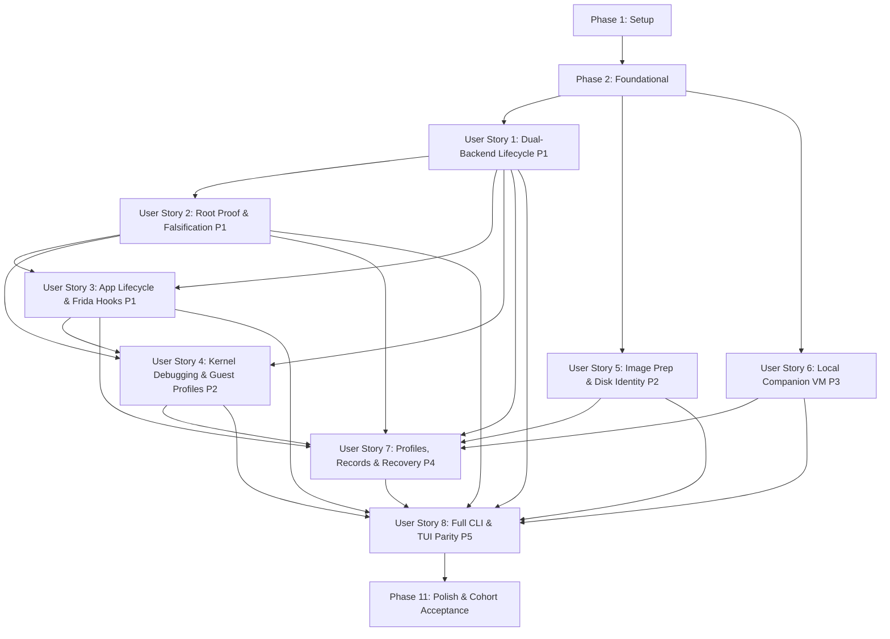

# Tasks: iOS Root VM and Darwin Security Research Backends

**Input**: Design documents from `/Users/datnguyen/Projects/emu/specs/002-ios-root-vm/`
**Prerequisites**: plan.md (required), spec.md (required for user stories), research.md, data-model.md, contracts/
**Tests**: Feature specification explicitly mandates comprehensive test coverage: per-story Independent Test sections, a frozen 4-guest reference evaluation cohort (2 `darwin-vm`, 2 `Inferno`), the 16 critical negative/falsification test cases (SC-019), and strict separation between hermetic mock-driven CI and an opt-in authorized physical lab validation harness (`examples/ios_research_lab.rs`).
**Organization**: Tasks are grouped by user story to enable independent implementation, testing, and delivery of each story.

## Format: `[ID] [P?] [Story] Description`

- **[P]**: Can run in parallel (different files, no dependencies)
- **[Story]**: Which user story this task belongs to (e.g., US1, US2, US3)
- Include exact file paths in descriptions

## Path Conventions

- **Single project**: `src/`, `tests/` at repository root
- Paths shown below follow the repository layout from `plan.md`

---

## Canonical Source-Drift Normalizations & Contract Alignments

The following architectural normalizations and task-generation contract decisions govern task definitions and implementation sequencing:

1. **Administrative Refusal Exit Code Normalization (FR-035, contracts/cli.md §2)**:
   - **Canonical Authority**: `contracts/cli.md` §2 Process Exit Code Contract.
   - **Canonical Semantics**: Host-side image preparation requiring elevated privileges executed in unattended automation mode without pre-authorized credentials returns **Exit Code 4** (`outcome: "auth_refused"`, `error.code: "AUTH_REQUIRED"`).
   - **Source Drift Reconciliation**: Earlier draft references in `contracts/cli.md` §5.7 (`image prepare`), `quickstart.md` §7.2, and `data-model.md` §4 (FR-035 table row) loosely cited exit code 2. During Foundation (Phase 2, Task T007), these references are unified under Exit Code 4. Exit Code 2 is preserved strictly for invalid syntax, missing parameters, or incompatible Mach-O architectures (`outcome: "invalid_input"`).
2. **Segregation of Simulation Controls (quickstart.md §3.2, §7.2)**:
   - CLI flags `--simulate-permissive-guest` and `--simulate-missing-sudo` referenced in `quickstart.md` are strictly test-fixture / mock-harness simulation controls.
   - They are **excluded** from the public production CLI grammar and will not be added as production options in `src/cli/`. Negative falsification cases in automated CI are driven by deterministic `MockCommandExecutor` branches and lab test fixtures.
3. **Cross-Process Advisory Locking Semantics (plan.md §Storage, research.md §Stack Foundation)**:
   - Cross-process file locking uses `fs4::FileExt` advisory locks on dedicated lock files under `dirs::data_local_dir()/emu/research/locks/`.
   - Dedicated advisory lock files are never unlinked while held and are **never deleted to break stale locks** (adhering strictly to the research engine's no-stale-lock-deletion invariant). Lock contention deterministically returns Exit Code 5 (`conflict`).
4. **Out-of-Scope Module Exclusion (`cuttlefish`)**:
   - `plan.md` mentions `CuttlefishManager` and `src/managers/cuttlefish/` under Principle I. This represents unmerged future context from feature 001 (Android research backends) and is strictly **OUT OF SCOPE** for feature 002. Tasks touch only `darwin_vm` and `inferno` in `src/managers/`.
5. **Toolchain and Pinned Dependencies (plan.md §Technical Context)**:
   - Toolchain is pinned to Rust 2024 edition (`rustc 1.88.0`).
   - Planned dependency additions in `Cargo.toml` are limited to promoting `sha2 = "0.10.9"` and `uuid = { version = "1.26.1", features = ["v4"] }` to direct dependencies, and adding `fs4 = { version = "1.1.0", default-features = false, features = ["sync"] }`.
6. **Isolated Frida Worker Build and Linkage Strategy (research.md §D-02, plan.md §Testing)**:
   - `emu-frida-worker` (`src/bin/emu-frida-worker.rs`) implements an isolated native executable communicating with the supervisor over typed stdio JSON streams.
   - Primary evidence from official documentation (https://frida.re/docs/c-api/) and official releng scripts (https://github.com/frida/releng/blob/main/devkit.py) confirms that the official `frida-core` devkit generates `libfrida-core.a` static archives (via `libtool -static` on Apple/Unix platforms), not dynamic libraries.
   - To preserve hermetic root CI compilation (`cargo test --bins --tests --features test-utils`) without requiring host Frida devkit SDKs, the native helper is built from a separate standalone helper package in `native/frida-worker/Cargo.toml` (with standalone `[workspace]`, isolated from root test workspace) and `native/frida-worker/build.rs`, compiling `src/bin/emu-frida-worker.rs` via explicit command `cargo build --manifest-path native/frida-worker/Cargo.toml --release` with an approved absolute `FRIDA_CORE_DEVKIT` path.
   - Root `Cargo.toml` sets `autobins = false`, explicitly retaining current `emu` (`src/main.rs`) and `debug-avd` (`src/bin/debug_avd.rs`), so root Cargo tests never select the native helper manifest.
   - If the helper binary is absent at runtime, the root supervisor reports honest unavailable status (`FRIDA_DEVKIT_UNAVAILABLE`) rather than a fake fallback or no-op mock.
   - The package split is BUILD isolation only (still a single public `emu` binary plus plan's private helper), not a new backend or daemon.
7. **OutputEnvelope and Wire Schema Consistency (contracts/research.schema.json, contracts/cli.md §3)**:
   - `OutputEnvelope.status` enum contains: `["success", "already_satisfied", "accepted", "failed", "rejected", "timed_out", "cancelled"]`.
   - `OutputEnvelope.outcome` enum contains: `["completed", "already_satisfied", "proposal_created", "auth_refused", "invalid_input", "unsupported", "conflict", "timeout", "cancelled", "execution_failed"]`.
   - Notice: There is **NO `cancellation_pending` in `OutputEnvelope.outcome` or `status`**.
   - Nonterminal `cancellation_pending` state is explicitly preserved within the operation journal / progress `data` object payload.
   - At wait deadline expiry: returns `status: "timed_out"`, `outcome: "timeout"`, Exit Code 124.
   - At confirmed cessation: returns `status: "cancelled"`, `outcome: "cancelled"`, Exit Code 130.
   - `OperationStatus` enum is terminal-only (`["completed", "failed", "cancelled", "timed_out"]`) for records, while active operation journal tracking uses detailed progress phases.
8. **CommandExecutor ProcessHandle Extension (src/utils/command_executor.rs, src/utils/command.rs)**:
   - The existing `CommandExecutor` trait (which has `run`, `spawn`, `run_with_retry`, `run_ignoring_errors`) is extended with an owned `ProcessHandle` contract (child process handle, stream pipes, lifecycle termination).
   - Concrete implementation is implemented on `CommandRunner` in `src/utils/command.rs`, and the nested `MockCommandExecutor` in `src/utils/command_executor.rs` is updated concurrently.
   - Preserves existing `run` and bare-PID `spawn` methods for legacy Android and iOS Simulator callers with zero functional or performance regression.
   - Strictly avoids automatic retries for research mutations (FR-047).

---

## Phase 1: Setup (Shared Infrastructure)

**Purpose**: Project initialization, dependency pins, and shared command/persistence infrastructure

- [x] T001 Configure Cargo workspace dependencies by adding `fs4 = { version = "1.1.0", default-features = false, features = ["sync"] }` for cross-process advisory file locking, promoting existing locked transitive crates `sha2 = "0.10.9"` and `uuid = { version = "1.26.1", features = ["v4"] }` to direct dependencies, preserving the existing root binaries via `autobins = false` and leaving standalone `native/frida-worker` dependency and static Frida devkit build configuration to T064; Files: `Cargo.toml`, `Cargo.lock`; Depends: none; Refs: plan.md §Technical Context, research.md §Stack Foundation, §D-02; Constraints: pinned to Rust 2024 edition (rustc 1.88.0), zero compiler warnings under strict clippy, hermetic CI compilation without host Frida devkit
- [x] T002 [P] Implement centralized immutable constants in `src/constants/research.rs` declaring research subcommands, exit codes (`0`, `1`, `2`, `3`, `4`, `5`, `124`, `130`), default timeouts (8ms polling, <150ms startup, 50ms details, 10ms log streaming, 100ms UI ack, 200ms cancel ack, 180s baseline restore), storage paths, and error codes; Files: `src/constants/research.rs`; Depends: none; Refs: plan.md §Principle III, contracts/cli.md §2; Constraints: zero magic constants, strict inline format strings format!("{var}")
- [x] T003 [P] Implement transactional filesystem persistence paths and staged atomic write pipeline (.tmp write + File::sync_all + rename) in `src/persistence/paths.rs` and `src/persistence/atomic.rs`; Files: `src/persistence/paths.rs`, `src/persistence/atomic.rs`; Depends: none; Refs: plan.md §Storage, data-model.md §6; Constraints: storage rooted at dirs::data_local_dir()/emu/research, short UDS runtime_dir under /tmp/emu-<short_uuid>/ with 0700 permissions
- [x] T004 Implement cross-process advisory locking engine via fs4::FileExt on dedicated lock files in `src/persistence/lock.rs`; Files: `src/persistence/lock.rs`; Depends: T001, T003; Refs: plan.md §Storage, data-model.md §6.1, §6.2; Constraints: dedicated lockfiles (*.lock) are never unlinked while held and never deleted to break stale locks, lock contention returns exit code 5 (conflict)
- [x] T005 Extend CommandExecutor trait in `src/utils/command_executor.rs` with owned ProcessHandle contract (child process handle, stream pipes, lifecycle termination) alongside existing run and bare-PID spawn methods; implement the ProcessHandle spawning contract on concrete CommandRunner in `src/utils/command.rs` and update the nested MockCommandExecutor in `src/utils/command_executor.rs`, migrating in-scope process consumers while strictly avoiding automatic retries on research mutations (FR-047); inspect references with LSP before modifying exported symbols; Files: `src/utils/command_executor.rs`, `src/utils/command.rs`; Depends: none; Refs: plan.md §Principle I, §Technical Context, FR-047; Constraints: preserves existing run and spawn methods for legacy Android and iOS Simulator callers with zero regression
- [x] T006 Register Setup persistence and constants modules in `src/constants/mod.rs`, `src/persistence/mod.rs`, and export in `src/lib.rs`; Files: `src/constants/mod.rs`, `src/persistence/mod.rs`, `src/lib.rs`; Depends: T002, T003, T004, T005; Refs: plan.md §Structure; Constraints: single serialized integration owner for Setup exports

---

## Phase 2: Foundational (Blocking Prerequisites)

**Purpose**: Core infrastructure, shared data shapes, process supervision, operation tracking, and lab trial harness that MUST be complete before ANY user story can be implemented

**CRITICAL**: No user story work can begin until this phase is complete

- [x] T007 Reconcile source-drift specifications in `specs/002-ios-root-vm/contracts/cli.md` (§5.7), `specs/002-ios-root-vm/quickstart.md` (§3.2, §7.2), and `specs/002-ios-root-vm/data-model.md` (§4 FR-035) to align with canonical Exit Code 4 (`auth_refused`, `AUTH_REQUIRED`) for unauthorized elevated host preparation in unattended automation mode, and align quickstart walkthroughs to deterministic mock/lab harness fixtures rather than public CLI flags; Files: `specs/002-ios-root-vm/contracts/cli.md`, `specs/002-ios-root-vm/quickstart.md`, `specs/002-ios-root-vm/data-model.md`; Depends: none; Refs: contracts/cli.md §2, FR-035, quickstart.md §3.2, §7.2; Constraints: preserves canonical global exit code taxonomy
- [x] T008 [P] Implement standard JSON OutputEnvelope (stdout) and JSONL StreamLogEnvelope (stderr) formatters in `src/cli/envelope.rs` supporting status variants ["success", "already_satisfied", "accepted", "failed", "rejected", "timed_out", "cancelled"], outcome variants ["completed", "already_satisfied", "proposal_created", "auth_refused", "invalid_input", "unsupported", "conflict", "timeout", "cancelled", "execution_failed"], and phase variants ["preflight", "staging", "booting", "verifying", "settled", "recovering", "stopping", "cleanup", "teardown", "paused", "executing"]; Files: `src/cli/envelope.rs`; Depends: T002; Refs: contracts/cli.md §3, contracts/research.schema.json, FR-044; Constraints: exactly one JSON OutputEnvelope on stdout when --json passed, JSONL diagnostics on stderr, zero non-schema outcomes serialized
- [x] T009 [P] Implement domain error types and ErrorRecord classification in `src/models/error.rs` covering all 16 standardized error codes (`AUTH_REQUIRED`, `INVALID_INPUT`, `UNSUPPORTED_HOST`, `APP_FRAMEWORKS_UNAVAILABLE`, `AMBIGUOUS_INSTANCE_NAME`, `ARTIFACT_CORRUPTED`, `EXPERIMENTAL_OPT_IN_REQUIRED`, `MISSING_BASELINE`, `CONCURRENCY_CONFLICT`, `DEPENDENT_GUEST_ACTIVE`, `TIMEOUT`, `CANCELLED`, `PROBE_VERIFICATION_FAILED`, `DEBUG_LEASE_CONFLICT`, `UNSAFE_MOUNT_DETECTED`, `RUNTIME_EXECUTION_ERROR`) and exit code mapping (0, 1, 2, 3, 4, 5, 124, 130); Files: `src/models/error.rs`; Depends: T002, T007; Refs: contracts/cli.md §2, FR-045; Constraints: deterministic exit code mapping, canonical exit code 4 (auth_refused) for missing administrative authorization in unattended automation
- [x] T010 [P] Implement complete shared identifier newtypes (ResearchGuestId, BootSessionId, ArtifactId, EvidenceId, ApplicationId, InstrumentationSessionId, RecoveryBaselineId, ProposalId, LeaseId, RecordId, Sha256Digest), domain enums (BackendType, InstanceLifecycleState, CpuArchitecture, PrivilegeState, RootVerificationState, FridaAttachmentState, DebugLeaseState, SupportStatus, ImageArtifactType, ArtifactTrustStatus, AppDeploymentStatus, CodeSigningMode, AmfiStatus, SandboxMode, MountMode, KernelPrivilegeLevel, MutationType, OperationStatus), and auxiliary value objects (ProbeOutcome, HookStatus, DebugTelemetryRecord, ImageOriginMetadata, BinaryPrerequisite, EntitlementPrerequisite) in `src/models/research/types.rs`; Files: `src/models/research/types.rs`; Depends: T002; Refs: data-model.md §2, contracts/research.schema.json; Constraints: complete common type definitions unblocking embedded model references without forward cycles
- [x] T011 [P] Implement OperationRecord domain model and persistence repository in `src/models/research/operation.rs` and `src/persistence/operations.rs` tracking operation_id (`^op_[0-9A-Za-z]+$`), lifecycle state transitions (Created -> Preflight -> Staged -> Executing -> Verifying -> Completed/Failed/CancellationPending -> Cancelled/TimedOut), target_instance_id, op_type, phase, created_at, updated_at, and errors, explicitly preserving nonterminal cancellation-pending in progress payload while OperationStatus enum remains terminal-only (completed, failed, cancelled, timed_out), and streaming progress events to `operations/<operation_id>.events.jsonl`; Files: `src/models/research/operation.rs`, `src/persistence/operations.rs`; Depends: T003, T004, T010; Refs: data-model.md §3.2, §6.2, FR-046, SC-015, SC-016; Constraints: cancellation acknowledged <= 200ms with cancellation_pending, cessation confirmed only at safe boundary, wait deadline elapsed returns exit 124 without killing background task
- [x] T012 [P] Implement MutationProposal domain data model and Two-Step Safety Gate persistence in `src/models/research/proposal.rs` and `src/persistence/proposals.rs` with verbatim field constraints: Field Name: `proposal_id` | Type: `ProposalId` (UUIDv4) | Optionality: **Required** | Description: Unique proposal tracking ID.; Field Name: `proposal_digest` | Type: `Sha256Digest` (String) | Optionality: **Required** | Description: Cryptographic hash of proposed action: `sha256:<hex>`.; Field Name: `operation_type` | Type: `MutationType` (Enum) | Optionality: **Required** | Description: `disk_wipe`, `instance_delete`, `baseline_restore`, `security_policy_relax`.; Field Name: `target_instance_id` | Type: `ResearchGuestId` (UUIDv4) | Optionality: **Required** | Description: Target guest instance ID.; Field Name: `backend` | Type: `BackendType` (Enum) | Optionality: **Required** | Description: Target backend.; Field Name: `affected_paths` | Type: `Vec<PathBuf>` | Optionality: **Required** | Description: Concrete filesystem paths to be deleted or overwritten.; Field Name: `destructive` | Type: `bool` | Optionality: **Required** | Description: Always `true` for `MutationProposal`.; Field Name: `expires_at` | Type: `DateTime<Utc>` | Optionality: **Required** | Description: Proposal expiration timestamp (default: 15 minutes).; Field Name: `parameters` | Type: `Map<String, Value>` | Optionality: **Required** | Description: Serialized arguments of the proposed operation. and verbatim entity invariants: **FR-008**: Destructive operations invoked without `--authorize sha256:<digest>` return exit code 4 (`auth_refused`) along with the generated `MutationProposal`.; Files: `src/models/research/proposal.rs`, `src/persistence/proposals.rs`; Depends: T001, T003, T010; Refs: FR-008, data-model.md §2.13, §5.1, §5.2; Constraints: proposal_digest computed as sha256: + SHA-256(CanonicalJSON(MutationProposal)), stored under proposals/<proposal_digest>.json with 15-minute expiration, unconfirmed invocation returns exit code 4 (auth_refused)
- [x] T013 [P] Implement ResearchImageArtifact domain data model and catalogue repository in `src/models/research/artifact.rs` and `src/persistence/artifacts.rs` with verbatim field constraints: Field Name: `artifact_id` | Type: `ArtifactId` (String) | Optionality: **Required** | Description: Content hash-derived identifier: `art_sha256_<prefix>`.; Field Name: `artifact_type` | Type: `ImageArtifactType` (Enum) | Optionality: **Required** | Description: `kernelcache`, `ramdisk`, `devicetree`, `trustcache`, `root_disk`, `ipsw_restore_bundle`.; Field Name: `file_path` | Type: `PathBuf` | Optionality: **Required** | Description: Absolute path to artifact on host.; Field Name: `sha256_digest` | Type: `Sha256Digest` (String) | Optionality: **Required** | Description: Cryptographic SHA-256 digest: `sha256:<hex>`. Computed prior to registration (FR-031).; Field Name: `origin_metadata` | Type: `ImageOriginMetadata` (Struct) | Optionality: **Required** | Description: Source provenance: `source_type` (`user_supplied`, `prepared_recovery`), `build_identity`, `source_url_or_ref`.; Field Name: `target_backend` | Type: `BackendType` (Enum) | Optionality: **Required** | Description: Target backend: `darwin-vm` or `Inferno`. Prevents cross-backend raw image boot (FR-009).; Field Name: `build_version_identity` | Type: `String` | Optionality: **Required** | Description: Guest build identity parsed from plist/build manifest (e.g. `"18A5351d"`).; Field Name: `verified_device_node` | Type: `Option<String>` | Optionality: Optional | Description: Isolated device node (e.g. `"/dev/disk4s1"`) when attached for preparation (FR-033).; Field Name: `verified_volume_uuid` | Type: `Option<String>` | Optionality: Optional | Description: Unique volume UUID verified via `diskutil info -plist` (FR-033). Hardcoded paths rejected.; Field Name: `trust_status` | Type: `ArtifactTrustStatus` (Enum) | Optionality: **Required** | Description: `verified_trusted`, `experimental_opt_in`, `digest_mismatch_corrupt`, `unverified_untrusted` (FR-032).; Field Name: `created_at` | Type: `DateTime<Utc>` | Optionality: **Required** | Description: Registration timestamp. and verbatim entity invariants: **FR-009**: An artifact with `target_backend = inferno` MUST NOT be used to initialize a `darwin-vm` instance and vice versa.; **FR-032 / SC-009**: Corrupt or truncated images are marked `digest_mismatch_corrupt` and rejected prior to hypervisor initialization. Experimental artifacts require explicit `--allow-experimental` and an existing `RecoveryBaseline`.; **FR-033 / SC-010**: Host-side image preparation verifies `verified_device_node` and `verified_volume_uuid`. Hardcoded mount paths (e.g. `/Volumes/System`) are strictly prohibited.; Files: `src/models/research/artifact.rs`, `src/persistence/artifacts.rs`; Depends: T001, T002, T003, T010; Refs: FR-009, FR-031, FR-032, FR-033, SC-009, SC-010, Gate G-05, G-06, data-model.md §2.4; Constraints: cross-backend raw image boot strictly prohibited, experimental artifacts require opt-in and verified baseline
- [x] T014 [P] Implement GuestSecurityProfile domain data model and repository in `src/models/research/security_profile.rs` and `src/persistence/security_profiles.rs` with verbatim field constraints: Field Name: `profile_id` | Type: `String` | Optionality: **Required** | Description: Unique security profile ID (e.g. `"secprof_amfi_relaxed"`).; Field Name: `name` | Type: `String` | Optionality: **Required** | Description: Human-readable name.; Field Name: `code_signing_mode` | Type: `CodeSigningMode` (Enum) | Optionality: **Required** | Description: `enforced`, `adhoc_permitted`, `disabled`.; Field Name: `amfi_status` | Type: `AmfiStatus` (Enum) | Optionality: **Required** | Description: `enforced`, `developer_mode`, `amfi_get_out_of_my_way` (boot-arg `amfi=0xff`).; Field Name: `sandbox_mode` | Type: `SandboxMode` (Enum) | Optionality: **Required** | Description: `enforced`, `audit_only`, `relaxed`.; Field Name: `root_filesystem_mount` | Type: `MountMode` (Enum) | Optionality: **Required** | Description: `read_only` (stock default) or `read_write` (research mode) (FR-025).; Field Name: `kernel_privilege_level` | Type: `KernelPrivilegeLevel` (Enum) | Optionality: **Required** | Description: `stock`, `root_console_enabled`, `kernel_debug_enabled`.; Field Name: `guest_relaxations` | Type: `Vec<String>` | Optionality: **Required** | Description: List of specific policy relaxations applied inside guest (FR-030).; Field Name: `created_at` | Type: `DateTime<Utc>` | Optionality: **Required** | Description: Creation timestamp.; Field Name: `updated_at` | Type: `DateTime<Utc>` | Optionality: **Required** | Description: Last update timestamp. and verbatim entity invariants: **FR-030**: Security profile relaxations are reported independently of UID 0 root privilege status. Having UID 0 root access does not imply sandbox is disabled.; Files: `src/models/research/security_profile.rs`, `src/persistence/security_profiles.rs`; Depends: T002, T003, T010; Refs: FR-030, data-model.md §2.8; Constraints: security profile relaxations reported independently of UID 0 root privilege status
- [x] T015 [P] Implement RecoveryBaseline domain data model and baseline repository in `src/models/research/baseline.rs` and `src/persistence/baselines.rs` with verbatim field constraints: Field Name: `baseline_id` | Type: `RecoveryBaselineId` (String) | Optionality: **Required** | Description: Baseline identifier: `base_<guest_id>_<prefix>`.; Field Name: `guest_id` | Type: `ResearchGuestId` (UUIDv4) | Optionality: **Required** | Description: Target guest instance ID.; Field Name: `backend` | Type: `BackendType` (Enum) | Optionality: **Required** | Description: Target backend.; Field Name: `base_disk_digest` | Type: `Sha256Digest` | Optionality: **Required** | Description: SHA-256 digest of clean baseline disk image.; Field Name: `kernel_config_hash` | Type: `Sha256Digest` | Optionality: **Required** | Description: Hash of verified stock kernel boot configuration.; Field Name: `clean_snapshot_path` | Type: `PathBuf` | Optionality: **Required** | Description: Path to verified clean copy-on-write base disk.; Field Name: `declared_recovery_deadline_ms` | Type: `u64` | Optionality: **Required** | Description: Predeclared recovery SLA in milliseconds (e.g. `15000`).; Field Name: `verified` | Type: `bool` | Optionality: **Required** | Description: `true` only after successful boot verification (FR-043).; Field Name: `verified_at` | Type: `Option<DateTime<Utc>>` | Optionality: Optional | Description: Timestamp when boot verification succeeded.; Field Name: `created_at` | Type: `DateTime<Utc>` | Optionality: **Required** | Description: Creation timestamp. and verbatim entity invariants: **FR-043 / SC-012**: If `verified == false` or baseline files are missing/corrupted, rollback is safely rejected with an error; automatic instance deletion is prohibited. Overwriting persistent guest state requires explicit authorization.; Files: `src/models/research/baseline.rs`, `src/persistence/baselines.rs`; Depends: T001, T002, T003, T010; Refs: FR-043, SC-012, data-model.md §2.12; Constraints: declared_recovery_deadline_ms predeclared before measurement, missing baseline safely rejects recovery
- [x] T016 [P] Implement RootProofEvidence domain data model in `src/models/research/proof.rs`, reusing the complete shared ProbeOutcome value object from `src/models/research/types.rs` (T010), with verbatim field constraints: Field Name: `evidence_id` | Type: `EvidenceId` (UUIDv4) | Optionality: **Required** | Description: Unique identifier for the verification execution.; Field Name: `guest_id` | Type: `ResearchGuestId` (UUIDv4) | Optionality: **Required** | Description: Target guest instance identifier (FR-010).; Field Name: `boot_session_id` | Type: `BootSessionId` (UUIDv4) | Optionality: **Required** | Description: Active boot session ID to which this evidence is bound (FR-010).; Field Name: `backend` | Type: `BackendType` (Enum) | Optionality: **Required** | Description: Backend: `darwin-vm` or `Inferno`.; Field Name: `guest_build_identity` | Type: `String` | Optionality: **Required** | Description: Verified guest build identity (e.g. `"18A5351d"`).; Field Name: `image_artifact_digest` | Type: `Sha256Digest` | Optionality: **Required** | Description: SHA-256 digest of input disk/firmware artifact.; Field Name: `config_revision_hash` | Type: `Sha256Digest` | Optionality: **Required** | Description: Cryptographic hash of kernel boot arguments and security configuration (FR-010).; Field Name: `verified_uid` | Type: `u32` | Optionality: **Required** | Description: Observed effective user ID: must be `0` for root (FR-010).; Field Name: `positive_probe_outcome` | Type: `ProbeOutcome` (Struct) | Optionality: **Required** | Description: Positive test: writing `/private/var/root/.emu_probe` succeeds, content verified (FR-012).; Field Name: `negative_control_outcome` | Type: `ProbeOutcome` (Struct) | Optionality: **Required** | Description: Negative control: executing write as UID 501 (`mobile`) verifiably denied (`Permission denied`) (FR-012).; Field Name: `observed_kernel_version` | Type: `String` | Optionality: **Required** | Description: Output of `uname -v` captured in guest (FR-013).; Field Name: `observed_boot_args` | Type: `String` | Optionality: **Required** | Description: Boot arguments queried via `sysctl kern.bootargs` (FR-013).; Field Name: `benign_binary_digest` | Type: `Sha256Digest` | Optionality: **Required** | Description: SHA-256 digest of the supplied benign CLI test binary executed during verification (FR-013).; Field Name: `verification_state` | Type: `RootVerificationState` (Enum) | Optionality: **Required** | Description: `verified` (both positive and negative pass), `unverified` (probe failure, negative pass, or missing).; Field Name: `verified_at` | Type: `DateTime<Utc>` | Optionality: **Required** | Description: Timestamp when empirical proof was evaluated.; Field Name: `diagnostics` | Type: `Vec<String>` | Optionality: **Required** | Description: Structured log messages or warning diagnostics. and verbatim entity invariants: **FR-012 / Gate T-01**: Both positive probe (UID 0 success) AND negative control (UID 501 denial) MUST succeed for `verification_state` to be `verified`.; **FR-014 / Gate T-02**: If the unprivileged negative control action unexpectedly succeeds, `verification_state` MUST immediately be set to `unverified`.; **FR-015 / Gate T-03**: Rebooting the guest or modifying kernel boot arguments invalidates active evidence; `verification_state` transitions to `unverified`. and state transitions: Root Verification State Machine transitions: Unverified -> Verifying (emu research root verify) -> Verified (positive UID 0 pass AND negative control denial pass) / Unverified (positive fail OR negative control pass OR stale evidence) -> Invalidated (guest reboot / kernel bootarg modification / crash) -> Verifying (fresh re-verification run); Verified -> Verified (normal in-guest workload file writes preserve verified status throughout active boot session, FR-015); Files: `src/models/research/proof.rs`; Depends: T001, T002, T010; Refs: FR-010, FR-012, FR-013, FR-014, FR-015, Gate T-01, T-02, T-03, data-model.md §2.5, §3.3; Constraints: verified_uid strictly enforced as enum [0], distinct desired vs observed privilege, declared in Foundation to unblock embedded record references
- [x] T017 [P] Implement ResearchExperimentProfile domain data model and profile repository in `src/models/research/profile.rs` and `src/persistence/profiles.rs` with verbatim field constraints: Field Name: `profile_id` | Type: `String` | Optionality: **Required** | Description: Unique profile identifier: `prof_<uuid>`.; Field Name: `name` | Type: `String` | Optionality: **Required** | Description: Human-readable name.; Field Name: `target_backend` | Type: `BackendType` (Enum) | Optionality: **Required** | Description: Target backend: `darwin-vm` or `Inferno`.; Field Name: `base_image_digest` | Type: `Sha256Digest` | Optionality: **Required** | Description: SHA-256 digest of verified base image artifact.; Field Name: `kernel_boot_args` | Type: `String` | Optionality: **Required** | Description: Kernel boot arguments (e.g. `"debug=0x144 amfi=0xff -v"`).; Field Name: `applied_patches` | Type: `Vec<String>` | Optionality: **Required** | Description: List of applied patch identifiers.; Field Name: `security_profile` | Type: `GuestSecurityProfile` | Optionality: **Required** | Description: Desired guest security configuration.; Field Name: `app_artifacts` | Type: `Vec<Sha256Digest>` | Optionality: **Required** | Description: SHA-256 digests of applications to install (Inferno).; Field Name: `instrumentation_scripts` | Type: `Vec<Sha256Digest>` | Optionality: **Required** | Description: SHA-256 digests of Frida instrumentation scripts.; Field Name: `guest_fixtures` | Type: `Vec<String>` | Optionality: **Required** | Description: Declared test fixtures (e.g. `"/private/var/root/.emu_probe"`).; Field Name: `exported_at` | Type: `DateTime<Utc>` | Optionality: **Required** | Description: Export timestamp.; Field Name: `version` | Type: `String` | Optionality: **Required** | Description: Semantic version (e.g. `"1.0.0"`). and verbatim entity invariants: **FR-041**: Exported profiles MUST automatically strip all host environment variables, host credentials, private SSH keys, and user secrets.; **FR-040**: Re-importing a profile requires local validation of artifact checksums prior to instantiating the guest.; Files: `src/models/research/profile.rs`, `src/persistence/profiles.rs`; Depends: T001, T002, T003, T010, T013, T014; Refs: FR-040, FR-041, SC-013, data-model.md §2.10; Constraints: profile export automatically strips host environment variables, host credentials, and private keys
- [x] T018 [P] Implement ExperimentRecord domain data model and immutable trial repository in `src/models/research/record.rs` and `src/persistence/records.rs` with verbatim field constraints: Field Name: `record_id` | Type: `RecordId` (UUIDv4) | Optionality: **Required** | Description: Immutable record identifier: `rec_<uuid>`.; Field Name: `profile_id` | Type: `String` | Optionality: **Required** | Description: Associated research profile ID.; Field Name: `backend` | Type: `BackendType` (Enum) | Optionality: **Required** | Description: Backend used in trial.; Field Name: `upstream_build_identity` | Type: `String` | Optionality: **Required** | Description: Upstream build version (e.g. `"18A5351d"`).; Field Name: `artifact_checksums` | Type: `Map<String, Sha256Digest>` | Optionality: **Required** | Description: Fingerprints of all components used.; Field Name: `session_parameters` | Type: `Map<String, Value>` | Optionality: **Required** | Description: Boot parameters, hypervisor arguments.; Field Name: `observed_root_proof` | Type: `Option<RootProofEvidence>` | Optionality: Optional | Description: Captured root proof evidence if evaluated.; Field Name: `instrumentation_summary` | Type: `Option<HookStatus>` | Optionality: Optional | Description: Captured Frida hook statistics if evaluated.; Field Name: `kernel_debug_telemetry` | Type: `Option<DebugTelemetryRecord>` | Optionality: Optional | Description: Summary of kernel debug operations executed.; Field Name: `execution_status` | Type: `OperationStatus` (Enum) | Optionality: **Required** | Description: `completed`, `failed`, `cancelled`, `timed_out`.; Field Name: `started_at` | Type: `DateTime<Utc>` | Optionality: **Required** | Description: Trial start timestamp.; Field Name: `completed_at` | Type: `DateTime<Utc>` | Optionality: **Required** | Description: Trial completion timestamp.; Field Name: `errors` | Type: `Vec<String>` | Optionality: **Required** | Description: List of recorded errors or failure reasons. and verbatim entity invariants: **FR-042 / SC-018**: Once written, `ExperimentRecord` files are immutable. The filesystem enforces write-protection; records are never mutated or overwritten.; Files: `src/models/research/record.rs`, `src/persistence/records.rs`; Depends: T001, T002, T003, T010, T016, T017; Refs: FR-042, SC-018, data-model.md §2.11; Constraints: records are append-only and write-protected on filesystem, embeds complete RootProofEvidence, HookStatus, and DebugTelemetryRecord shapes without forward-ID cycles
- [x] T019 Register all shared Foundation domain models and persistence repositories in `src/models/research/mod.rs`, `src/models/mod.rs`, `src/persistence/mod.rs`, and export in `src/lib.rs`; Files: `src/models/research/mod.rs`, `src/models/mod.rs`, `src/persistence/mod.rs`, `src/lib.rs`; Depends: T010, T011, T012, T013, T014, T015, T016, T017, T018; Refs: plan.md §Structure; Constraints: single serialized integration owner for Foundation model exports
- [x] T020 [P] Implement abstract async protocol stream utilities (AsyncRead + AsyncWrite) and QMP line-delimited wire codec in `src/protocols/qmp/codec.rs` allowing test execution over in-memory tokio::io::duplex streams without launching hypervisors; Files: `src/protocols/qmp/codec.rs`; Depends: none; Refs: plan.md §Principle I, Principle V; Constraints: hermetic mock stream support
- [x] T021 Implement async QMP client connection, handshake greeting negotiation (`qmp_capabilities`), and typed command dispatch (`qmp_capabilities`, `stop`, `cont`, `system_powerdown`, `system_reset`, `quit`) in `src/protocols/qmp/client.rs` and `src/protocols/qmp/commands.rs`; Files: `src/protocols/qmp/client.rs`, `src/protocols/qmp/commands.rs`; Depends: T020; Refs: plan.md §Principle I, data-model.md §3.1; Constraints: non-blocking Tokio async sockets over short UDS paths
- [x] T022 [P] Implement asynchronous QMP event parsing loop in `src/protocols/qmp/events.rs` handling QMP lifecycle events (`SHUTDOWN`, `RESET`, `STOP`, `RESUME`) and notifying supervisor listeners via tokio::sync::broadcast channels; Files: `src/protocols/qmp/events.rs`; Depends: T020; Refs: data-model.md §3.1, plan.md §Principle II; Constraints: zero deadlocks, non-blocking broadcast dispatch
- [x] T023 Register QMP protocol modules in `src/protocols/qmp/mod.rs`, `src/protocols/mod.rs`, and `src/lib.rs`; Files: `src/protocols/qmp/mod.rs`, `src/protocols/mod.rs`, `src/lib.rs`; Depends: T021, T022; Refs: plan.md §Structure; Constraints: single serialized integration owner for QMP exports
- [x] T024 Implement private child supervisor process manager (`emu __supervise --vm-id <ID>`) in `src/cli/supervisor.rs` managing QEMU child process lifecycle, allocating private 0700 runtime directory `/tmp/emu-<short_uuid>/`, hosting `qmp.sock`, `gdb.sock`, `console.sock`, `supervisor.sock`, holding `<instance_id>.run.lock` via fs4, and cleanly reaping processes and unlinking socket directory upon exit; Files: `src/cli/supervisor.rs`; Depends: T004, T005, T021, T022, T023; Refs: plan.md §Principle II, data-model.md §6.1, FR-047; Constraints: unprivileged child process, no persistent launchd daemon, run lock released on termination
- [x] T025 Implement private finite worker process manager (`emu __worker --operation-id <ID>`) with LIFO cleanup stack in `src/cli/worker.rs` executing offline multi-stage mutations, acquiring `<op_id>.op.lock` and `<instance_id>.device.lock`, maintaining a deterministic LIFO cleanup stack (Drop/defer) to unmount loopbacks and detach disk images upon error or cancellation, and updating OperationRecord; Files: `src/cli/worker.rs`; Depends: T004, T005, T011, T012; Refs: data-model.md §6.2, FR-036, FR-046; Constraints: deterministic resource cleanup on failure, no orphaned mounts
- [x] T026 Implement research domain coordinator facade, operation dispatching, and crash recovery reconciler in `src/services/research/coordinator.rs` and `src/services/research/reconciler.rs` providing operation dispatching, proposal generation, worker spawning, supervisor health checks, and orphaned PID cleanup; Files: `src/services/research/coordinator.rs`, `src/services/research/reconciler.rs`; Depends: T024, T025; Refs: plan.md §Principle I, Principle II; Constraints: non-blocking async coordinator, AppState coordination
- [x] T027 Implement early operation tracking commands (`emu research operation status`, `cancel`, `wait`) and primitive immutable evidence recording in `src/cli/operation.rs` and `src/services/research/provenance.rs` providing operation status/cancel/wait infrastructure and audit evidence recording for early cohort gates; Files: `src/cli/operation.rs`, `src/services/research/provenance.rs`; Depends: T011, T018, T026; Refs: contracts/cli.md §14, data-model.md §3.2, FR-042, FR-046, SC-016, SC-018; Constraints: wait returns exit code 124 on timeout without killing task, cancel confirms exit code 130 at safe boundary, nonterminal cancellation-pending represented in data payload
- [x] T028 Register research services in `src/services/research/mod.rs`, `src/services/mod.rs`, and `src/lib.rs`; Files: `src/services/research/mod.rs`, `src/services/mod.rs`, `src/lib.rs`; Depends: T026, T027; Refs: plan.md §Structure; Constraints: single serialized integration owner for research service exports
- [x] T029 Implement shared CLI hierarchy and routing in `src/cli/mod.rs` and `src/main.rs` wiring hidden supervisor `__supervise`, hidden worker `__worker`, global `--check`, operation commands, and `emu research` tree, bypassing TUI for headless commands; Files: `src/cli/mod.rs`, `src/main.rs`; Depends: T008, T009, T024, T025, T027, T028; Refs: plan.md §Principle II, contracts/cli.md §1; Constraints: headless commands complete in <50ms, zero TUI raw mode initialization
- [x] T030 [P] Implement contract tests for JSON OutputEnvelope and StreamLogEnvelope formatting and schema validation in `tests/contract/json_envelope.rs`; Files: `tests/contract/json_envelope.rs`; Depends: T008, T029; Refs: contracts/cli.md §3, contracts/research.schema.json, FR-044; Constraints: verifies Draft-07 schema compliance, asserts zero non-schema outcomes serialized
- [x] T031 [P] Implement contract tests for standardized CLI exit codes (0, 1, 2, 3, 4, 5, 124, 130) and canonical administrative-refusal normalization in `tests/contract/cli_exit_codes.rs` verifying that unauthorized unattended elevation returns exit code 4 (`auth_refused`, `AUTH_REQUIRED`) while invalid input returns exit code 2 (`invalid_input`); Files: `tests/contract/cli_exit_codes.rs`; Depends: T009, T029; Refs: contracts/cli.md §2, FR-035, FR-045; Constraints: validates canonical source-drift normalization aligning stale cli.md §5.7 and quickstart §7.2
- [x] T032 [P] Implement contract tests for two-step mutation proposal authorization, proposal digest calculation, 15-minute expiration, and invalidation upon state mismatch in `tests/contract/proposal_auth.rs`; Files: `tests/contract/proposal_auth.rs`; Depends: T012, T026; Refs: data-model.md §5.1, §5.2, FR-008; Constraints: hermetic mock persistence tests
- [x] T033 Implement dedicated opt-in laboratory trial test harness infrastructure in `examples/ios_research_lab.rs` and `tests/lab/` (`mod.rs`, `config.rs`, `runner.rs`, `evidence.rs`, `gates.rs`) providing frozen 4-guest cohort execution, predeclared SLA deadline tracking, legal firmware artifact resolution from `~/research_artifacts/`, and immutable ExperimentRecord audit generation for physical macOS Apple Silicon runs; invoked explicitly via `cargo run --example ios_research_lab -- --config <PATH> --artifacts-dir ~/research_artifacts/ --evidence-dir ~/.local/share/emu/research/records/ --point-of-risk-consent` and never executed by standard cargo test; Files: `examples/ios_research_lab.rs`, `tests/lab/mod.rs`, `tests/lab/config.rs`, `tests/lab/runner.rs`, `tests/lab/evidence.rs`, `tests/lab/gates.rs`; Depends: T018, T027; Refs: spec.md §Reference Acceptance Set, SC-018, Gate G-01..G-08, T-01..T-08; Constraints: dedicated opt-in lab harness, never auto-discovered by standard CI cargo test
- [x] T034 Register contract test modules in `tests/lib.rs` and `tests/contract/mod.rs` ensuring discoverable hermetic test harness execution under `cargo test --bins --tests`; Files: `tests/lib.rs`, `tests/contract/mod.rs`; Depends: T030, T031, T032; Refs: plan.md §Testing; Constraints: registers strictly hermetic tests, lab harness excluded from test auto-discovery

**Checkpoint**: Foundation ready - user story implementation can now begin in parallel

---

## Phase 3: User Story 1 - Dual-Backend Lifecycle Management, Instance Identity, and Standard Platform Non-Regression (Priority: P1) [MVP]

**Goal**: Manage dual-backend virtualized iOS and Darwin research environments across `darwin-vm` and `Inferno` with independent lifecycle control, unambiguous instance identity, truthful preflight compatibility, and zero regression on standard Android AVD and iOS Simulator platforms.

**Independent Test**: On macOS Apple Silicon, register two instances with the same display name 'ios-sec-lab' under `darwin-vm` and `Inferno`. Verify that preflight checks report applicable acceleration and permissions, both instances operate independently without ID collisions, stopping one does not affect the other, and standard Android AVD and iOS Simulator instances continue functioning normally across 20 fixed lifecycle trials.

### Tests for User Story 1

> **NOTE: Write these tests FIRST, ensure they FAIL before implementation**

- [x] T035 [P] [US1] Implement integration tests in `tests/integration/dual_backend_lifecycle.rs` verifying concurrent registration of darwin-vm and Inferno instances sharing display name 'ios-sec-lab', unique UUIDv4 assignment, independent lifecycle control (starting one does not affect the other), and unqualified query rejection with exit code 2 (invalid_input, AMBIGUOUS_INSTANCE_NAME); Files: `tests/integration/dual_backend_lifecycle.rs`; Depends: T029, T034; Refs: FR-001, FR-003, FR-005, FR-006, FR-007, FR-009, SC-017; Constraints: mock-driven test using MockCommandExecutor and duplex QMP streams
- [x] T036 [P] [US1] Implement unit tests in `tests/unit/guest_instance_test.rs` defending globally unique instance identification, immutable UUIDv4 formatting, and 104-byte short socket path boundary under /tmp/emu-<short_uuid>/; Files: `tests/unit/guest_instance_test.rs`; Depends: T002, T010; Refs: FR-005, SC-017, data-model.md §2.2, D-04; Constraints: strictly verifies 104-byte Darwin sockaddr_un.sun_path compliance
- [x] T037 [P] [US1] Implement unit tests in `tests/unit/capability_profile_test.rs` verifying preflight evaluation of macOS Apple Silicon host architecture (aarch64), Hypervisor.framework entitlement checks (sysctl kern.hv_support), and truthful reporting of unsupported status on non-Darwin platforms; Files: `tests/unit/capability_profile_test.rs`; Depends: T002; Refs: FR-001, FR-002, Gate G-01, contracts/cli.md §2; Constraints: exit code 0 for capability queries even when reporting unavailable features
- [x] T038 [P] [US1] Implement legacy platform non-regression test harness in `tests/integration/legacy_non_regression_test.rs` evaluating standard Android AVD and macOS iOS Simulator devices across 20 fixed lifecycle trials before and after research backend execution, verifying zero budget violations and byte-for-byte preservation of all 8 Android 001 specification artifacts; Files: `tests/integration/legacy_non_regression_test.rs`; Depends: T029; Refs: FR-004, SC-008; Constraints: verifies constitution performance budgets (8ms polling, <150ms startup, <=50ms details, <=10ms log streaming)

### Implementation for User Story 1

- [x] T039 [P] [US1] Implement BackendCapabilityProfile domain data model in `src/models/research/backend.rs` with verbatim field constraints: Field Name: `backend` | Type: `BackendType` (Enum) | Optionality: **Required** | Description: `darwin-vm` or `Inferno`.; Field Name: `host_os` | Type: `HostOs` (Enum) | Optionality: **Required** | Description: Strictly `macos` (Darwin). Non-Darwin is unsupported (FR-001).; Field Name: `host_arch` | Type: `HostArchitecture` (Enum) | Optionality: **Required** | Description: Strictly `arm64` (Apple Silicon). x86_64 is unsupported (FR-001).; Field Name: `hypervisor` | Type: `HypervisorType` (Enum) | Optionality: **Required** | Description: `hypervisor_framework` (`Hypervisor.framework` via `sysctl kern.hv_support`) or `tcg_emulation`.; Field Name: `support_status` | Type: `SupportStatus` (Enum) | Optionality: **Required** | Description: `supported`, `unsupported`, or `experimental`.; Field Name: `supported_guest_families` | Type: `Vec<String>` | Optionality: **Required** | Description: e.g. `["darwin-minimal"]` for `darwin-vm`; `["ios-14", "ios-15"]` for `Inferno`.; Field Name: `headless_console_support` | Type: `bool` | Optionality: **Required** | Description: `true` for both backends.; Field Name: `graphical_display_support` | Type: `bool` | Optionality: **Required** | Description: `false` for `darwin-vm`; `true` for `Inferno` (SpringBoard/UI display).; Field Name: `companion_vm_required` | Type: `bool` | Optionality: **Required** | Description: `false` for `darwin-vm`; `true` for `Inferno` (restore/USB workflows).; Field Name: `app_frameworks_supported` | Type: `bool` | Optionality: **Required** | Description: `false` for `darwin-vm` (minimal kernel/CLI only); `true` for `Inferno` (SC-003, FR-023).; Field Name: `supported_debug_interfaces` | Type: `Vec<DebugInterfaceType>` | Optionality: **Required** | Description: `["gdb_rsp", "qmp_monitor"]` for both backends (FR-027).; Field Name: `required_binaries` | Type: `Vec<BinaryPrerequisite>` | Optionality: **Required** | Description: Host binaries: `qemu-system-aarch64` (or custom fork binary), `hdiutil`, `diskutil`. For `Inferno`: `ideviceinstaller` (FR-016).; Field Name: `required_entitlements` | Type: `Vec<EntitlementPrerequisite>` | Optionality: **Required** | Description: Hypervisor entitlements, SIP inspection status.; Field Name: `remediation_steps` | Type: `Vec<String>` | Optionality: **Required** | Description: Human-readable remediation advice if prerequisites are missing. and verbatim entity invariants: **FR-001 / Gate G-01**: Must run on macOS Apple Silicon (`aarch64`). If evaluated on Linux or Windows, `support_status` MUST evaluate to `unsupported`.; **FR-023 / SC-003**: `darwin-vm` declares `app_frameworks_supported = false`. Any request to install applications or spawn app Frida sessions on `darwin-vm` MUST be rejected with exit code 3 (`unsupported`) and structured diagnostic `AppFrameworksUnavailable`.; Files: `src/models/research/backend.rs`; Depends: T002, T010; Refs: FR-001, FR-002, FR-023, SC-003, Gate G-01, data-model.md §2.3; Constraints: non-macOS or non-arm64 hosts evaluate to unsupported
- [x] T040 [P] [US1] Implement ResearchGuestInstance domain data model in `src/models/research/guest.rs` with verbatim field constraints: Field Name: `id` | Type: `ResearchGuestId` (UUIDv4) | Optionality: **Required** | Description: Immutable globally unique identifier (e.g. `uuid::Uuid::new_v4()`). Disambiguates instances independently of display names (FR-005, SC-017).; Field Name: `display_name` | Type: `String` | Optionality: **Required** | Description: Human-readable name (e.g. `ios-sec-lab`). May collide across backends (FR-007).; Field Name: `backend` | Type: `BackendType` (Enum) | Optionality: **Required** | Description: Virtualization backend: `darwin-vm` or `Inferno` (FR-003).; Field Name: `lifecycle_state` | Type: `InstanceLifecycleState` (Enum) | Optionality: **Required** | Description: Current state: `stopped`, `booting`, `running`, `paused`, `recovering`, `stopping`, `error` (D-04).; Field Name: `guest_arch` | Type: `CpuArchitecture` (Enum) | Optionality: **Required** | Description: Guest CPU architecture: strictly `arm64` (Apple Silicon).; Field Name: `guest_os_version` | Type: `String` | Optionality: **Required** | Description: OS release version (e.g. `"iOS 14.0 beta 5"`, `"Darwin 20.0.0 minimal"`).; Field Name: `build_identity` | Type: `String` | Optionality: **Required** | Description: Upstream build version (e.g. `"18A5351d"`).; Field Name: `boot_session_id` | Type: `Option<BootSessionId>` (UUIDv4) | Optionality: Optional | Description: Unique boot session ID generated on each boot. Reset on cold reboot or crash (FR-010, FR-015). Null when stopped.; Field Name: `config_revision` | Type: `Sha256Digest` | Optionality: **Required** | Description: Cryptographic hash of active kernel boot arguments, applied patches, and security profile.; Field Name: `base_image_ref` | Type: `Sha256Digest` | Optionality: **Required** | Description: SHA-256 digest of registered base image artifact (FR-031).; Field Name: `runtime_dir` | Type: `PathBuf` | Optionality: **Required** | Description: Short socket runtime directory: `/tmp/emu-<short_uuid>/` (D-04).; Field Name: `qmp_socket_path` | Type: `Option<PathBuf>` | Optionality: Optional | Description: Path to `qmp.sock`. Null when stopped.; Field Name: `gdb_socket_path` | Type: `Option<PathBuf>` | Optionality: Optional | Description: Path to `gdb.sock`. Null when stopped.; Field Name: `console_socket_path` | Type: `Option<PathBuf>` | Optionality: Optional | Description: Path to `console.sock`. Null when stopped.; Field Name: `active_session_id` | Type: `Option<String>` | Optionality: Optional | Description: Active user console session ID if attached.; Field Name: `security_profile_id` | Type: `Option<String>` | Optionality: Optional | Description: Currently applied `GuestSecurityProfile` ID (FR-030).; Field Name: `baseline_id` | Type: `Option<RecoveryBaselineId>` | Optionality: Optional | Description: Associated recovery baseline ID (FR-043).; Field Name: `desired_privilege` | Type: `PrivilegeState` (Enum) | Optionality: **Required** | Description: Desired privilege state: `root` (UID 0) or `unprivileged` (FR-014).; Field Name: `observed_privilege` | Type: `RootVerificationState` (Enum) | Optionality: **Required** | Description: Observed privilege state: `unverified`, `verifying`, `verified`, `invalidated` (FR-014).; Field Name: `created_at` | Type: `DateTime<Utc>` | Optionality: **Required** | Description: ISO 8601 creation timestamp.; Field Name: `updated_at` | Type: `DateTime<Utc>` | Optionality: **Required** | Description: ISO 8601 last mutation timestamp.; Field Name: `last_settled_at` | Type: `DateTime<Utc>` | Optionality: **Required** | Description: Timestamp of last verified stable operational condition. and verbatim entity invariants: **FR-005 / SC-017**: `id` is globally unique and immutable. Two instances with identical `display_name` ("ios-sec-lab") under `darwin-vm` and `Inferno` have distinct IDs and are controlled independently.; **FR-007**: Addressing by `display_name` that matches multiple instances across backends MUST be rejected with exit code 2 (`invalid_input`) unless qualified by `--backend` or `--id`.; **FR-015**: Any guest reboot, crash, or base image replacement transitions `boot_session_id` to a fresh UUID and marks `observed_privilege` as `unverified`. and state transitions: Guest Instance Lifecycle State Machine transitions: Stopped -> Booting (acquire run.lock via fs4, exit 5 if held) -> Running (boot complete, QMP running + console ready) -> Paused (QMP stop halts vCPU, runstate PAUSED, never reported as crash or boot failure, FR-028) -> Running (QMP cont, permitted only if no conflicting KernelDebugLease blocks resumption, D-05) -> Recovering -> Stopped (baseline restored, lock released) -> Stopping -> Stopped (process reaped & locks released); Booting -> Error (timeout/fault); Running -> Error (hypervisor crash, supervisor cleans /tmp/emu-<uuid>/, marks error, does not auto-restart, FR-047); Files: `src/models/research/guest.rs`; Depends: T001, T002, T010, T013, T014, T015; Refs: FR-003, FR-005, FR-007, FR-010, FR-014, FR-015, FR-030, FR-031, FR-043, SC-017, data-model.md §2.2, §3.1, D-04; Constraints: arm64 Apple Silicon only, short UDS runtime_dir /tmp/emu-<short_uuid>/, distinct desired vs observed privilege
- [x] T041 [US1] Implement ResearchGuestInstance persistence repository in `src/persistence/instances.rs` with atomic staged file updates, listing, query by ID/display_name, and disambiguation filters; Files: `src/persistence/instances.rs`; Depends: T003, T004, T040; Refs: data-model.md §2.2, §6, FR-005, FR-007; Constraints: persistent records stored under dirs::data_local_dir()/emu/research/instances/<instance_id>.json
- [x] T042 [P] [US1] Implement DarwinVmManager in `src/managers/darwin_vm/` (`mod.rs`, `discovery.rs`, `lifecycle.rs`, `details.rs`) supporting minimal Darwin VM configuration discovery, QEMU/run.sh execution via CommandExecutor, runtime property inspection, and declaring app_frameworks_supported = false; Files: `src/managers/darwin_vm/mod.rs`, `src/managers/darwin_vm/discovery.rs`, `src/managers/darwin_vm/lifecycle.rs`, `src/managers/darwin_vm/details.rs`; Depends: T005, T024, T026; Refs: plan.md §Principle I, FR-003, FR-006, FR-023; Constraints: out-of-process execution strictly contained in child supervisor
- [x] T043 [P] [US1] Implement InfernoManager in `src/managers/inferno/` (`mod.rs`, `discovery.rs`, `lifecycle.rs`, `details.rs`) supporting Inferno iOS research configuration discovery, QEMU-SPTM process execution via CommandExecutor, SpringBoard runtime property inspection, and declaring app_frameworks_supported = true; Files: `src/managers/inferno/mod.rs`, `src/managers/inferno/discovery.rs`, `src/managers/inferno/lifecycle.rs`, `src/managers/inferno/details.rs`; Depends: T005, T024, T026; Refs: plan.md §Principle I, FR-003, FR-006; Constraints: out-of-process execution strictly contained in child supervisor
- [x] T044 [US1] Integrate DarwinVmManager and InfernoManager with DeviceManager trait in `src/managers/common.rs`, update managers registration in `src/managers/mod.rs`, and migrate all existing Android (`src/managers/android/`) and iOS Simulator (`src/managers/ios/`) implementations and fixture tests if trait signature updates require them, preserving full functional parity across all platforms; Files: `src/managers/common.rs`, `src/managers/mod.rs`, `src/managers/android/mod.rs`, `src/managers/ios/mod.rs`, `src/lib.rs`; Depends: T042, T043; Refs: plan.md §Principle I, FR-003, FR-004, SC-008; Constraints: zero regression on existing Android AVD and iOS Simulator managers
- [x] T045 [US1] Register US1 domain models and persistence in `src/models/research/mod.rs`, `src/models/mod.rs`, `src/persistence/mod.rs`, and export in `src/lib.rs`; Files: `src/models/research/mod.rs`, `src/models/mod.rs`, `src/persistence/mod.rs`, `src/lib.rs`; Depends: T039, T040, T041; Refs: plan.md §Structure; Constraints: single serialized integration owner for US1 model exports
- [x] T046 [US1] Implement preflight diagnostics and backend listing commands (`emu research backend preflight`, `emu research backend list`) in `src/cli/backend.rs` outputting structured BackendCapabilityProfile JSON on stdout and separated log streaming on stderr; Files: `src/cli/backend.rs`; Depends: T039, T044; Refs: contracts/cli.md §4.1, §4.2, FR-001, FR-002, Gate G-01; Constraints: preflight completes in <50ms without GUI initialization
- [x] T047 [US1] Implement guest instance lifecycle commands (`emu research guest create`, `list`, `inspect`, `start`, `stop`, `restart`, `delete`) in `src/cli/device.rs` enforcing UUIDv4 generation, backend isolation, ambiguous display name qualification, exclusive run locks, and Two-Step Safety Gate for delete; Files: `src/cli/device.rs`; Depends: T040, T041, T044; Refs: contracts/cli.md §5, FR-005, FR-006, FR-007, FR-008, FR-009, SC-017, Gate G-02, G-03, G-04; Constraints: unconfirmed deletion returns exit code 4 (auth_refused) with proposal digest
- [x] T048 [US1] Wire backend and guest command families into central CLI hierarchy in `src/cli/mod.rs` and connect to `src/main.rs`; Files: `src/cli/mod.rs`, `src/main.rs`; Depends: T046, T047; Refs: contracts/cli.md §1, FR-044; Constraints: clean cutover, all routes verified
- [x] T049 [US1] Register US1 unit and integration test modules in `tests/lib.rs`, `tests/unit/mod.rs`, and `tests/integration/mod.rs`; Files: `tests/lib.rs`, `tests/unit/mod.rs`, `tests/integration/mod.rs`; Depends: T035, T036, T037, T038, T048; Refs: plan.md §Testing; Constraints: single serialized integration owner for US1 test discovery
- [ ] T050 [US1] Execute and document empirical validation gates G-01 (Host entitlement check), G-02 (Backend isolation & 20-trial legacy non-regression), G-03 (Display name disambiguation across backends), and negative cases 1 & 2 via dedicated lab runner `examples/ios_research_lab.rs` across the 4-guest cohort, persisting evidence to ExperimentRecord files; Files: `examples/ios_research_lab.rs`, `tests/lab/gates.rs`; Depends: T033, T048, T049; Refs: SC-008, SC-017, SC-019, Gate G-01, G-02, G-03; Constraints: empirical trial execution on Apple Silicon with retained failure evidence

**Checkpoint**: At this point, User Story 1 is fully functional and testable independently: dual-backend lifecycle control, unique UUIDv4 addressing, and standard platform non-regression are verified.

---

## Phase 4: User Story 2 - Verifiable iOS-Derived Root Proof, Guest Bootstrap Console, and Falsification Controls (Priority: P1)

**Goal**: Establish verifiable, empirical proof of effective root execution (UID 0) within booted iOS-derived guests across both backends via benign privileged fixture writes, negative control falsification (UID 501 denial), kernel telemetry inspection, and automatic invalidation on reboot.

**Independent Test**: Boot an iOS-derived guest on `darwin-vm` and another on `Inferno`. Run the privilege verification workflow: establish a root launch console, execute the benign privileged fixture action as root, verify success, attempt the same action as an unprivileged guest user, verify denial, inspect observed kernel state, and confirm that restarting the guest clears the active verification status until re-proven. In a negative test case, simulate an unexpected unprivileged success and verify that the system marks privilege status unverified.

### Tests for User Story 2

> **NOTE: Write these tests FIRST, ensure they FAIL before implementation**

- [x] T051 [P] [US2] Implement integration tests in `tests/integration/root_proof_falsification.rs` evaluating positive root write probe against /private/var/root/.emu_probe (UID 0), negative control write as mobile (UID 501) asserting EACCES denial, simulated unprivileged success triggering immediate unverified state, and cold reboot invalidating active verification; Files: `tests/integration/root_proof_falsification.rs`; Depends: T048, T049; Refs: FR-010, FR-012, FR-014, FR-015, SC-001, Gate T-01, T-02, T-03; Constraints: mock console PTY bridge and fixture loader
- [x] T052 [P] [US2] Implement host containment and isolation fixture tests in `tests/integration/host_containment_test.rs` asserting zero unauthorized privilege elevation, zero host filesystem modification, and zero alteration to host SIP, SSV, or NVRAM during guest root execution; Files: `tests/integration/host_containment_test.rs`; Depends: T048; Refs: SC-007, Gate T-04; Constraints: automated containment verification

### Implementation for User Story 2

- [x] T053 [US2] Implement guest bootstrap virtio console PTY bridge in `src/managers/common.rs` and `src/managers/inferno/details.rs` connecting to `/tmp/emu-<short_uuid>/console.sock` for bidirectional guest shell communication without host disk mounts; Files: `src/managers/common.rs`, `src/managers/inferno/details.rs`, `src/managers/darwin_vm/details.rs`; Depends: T044; Refs: FR-011, FR-025, plan.md §Principle I; Constraints: non-blocking async terminal stream, implemented before verifier engine
- [x] T054 [US2] Implement root verification engine in `src/services/research/verifier.rs` executing benign privileged test action via console PTY bridge, verifying UID 501 negative denial, inspecting uname -v and kern.bootargs, computing benign binary SHA-256 digest, and binding evidence to runtime boot_session_id; Files: `src/services/research/verifier.rs`; Depends: T016, T053; Refs: FR-010, FR-012, FR-013, FR-014, FR-015, Gate T-01, T-02; Constraints: falsification gate triggers unverified on unexpected negative control pass
- [x] T055 [US2] Register US2 verifier service in `src/services/research/mod.rs`, `src/services/mod.rs`, and export in `src/lib.rs`; Files: `src/services/research/mod.rs`, `src/services/mod.rs`, `src/lib.rs`; Depends: T054; Refs: plan.md §Structure; Constraints: single serialized integration owner for US2 exports
- [x] T056 [US2] Implement root command family (`emu research root verify`, `emu research root status`, `emu research root console`) in `src/cli/tool.rs` allowing interactive root shell access and non-interactive in-guest command execution via `--command <CMD>` (serving as the primary CLI surface for in-guest filesystem actions under FR-025); Files: `src/cli/tool.rs`; Depends: T053, T054; Refs: contracts/cli.md §6, FR-010, FR-011, FR-012, FR-014, FR-025; Constraints: returns exit code 0 on successful verification, exit code 1 (PROBE_VERIFICATION_FAILED) on probe failure
- [x] T057 [US2] Wire root command family into central CLI hierarchy in `src/cli/mod.rs` and register US2 test modules in `tests/lib.rs` and `tests/integration/mod.rs`; Files: `src/cli/mod.rs`, `tests/lib.rs`, `tests/integration/mod.rs`; Depends: T051, T052, T055, T056; Refs: contracts/cli.md §1, FR-044; Constraints: clean cutover, all routes verified
- [ ] T058 [US2] Execute and document empirical validation gates T-01 (Root proof verification), T-02 (Negative control falsification), T-03 (Stale proof invalidation on reboot), T-04 (Host containment), and negative cases 6 & 7 via dedicated lab runner `examples/ios_research_lab.rs` across 3 consecutive cold boots per root instance in the 4-guest cohort, persisting evidence to ExperimentRecord files; Files: `examples/ios_research_lab.rs`, `tests/lab/gates.rs`; Depends: T033, T050, T057; Refs: SC-001, SC-007, SC-019, Gate T-01, T-02, T-03, T-04; Constraints: 100% pass across 3 consecutive cold boots with retained failure evidence

**Checkpoint**: At this point, User Story 2 is fully functional and testable independently: empirical root proof, negative control falsification, and boot-session invalidation are verified.

---

## Phase 5: User Story 3 - Owned Compatible iOS Application Lifecycle, Complete Frida Runtime Control, and Target Specificity (Priority: P1)

**Goal**: Manage owned compatible iOS application lifecycle (import, install, list, launch, monitor, stop, remove) on `Inferno` via `ideviceinstaller` and `InstallationProxy`, and manage the complete Frida 17.18.0 dynamic instrumentation lifecycle with confirmed native/ObjC hooks and untouched control processes.

**Independent Test**: On a supported `Inferno` iOS research guest, import a sample iOS application binary, deploy and start Frida, launch the application, attach Frida via script injection, observe hooked native and Objective-C method calls, verify that a concurrent control application remains unhooked, detach the probe verifying the app continues running, and stop and remove the Frida agent verifying target status. On a backend configuration lacking application frameworks, confirm that app installation truthfully reports missing application frameworks.

### Tests for User Story 3

> **NOTE: Write these tests FIRST, ensure they FAIL before implementation**

- [x] T059 [P] [US3] Implement integration tests in `tests/integration/app_lifecycle_frida.rs` evaluating owned iOS app installation, launch, Frida 17.18.0 deployment, script injection hooking native C functions and Objective-C methods, verifying control process remains unhooked, clean probe detach without app termination, and agent removal; Files: `tests/integration/app_lifecycle_frida.rs`; Depends: T048, T049; Refs: FR-016, FR-017, FR-018, FR-020, FR-021, SC-002, Gate T-05; Constraints: simulated frida worker and ideviceinstaller mock fixtures
- [x] T060 [P] [US3] Implement contract tests in `tests/contract/app_frameworks_refusal.rs` asserting that application import, installation, or Frida spawn requests targeting minimal darwin-vm instances are rejected immediately with exit code 3 (unsupported) and structured diagnostic AppFrameworksUnavailable; Files: `tests/contract/app_frameworks_refusal.rs`; Depends: T048; Refs: FR-023, SC-003, Gate T-06; Constraints: verifies truthful capability boundary without silent fallbacks

### Implementation for User Story 3

- [x] T061 [P] [US3] Implement ApplicationArtifact domain data model in `src/models/research/app.rs` with verbatim field constraints: Field Name: `app_id` | Type: `ApplicationId` (String) | Optionality: **Required** | Description: Application identifier: `app_<bundle_id>_<prefix>`.; Field Name: `bundle_identifier` | Type: `String` | Optionality: **Required** | Description: Bundle ID (e.g. `"com.example.researchapp"`).; Field Name: `bundle_name` | Type: `String` | Optionality: **Required** | Description: Display bundle name (e.g. `"ResearchApp"`).; Field Name: `package_path` | Type: `PathBuf` | Optionality: **Required** | Description: Path to owned IPA or unpacked `.app` directory on host.; Field Name: `sha256_digest` | Type: `Sha256Digest` | Optionality: **Required** | Description: SHA-256 digest of the application package file (FR-031).; Field Name: `binary_architecture` | Type: `CpuArchitecture` (Enum) | Optionality: **Required** | Description: Must be `arm64` (Apple Silicon 64-bit Mach-O).; Field Name: `code_signature_identity` | Type: `String` | Optionality: **Required** | Description: Code signature identity or `"adhoc"` / `"unsigned"` (FR-022).; Field Name: `sandbox_container_path` | Type: `Option<String>` | Optionality: Optional | Description: In-guest data container path: `/private/var/mobile/Containers/Data/Application/<UUID>` (D-03, FR-024).; Field Name: `entitlement_manifest` | Type: `Map<String, Value>` | Optionality: **Required** | Description: Extracted entitlements plist dictionary.; Field Name: `deployment_status` | Type: `AppDeploymentStatus` (Enum) | Optionality: **Required** | Description: `imported`, `installed`, `running`, `stopped`, `removed`, `incompatible`.; Field Name: `target_guest_id` | Type: `ResearchGuestId` (UUIDv4) | Optionality: **Required** | Description: Guest instance to which this application is deployed.; Field Name: `created_at` | Type: `DateTime<Utc>` | Optionality: **Required** | Description: Import timestamp.; Field Name: `updated_at` | Type: `DateTime<Utc>` | Optionality: **Required** | Description: Last status update timestamp. and verbatim entity invariants: **FR-016 / D-03**: Application installation is managed via `ideviceinstaller` using the standard `InstallationProxy` protocol over usbmuxd.; **FR-022 / Gate G-05**: Mach-O header must declare ARM64 architecture. Incompatible binaries are rejected with exit code 2 (`invalid_input`).; **FR-024**: Container access is restricted strictly to `/private/var/mobile/Containers/Data/Application/<UUID>` and requires explicit researcher authorization.; Files: `src/models/research/app.rs`; Depends: T001, T002, T010, T040; Refs: FR-016, FR-022, FR-024, Gate G-05, data-model.md §2.6, D-03; Constraints: arm64 Mach-O binary architecture strictly required, container path scoped to /private/var/mobile/Containers/Data/Application/<UUID>
- [x] T062 [P] [US3] Implement InstrumentationSession domain data model in `src/models/research/instrumentation.rs`, reusing the complete shared HookStatus value object from `src/models/research/types.rs` (T010), with verbatim field constraints: Field Name: `session_id` | Type: `InstrumentationSessionId` | Optionality: **Required** | Description: Unique session ID: `sess_<uuid>`.; Field Name: `guest_id` | Type: `ResearchGuestId` (UUIDv4) | Optionality: **Required** | Description: Target guest instance ID.; Field Name: `boot_session_id` | Type: `BootSessionId` (UUIDv4) | Optionality: **Required** | Description: Active boot session ID (FR-017).; Field Name: `target_process_id` | Type: `u32` | Optionality: **Required** | Description: In-guest target PID.; Field Name: `target_bundle_id` | Type: `Option<String>` | Optionality: Optional | Description: Target iOS bundle ID if spawned via Frida `Device.spawn()`.; Field Name: `agent_package_version` | Type: `String` | Optionality: **Required** | Description: Pinned Frida version: `"17.18.0"` (D-02, FR-017).; Field Name: `agent_integrity_hash` | Type: `Sha256Digest` | Optionality: **Required** | Description: SHA-256 digest of deployed in-guest Frida agent package.; Field Name: `injected_script_hashes` | Type: `Vec<Sha256Digest>` | Optionality: **Required** | Description: SHA-256 hashes of injected user scripts.; Field Name: `hook_status` | Type: `HookStatus` (Struct) | Optionality: **Required** | Description: Hook telemetry: `native_hooks_count`, `objc_hooks_count`, `events_intercepted`.; Field Name: `attachment_state` | Type: `FridaAttachmentState` (Enum) | Optionality: **Required** | Description: `detached`, `preparing`, `ready`, `attached`, `detached_clean`, `failed`, `invalidated`.; Field Name: `attached_at` | Type: `Option<DateTime<Utc>>` | Optionality: Optional | Description: Timestamp when first hook event confirmed ready (FR-018).; Field Name: `detached_at` | Type: `Option<DateTime<Utc>>` | Optionality: Optional | Description: Timestamp when session detached cleanly.; Field Name: `captured_hook_events_count` | Type: `u64` | Optionality: **Required** | Description: Total count of intercepted invocations.; Field Name: `control_process_id` | Type: `Option<u32>` | Optionality: Optional | Description: In-guest uninstrumented control PID (FR-021).; Field Name: `control_process_hooked` | Type: `bool` | Optionality: **Required** | Description: Must be `false`. Verifies probes attach exclusively to target PID (FR-021, SC-002).; Field Name: `diagnostics` | Type: `Vec<String>` | Optionality: **Required** | Description: Diagnostic logs from `emu-frida-worker`. and verbatim entity invariants: **FR-018 / SC-002**: `attachment_state` transitions to `ready` ONLY after confirmed hook telemetry is received from the target process.; **FR-019 / Gate T-03**: Guest reboot or target process termination immediately transitions `attachment_state` to `invalidated`.; **FR-021**: `control_process_hooked` must remain `false`. Hooking of non-target processes fails the trial. and state transitions: Frida Dynamic Instrumentation State Machine transitions: Detached -> Preparing (agent deployed to guest) -> Ready (agent listening on guest bridge) -> Attached (script injected & first hook intercepted, native C or Objective-C) -> DetachedClean (explicit detach request, app continues running without termination, FR-018) / Failed (script syntax error or target crash) / Invalidated (guest reboot or target process exit, FR-019); DetachedClean -> Detached (agent stopped & removed); control_process_hooked strictly false (FR-021, SC-002); Files: `src/models/research/instrumentation.rs`; Depends: T001, T002, T010, T040; Refs: FR-017, FR-018, FR-019, FR-020, FR-021, SC-002, Gate T-05, data-model.md §2.7, §3.4; Constraints: agent_package_version strictly enum ["17.18.0"], control_process_hooked strictly enum [false]
- [x] T063 [US3] Implement shared Frida worker IPC protocol and line-delimited stdio JSON framing in `src/workers/frida/protocol.rs` declaring typed request, response, and telemetry event records; Files: `src/workers/frida/protocol.rs`; Depends: T002, T010, T062; Refs: plan.md §Structure, D-02, FR-017; Constraints: shared IPC protocol implemented before worker executable and client bridge
- [x] T064 [P] [US3] Configure standalone native helper build package in `native/frida-worker/Cargo.toml` (with standalone [workspace], not a member of root test workspace) and `native/frida-worker/build.rs` linking official frida-core 17.18.0 static archive (libfrida-core.a) and header (frida-core.h) via FRIDA_CORE_DEVKIT environment variable per official compiler flags (https://frida.re/docs/c-api/, https://github.com/frida/releng/blob/main/devkit.py), failing clearly if missing; Files: `native/frida-worker/Cargo.toml`, `native/frida-worker/build.rs`; Depends: T001, T063; Refs: plan.md §Complexity Tracking, research.md §D-02, FR-017; Constraints: standalone workspace isolated from root CI
- [x] T065 [P] [US3] Implement standalone `emu-frida-worker` executable in `src/bin/emu-frida-worker.rs` (configured as [[bin]] path in `native/frida-worker/Cargo.toml` and compiled via `cargo build --manifest-path native/frida-worker/Cargo.toml --release`), executing in an isolated GLib loop (GMainContext, GMainLoop), configuring DeviceManager.with_socket_backend_only() to eliminate host process injection risk, communicating over typed stdio JSON streams, and verified via isolated-worker smoke gate in authorized lab; root supervisor detects missing helper as unavailable; Files: `src/bin/emu-frida-worker.rs`; Depends: T063, T064; Refs: plan.md §Complexity Tracking, research.md §D-02, FR-017; Constraints: isolated native child executable, static devkit linkage, zero GLib interference with Tokio/Ratatui runtimes, hermetic root CI build compatibility
- [x] T066 [P] [US3] Implement Frida worker IPC client bridge in `src/workers/frida/bridge.rs` managing async child process spawning via CommandExecutor, line-delimited stdio JSON framing, request/response correlation, and hook telemetry event parsing; Files: `src/workers/frida/bridge.rs`; Depends: T005, T063; Refs: plan.md §Structure, D-02, FR-017, FR-018; Constraints: non-blocking async IPC bridge
- [x] T067 [US3] Implement ApplicationProxy integration in `src/managers/inferno/app_proxy.rs` wrapping `ideviceinstaller` modern grammar (install, list, uninstall, -u <UDID>) over usbmuxd and InstallationProxy for owned iOS application deployment; Files: `src/managers/inferno/app_proxy.rs`; Depends: T043; Refs: plan.md §Principle I, D-03, FR-016; Constraints: CommandExecutor abstraction for testability
- [x] T068 [US3] Register US3 domain models and worker modules in `src/models/research/mod.rs`, `src/models/mod.rs`, `src/workers/frida/mod.rs`, `src/workers/mod.rs`, and export in `src/lib.rs`; Files: `src/models/research/mod.rs`, `src/models/mod.rs`, `src/workers/frida/mod.rs`, `src/workers/mod.rs`, `src/lib.rs`; Depends: T061, T062, T063, T065, T066; Refs: plan.md §Structure; Constraints: single serialized integration owner for US3 exports
- [x] T069 [US3] Implement app command family (`emu research app import`, `install`, `list`, `launch`, `inspect`, `stop`, `remove`, `container-read`, `container-export`) in `src/cli/app.rs` validating ARM64 Mach-O binaries, querying bundle containers, and requiring explicit scoped --authorize-export consent for container export and scoped authorization for container reads, without adding a MutationType variant; Files: `src/cli/app.rs`; Depends: T061, T066, T067; Refs: contracts/cli.md §7, FR-016, FR-022, FR-023, FR-024; Constraints: container-export requires explicit --authorize-export, non-ARM64 binaries rejected with exit code 2 (invalid_input)
- [x] T070 [US3] Implement frida command family (`emu research frida prepare`, `install`, `start`, `attach`, `inspect`, `detach`, `stop`, `remove`) in `src/cli/tool.rs` deploying pinned 17.18.0 agent, binding frida-server strictly to loopback 127.0.0.1:27042, injecting user scripts, and reporting hook telemetry; Files: `src/cli/tool.rs`; Depends: T062, T065, T066; Refs: contracts/cli.md §8, FR-017, FR-018, FR-020, FR-021, FR-039; Constraints: attach verifies native and ObjC hooks before reporting ready, detach preserves target process execution
- [x] T071 [US3] Wire app and frida command families into central CLI hierarchy in `src/cli/mod.rs` and register US3 test modules in `tests/lib.rs`, `tests/contract/mod.rs`, and `tests/integration/mod.rs`; Files: `src/cli/mod.rs`, `tests/lib.rs`, `tests/contract/mod.rs`, `tests/integration/mod.rs`; Depends: T059, T060, T068, T069, T070; Refs: contracts/cli.md §1, FR-044; Constraints: clean cutover, all routes verified
- [ ] T072 [US3] Execute and document empirical validation gates T-05 (Frida application hook capture), T-06 (Minimal backend framework refusal), and negative cases 11 & 12 via dedicated lab runner `examples/ios_research_lab.rs` across 3 consecutive trials on the reference Inferno guest (requiring US2 root console bootstrap for in-guest agent staging and building native worker via `cargo build --manifest-path native/frida-worker/Cargo.toml --release`), persisting evidence to ExperimentRecord files; Files: `examples/ios_research_lab.rs`, `tests/lab/gates.rs`; Depends: T033, T058, T071; Refs: SC-002, SC-003, SC-019, Gate T-05, T-06; Constraints: 100% pass across 3 consecutive trials on reference Inferno configuration

**Checkpoint**: At this point, User Story 3 is fully functional and testable independently: application lifecycle, Frida dynamic instrumentation, and target specificity are verified.

---

## Phase 6: User Story 4 - Deep System and Kernel Security Research Workflows, Controlled State Modification, and Guest Security Profiles (Priority: P2)

**Goal**: Provide low-level system and kernel security research capabilities: typed GDB RSP kernel debugging (pause, resume, registers, memory, breakpoints, single-step) under an exclusive KernelDebugLease, in-guest root filesystem execution without host mounts, system daemon Frida tracing on `Inferno`, and guest security profile application and reversion.

**Independent Test**: On a running guest configuration with kernel debugging enabled, pause the guest, inspect CPU register and memory values, trigger a breakpoint, single-step execution, edit and restore a test register value, and resume, verifying that the guest continues normal operation. Disconnect the debugger while paused, verifying that the system reports actual paused state truthfully and provides recovery. Attach Frida to a compatible guest system daemon and capture trace logs. Apply a custom guest security profile, verify independent reporting of root access versus sandbox status, and revert to baseline. Read and write an authorized guest path directly within the guest environment, verifying persistence in runtime storage without host-side disk mounts.

### Tests for User Story 4

> **NOTE: Write these tests FIRST, ensure they FAIL before implementation**

- [x] T073 [P] [US4] Implement integration tests in `tests/integration/kernel_debug_lease.rs` evaluating GDB RSP kernel pause, reading/writing ARM64 registers (x0, pc, sp), reading/writing memory via m/M packets, triggering software breakpoints (Z0/z0), single-step execution (s packet), and verifying that an active KernelDebugLease blocks QMP cont with exit code 5 (conflict); Files: `tests/integration/kernel_debug_lease.rs`; Depends: T048, T049; Refs: FR-027, FR-028, SC-004, D-05; Constraints: duplex RSP stream test harness
- [x] T074 [P] [US4] Implement unit tests in `tests/unit/gdb_rsp_packet_test.rs` validating GDB RSP packet framing ($...#xx), checksum calculation, ACK/NAK transitions, and ARM64 64-bit general purpose register serialization; Files: `tests/unit/gdb_rsp_packet_test.rs`; Depends: T002; Refs: FR-027, plan.md §Structure; Constraints: RFC 9003 GDB RSP compliance
- [x] T075 [P] [US4] Implement integration tests in `tests/integration/system_daemon_trace_test.rs` evaluating Frida dynamic instrumentation attached to a guest system daemon on Inferno, capturing trace logs from Mach service calls, verifying that an uninstrumented control daemon remains unaffected, and detaching cleanly without daemon termination; Files: `tests/integration/system_daemon_trace_test.rs`; Depends: T071; Refs: FR-026, SC-005, Gate T-05; Constraints: simulated Inferno system daemon harness

### Implementation for User Story 4

- [x] T076 [P] [US4] Implement KernelDebugLease domain data model and concurrency contract in `src/protocols/gdb/lease.rs` with verbatim field constraints: Field Name: `lease_id` | Type: `LeaseId` (UUIDv4) | Optionality: **Required** | Description: Unique lease identifier.; Field Name: `guest_id` | Type: `ResearchGuestId` (UUIDv4) | Optionality: **Required** | Description: Target guest instance ID.; Field Name: `session_id` | Type: `String` | Optionality: **Required** | Description: Debugger client session ID.; Field Name: `client_identity` | Type: `String` | Optionality: **Required** | Description: Client identifier (e.g. `"emu-gdb-client"`, `"cli-debug"`).; Field Name: `lease_state` | Type: `DebugLeaseState` (Enum) | Optionality: **Required** | Description: `active`, `released`, `expired`, `disconnected_paused`.; Field Name: `acquired_at` | Type: `DateTime<Utc>` | Optionality: **Required** | Description: Timestamp when lease was acquired.; Field Name: `heartbeat_at` | Type: `DateTime<Utc>` | Optionality: **Required** | Description: Last client heartbeat timestamp.; Field Name: `qmp_cont_blocked` | Type: `bool` | Optionality: **Required** | Description: Must be `true`. While lease is held, QMP `cont` is blocked (D-05).; Field Name: `gdb_endpoint_path` | Type: `PathBuf` | Optionality: **Required** | Description: Private Unix Domain Socket for GDB RSP communication. and verbatim entity invariants: **D-05**: While a `KernelDebugLease` is `active`, all conflicting QMP commands (`cont`, `system_reset`) are strictly blocked.; **FR-029 / SC-006**: When client disconnects while paused, lease transitions to `disconnected_paused`. Guest remains paused; silent resumption is prohibited. and state transitions: Kernel Debugger State Machine transitions: Detached -> Attaching (connect GDB RSP to gdbstub) -> ActivePaused (target halted, ? packet received) -> ActiveRunning (continue, c packet) -> ActivePaused (breakpoint hit, T05 packet, or pause); ActivePaused -> Stepping (single step, s packet) -> ActivePaused (step complete, T05 packet); ActivePaused -> DisconnectedPaused (client disconnects while paused, hypervisor execution remains paused, status reported truthfully as paused without silent resumption, recovery commands: resume/reset/terminate, FR-029, SC-006); ActiveRunning -> DisconnectedRunning; DisconnectedPaused -> ActivePaused (client reattaches/recovers); while lease active, all conflicting QMP commands cont and system_reset strictly blocked (D-05); Files: `src/protocols/gdb/lease.rs`; Depends: T001, T002, T010, T040; Refs: FR-027, FR-029, SC-006, D-05, data-model.md §2.14, §3.5; Constraints: qmp_cont_blocked strictly enum [true], exclusive lease ownership
- [x] T077 [P] [US4] Implement GDB RSP packet framing, checksumming ($...#xx), escape encoding, and ACK/NAK handling in `src/protocols/gdb/packet.rs`; Files: `src/protocols/gdb/packet.rs`; Depends: T002; Refs: FR-027, plan.md §Structure; Constraints: byte-exact RSP framing
- [x] T078 [P] [US4] Implement ARM64 register set mapping (x0-x30, sp, pc, pstate) in `src/protocols/gdb/registers.rs` supporting register reading, parsing hexadecimal byte streams, and writing updated register values; Files: `src/protocols/gdb/registers.rs`; Depends: T002; Refs: FR-027, SC-004; Constraints: strictly Apple Silicon arm64 register architecture
- [x] T079 [US4] Implement async GDB RSP client connection and command dispatch in `src/protocols/gdb/client.rs` connecting to `/tmp/emu-<short_uuid>/gdb.sock` and executing halt, continue, step, register read/write, memory read/write, and software breakpoint commands; Files: `src/protocols/gdb/client.rs`; Depends: T077, T078; Refs: plan.md §Principle I, FR-027, FR-028; Constraints: non-blocking async client over Unix Domain Socket
- [x] T080 [US4] Register GDB protocol modules in `src/protocols/gdb/mod.rs`, `src/protocols/mod.rs`, and export in `src/lib.rs`; Files: `src/protocols/gdb/mod.rs`, `src/protocols/mod.rs`, `src/lib.rs`; Depends: T076, T079; Refs: plan.md §Structure; Constraints: single serialized integration owner for GDB exports
- [x] T081 [US4] Implement in-guest root filesystem execution (without host-side disk mounts) via `root console ... --command <CMD>` and system daemon inspection in `src/services/research/guest_fs.rs` allowing authorized file read, write, and daemon process enumeration directly within the running guest runtime; Files: `src/services/research/guest_fs.rs`; Depends: T056; Refs: FR-025, FR-026, SC-007; Constraints: zero host disk mounts created during live guest execution
- [x] T082 [US4] Implement kernel debug command family (`emu research debug pause`, `resume`, `registers`, `memory`, `breakpoint`, `step`, `status`, `disconnect`) in `src/cli/kernel.rs` acquiring KernelDebugLease, distinguishing paused state from crash or boot failure, and preserving paused state truthfully on disconnect without silent resumption; Files: `src/cli/kernel.rs`; Depends: T076, T079; Refs: contracts/cli.md §9, FR-027, FR-028, FR-029, SC-004, SC-006; Constraints: disconnect while paused preserves paused state and surfaces explicit recovery actions
- [x] T083 [US4] Implement guest security-profile apply and revert coordinator in `src/services/research/coordinator.rs` accessible via `emu research profile apply --id <ID> --profile <FILE>` (binding early bounded apply handler in `src/cli/profile.rs` using shared ResearchExperimentProfile T017 and idempotent desired-state reconciler primitives: evaluating active guest state against desired profile returning exit code 0 already_satisfied without redundant mutation if matching, while policy relaxation requires --authorize sha256:... and invalidates root proof observed_privilege -> unverified); Files: `src/services/research/coordinator.rs`, `src/cli/profile.rs`; Depends: T012, T014, T017, T040; Refs: FR-008, FR-015, FR-030, data-model.md §2.8, §5; Constraints: policy relaxation requires two-step authorization, invalidates root verification
- [x] T084 [US4] Wire kernel debug commands and early profile apply into central CLI hierarchy in `src/cli/mod.rs`, register services in `src/services/research/mod.rs`, and wire US4 test modules in `tests/lib.rs`, `tests/unit/mod.rs`, and `tests/integration/mod.rs`; Files: `src/cli/mod.rs`, `src/services/research/mod.rs`, `tests/lib.rs`, `tests/unit/mod.rs`, `tests/integration/mod.rs`; Depends: T073, T074, T075, T080, T081, T082, T083; Refs: contracts/cli.md §1, FR-044; Constraints: clean cutover, all routes verified
- [ ] T085 [US4] Execute and document empirical validation gates T-07 (Kernel debugger registers, memory, step, breakpoint), T-08 (Truthful debugger disconnect handling), SC-004, SC-005 (System daemon Frida trace on Inferno), SC-006, and negative case 13 via dedicated lab runner `examples/ios_research_lab.rs` across the reference cohort, persisting evidence to ExperimentRecord files; Files: `examples/ios_research_lab.rs`, `tests/lab/gates.rs`; Depends: T033, T058, T072, T084; Refs: SC-004, SC-005, SC-006, SC-019, Gate T-07, T-08; Constraints: 100% pass on reference kernel debug configurations

**Checkpoint**: At this point, User Story 4 is fully functional and testable independently: kernel debugging under KernelDebugLease, in-guest filesystem writes, daemon tracing, and security profile application are verified.

---

## Phase 7: User Story 5 - Controlled Image Preparation, Verified Disk Identity, Experimental Opt-In, and Disposable Resource Cleanup (Priority: P2)

**Goal**: Prepare and import base system images and firmware components for `darwin-vm` and `Inferno`, verifying unique device nodes and volume UUIDs via `diskutil info -plist`, preserving host SSV/SIP, requiring explicit administrative authorization for elevated tasks (with fast-failure in unattended mode), and guaranteeing deterministic disposable resource cleanup.

**Independent Test**: Provide valid, corrupted, experimental, and mismatched firmware images to the image preparation workflow. Confirm that valid images compute and record provenance metadata, mounted guest disk identities are verified independently of host system paths, corrupted images are rejected before registration, experimental images require opt-in and verified baseline, administrative authorization is requested with explicit scope, unattended runs without credentials exit with error code, and partial preparation failures clean up disposable resources reporting residual state.

### Tests for User Story 5

> **NOTE: Write these tests FIRST, ensure they FAIL before implementation**

- [x] T086 [P] [US5] Implement unit tests in `tests/unit/image_artifact_test.rs` validating cryptographic SHA-256 checksum calculation, build identity parsing, format compatibility verification for darwin-vm vs Inferno, rejection of corrupted images (ARTIFACT_CORRUPTED), and rejection of unverified experimental images missing --allow-experimental (EXPERIMENTAL_OPT_IN_REQUIRED); Files: `tests/unit/image_artifact_test.rs`; Depends: T002; Refs: FR-031, FR-032, SC-009, Gate G-05; Constraints: deterministic unit test against static artifact fixtures
- [x] T087 [P] [US5] Implement integration tests in `tests/integration/image_preparation_test.rs` evaluating host-side guest disk mounting via `diskutil info -plist` (verifying unique device node and volume UUID), rejection of hardcoded paths like /Volumes/System (UNSAFE_MOUNT_DETECTED), unattended elevation refusal with exit code 4 (auth_refused, AUTH_REQUIRED), and LIFO cleanup of loopbacks on failure; Files: `tests/integration/image_preparation_test.rs`; Depends: T029; Refs: FR-033, FR-034, FR-035, FR-036, SC-010, Gate G-06; Constraints: mock diskutil/hdiutil command runner

### Implementation for User Story 5

- [x] T088 [US5] Implement host image preparation worker logic with disposable resource cleanup stack in `src/services/research/image_prep.rs` and `src/cli/worker.rs` executing loopback mounting, filesystem patching, volume UUID verification (`diskutil info -plist`), and LIFO detachment on error or cancellation; Files: `src/services/research/image_prep.rs`, `src/cli/worker.rs`; Depends: T013, T025; Refs: FR-033, FR-034, FR-035, FR-036, SC-010; Constraints: zero host SSV/SIP modification, fails fast in unattended mode if unauthorized (exit code 4)
- [x] T089 [US5] Implement image command family (`emu research image register`, `prepare`, `verify-mount`, `cleanup`, `inspect`, `list`) in `src/cli/artifact.rs` exposing image catalog inspection, mount verification, and disposable resource cleanup; Files: `src/cli/artifact.rs`; Depends: T013, T088; Refs: contracts/cli.md §10, FR-031, FR-032, FR-033, FR-036; Constraints: structured OutputEnvelope on stdout, exit code 0 on successful verification
- [x] T090 [US5] Wire image command family into central CLI hierarchy in `src/cli/mod.rs`, register image services in `src/services/research/mod.rs`, and wire US5 test modules in `tests/lib.rs`, `tests/unit/mod.rs`, and `tests/integration/mod.rs`; Files: `src/cli/mod.rs`, `src/services/research/mod.rs`, `tests/lib.rs`, `tests/unit/mod.rs`, `tests/integration/mod.rs`; Depends: T086, T087, T089; Refs: contracts/cli.md §1, FR-044; Constraints: clean cutover, all routes verified
- [ ] T091 [US5] Execute and document empirical validation gates G-05 (Firmware artifact SHA-256 integrity and experimental opt-in), G-06 (Host mount identity verification), and negative cases 3, 4, 5, 8 via dedicated lab runner `examples/ios_research_lab.rs` across the reference cohort, persisting evidence to ExperimentRecord files; Files: `examples/ios_research_lab.rs`, `tests/lab/gates.rs`; Depends: T033, T090; Refs: SC-009, SC-010, SC-019, Gate G-05, G-06; Constraints: 100% rejection of corrupt/unsafe mounts

**Checkpoint**: At this point, User Story 5 is fully functional and testable independently: verified image registration, volume UUID mount validation, unattended elevation refusal, and disposable cleanup stacks are verified.

---

## Phase 8: User Story 6 - Isolated Local Companion VM Orchestration for Restore and Live Dependencies (Priority: P3)

**Goal**: Orchestrate an isolated, local helper Linux virtual machine on the macOS Apple Silicon host for `Inferno` restore and preparation workflows, enforcing resource limits, same-host access-controlled channels, and binding companion lifetimes strictly to active workflows and live dependent guest sessions.

**Independent Test**: Initiate an `Inferno` guest setup requiring companion restore services on the local macOS host. Verify that the companion VM launches with declared resource limits, performs its helper tasks over same-host access-controlled channels, reports progress to the researcher, remains running when a dependent guest session is active, and shuts down completely only after all dependent workflows conclude without orphaned processes.

### Tests for User Story 6

> **NOTE: Write these tests FIRST, ensure they FAIL before implementation**

- [x] T092 [P] [US6] Implement integration tests in `tests/integration/companion_orchestration.rs` evaluating local companion Linux VM launch on macOS Apple Silicon with CPU/RAM limits, same-host socket isolation (rejecting 0.0.0.0 binding), active restore task progress, refusal to stop while live dependents exist (exit code 5, DEPENDENT_GUEST_ACTIVE), and clean termination when all dependent workflows and sessions conclude; Files: `tests/integration/companion_orchestration.rs`; Depends: T029; Refs: FR-037, FR-038, FR-039, SC-011, Gate G-07; Constraints: simulated companion VM process and UDS bridge

### Implementation for User Story 6

- [x] T093 [P] [US6] Implement CompanionEnvironment domain data model in `src/models/research/companion.rs` with verbatim field constraints: Field Name: `companion_id` | Type: `CompanionId` (UUIDv4) | Optionality: **Required** | Description: Unique companion VM identifier.; Field Name: `parent_guest_id` | Type: `ResearchGuestId` (UUIDv4) | Optionality: **Required** | Description: Primary `Inferno` guest instance requiring helper services.; Field Name: `lifecycle_state` | Type: `InstanceLifecycleState` (Enum) | Optionality: **Required** | Description: `stopped`, `booting`, `running`, `stopping`, `error`.; Field Name: `cpu_limit` | Type: `u32` | Optionality: **Required** | Description: Allocated virtual CPUs (default: `2`).; Field Name: `memory_limit_mb` | Type: `u64` | Optionality: **Required** | Description: Allocated RAM ceiling in megabytes (default: `2048`).; Field Name: `storage_limit_mb` | Type: `u64` | Optionality: **Required** | Description: Virtual disk ceiling in megabytes (default: `8192`).; Field Name: `endpoint_socket_path` | Type: `PathBuf` | Optionality: **Required** | Description: Local Unix Domain Socket for access-controlled same-host IPC (FR-039).; Field Name: `forwarded_ports` | Type: `Vec<u16>` | Optionality: **Required** | Description: Local loopback ports (e.g. `[27042]`). Bound strictly to `127.0.0.1` (FR-039).; Field Name: `active_workflows_count` | Type: `u32` | Optionality: **Required** | Description: Count of actively executing restore tasks.; Field Name: `live_dependents_count` | Type: `u32` | Optionality: **Required** | Description: Count of live guest sessions currently bound to companion forwarders (FR-038).; Field Name: `created_at` | Type: `DateTime<Utc>` | Optionality: **Required** | Description: Launch timestamp.; Field Name: `updated_at` | Type: `DateTime<Utc>` | Optionality: **Required** | Description: Last heartbeat timestamp. and verbatim entity invariants: **FR-038 / SC-011**: Companion VM terminates ONLY when `active_workflows_count == 0` AND `live_dependents_count == 0`.; **FR-039**: Companion endpoints are bound strictly to private Unix Domain Sockets or `127.0.0.1`. Public interface binding (`0.0.0.0`) is unconditionally prohibited.; Files: `src/models/research/companion.rs`; Depends: T001, T002, T010, T040; Refs: FR-037, FR-038, FR-039, SC-011, Gate G-07, data-model.md §2.9; Constraints: companion terminates ONLY when active_workflows_count == 0 AND live_dependents_count == 0, loopback 127.0.0.1 or private UDS strictly enforced
- [x] T094 [US6] Implement companion VM lifecycle coordinator, resource monitor, and dependency tracking in `src/services/research/companion.rs` managing local Linux VM execution on Apple Silicon, socket forwarders, and dependent guest session reference counting; Files: `src/services/research/companion.rs`; Depends: T005, T093; Refs: FR-037, FR-038, plan.md §Principle I; Constraints: companion_vm_required evaluates true exclusively for Inferno
- [x] T095 [US6] Register US6 domain model and companion service in `src/models/research/mod.rs`, `src/models/mod.rs`, `src/services/research/mod.rs`, and export in `src/lib.rs`; Files: `src/models/research/mod.rs`, `src/models/mod.rs`, `src/services/research/mod.rs`, `src/lib.rs`; Depends: T093, T094; Refs: plan.md §Structure; Constraints: single serialized integration owner for US6 exports
- [x] T096 [US6] Implement companion command family (`emu research companion start`, `inspect`, `stop`, `status`) in `src/cli/companion.rs` exposing companion CPU/RAM telemetry, active restore tasks, and dependency-aware stop enforcement; Files: `src/cli/companion.rs`; Depends: T094; Refs: contracts/cli.md §11, FR-037, FR-038, FR-039; Constraints: stop returns exit code 5 (conflict) if live dependent guests remain connected unless --force supplied
- [x] T097 [US6] Wire companion command family into central CLI hierarchy in `src/cli/mod.rs` and wire US6 test modules in `tests/lib.rs` and `tests/integration/mod.rs`; Files: `src/cli/mod.rs`, `tests/lib.rs`, `tests/integration/mod.rs`; Depends: T092, T095, T096; Refs: contracts/cli.md §1, FR-044; Constraints: clean cutover, all routes verified
- [ ] T098 [US6] Execute and document empirical validation gate G-07 (Local companion VM lifecycle binding) and negative case 9 via dedicated lab runner `examples/ios_research_lab.rs` across the reference cohort, persisting evidence to ExperimentRecord files; Files: `examples/ios_research_lab.rs`, `tests/lab/gates.rs`; Depends: T033, T097; Refs: SC-011, SC-019, Gate G-07; Constraints: 100% clean termination without orphaned processes

**Checkpoint**: At this point, User Story 6 is fully functional and testable independently: local companion VM lifecycle, resource boundaries, and live dependent session binding are verified.

---

## Phase 9: User Story 7 - Reproducible Research Profiles, Immutable Experiment Records, and Baseline State Recovery (Priority: P4)

**Goal**: Capture complete research environment states into versioned, portable research experiment profiles (automatically stripping host secrets), capture immutable audit logs in `ExperimentRecord` files, and execute rapid baseline state recovery from verified `RecoveryBaseline` snapshots within declared SLAs via Two-Step Safety Gate authorization.

**Independent Test**: Configure a customized guest environment with specific boot arguments, application artifacts, and Frida scripts. Export the research profile as portable data, verify that no host secrets are included, import the profile onto a fresh instance on the same workstation, confirm that imported privilege status is unverified until booted and proven, deliberately corrupt the guest filesystem, execute a profile restore verifying recovery to baseline within the declared deadline, and verify that immutable experiment records retain trial history.

### Tests for User Story 7

> **NOTE: Write these tests FIRST, ensure they FAIL before implementation**

- [x] T099 [P] [US7] Implement integration tests in `tests/integration/baseline_recovery.rs` evaluating research profile export (verifying host credentials and SSH keys are stripped), import on a fresh instance (revalidating artifact checksums), deliberate guest filesystem corruption, baseline restoration within declared SLA milliseconds via Two-Step Safety Gate, and verification of immutable experiment record generation; Files: `tests/integration/baseline_recovery.rs`; Depends: T029; Refs: FR-040, FR-041, FR-042, FR-043, SC-012, SC-013, SC-018, Gate G-04; Constraints: mock baseline snapshot runner
- [x] T100 [P] [US7] Implement unit tests in `tests/unit/experiment_record_test.rs` validating immutable ExperimentRecord historical preservation, asserting that existing trial records cannot be overwritten or mutated, and validating SHA-256 fingerprint verification of trial components; Files: `tests/unit/experiment_record_test.rs`; Depends: T002, T018; Refs: FR-042, SC-018, data-model.md §2.11; Constraints: defends immutable historical record preservation

### Implementation for User Story 7

- [x] T101 [US7] Implement provenance tracker and profile secret-stripping export/import engine in `src/services/research/provenance.rs` resolving local artifact checksums, stripping host credentials and SSH keys, and generating reproducible experiment manifests; Files: `src/services/research/provenance.rs`; Depends: T017, T018, T088; Refs: FR-040, FR-041, FR-042, SC-013; Constraints: imported profiles mark privilege unverified until fresh live proof
- [x] T102 [US7] Implement baseline restore recovery worker logic in `src/services/research/recovery.rs` executing copy-on-write snapshot rollback within declared SLA milliseconds and enforcing Two-Step Safety Gate authorization; Files: `src/services/research/recovery.rs`; Depends: T015, T025; Refs: FR-008, FR-043, SC-012, Gate G-04; Constraints: missing or unverified baseline safely refuses recovery without instance deletion
- [x] T103 [US7] Register recovery service in `src/services/research/mod.rs`, `src/services/mod.rs`, and export in `src/lib.rs`; Files: `src/services/research/mod.rs`, `src/services/mod.rs`, `src/lib.rs`; Depends: T101, T102; Refs: plan.md §Structure; Constraints: single serialized integration owner for US7 exports
- [x] T104 [US7] Implement full profile command family (`emu research profile apply`, `export`, `import`) in `src/cli/profile.rs` verifying local artifact checksums on import, stripping host credentials on export, and enforcing idempotency on apply; Files: `src/cli/profile.rs`; Depends: T101; Refs: contracts/cli.md §12, FR-040, FR-041, FR-047; Constraints: applying matching active state returns exit code 0 (already_satisfied) without redundant mutations
- [x] T105 [US7] Implement baseline command family (`emu research baseline create`, `restore`, `inspect`) in `src/cli/baseline.rs` capturing clean baseline disk state and executing recovery via `--authorize sha256:<digest>`; Files: `src/cli/baseline.rs`; Depends: T102; Refs: contracts/cli.md §13, FR-008, FR-043, SC-012; Constraints: baseline restore without authorization returns exit code 4 (auth_refused) with proposal digest
- [x] T106 [US7] Wire complete profile and baseline command families into central CLI hierarchy in `src/cli/mod.rs` and wire US7 test modules in `tests/lib.rs`, `tests/unit/mod.rs`, and `tests/integration/mod.rs`; Files: `src/cli/mod.rs`, `tests/lib.rs`, `tests/unit/mod.rs`, `tests/integration/mod.rs`; Depends: T099, T100, T104, T105; Refs: contracts/cli.md §1, FR-044; Constraints: clean cutover, all routes verified
- [ ] T107 [US7] Execute and document empirical validation gates G-04 (Two-step destructive authorization for baseline restore), SC-012 (Baseline recovery within declared SLA), SC-013 (Reproducible research profile import), SC-018 (Immutable ExperimentRecord audit preservation), and negative cases 10 & 16 via dedicated lab runner `examples/ios_research_lab.rs` across the reference cohort, persisting evidence to ExperimentRecord files; Files: `examples/ios_research_lab.rs`, `tests/lab/gates.rs`; Depends: T033, T058, T072, T085, T091, T106; Refs: SC-012, SC-013, SC-018, SC-019, Gate G-04; Constraints: 100% SLA compliance with retained failure evidence

**Checkpoint**: At this point, User Story 7 is fully functional and testable independently: portable profile export/import without secret leakage, immutable trial records, and SLA baseline recovery are verified.

---

## Phase 10: User Story 8 - Complete Automation CLI, Interactive TUI Parity, Bounded Waiting, and Cancellation Truth (Priority: P5)

**Goal**: Deliver complete operational surface parity between headless CLI automation and the interactive Terminal User Interface (TUI), with non-blocking UI responsiveness (navigation <= 100ms, cancellation acknowledgment <= 200ms), truthful timeout reporting (exit code 124 without killing tasks), confirmed cessation at safe boundaries (exit code 130), and idempotent desired-state reconciliation.

**Independent Test**: Execute the entire lifecycle, root verification, application installation, Frida attachment, and profile export sequence through non-interactive CLI commands using structured output mode. Then perform the identical sequence within the interactive TUI. Measure TUI navigation latency during background guest operations, test cancellation during long-running tasks, and verify that canceling long-running operations acknowledges immediately without UI freezing.

### Tests for User Story 8

> **NOTE: Write these tests FIRST, ensure they FAIL before implementation**

- [x] T108 [P] [US8] Implement contract tests in `tests/contract/timeout_cancellation_test.rs` validating caller wait timeout reporting actual state as continuing (status: timed_out, outcome: timeout, exit code 124) without stopping task, nonterminal cancellation-pending represented in data payload (not as non-schema outcome), confirmed cessation (status: cancelled, outcome: cancelled, exit code 130) at safe boundary, and observer disconnect leaving guest running; Files: `tests/contract/timeout_cancellation_test.rs`; Depends: T027, T029; Refs: FR-045, FR-046, SC-015, SC-016, Gate G-08; Constraints: strict schema compliance, zero non-schema outcomes serialized
- [x] T109 [P] [US8] Implement performance benchmark tests in `tests/performance/tui_research_latency_test.rs` evaluating TUI navigation response latency <= 100ms across 50 consecutive events and user cancellation request acknowledgment <= 200ms across 10 trials during active background operations; Files: `tests/performance/tui_research_latency_test.rs`; Depends: T029; Refs: FR-048, SC-015; Constraints: strictly verifies constitution performance budgets

### Implementation for User Story 8

- [x] T110 [US8] Implement idempotent desired-state reconciler (`OperationReconciler`) in `src/services/research/reconciler.rs` ensuring repeated application of identical state returns exit code 0 (already_satisfied) without redundant mutation, while failed imperative actions return non-zero without automatic retries; Files: `src/services/research/reconciler.rs`; Depends: T026; Refs: FR-047, SC-019; Constraints: strict idempotency verification
- [x] T111 [P] [US8] Implement interactive research guest instance table widget and action controllers in `src/app/research/guest_table.rs` with backend badges (darwin-vm vs Inferno), status indicators, and interactive keybindings/actions for guest create, guest list, guest inspect, guest start, guest stop, guest restart, and triggering guest delete confirmation modal; Files: `src/app/research/guest_table.rs`; Depends: T040, T047; Refs: plan.md §Structure, FR-006, FR-048; Constraints: Ratatui table widget, non-blocking rendering
- [x] T112 [P] [US8] Implement interactive root proof status panel and console controller in `src/app/research/root_status.rs` displaying verified/unverified privilege badges, kernel version, boot args, and interactive actions for triggering root verify and attaching to root console PTY stream or command runner; Files: `src/app/research/root_status.rs`; Depends: T016, T056; Refs: plan.md §Structure, FR-010, FR-011, FR-014, FR-025, FR-048; Constraints: non-blocking rendering
- [x] T113 [P] [US8] Implement interactive application lifecycle and container management panel in `src/app/research/app_panel.rs` displaying installed bundle IDs, container paths, and interactive action controls for app import (file picker), app install, app list, app launch, app inspect, app stop, app remove, container browser for app container-read, and container export modal for app container-export; Files: `src/app/research/app_panel.rs`; Depends: T061, T069; Refs: plan.md §Structure, FR-016, FR-024, FR-048; Constraints: non-blocking rendering
- [x] T114 [P] [US8] Implement interactive Frida dynamic instrumentation trace monitor panel in `src/app/research/frida_panel.rs` providing action toggles for frida prepare, frida install, frida start, script attachment modal for frida attach, real-time hook telemetry streamer, frida inspect, clean detach button for frida detach, frida stop, and frida remove; Files: `src/app/research/frida_panel.rs`; Depends: T062, T070; Refs: plan.md §Structure, FR-017, FR-018, FR-020, FR-021, FR-048; Constraints: bounded ring buffer, <10ms log latency
- [x] T115 [P] [US8] Implement interactive kernel debugger registers, memory, and stepping panel in `src/app/research/kernel_panel.rs` providing controls for debug pause, debug resume, register viewer/editor for debug registers, memory hex viewer/editor for debug memory, breakpoint manager for debug breakpoint, single-step button for debug step, lease status for debug status, and debug disconnect session recovery action; Files: `src/app/research/kernel_panel.rs`; Depends: T076, T082; Refs: plan.md §Structure, FR-027, FR-028, FR-029, FR-048; Constraints: non-blocking rendering
- [x] T116 [P] [US8] Implement interactive image catalog, companion orchestration, and profile/baseline management panels in `src/app/research/image_panel.rs`, `src/app/research/companion_panel.rs`, and `src/app/research/profile_panel.rs` exposing controls for image register/prepare/verify-mount/cleanup/inspect/list, companion start/inspect/stop/status, profile apply/export/import, and baseline create/restore/inspect; Files: `src/app/research/image_panel.rs`, `src/app/research/companion_panel.rs`, `src/app/research/profile_panel.rs`; Depends: T089, T096, T104, T105; Refs: plan.md §Structure, FR-031, FR-037, FR-040, FR-043, FR-048; Constraints: non-blocking rendering
- [x] T117 [P] [US8] Implement interactive Two-Step Safety Gate modal dialogs in `src/app/research/dialogs.rs` displaying affected resources, paths, and proposal digest for MutationProposal destructive action confirmations (guest delete, baseline restore, security_policy_relax) and a separate scoped --authorize-export consent dialog for app container-export (which is not a MutationType variant); Files: `src/app/research/dialogs.rs`; Depends: T012; Refs: plan.md §Structure, FR-008, SC-015; Constraints: dialog acknowledgment <= 200ms
- [x] T118 [US8] Integrate all research panels, non-blocking background event channels, and interactive input keybindings for all 56 operations into `AppState` and `App` runtime in `src/app/research/mod.rs`, `src/app/state/mod.rs`, and `src/app/mod.rs` ensuring full functional parity with CLI without impacting the 8ms polling loop; Files: `src/app/research/mod.rs`, `src/app/state/mod.rs`, `src/app/mod.rs`; Depends: T110, T111, T112, T113, T114, T115, T116, T117; Refs: plan.md §Principle II, Principle IV, FR-048, SC-015; Constraints: zero UI thread freezing, navigation <= 100ms
- [x] T119 [US8] Wire operation command family and TUI research integration into central CLI hierarchy in `src/cli/mod.rs` and register US8 test modules in `tests/lib.rs`, `tests/contract/mod.rs`, and `tests/performance/mod.rs`; Files: `src/cli/mod.rs`, `tests/lib.rs`, `tests/contract/mod.rs`, `tests/performance/mod.rs`; Depends: T108, T109, T118; Refs: contracts/cli.md §1, FR-044; Constraints: clean cutover, all routes verified
- [ ] T120 [US8] Execute and document empirical validation gate G-08 (Caller timeout vs cooperative cancellation cessation truth), SC-014, SC-015 (TUI navigation <= 100ms and cancel ack <= 200ms), SC-016, and negative cases 14 & 15 via dedicated lab runner `examples/ios_research_lab.rs` across the reference cohort, persisting evidence to ExperimentRecord files; Files: `examples/ios_research_lab.rs`, `tests/lab/gates.rs`; Depends: T033, T119; Refs: SC-014, SC-015, SC-016, SC-019, Gate G-08; Constraints: 100% full CLI/TUI parity verification

**Checkpoint**: At this point, User Story 8 is fully functional and testable independently: full CLI and TUI operational parity, non-blocking responsiveness, bounded waiting, cancellation truth, and desired profile idempotency are verified.

---

## Phase 11: Polish & Cross-Cutting Concerns

**Purpose**: Bounded documentation, end-to-end walkthrough alignment, full test suite execution, strict clippy/format validation, and reference cohort empirical acceptance.

- [x] T121 [P] Update repository documentation in `docs/research/ios_root_vm.md` reflecting dual-backend architecture, CLI command references, containment invariants, and security boundaries; Files: `docs/research/ios_root_vm.md`; Depends: none; Refs: plan.md §Documentation, spec.md §Assumptions; Constraints: accurate user guidance, zero unverified capability claims
- [x] T122 [P] Align quickstart walkthrough scenarios with deterministic mock and lab test fixtures in `tests/integration/quickstart_scenario_walkthrough_test.rs` validating all 9 walkthrough scenarios without public simulation flags; Files: `tests/integration/quickstart_scenario_walkthrough_test.rs`; Depends: T029; Refs: quickstart.md §1-§9, SC-014; Constraints: automated walkthrough verification
- [x] T123 Execute full hermetic automated test suite under `RUST_TEST_THREADS=1 cargo test --bins --tests --features test-utils` and `RUST_TEST_THREADS=1 cargo test --features test-utils` ensuring 100% pass across all unit, contract, and mock integration tests without requiring physical hypervisors or host Frida devkits; Files: `tests/lib.rs`; Depends: T119, T122; Refs: plan.md §Testing, Principle V; Constraints: hermetic test execution with RUST_TEST_THREADS=1
- [x] T124 Execute project-wide compile, lint, and formatting verification gates ensuring zero compiler warnings under `cargo clippy --all-targets --all-features -- -D warnings` and clean formatting under `cargo fmt --check`; Files: `src/lib.rs`, `tests/lib.rs`; Depends: T123; Refs: plan.md §Technical Context, Principle III; Constraints: zero clippy warnings, idiomatic Rust 2024
- [ ] T125 Execute full feature empirical acceptance evaluation against the frozen 4-guest reference cohort (2 darwin-vm, 2 Inferno) sequentially on physical Apple Silicon hardware via `examples/ios_research_lab.rs`, executing Gates G-01 through G-08, Toolchain Gates T-01 through T-08, all 16 critical negative/falsification cases (SC-019), and persisting the final immutable ExperimentRecord with retained-evidence obligations; Files: `examples/ios_research_lab.rs`, `tests/lab/cohort_runner.rs`; Depends: T033, T124; Refs: SC-001 through SC-019, FR-001 through FR-048; Constraints: predeclared frozen baselines, retained-evidence obligations on failures

---

## Dependencies & Execution Order

### Phase Dependencies

- **Setup (Phase 1)**: No dependencies - can start immediately. Establishes dependencies in `Cargo.toml`, centralized constants in `src/constants/research.rs`, path resolution in `src/persistence/paths.rs`, advisory locking in `src/persistence/lock.rs`, and extends `CommandExecutor` in `src/utils/command_executor.rs` with `ProcessHandle`.
- **Foundational (Phase 2)**: Depends on Setup (Phase 1) completion. Reconciles source-drift specifications, implements standard JSON/JSONL envelopes, error classification, shared domain data models (`MutationProposal`, `ResearchImageArtifact`, `GuestSecurityProfile`, `RecoveryBaseline`, `RootProofEvidence`, `ResearchExperimentProfile`, `ExperimentRecord`), QMP client, child supervisor (`emu __supervise`), worker manager (`emu __worker`), early operation tracking and primitive evidence recording, and dedicated lab harness (`examples/ios_research_lab.rs`). **CRITICAL: BLOCKS all user stories**.
- **User Story 1 (Phase 3, P1)**: Depends on Foundational (Phase 2). Delivers dual-backend lifecycle management (`darwin-vm` and `Inferno`), unique UUIDv4 addressing, and standard platform non-regression. Forms the first independently demonstrated operational lifecycle milestone.
- **User Story 2 (Phase 4, P1)**: Depends on User Story 1 (Phase 3) for running guest instances and console PTY communication. Delivers verifiable iOS-derived root proof verification workflow, console bridge, and falsification controls.
- **User Story 3 (Phase 5, P1)**: Code implementation depends on User Story 1 (Phase 3) and shared IPC protocol (T063). In acceptance laboratory, requires User Story 2 root console bootstrap for in-guest Frida agent deployment. Delivers owned iOS app lifecycle and Frida 17.18.0 dynamic instrumentation with target specificity.
- **User Story 4 (Phase 6, P2)**: Kernel debugging portions (pause, resume, registers, memory, breakpoints, single-step via GDB RSP) depend on User Story 1 (Phase 3). System daemon Frida tracing on Inferno depends on User Story 3 (Phase 5). In-guest root filesystem execution (without host mounts) uses `root console ... --command <CMD>` from User Story 2 (Phase 4). Early bounded guest security profile application (`profile apply`) with destructive authorization and proof invalidation completes within US4.
- **User Story 5 (Phase 7, P2)**: Code implementation depends on Setup (Phase 1) and Foundational (Phase 2) where `ResearchImageArtifact` is defined. Delivers host-side image preparation worker logic (`src/services/research/image_prep.rs`), loopback mounting, volume UUID verification, unattended elevation refusal, and disposable cleanup stacks. Provides verified base images and disk artifacts required for physical acceptance testing of Stories 1-4.
- **User Story 6 (Phase 8, P3)**: Code implementation depends on Setup (Phase 1) and Foundational (Phase 2). Delivers local companion Linux VM orchestration, resource limits, same-host socket isolation, and live dependent session binding for Inferno restore workflows.
- **User Story 7 (Phase 9, P4)**: Depends on User Stories 1 through 6 for active guest configurations, root proof evidence capture, app manifests, and verified image/baseline artifacts. Delivers portable research profiles (secret-stripped), immutable ExperimentRecord persistence, and SLA baseline recovery worker (`src/services/research/recovery.rs`).
- **User Story 8 (Phase 10, P5)**: Depends on all domain capability stories (Stories 1–7). Delivers full interactive TUI action controllers and dialogs for ALL 56 operations across all 10 families, operation tracking (`operation status`, `cancel`, `wait`), idempotent desired profile reconciliation, and non-blocking TUI responsiveness (navigation <= 100ms, cancel ack <= 200ms).
- **Polish (Phase 11)**: Depends on all user stories (Phases 3–10). Executes documentation updates, quickstart walkthrough alignment, full test suite execution (`cargo test --bins --tests --features test-utils` and `cargo test --features test-utils` with `RUST_TEST_THREADS=1`), strict clippy/format checks, and full 4-guest cohort empirical acceptance via `examples/ios_research_lab.rs`.

### User Story Dependencies & Graph

### Code Prerequisites vs. Laboratory Acceptance Prerequisites

To maintain development velocity without compromising research rigor, code development dependencies are decoupled from physical laboratory validation prerequisites:

1. **Code Implementation Prerequisites**: High-priority stories (US1, US2, US3) depend strictly on foundational traits, protocol streams, and persistence engines. They can be developed and verified using hermetic unit/contract tests (`MockCommandExecutor`, duplex streams, static fixtures) without requiring real hardware or pre-seeded firmware.
2. **Acceptance Laboratory Prerequisites**: Empirical trial execution of Stories 1-4 on real Apple Silicon workstations requires disk images produced by Story 5 (or pre-seeded known-good fixture artifacts in `~/research_artifacts/`). Real-machine app dynamic instrumentation (Story 3) requires a functioning root bootstrap (Story 2). Live Inferno restore workflows require the local companion VM (Story 6).

### Within Each User Story

- Tests MUST be written and fail before implementation.
- Domain models and entity types before persistence repositories.
- Persistence repositories and protocol drivers before domain services.
- Services before CLI command handlers.
- CLI command handlers before CLI hierarchy integration.
- Story complete and verified before moving to next priority milestone.

### Parallel Opportunities

- In Phase 1 (Setup): Independent tasks T002 (`src/constants/research.rs`) and T003 (`src/persistence/paths.rs`, `src/persistence/atomic.rs`) can run concurrently once T001 completes.
- In Phase 2 (Foundational): Model tasks T011 (`OperationRecord`), T012 (`MutationProposal`), T013 (`ResearchImageArtifact`), T014 (`GuestSecurityProfile`), T015 (`RecoveryBaseline`), and T016 (`RootProofEvidence`) can run concurrently across distinct disjoint files.
- Within each user story, test tasks marked `[P]` can run in parallel across distinct files.
- In Phase 10 (User Story 8): TUI panels marked `[P]` can run in parallel across separate panel files before single serialized integration into `src/app/research/mod.rs` and `src/app/mod.rs`.

---

## Parallel Examples for EACH Story (US1..US8)

Each subsection below names the exact disjoint `[P]` task pair for that story. All prior phase and story prerequisites plus the union of both tasks' explicit `Depends` must be COMPLETE before running the pair concurrently. After both settle, remaining story tasks proceed in serialized order.

### Parallel Example: User Story 1

**Pair**: T035 + T036 (disjoint, dependency-independent)

- T035: `tests/integration/dual_backend_lifecycle.rs` (Depends: T029, T034)
- T036: `tests/unit/guest_instance_test.rs` (Depends: T002, T010)

Prerequisites: Phase 1 (Setup) and Phase 2 (Foundation) COMPLETE. Then run T035 and T036 concurrently, followed by serialized integration (T037 → T050).

### Parallel Example: User Story 2

**Pair**: T051 + T052 (disjoint, dependency-independent)

- T051: `tests/integration/root_proof_falsification.rs` (Depends: T048, T049)
- T052: `tests/integration/host_containment_test.rs` (Depends: T048)

Prerequisites: User Story 1 (Phase 3) COMPLETE. Then run T051 and T052 concurrently, followed by serialized integration (T053 → T058).

### Parallel Example: User Story 3

**Pair**: T059 + T060 (disjoint, dependency-independent)

- T059: `tests/integration/app_lifecycle_frida.rs` (Depends: T048, T049)
- T060: `tests/contract/app_frameworks_refusal.rs` (Depends: T048)

Prerequisites: User Story 1 (Phase 3) COMPLETE (code); lab acceptance also requires US2 root bootstrap. Then run T059 and T060 concurrently, followed by serialized integration (T061 → T072).

### Parallel Example: User Story 4

**Pair**: T073 + T074 (disjoint, dependency-independent)

- T073: `tests/integration/kernel_debug_lease.rs` (Depends: T048, T049)
- T074: `tests/unit/gdb_rsp_packet_test.rs` (Depends: T002)

Prerequisites: User Story 1 (Phase 3) COMPLETE. Then run T073 and T074 concurrently, followed by serialized integration (T075 → T085).

### Parallel Example: User Story 5

**Pair**: T086 + T087 (disjoint, dependency-independent)

- T086: `tests/unit/image_artifact_test.rs` (Depends: T002)
- T087: `tests/integration/image_preparation_test.rs` (Depends: T029)

Prerequisites: Phase 2 (Foundation) COMPLETE. Then run T086 and T087 concurrently, followed by serialized integration (T088 → T091).

### Parallel Example: User Story 6

**Pair**: T092 + T093 (disjoint, dependency-independent)

- T092: `tests/integration/companion_orchestration.rs` (Depends: T029)
- T093: `src/models/research/companion.rs` (Depends: T001, T002, T010, T040)

Prerequisites: Phase 2 (Foundation) + T040 (ResearchGuestInstance from US1) COMPLETE. Then run T092 and T093 concurrently, followed by serialized integration (T094 → T098).

### Parallel Example: User Story 7

**Pair**: T099 + T100 (disjoint, dependency-independent)

- T099: `tests/integration/baseline_recovery.rs` (Depends: T029)
- T100: `tests/unit/experiment_record_test.rs` (Depends: T002, T018)

Prerequisites: Phase 2 (Foundation) COMPLETE (code dependencies); story ordering requires US1–US6 COMPLETE for full lab acceptance. Then run T099 and T100 concurrently, followed by serialized integration (T101 → T107).

### Parallel Example: User Story 8

**Pair**: T108 + T109 (disjoint, dependency-independent)

- T108: `tests/contract/timeout_cancellation_test.rs` (Depends: T027, T029)
- T109: `tests/performance/tui_research_latency_test.rs` (Depends: T029)

Prerequisites: Phase 2 (Foundation) COMPLETE (code dependencies); story ordering requires US1–US7 COMPLETE for full acceptance. Then run T108 and T109 concurrently, followed by serialized integration (T110 → T120).

---

## Implementation Strategy

### MVP First (User Story 1 Only)

1. Complete Phase 1: Setup (T001–T006).
2. Complete Phase 2: Foundational (T007–T034).
3. Complete Phase 3: User Story 1 (T035–T050).
4. **STOP and VALIDATE**: Verify that User Story 1 functions independently:
   - Run `emu research backend preflight --json` and `emu research backend list --json`.
   - Create, inspect, start, stop, restart, and delete instances across `darwin-vm` and `Inferno`.
   - Verify that standard Android AVD and iOS Simulator devices maintain 100% behavioral parity across 20 trials.
5. **Architectural Notice**: Completing Phase 1 + Phase 2 + US1 establishes the first independently demonstrated operational lifecycle milestone. It proves hypervisor process isolation, advisory locking, and platform non-regression, but does **NOT** constitute delivery of the full iOS root/app security research feature (which requires root proof, application lifecycle, Frida instrumentation, and kernel debugging).

### P1 Research Milestone (User Stories 1–3)

1. Build on US1 by completing Phase 4: User Story 2 (Verifiable iOS-Derived Root Proof, T051–T058). Verify empirical UID 0 write probe and UID 501 negative denial across 3 consecutive cold boots.
2. Complete Phase 5: User Story 3 (Owned iOS App Lifecycle & Frida Instrumentation, T059–T072). Verify app installation, Frida spawn, native and ObjC hooks, and clean detach without app termination.
3. **P1 Milestone Acceptance**: At this point, the core value proposition—an iOS root VM capable of deep app dynamic instrumentation—is fully functional and verifiable in the laboratory.

### Incremental Delivery of All Eight Stories

1. Add User Story 4 (Phase 6, P2): Deep System & Kernel Security Workflows (GDB RSP registers/memory/step under exclusive lease, in-guest filesystem writes via root console, daemon tracing).
2. Add User Story 5 (Phase 7, P2): Controlled Image Preparation (verified device nodes/volume UUIDs via `diskutil info -plist`, unattended elevation refusal, disposable cleanup).
3. Add User Story 6 (Phase 8, P3): Local Companion VM Orchestration (resource limits, same-host socket isolation, live dependent session binding).
4. Add User Story 7 (Phase 9, P4): Reproducible Profiles, Immutable Records, and SLA Baseline Recovery (secret stripping, write-protected records, Two-Step Safety Gate rollback).
5. Add User Story 8 (Phase 10, P5): Full Automation CLI & Interactive TUI Parity for all 56 operations (operation tracking, cancellation truth, non-blocking TUI responsiveness <= 100ms).
6. Complete Phase 11: Polish & Cohort Acceptance (documentation, quickstart alignment, full test suite execution under `RUST_TEST_THREADS=1 cargo test --bins --tests --features test-utils` and `RUST_TEST_THREADS=1 cargo test --features test-utils`, strict clippy validation, and 4-guest cohort empirical evaluation via `examples/ios_research_lab.rs`).

### Parallel Team Strategy

With multiple developers:

1. Team completes Phase 1 (Setup) and Phase 2 (Foundational) collaboratively.
2. Once Foundation settles:
   - Developer A: User Story 1 (Dual-Backend Lifecycle).
   - Developer B: User Story 5 (Image Preparation Pipeline).
   - Developer C: User Story 6 (Companion VM Orchestration).
3. Once User Story 1 settles:
   - Developer A: User Story 2 (Root Proof & Falsification).
   - Developer B: User Story 3 (Application Lifecycle & Frida).
   - Developer C: User Story 4 (Kernel Debugging & GDB RSP).
4. Once User Stories 1 through 6 settle:
   - Developer A & B: User Story 7 (Profiles, Records & Recovery).
5. Once Stories 1–7 settle:
   - Full Team: User Story 8 (TUI Parity & Operations) and Polish.

### Reviewer Checklist Gate Note

The specification quality checklist in `specs/002-ios-root-vm/checklists/requirements.md` contains requirements-quality criteria, and `specs/002-ios-root-vm/checklists/ios.md` contains 38 reviewer-owned evaluation criteria covering capability boundaries, acceptance measurability, host security, isolation, destructive authorization, companion lifecycle, and interface parity.

- These checklist items are **reviewer-owned** artifacts.
- They **MUST NOT** be automatically marked complete during task generation or automated script execution.
- Human specification reviewers and security researchers evaluate and mark checklist items independently prior to final production cutover.

---

## Traceability Matrices & Verification Mappings

### 1. Functional Requirements (FR-001 through FR-048)

| FR ID      | Primary Owning Story | Implementing Tasks           | Primary Files                                                                     | Verification / Test Oracles                                                                 |
| :--------- | :------------------: | :--------------------------- | :-------------------------------------------------------------------------------- | :------------------------------------------------------------------------------------------ |
| **FR-001** |         US1          | T037, T039, T046             | `src/models/research/backend.rs`, `src/cli/backend.rs`                            | Preflight verifies aarch64 macOS; non-Darwin reports unsupported (exit 3)                   |
| **FR-002** |         US1          | T037, T046                   | `src/cli/backend.rs`                                                              | Non-interactive preflight completes in <50ms without GUI initialization                     |
| **FR-003** |         US1          | T035, T042, T043, T044       | `src/managers/darwin_vm/`, `src/managers/inferno/`                                | Strict isolation between darwin-vm and Inferno; no shared disk images                       |
| **FR-004** |         US1          | T038, T044, T123             | `src/managers/common.rs`, `tests/integration/legacy_non_regression_test.rs`       | 20 trials Android/iOS Simulator non-regression; byte-for-byte Android 001 preservation      |
| **FR-005** |         US1          | T036, T040, T041, T047       | `src/models/research/guest.rs`, `src/persistence/instances.rs`                    | Immutable UUIDv4 assigned to every instance independent of display name                     |
| **FR-006** |         US1          | T042, T043, T047             | `src/cli/device.rs`                                                               | Standard lifecycle commands (create, inspect, start, stop, restart, delete)                 |
| **FR-007** |         US1          | T035, T041, T047             | `src/cli/device.rs`, `src/persistence/instances.rs`                               | Identical display names across backends disambiguated by backend or ID                      |
| **FR-008** |         US1          | T012, T032, T047             | `src/models/research/proposal.rs`, `src/persistence/proposals.rs`                 | Two-Step Safety Gate generates MutationProposal; unconfirmed returns exit 4                 |
| **FR-009** |         US1          | T013, T035, T047             | `src/models/research/artifact.rs`, `src/cli/device.rs`                            | Target backend strictly verified; cross-backend raw image boot rejected                     |
| **FR-010** |         US2          | T016, T054, T056             | `src/models/research/proof.rs`, `src/services/research/verifier.rs`               | Empirical root proof proves UID 0 bound to boot session ID and build identity               |
| **FR-011** |         US2          | T053, T056                   | `src/managers/common.rs`, `src/cli/tool.rs`                                       | Interactive root launch console established via guest bootstrap without exploits            |
| **FR-012** |         US2          | T051, T054                   | `src/services/research/verifier.rs`                                               | Executes positive UID 0 write probe AND verifies negative UID 501 mobile denial             |
| **FR-013** |         US2          | T016, T054                   | `src/services/research/verifier.rs`                                               | Records uname -v, kern.bootargs, and benign test binary SHA-256 digest                      |
| **FR-014** |         US2          | T051, T016, T054             | `src/models/research/proof.rs`                                                    | Desired privilege vs observed privilege reported as distinct attributes                     |
| **FR-015** |         US2          | T040, T051, T016, T054       | `src/models/research/guest.rs`, `src/services/research/verifier.rs`               | Reboot, crash, base image swap, or bootarg change transitions privilege to unverified       |
| **FR-016** |         US3          | T059, T067, T069             | `src/managers/inferno/app_proxy.rs`, `src/cli/app.rs`                             | Import, install, list, launch, inspect, stop, remove owned iOS apps on Inferno              |
| **FR-017** |         US3          | T062, T063, T064, T065, T070 | `src/workers/frida/`, `src/bin/emu-frida-worker.rs`                               | Full Frida lifecycle bound to instance ID, boot session, pinned version 17.18.0             |
| **FR-018** |         US3          | T059, T062, T070             | `src/models/research/instrumentation.rs`, `src/cli/tool.rs`                       | Attachment state transitions to ready only after observed hook event received               |
| **FR-019** |         US3          | T062, T066                   | `src/models/research/instrumentation.rs`                                          | Guest reboot, crash, base image swap, or process exit invalidates Frida readiness           |
| **FR-020** |         US3          | T059, T062, T070             | `src/models/research/instrumentation.rs`, `src/cli/tool.rs`                       | Intercepts native C/ARM64 functions and Objective-C method calls with arguments             |
| **FR-021** |         US3          | T059, T062, T070             | `src/models/research/instrumentation.rs`                                          | Target specificity strictly verified; control_process_hooked remains false                  |
| **FR-022** |         US3          | T059, T061, T069             | `src/models/research/app.rs`, `src/cli/app.rs`                                    | Validates ARM64 Mach-O architecture and signature prior to launch                           |
| **FR-023** |         US3          | T039, T060, T069             | `src/models/research/backend.rs`, `src/cli/app.rs`                                | darwin-vm reports app frameworks unavailable truthfully (exit 3, AppFrameworksUnavailable)  |
| **FR-024** |         US3          | T061, T069                   | `src/cli/app.rs`                                                                  | App container read/export strictly scoped to container path, requires authorization         |
| **FR-025** |         US4          | T052, T056, T081             | `src/services/research/guest_fs.rs`, `src/cli/tool.rs`                            | In-guest root filesystem execution via root console without host-side disk mounts           |
| **FR-026** |         US4          | T075, T081                   | `src/services/research/guest_fs.rs`                                               | Enumerates guest processes, queries Mach services, attaches Frida to daemons                |
| **FR-027** |         US4          | T073, T076, T079, T082       | `src/protocols/gdb/`, `src/cli/kernel.rs`                                         | Kernel pause, resume, registers (x0-x30, sp, pc), memory, breakpoints, single-step          |
| **FR-028** |         US4          | T073, T082                   | `src/cli/kernel.rs`, `src/protocols/qmp/commands.rs`                              | Paused debugger state distinguished from hypervisor crash or boot failure                   |
| **FR-029** |         US4          | T073, T076, T082             | `src/protocols/gdb/lease.rs`, `src/cli/kernel.rs`                                 | Truthful debugger disconnect: preserves paused runstate without silent resumption           |
| **FR-030** |         US4          | T014, T083                   | `src/models/research/security_profile.rs`, `src/services/research/coordinator.rs` | Apply and revert GuestSecurityProfile independently of UID 0 root privilege                 |
| **FR-031** |         US5          | T013, T086, T089             | `src/models/research/artifact.rs`, `src/cli/artifact.rs`                          | Computes, records, and verifies SHA-256 hashes and build identities for all images          |
| **FR-032** |         US5          | T013, T086, T089             | `src/models/research/artifact.rs`                                                 | Rejects corrupt images; experimental images require opt-in and verified baseline            |
| **FR-033** |         US5          | T087, T088, T089             | `src/services/research/image_prep.rs`, `src/cli/artifact.rs`                      | Verifies unique device node and volume UUID via diskutil info; rejects hardcoded paths      |
| **FR-034** |         US5          | T087, T088                   | `src/services/research/image_prep.rs`                                             | Host-side preparation operates strictly on guest image; host SSV/SIP untouched              |
| **FR-035** |         US5          | T007, T031, T087, T088       | `src/cli/worker.rs`, `src/services/research/image_prep.rs`                        | Elevated preparation in unattended automation fails fast if unauthorized (exit code 4)      |
| **FR-036** |         US5          | T025, T087, T088             | `src/cli/worker.rs`, `src/services/research/image_prep.rs`                        | Multi-stage LIFO cleanup of disposable resources on preparation failure or cancel           |
| **FR-037** |         US6          | T092, T093, T096             | `src/models/research/companion.rs`, `src/cli/companion.rs`                        | Isolated local companion Linux VM on macOS Apple Silicon with resource limits               |
| **FR-038** |         US6          | T092, T094, T096             | `src/services/research/companion.rs`, `src/cli/companion.rs`                      | Companion terminated ONLY when zero active workflows AND zero dependent guests              |
| **FR-039** |         US6          | T092, T096                   | `src/services/research/companion.rs`                                              | Control, GDB, Frida, and companion sockets strictly bound to same-host loopback             |
| **FR-040** |         US7          | T017, T099, T101             | `src/models/research/profile.rs`, `src/services/research/provenance.rs`           | Versioned portable research profiles revalidate local artifact checksums on import          |
| **FR-041** |         US7          | T017, T101, T104             | `src/services/research/provenance.rs`, `src/cli/profile.rs`                       | Profile export automatically strips host credentials, SSH keys, and secrets                 |
| **FR-042** |         US7          | T018, T099, T100             | `src/models/research/record.rs`, `src/persistence/records.rs`                     | Records every execution trial in an immutable, write-protected ExperimentRecord             |
| **FR-043** |         US7          | T015, T099, T102, T105       | `src/models/research/baseline.rs`, `src/services/research/recovery.rs`            | Restores guest to verified RecoveryBaseline within declared SLA via Two-Step Safety Gate    |
| **FR-044** |         US8          | T008, T029, T119             | `src/cli/envelope.rs`, `src/cli/mod.rs`                                           | Non-interactive CLI with structured stdout (OutputEnvelope) and separated stderr logs       |
| **FR-045** |         US8          | T009, T031, T108             | `src/models/error.rs`, `src/cli/envelope.rs`                                      | Standard exit codes: 0 (success/already_satisfied), 1, 2, 3, 4, 5, 124, 130                 |
| **FR-046** |         US8          | T011, T027, T108             | `src/cli/operation.rs`, `src/services/research/reconciler.rs`                     | Cancellation-pending acknowledged <= 200ms; cessation confirmed only at safe boundary       |
| **FR-047** |         US8          | T005, T024, T110             | `src/services/research/reconciler.rs`                                             | Imperative mutations execute once; applying matching desired profile is idempotent (exit 0) |
| **FR-048** |         US8          | T109, T118                   | `src/app/research/`, `src/app/mod.rs`                                             | Full functional parity between CLI and TUI; UI navigation <= 100ms without thread freeze    |

---

### 2. Success Criteria (SC-001 through SC-019)

| SC ID      | Metric / Target Threshold                                              | Primary Story | Exercising Tasks                               | Verification Mechanism                                                                 |
| :--------- | :--------------------------------------------------------------------- | :-----------: | :--------------------------------------------- | :------------------------------------------------------------------------------------- |
| **SC-001** | 100% verifiable root proof across 3 consecutive cold boots             |      US2      | T051, T058                                     | Re-evaluates UID 0 write probe and negative mobile denial after reboot in lab          |
| **SC-002** | 100% app install, Frida spawn, native & ObjC hooks across 3 trials     |      US3      | T059, T072                                     | Native and ObjC method invocation interception with untouched control PID in lab       |
| **SC-003** | 100% accurate framework unavailability reporting on minimal backends   |      US3      | T060, T072                                     | Refuses app deployment on darwin-vm with structured exit code 3 (unsupported)          |
| **SC-004** | 100% kernel pause, registers, memory, breakpoint, step, restore        |      US4      | T073, T085                                     | GDB RSP operations execute cleanly without guest crash or boot failure in lab          |
| **SC-005** | 100% system daemon Frida tracing on Inferno across 3 trials            |      US4      | T075, T085                                     | Captures trace logs from system daemons with uninstrumented control daemon in lab      |
| **SC-006** | 100% debugger disconnect truthfulness preserving observed paused state |      US4      | T073, T085                                     | Disconnect leaves guest paused, reports paused truthfully without silent resume in lab |
| **SC-007** | Zero unauthorized host privilege elevation or host filesystem change   |   US2, US4    | T052, T058                                     | Containment fixtures assert host SIP, SSV, and host NVRAM untouched                    |
| **SC-008** | Zero regression across 20 trials Android/iOS; byte preservation        |      US1      | T038, T050, T123                               | 20 lifecycle trials; byte-for-byte check of 8 Android 001 specification files          |
| **SC-009** | 100% corrupt image rejection; experimental requires opt-in & baseline  |      US5      | T086, T091                                     | Corrupted images rejected prior to launch; experimental requires opt-in flag           |
| **SC-010** | 100% host mount device node & volume UUID verification                 |      US5      | T087, T091                                     | diskutil info verifies UUID; rejects hardcoded paths; zero host SSV touch              |
| **SC-011** | 100% companion VM termination ONLY when zero workflows & dependents    |      US6      | T092, T098                                     | Companion retained while live dependents exist; clean teardown when 0                  |
| **SC-012** | 100% baseline recovery within declared SLA; missing baseline rejected  |      US7      | T099, T107                                     | Rollback within predeclared deadline ms; missing baseline safely refused in lab        |
| **SC-013** | 100% profile reproduction on fresh instance with zero secrets leaked   |      US7      | T099, T107                                     | Export strips host secrets; import revalidates local hashes & live proof in lab        |
| **SC-014** | 100% CLI automation parity with structured output and separated stderr |      US8      | T030, T120                                     | Non-interactive CLI produces OutputEnvelope stdout and StreamLogEnvelope stderr        |
| **SC-015** | TUI navigation latency <= 100ms; cancel acknowledgment <= 200ms        |      US8      | T108, T120                                     | Non-blocking background event loop, 50 navigation events, 10 cancel trials             |
| **SC-016** | 100% caller timeout truthfulness reporting actual state                |      US8      | T108, T120                                     | Deadline elapses: returns exit 124 reporting continuing state without killing task     |
| **SC-017** | 100% disambiguation of identical display names across backends         |      US1      | T035, T050                                     | Unqualified query for 'ios-sec-lab' exits 2 (invalid_input); qualified succeeds        |
| **SC-018** | 100% immutable ExperimentRecord generation for executed trials         |      US7      | T099, T107                                     | Audit files written with read-only attributes, preserving historical integrity         |
| **SC-019** | 100% execution of the 16 critical negative cases                       |    US1-US8    | T050, T058, T072, T085, T091, T098, T107, T120 | All 16 critical negative cases evaluated with documented outcome exit codes in lab     |

---

### 3. Public CLI Command Inventory (56 Public Subcommands Across 10 Families)

| #   | Command Syntax                      | Family      | Owning Story | Implementing Task | Planned File           |
| --- | ----------------------------------- | ----------- | :----------: | :---------------: | ---------------------- |
| 1   | `emu research backend preflight`    | `backend`   |     US1      |       T046        | `src/cli/backend.rs`   |
| 2   | `emu research backend list`         | `backend`   |     US1      |       T046        | `src/cli/backend.rs`   |
| 3   | `emu research guest create`         | `guest`     |     US1      |       T047        | `src/cli/device.rs`    |
| 4   | `emu research guest list`           | `guest`     |     US1      |       T047        | `src/cli/device.rs`    |
| 5   | `emu research guest inspect`        | `guest`     |     US1      |       T047        | `src/cli/device.rs`    |
| 6   | `emu research guest start`          | `guest`     |     US1      |       T047        | `src/cli/device.rs`    |
| 7   | `emu research guest stop`           | `guest`     |     US1      |       T047        | `src/cli/device.rs`    |
| 8   | `emu research guest restart`        | `guest`     |     US1      |       T047        | `src/cli/device.rs`    |
| 9   | `emu research guest delete`         | `guest`     |     US1      |       T047        | `src/cli/device.rs`    |
| 10  | `emu research root verify`          | `root`      |     US2      |       T056        | `src/cli/tool.rs`      |
| 11  | `emu research root status`          | `root`      |     US2      |       T056        | `src/cli/tool.rs`      |
| 12  | `emu research root console`         | `root`      |     US2      |       T056        | `src/cli/tool.rs`      |
| 13  | `emu research app import`           | `app`       |     US3      |       T069        | `src/cli/app.rs`       |
| 14  | `emu research app install`          | `app`       |     US3      |       T069        | `src/cli/app.rs`       |
| 15  | `emu research app list`             | `app`       |     US3      |       T069        | `src/cli/app.rs`       |
| 16  | `emu research app launch`           | `app`       |     US3      |       T069        | `src/cli/app.rs`       |
| 17  | `emu research app inspect`          | `app`       |     US3      |       T069        | `src/cli/app.rs`       |
| 18  | `emu research app stop`             | `app`       |     US3      |       T069        | `src/cli/app.rs`       |
| 19  | `emu research app remove`           | `app`       |     US3      |       T069        | `src/cli/app.rs`       |
| 20  | `emu research app container-read`   | `app`       |     US3      |       T069        | `src/cli/app.rs`       |
| 21  | `emu research app container-export` | `app`       |     US3      |       T069        | `src/cli/app.rs`       |
| 22  | `emu research frida prepare`        | `frida`     |     US3      |       T070        | `src/cli/tool.rs`      |
| 23  | `emu research frida install`        | `frida`     |     US3      |       T070        | `src/cli/tool.rs`      |
| 24  | `emu research frida start`          | `frida`     |     US3      |       T070        | `src/cli/tool.rs`      |
| 25  | `emu research frida attach`         | `frida`     |     US3      |       T070        | `src/cli/tool.rs`      |
| 26  | `emu research frida inspect`        | `frida`     |     US3      |       T070        | `src/cli/tool.rs`      |
| 27  | `emu research frida detach`         | `frida`     |     US3      |       T070        | `src/cli/tool.rs`      |
| 28  | `emu research frida stop`           | `frida`     |     US3      |       T070        | `src/cli/tool.rs`      |
| 29  | `emu research frida remove`         | `frida`     |     US3      |       T070        | `src/cli/tool.rs`      |
| 30  | `emu research debug pause`          | `debug`     |     US4      |       T082        | `src/cli/kernel.rs`    |
| 31  | `emu research debug resume`         | `debug`     |     US4      |       T082        | `src/cli/kernel.rs`    |
| 32  | `emu research debug registers`      | `debug`     |     US4      |       T082        | `src/cli/kernel.rs`    |
| 33  | `emu research debug memory`         | `debug`     |     US4      |       T082        | `src/cli/kernel.rs`    |
| 34  | `emu research debug breakpoint`     | `debug`     |     US4      |       T082        | `src/cli/kernel.rs`    |
| 35  | `emu research debug step`           | `debug`     |     US4      |       T082        | `src/cli/kernel.rs`    |
| 36  | `emu research debug status`         | `debug`     |     US4      |       T082        | `src/cli/kernel.rs`    |
| 37  | `emu research debug disconnect`     | `debug`     |     US4      |       T082        | `src/cli/kernel.rs`    |
| 38  | `emu research image register`       | `image`     |     US5      |       T089        | `src/cli/artifact.rs`  |
| 39  | `emu research image prepare`        | `image`     |     US5      |       T089        | `src/cli/artifact.rs`  |
| 40  | `emu research image verify-mount`   | `image`     |     US5      |       T089        | `src/cli/artifact.rs`  |
| 41  | `emu research image cleanup`        | `image`     |     US5      |       T089        | `src/cli/artifact.rs`  |
| 42  | `emu research image inspect`        | `image`     |     US5      |       T089        | `src/cli/artifact.rs`  |
| 43  | `emu research image list`           | `image`     |     US5      |       T089        | `src/cli/artifact.rs`  |
| 44  | `emu research companion start`      | `companion` |     US6      |       T096        | `src/cli/companion.rs` |
| 45  | `emu research companion inspect`    | `companion` |     US6      |       T096        | `src/cli/companion.rs` |
| 46  | `emu research companion stop`       | `companion` |     US6      |       T096        | `src/cli/companion.rs` |
| 47  | `emu research companion status`     | `companion` |     US6      |       T096        | `src/cli/companion.rs` |
| 48  | `emu research profile apply`        | `profile`   |   US4/US7    |    T083, T104     | `src/cli/profile.rs`   |
| 49  | `emu research profile export`       | `profile`   |     US7      |       T104        | `src/cli/profile.rs`   |
| 50  | `emu research profile import`       | `profile`   |     US7      |       T104        | `src/cli/profile.rs`   |
| 51  | `emu research baseline create`      | `baseline`  |     US7      |       T105        | `src/cli/baseline.rs`  |
| 52  | `emu research baseline restore`     | `baseline`  |     US7      |       T105        | `src/cli/baseline.rs`  |
| 53  | `emu research baseline inspect`     | `baseline`  |     US7      |       T105        | `src/cli/baseline.rs`  |
| 54  | `emu research operation status`     | `operation` |  Found/US8   |    T027, T119     | `src/cli/operation.rs` |
| 55  | `emu research operation cancel`     | `operation` |  Found/US8   |    T027, T119     | `src/cli/operation.rs` |
| 56  | `emu research operation wait`       | `operation` |  Found/US8   |    T027, T119     | `src/cli/operation.rs` |

#### Private Process Subcommands & Global Options:

- `emu __supervise --vm-id <ID>`: Private unprivileged supervisor child mode (T024, `src/cli/supervisor.rs`).
- `emu __worker --operation-id <ID>`: Private finite worker child mode (T025, `src/cli/worker.rs`).
- `emu --check`: Global host preflight diagnostics and toolchain sanity check (T029, `src/main.rs`).

---

### 4. JSON Schema Definitions (37 Schema Types)

| Schema Definition Name      | Type                | Target Model Path                         | Owning Task |
| :-------------------------- | :------------------ | :---------------------------------------- | :---------: |
| `AmfiStatus`                | Enum                | `src/models/research/types.rs`            |    T010     |
| `AppDeploymentStatus`       | Enum                | `src/models/research/types.rs`            |    T010     |
| `ApplicationArtifact`       | Entity Struct       | `src/models/research/app.rs`              |    T061     |
| `ArtifactTrustStatus`       | Enum                | `src/models/research/types.rs`            |    T010     |
| `BackendCapabilityProfile`  | Entity Struct       | `src/models/research/backend.rs`          |    T039     |
| `BackendType`               | Enum                | `src/models/research/types.rs`            |    T010     |
| `CodeSigningMode`           | Enum                | `src/models/research/types.rs`            |    T010     |
| `CompanionEnvironment`      | Entity Struct       | `src/models/research/companion.rs`        |    T093     |
| `CpuArchitecture`           | Enum                | `src/models/research/types.rs`            |    T010     |
| `DebugLeaseState`           | Enum                | `src/models/research/types.rs`            |    T010     |
| `ErrorRecord`               | Object Struct       | `src/models/error.rs`                     |    T009     |
| `ExperimentRecord`          | Entity Struct       | `src/models/research/record.rs`           |    T018     |
| `FridaAttachmentState`      | Enum                | `src/models/research/types.rs`            |    T010     |
| `GuestSecurityProfile`      | Entity Struct       | `src/models/research/security_profile.rs` |    T014     |
| `HookStatus`                | Value Object Struct | `src/models/research/types.rs`            |    T010     |
| `ImageArtifactType`         | Enum                | `src/models/research/types.rs`            |    T010     |
| `InstanceLifecycleState`    | Enum                | `src/models/research/types.rs`            |    T010     |
| `InstrumentationSession`    | Entity Struct       | `src/models/research/instrumentation.rs`  |    T062     |
| `KernelDebugLease`          | Entity Struct       | `src/protocols/gdb/lease.rs`              |    T076     |
| `KernelPrivilegeLevel`      | Enum                | `src/models/research/types.rs`            |    T010     |
| `MountMode`                 | Enum                | `src/models/research/types.rs`            |    T010     |
| `MutationProposal`          | Entity Struct       | `src/models/research/proposal.rs`         |    T012     |
| `MutationType`              | Enum                | `src/models/research/types.rs`            |    T010     |
| `OperationStatus`           | Enum                | `src/models/research/types.rs`            |    T010     |
| `OutputEnvelope`            | Standard Envelope   | `src/cli/envelope.rs`                     |    T008     |
| `PrivilegeState`            | Enum                | `src/models/research/types.rs`            |    T010     |
| `ProbeOutcome`              | Value Object Struct | `src/models/research/types.rs`            |    T010     |
| `RecoveryBaseline`          | Entity Struct       | `src/models/research/baseline.rs`         |    T015     |
| `ResearchExperimentProfile` | Entity Struct       | `src/models/research/profile.rs`          |    T017     |
| `ResearchGuestInstance`     | Entity Struct       | `src/models/research/guest.rs`            |    T040     |
| `ResearchImageArtifact`     | Entity Struct       | `src/models/research/artifact.rs`         |    T013     |
| `RootProofEvidence`         | Entity Struct       | `src/models/research/proof.rs`            |    T016     |
| `RootVerificationState`     | Enum                | `src/models/research/types.rs`            |    T010     |
| `SandboxMode`               | Enum                | `src/models/research/types.rs`            |    T010     |
| `Sha256Digest`              | String Pattern      | `src/constants/research.rs`               |    T002     |
| `StreamLogEnvelope`         | Standard Envelope   | `src/cli/envelope.rs`                     |    T008     |
| `SupportStatus`             | Enum                | `src/models/research/types.rs`            |    T010     |

---

### 5. Empirical Research Gates (16 Total Gates)

| Gate ID       | Category           | Gate Description                                                                            | Target Invariant                        | Verifying Tasks  |
| :------------ | :----------------- | :------------------------------------------------------------------------------------------ | :-------------------------------------- | :--------------: |
| **Gate G-01** | Host Preflight     | Host virtualization entitlement check (`sysctl hw.optional.arm64`, `kern.hv_support`)       | Non-macOS/non-arm64 reports unsupported |    T037, T050    |
| **Gate G-02** | Lifecycle          | Backend isolation & 20-trial legacy non-regression + byte-for-byte Android 001 preservation | SC-008, FR-003, FR-004                  | T038, T050, T123 |
| **Gate G-03** | Addressing         | Disambiguation of identical display names ('ios-sec-lab') across backends                   | SC-017, FR-007                          |    T035, T050    |
| **Gate G-04** | Security           | Two-step cryptographic authorization for destructive operations (`--authorize sha256:...`)  | FR-008, SC-012                          |    T032, T107    |
| **Gate G-05** | Image Integrity    | Firmware artifact SHA-256 integrity and experimental opt-in verification                    | SC-009, FR-031, FR-032                  |    T086, T091    |
| **Gate G-06** | Host Security      | Host mount device node and volume UUID verification via `diskutil info -plist`              | SC-010, FR-033, FR-034                  |    T087, T091    |
| **Gate G-07** | Companion          | Local companion VM lifecycle binding to live dependent guests and active workflows          | SC-011, FR-037, FR-038                  |    T092, T098    |
| **Gate G-08** | Operations         | Caller timeout vs cooperative cancellation cessation truth at safe transaction boundary     | SC-015, SC-016, FR-046                  |    T108, T120    |
| **Gate T-01** | Root Proof         | iOS-derived root proof verification (UID 0 fixture execution + kernel telemetry)            | SC-001, FR-010, FR-012                  |    T051, T058    |
| **Gate T-02** | Falsification      | Negative control falsification (unprivileged UID 501 mobile denial proof)                   | SC-001, FR-012, FR-014                  |    T051, T058    |
| **Gate T-03** | State Invalidation | Stale root/Frida proof invalidation on reboot or configuration modification                 | SC-001, FR-015, FR-019                  |    T051, T058    |
| **Gate T-04** | Host Isolation     | Host containment fixture verification (zero host modification under guest root)             | SC-007, FR-025                          |    T052, T058    |
| **Gate T-05** | Dynamic Hooks      | Application lifecycle, Frida spawn, and native/ObjC dynamic hook capture                    | SC-002, FR-016, FR-017, FR-020          |    T059, T072    |
| **Gate T-06** | Framework Refusal  | Truthful capability reporting on minimal backends (darwin-vm) lacking app frameworks        | SC-003, FR-023                          |    T060, T072    |
| **Gate T-07** | Kernel Debug       | Kernel debugger register, memory, breakpoint, and single-step integrity under lease         | SC-004, FR-027, FR-028                  |    T073, T085    |
| **Gate T-08** | Disconnect Truth   | Truthful debugger disconnect state handling without silent resumption                       | SC-006, FR-029                          |    T073, T085    |

---

### 6. Critical Negative Cases (SC-019 - 16 Cases)

| Case # | Description & Invariant Tested                                                            | Expected Outcome & Exit Code                                                                                   | Exercising Tasks |
| :----: | :---------------------------------------------------------------------------------------- | :------------------------------------------------------------------------------------------------------------- | :--------------: |
| **1**  | Missing prerequisites / unaccelerated host reporting limits & read-only capability query  | Exit code 0 (`completed`) with structured `support_status: "unsupported"`                                      |    T037, T050    |
| **2**  | Ambiguous instance name collision across backends without qualification                   | Exit code 2 (`invalid_input`, `AMBIGUOUS_INSTANCE_NAME`)                                                       |    T035, T050    |
| **3**  | Corrupt, truncated, or format-incompatible image artifact rejection prior to launch       | Exit code 2 (`invalid_input`, `ARTIFACT_CORRUPTED`)                                                            |    T086, T091    |
| **4**  | Unverified experimental image missing baseline rejection & missing `--allow-experimental` | Exit code 2 (`invalid_input`, `EXPERIMENTAL_OPT_IN_REQUIRED`)                                                  |    T086, T091    |
| **5**  | Denied administrative authorization in unattended automation & unauthorized socket access | Exit code 4 (`auth_refused`, `AUTH_REQUIRED`)                                                                  | T031, T087, T091 |
| **6**  | Incomplete root proof or unexpected unprivileged negative control pass                    | Verification state marked `unverified`, exit code 1 (`PROBE_VERIFICATION_FAILED`)                              |    T051, T058    |
| **7**  | Stale root/Frida proof invalidation on reboot or kernel configuration modification        | Active evidence cleared, transitions observed privilege to `unverified`                                        |    T051, T058    |
| **8**  | Unsafe mount path detection aborting preparation and cleaning up disposable attachments   | Operation aborted, exit code 1 (`UNSAFE_MOUNT_DETECTED`), temporary mounts released                            |    T087, T091    |
| **9**  | Helper companion failure or live-dependent timeout handling preserving dependent guests   | Exit code 5 (`conflict`, `DEPENDENT_GUEST_ACTIVE`), companion retained while dependent                         |    T092, T098    |
| **10** | Missing or mismatched profile import / cross-backend raw state rejection                  | Exit code 2 (`invalid_input`), rejection prior to instance registration                                        |    T099, T107    |
| **11** | Incompatible application ABI (non-ARM64), bad signature, or missing framework rejection   | Exit code 2 (`invalid_input`) for x86; exit code 3 (`unsupported`) on darwin-vm                                | T059, T060, T072 |
| **12** | Frida agent version mismatch, script syntax error, or target process exit                 | Transitions to `failed`, captures error trace, reports actual process status                                   |    T059, T072    |
| **13** | Debugger disconnection reporting actual paused/running/unknown state truthfully           | Guest preserves paused state; status reported as paused without silent resume                                  |    T073, T085    |
| **14** | Concurrent conflicting mutation rejection protecting concurrent guests from interference  | Exit code 5 (`conflict`, `CONCURRENCY_CONFLICT`), instance run lock held                                       | T035, T108, T120 |
| **15** | Wait timeout reporting actual state + cancellation-pending vs confirmed cessation         | Wait timeout exits code 124 (`timeout`); cancellation confirms exit code 130 (`cancelled`)                     |    T108, T120    |
| **16** | Repeated application of identical desired state vs failed explicit imperative action      | Idempotent desired apply returns exit code 0 (`already_satisfied`); failed imperative exits non-zero w/o retry | T099, T110, T120 |

---

## Notes

- **[P] Task Invariant**: Tasks marked `[P]` operate strictly on distinct, disjoint files and can execute concurrently when all explicit prerequisite dependencies are satisfied. Shared module registrations (such as `src/models/research/mod.rs`, `src/cli/mod.rs`, `src/managers/common.rs`, `tests/lib.rs`) are assigned to a single serialized integration owner per phase.
- **[Story] Label Traceability**: Tasks in Phases 3 through 10 carry explicit story tags (`[US1]` through `[US8]`) for end-to-end traceability against feature specification user stories and acceptance scenarios.
- **TDD / Test-First Rule**: Story-specific tests (unit, contract, and mock integration) MUST be written first and observed to fail before implementing domain models, services, or CLI handlers.
- **Dedicated Opt-In Lab Harness**: Real-machine empirical trials (Gates G-01..G-08 and T-01..T-08) execute via the dedicated opt-in runner `examples/ios_research_lab.rs` requiring user-supplied legal firmware and IPSW artifacts placed in `~/research_artifacts/` and explicit point-of-risk consent. Automated CI environments execute decoupled mock implementations (`MockCommandExecutor`, `tokio::io::duplex` protocol streams) and static JSON/plist fixtures under `RUST_TEST_THREADS=1 cargo test --bins --tests --features test-utils`.
- **Zero Host Mutation**: Guest root execution, in-guest filesystem writes, kernel debugging, and dynamic instrumentation operate strictly inside virtual guest instances. Host System Integrity Protection (SIP), Sealed System Volume (SSV), and NVRAM remain 100% untouched.
